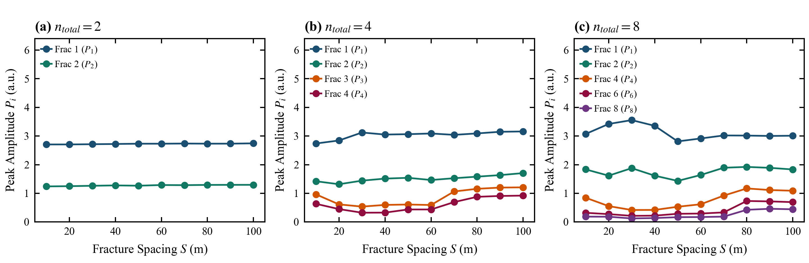

# 5.1 裂缝间距对累积倒谱表观峰值的影响

> **归属章节**：Paper A 第 5 章 — 5.1 节  
> **筛选条件**：`decay_table.csv` 中 `friction_model = steady`，$X_1 = 3000\,\mathrm{m}$，$n \in \{2,4,8\}$，$S \in [10,100]\,\mathrm{m}$（步长 $10\,\mathrm{m}$）。独立工况 30 组，裂缝级记录 140 条。  
> **峰值定义**：$P_i$ 为第 $i$ 缝在真值邻域内的累积倒谱表观峰值，不是反射能量。$\alpha_i = P_i/P_1$ 为相对表观响应。峰位偏差为真值邻域局部搜索结果，不是盲定位误差。  
> **适用条件**：稳态 Darcy 摩阻；固定 $D,a,C_f,k_{\mathrm{leak}}$；Hamming 窗 $30\,\mathrm{s}$，hop $5\,\mathrm{s}$。不外推至非定常摩阻、现场噪声或非均匀裂缝。  
> **图件与派生表**：`figures/Figure_5_1_Spacing_Main_Effect.png`；`figures/Figure_5_1_Supp_Multiplicity_Spacing.png`；`data/spacing_effect_metrics.csv`

---

## 1. 数据证据

### 1.1 主图（Figure 5.1）

> **Figure 5.1 | 间距 $S$ 对累积倒谱表观峰值的影响（$X_1 = 3000\,\mathrm{m}$，$n = 4$）**  
> **(a)** $S = 10,30,50,100\,\mathrm{m}$ 的时间边际累积倒谱剖面。灰色虚线只标 $S = 50\,\mathrm{m}$ 的真值位置；其余间距的真值随 $S$ 平移，不以该组竖线读取。  
> **(b)** 各缝表观峰值 $P_i(S)$。  
> **(c)** 相对表观响应 $\alpha_i = P_i/P_1$。第三面板是 $\alpha_i$，不是峰旁比。

### 1.2 扩展图（Figure 5.1-Supp）

> **Figure 5.1-Supp | 同一深度下 $n = 2,4,8$ 的 $P_i(S)$**  
> **(a)** $n=2$：$P_1,P_2$ 随 $S$ 接近水平。  
> **(b)** $n=4$：后序缝出现非单调低值区。  
> **(c)** $n=8$：更后序的缝在中等间距更低、大间距回升。

### 1.3 基准切片数值（$X_1 = 3000\,\mathrm{m}$，$n = 4$）

| $S$ (m) | $P_1$ | $P_2$ | $P_3$ | $P_4$ | $\alpha_2$ | $\alpha_3$ | $\alpha_4$ |
| :---: | :---: | :---: | :---: | :---: | :---: | :---: | :---: |
| 10 | 2.738 | 1.421 | 0.964 | 0.634 | 0.519 | 0.352 | 0.231 |
| 20 | 2.844 | 1.317 | 0.614 | 0.450 | 0.463 | 0.216 | 0.158 |
| 30 | 3.122 | 1.442 | 0.536 | 0.324 | 0.462 | 0.172 | 0.104 |
| 40 | 3.050 | 1.514 | 0.596 | 0.327 | 0.496 | 0.195 | 0.107 |
| 50 | 3.063 | 1.541 | 0.609 | 0.436 | 0.503 | 0.199 | 0.142 |
| 60 | 3.088 | 1.464 | 0.592 | 0.437 | 0.474 | 0.192 | 0.141 |
| 70 | 3.040 | 1.527 | 1.064 | 0.693 | 0.502 | 0.350 | 0.228 |
| 80 | 3.090 | 1.581 | 1.158 | 0.878 | 0.512 | 0.375 | 0.284 |
| 90 | 3.147 | 1.636 | 1.200 | 0.908 | 0.520 | 0.381 | 0.289 |
| 100 | 3.159 | 1.705 | 1.209 | 0.920 | 0.540 | 0.383 | 0.291 |

同一筛选下，140 条记录的真值邻域峰位偏差最大 $0.708\,\mathrm{m}$，平均 $0.353\,\mathrm{m}$。

---

## 2. 趋势描述

在 $n=4$ 切片上，$S \ge 30\,\mathrm{m}$ 时 $P_1 = 3.040$–$3.159$，相对极差约 $3.8\%$；$S=10\,\mathrm{m}$ 时 $P_1$ 降至 $2.738$。$P_2$ 随 $S$ 缓升（$1.32$–$1.71$）。$P_3$ 与 $P_4$ 在 $S=20$–$60\,\mathrm{m}$ 较低，最低点在 $S=30\,\mathrm{m}$（$0.536$ / $0.324$）；$S \ge 70\,\mathrm{m}$ 回升至约 $1.21$ / $0.92$。

$n=2$ 时 $P_1 \approx 2.70$–$2.74$、$P_2 \approx 1.24$–$1.30$，几乎不随 $S$ 变化。$n=3$ 已出现与 $n=4$ 同类的中等间距低值、大间距回升。$n=8$ 的后序缝低值更深：$P_8$ 在 $S=30\,\mathrm{m}$ 为 $0.124$，$S \ge 80\,\mathrm{m}$ 回升到 $0.43$–$0.46$。

---

## 3. 解释边界

上述结果只建立“间距改变累积倒谱表观峰”的参数响应。非单调低值区与多次反射、波包叠加和固定窗处理共同调制相容，但现有数据没有独立的相位或路径分解，不能唯一判因为相消干涉、半波长共振或大间距完全解耦。真值邻域内提峰成功，也不等于盲检或现场可识别。

---

## 4. 本节小结

间距不仅改变到达时延，也改变累积倒谱表观峰；影响在后序裂缝上更明显，但当前数据只建立参数响应，不完成唯一机制识别。
