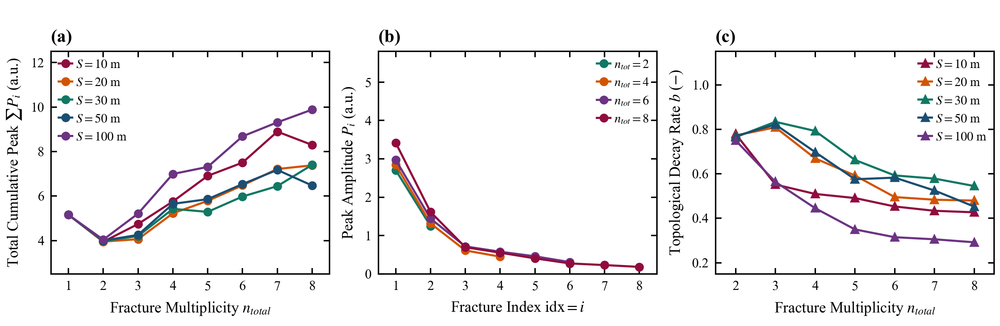

# 5.2 裂缝数量对首缝与末缝表观响应的影响

> **归属章节**：Paper A 第 5 章 — 5.2 节  
> **筛选条件**：`decay_table.csv` 中 `friction_model = steady`，$X_1 = 3000\,\mathrm{m}$，$n \in [1,8]$，$S \in [10,100]\,\mathrm{m}$。多缝独立工况 70 组；单缝基线在该深度只有 1 个独立样本（表中按 $S$ 重复列出，不按 10 个独立样本计）。裂缝级记录按 $n$ 累加。  
> **峰值定义**：$P_1$ 为首缝累积倒谱表观峰值；$P_\Sigma=\sum_i P_i$ 为表观峰值和，不用于能量守恒解释。$R_{\mathrm{end}}=P_n/P_1$ 为末首峰比，不是透射率。  
> **适用条件**：同 5.1，限于稳态 Darcy 摩阻与固定窗参数。  
> **图件与派生表**：`figures/Figure_5_2_Multiplicity_Main_Effect.png`；`figures/Figure_5_2_Supp_Cumulative_Energy_Decay.png`；`data/multiplicity_effect_metrics.csv`

---

## 1. 数据证据

### 1.1 主图（Figure 5.2）

> **Figure 5.2 | 缝数 $n$ 对首缝与末首峰比的影响（$X_1 = 3000\,\mathrm{m}$）**  
> **(a)** $S=20\,\mathrm{m}$ 下 $n=1,2,4,8$ 的累积倒谱剖面。  
> **(b)** 不同 $S$ 下 $P_1(n)$。  
> **(c)** $R_{\mathrm{end}}(n)$。本图不包含尾波比 CSR。

### 1.2 扩展图（Figure 5.2-Supp）

> **Figure 5.2-Supp | 表观峰值和、序号包络与经验衰减率**  
> **(a)** $P_\Sigma(n)$。  
> **(b)** $S=20\,\mathrm{m}$ 时不同 $n$ 的 $P_i$ 对序号 $i$。前序峰形态相近，绝对幅值并不重合。  
> **(c)** 由 $P_i/P_1=\exp[-b(i-1)]$ 得到的经验斜率 $b(n)$，只作描述，不解释为单节点透射系数。

### 1.3 代表性数值（$X_1 = 3000\,\mathrm{m}$）

| $n$ | $S$ (m) | $P_1$ | $P_n$ | $R_{\mathrm{end}}$ | $P_\Sigma$ |
| :---: | :---: | :---: | :---: | :---: | :---: |
| 1 | 20 | 5.157 | 5.157 | 1.000 | 5.157 |
| 2 | 20 | 2.705 | 1.250 | 0.462 | 3.955 |
| 3 | 20 | 2.451 | 0.477 | 0.195 | 4.062 |
| 4 | 20 | 2.844 | 0.450 | 0.158 | 5.224 |
| 5 | 20 | 2.958 | 0.356 | 0.120 | 5.784 |
| 6 | 20 | 2.971 | 0.309 | 0.104 | 6.481 |
| 7 | 20 | 3.226 | 0.233 | 0.072 | 7.216 |
| 8 | 20 | 3.420 | 0.184 | 0.054 | 7.380 |
| 7 | 50 | 3.379 | 0.192 | 0.0570 | 7.174 |
| 8 | 50 | 2.812 | 0.167 | 0.0595 | 6.474 |
| 8 | 100 | 3.010 | 0.443 | 0.147 | 9.885 |

$S=20\,\mathrm{m}$ 时，$n=4$ 与 $n=8$ 的前 4 个表观峰相对偏差为 $20.3\%$、$22.7\%$、$13.3\%$、$23.1\%$。$X_1=3000\,\mathrm{m}$、$n\ge 2$ 的全部 70 个工况上，$P_1$ 的变异系数约为 $8.1\%$。

---

## 2. 趋势描述

$S=20\,\mathrm{m}$ 时，$n=1\to 2$ 使 $P_1$ 从 $5.157$ 降至 $2.705$，下降 $47.5\%$；该跳变在其余 $S$ 上同样出现。$n\ge 2$ 后，$P_1$ 在 $2.45$–$3.55$ 内波动，不再出现同等幅度的二次下跌。

$R_{\mathrm{end}}$ 总体随 $n$ 下降，但不是全域严格单调：同一 $S=50\,\mathrm{m}$ 下，$n=7\to 8$ 时 $R_{\mathrm{end}}$ 由 $0.0570$ 略升至 $0.0595$。大间距衰减更慢，例如 $n=8$ 时 $S=20\,\mathrm{m}$ 的 $R_{\mathrm{end}}=0.054$，$S=100\,\mathrm{m}$ 为 $0.147$。

$P_\Sigma$ 在 $n=1\to 2$ 先降，随后随 $n$ 回升；回升幅度随 $S$ 而变，不能概括为边际贡献单调递减。图 5.2-Supp(b) 显示不同 $n$ 的序号包络形状接近，但对应前序峰仍可相差约 $13\%$–$23\%$。

---

## 3. 解释边界

单缝到双缝的离散变化说明单缝基线不能直接外推到多缝系统，但现有指标不足以称为声学相变，也不能识别单节点透射系数。$R_{\mathrm{end}}$ 的总体下降与界面增多相容，却不是严格几何透射律的证明。前序峰“严格不变”或“偏差小于 $3\%$”与图 5.2-Supp(b) 不符。

---

## 4. 本节小结

下游裂缝数量会反馈到井口观测峰，单缝基线不能直接外推至多缝系统；当前数据也不足以识别单节点透射系数。
