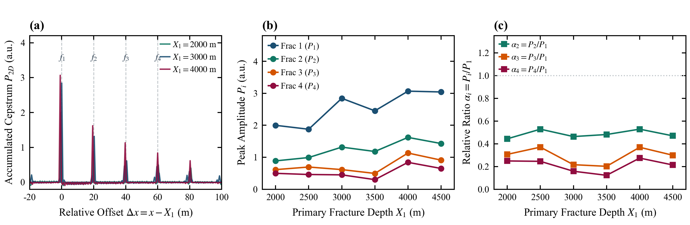
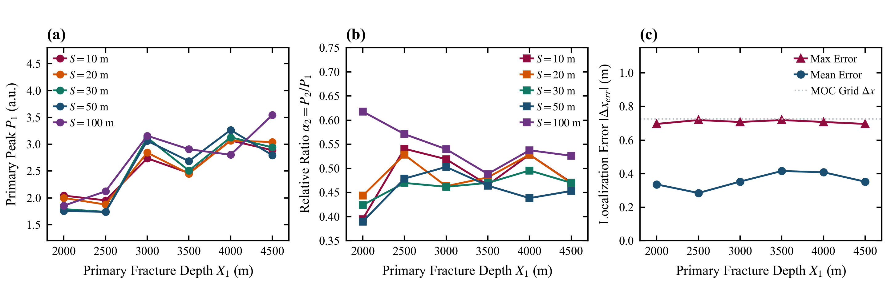

# 3.4a 深度是否只提供可分离增益（主切片）

> **投稿章节**：Paper A 第 3.4 节前半。工作笔记原编号 5.3。与 5.5 合为投稿 Figure 5。  
> **主张句**：为检验首缝深度是否只提供全局增益、相对响应是否与深度无关，固定 $S=20\,\mathrm{m}$、$n=4$，扫描 $X_1$。  
> **筛选条件**：主切片取 `decay_table.csv` 中 `friction_model = steady`，$S=20\,\mathrm{m}$，$n=4$，$X_1 \in \{2000,2500,3000,3500,4000,4500\}\,\mathrm{m}$（6 个独立工况，24 条裂缝级记录）。扩展图覆盖同表全部稳态记录；单缝基线按深度只有 6 个独立样本，不按每个 $S$ 重复计数。  
> **峰值定义**：$P_i$ 为累积倒谱表观峰值；$\alpha_i=P_i/P_1$ 为相对表观响应。峰位偏差 $=|\hat{x}_i-x_{i,\mathrm{true}}|$，由真值邻域局部搜索得到。  
> **适用条件**：同 3.2。  
> **图件与派生表**：`figures/Figure_5_3_Depth_Main_Effect.png`；`figures/Figure_5_3_Supp_Depth_Invariance.png`；`data/depth_effect_metrics.csv`

---

## 1. 数据证据

### 1.1 主图（Figure 5.3）

> **Figure 5 | 深度不是可分离增益（$S=20\,\mathrm{m}$，$n=4$；工作文件 Figure 5.3）**  
> **(a)** 相对坐标 $\Delta x=x-X_1$ 下对齐的累积倒谱剖面，用于核对提峰与几何映射。  
> **(b)** 各缝绝对表观峰值 $P_i(X_1)$，非单调，否定沿程指数衰减概括。  
> **(c)** 相对表观响应 $\alpha_i(X_1)$。$\alpha_2$ 相对集中，$\alpha_3,\alpha_4$ 仍随深度明显变化。本图不含 FWHM 或 PSR。

### 1.2 扩展图（Figure 5.3-Supp）

> **Figure 5-Supp | 多间距深度切片与真值邻域峰位偏差（附录；工作文件 Figure 5.3-Supp）**  
> **(a)** 若干 $S$ 下的 $P_1(X_1)$，起伏形态相近但幅度不同。  
> **(b)** $\alpha_2(X_1)$，相对集中但不是不变量。  
> **(c)** 真值邻域峰位偏差随 $X_1$ 的均值与最大值；灰色虚线为 MOC 网格步长 $0.725\,\mathrm{m}$。该偏差不是盲定位精度。

### 1.3 主切片数值（$S=20\,\mathrm{m}$，$n=4$）

| $X_1$ (m) | $P_1$ | $P_2$ | $P_3$ | $P_4$ | $\alpha_2$ | $\alpha_3$ | $\alpha_4$ | 最大峰位偏差 (m) | 平均峰位偏差 (m) |
| :---: | :---: | :---: | :---: | :---: | :---: | :---: | :---: | :---: | :---: |
| 2000 | 1.999 | 0.887 | 0.613 | 0.497 | 0.443 | 0.307 | 0.249 | 0.615 | 0.307 |
| 2500 | 1.876 | 0.991 | 0.695 | 0.461 | 0.528 | 0.370 | 0.245 | 0.603 | 0.363 |
| 3000 | 2.844 | 1.317 | 0.614 | 0.450 | 0.463 | 0.216 | 0.158 | 0.592 | 0.423 |
| 3500 | 2.453 | 1.181 | 0.494 | 0.300 | 0.481 | 0.202 | 0.122 | 0.580 | 0.363 |
| 4000 | 3.068 | 1.621 | 1.132 | 0.841 | 0.528 | 0.369 | 0.274 | 0.580 | 0.302 |
| 4500 | 3.043 | 1.429 | 0.910 | 0.649 | 0.470 | 0.299 | 0.213 | 0.615 | 0.307 |
| 切片统计 | — | — | — | — | $0.486\pm 0.035$ | $0.294\pm 0.073$ | $0.210\pm 0.059$ | 0.615 | 0.344 |

该切片上 $\alpha_2$ 的变异系数为 $7.25\%$，$\alpha_3$ 为 $24.7\%$，$\alpha_4$ 为 $27.9\%$。在全部稳态记录中，除去 $X_1=4500\,\mathrm{m}$ 两条尾缝提取落到剖面边缘的记录（偏差 $41.45\,\mathrm{m}$ 与 $61.45\,\mathrm{m}$）后，最大真值邻域峰位偏差为 $0.719\,\mathrm{m}$。

---

## 2. 趋势描述

$P_1(X_1)$ 为 $1.876,1.999,2.844,2.453,3.068,3.043$，不是随深度单调下降，整体还略有升高。各缝绝对峰值同步起伏。相对坐标下峰位对齐，$S=20\,\mathrm{m}$、$n=4$ 切片的最大峰位偏差为 $0.615\,\mathrm{m}$。

归一化后 $\alpha_2$ 相对集中；$\alpha_3$ 与 $\alpha_4$ 仍有约四分之一的变异系数，不能与 $\alpha_2$ 一并称为深度不变量。不同 $S$ 下 $P_1(X_1)$ 的起伏形态大体相近，但幅度并不相同。

---

## 3. 解释边界

数据足以否定“绝对峰值随深度简单指数衰减”，也足以否定把全部 $\alpha_i$ 称为深度不变量。非单调起伏可能同时受到沿程传播、边界反射、多次反射和固定分析窗的影响，现有切片不能单独证实驻波或窗截断。相对比值深度不变、腔体截断已证实、无失真反演或亚米级盲定位均超出证据范围。

---

## 4. 本节小结

深度敏感性随裂缝序号而变；归一化只使 $\alpha_2$ 相对集中。峰位偏差仅反映真值邻域提取与网格映射的一致性。
