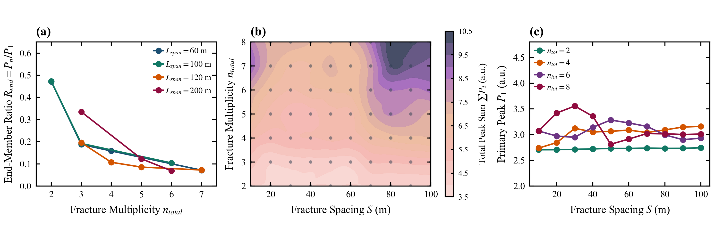

# 3.3 总跨度是否充分

> **投稿章节**：Paper A 第 3.3 节（机理检验三）。工作笔记原编号 5.4。投稿主图与 3.1 合为 Figure 3 时，以本图 **(c)** 等段长对照为决定性面板。  
> **主张句**：为检验相同总跨度 $L_{\mathrm{span}}=(n-1)S$ 是否给出等价的倒谱响应，固定 $X_1=3000\,\mathrm{m}$，在 $(S,n)$ 网格上做等段长对照。  
> **筛选条件**：`decay_table.csv` 中 `friction_model = steady`，$X_1 = 3000\,\mathrm{m}$，$n \in [2,8]$，$S \in [10,100]\,\mathrm{m}$。独立工况 70 组，裂缝级记录 350 条。  
> **峰值定义**：$R_{\mathrm{end}}=P_n/P_1$ 为末首峰比；$P_\Sigma=\sum_i P_i$ 为表观峰值和。总跨度 $L_{\mathrm{span}}=(n-1)S$ 只作对照自变量。  
> **适用条件**：同 3.2。  
> **图件与派生表**：`figures/Figure_5_4_Interaction_Phase_Maps.png`；`figures/Figure_5_4_Supp_Iso_Span_Divergence.png`；`data/interaction_S_n_metrics.csv`

---

## 1. 数据证据

### 1.1 主图（Figure 5.4）

> **Figure 3（续）| 等段长对照：$L_{\mathrm{span}}$ 不是充分描述量（$X_1=3000\,\mathrm{m}$；工作文件 Figure 5.4）**  
> **(a)** 首缝表观峰值 $P_1(S,n)$。色块由 70 个离散点插值，仅供示意，不表示连续相区。  
> **(b)** 末首峰比 $R_{\mathrm{end}}(S,n)$，同样是离散网格的示意着色。  
> **(c)** 主证据：以 $L_{\mathrm{span}}=(n-1)S$ 为横轴的 $R_{\mathrm{end}}$，按 $n$ 分组。不同 $n$ 不落到同一条关系上。

### 1.2 扩展图（Figure 5.4-Supp）

> **Figure 3-Supp | 多条等段长切片与表观峰值和（附录；工作文件 Figure 5.4-Supp）**  
> **(a)** $L_{\mathrm{span}}=60,100,120,200\,\mathrm{m}$ 时 $R_{\mathrm{end}}$ 随 $n$ 下降。  
> **(b)** $P_\Sigma(S,n)$ 离散网格示意着色，不是连续相区。  
> **(c)** 不同 $n$ 下的 $P_1(S)$。

### 1.3 等段长对照数值

| $L_{\mathrm{span}}$ (m) | $n$ | $S$ (m) | $P_1$ | $P_n$ | $R_{\mathrm{end}}$ | $P_\Sigma$ |
| :---: | :---: | :---: | :---: | :---: | :---: | :---: |
| 60 | 2 | 60 | 2.731 | 1.289 | 0.4722 | 4.020 |
| 60 | 3 | 30 | 2.583 | 0.485 | 0.1877 | 4.203 |
| 60 | 4 | 20 | 2.844 | 0.450 | 0.1582 | 5.224 |
| 60 | 7 | 10 | 3.397 | 0.243 | 0.0716 | 8.895 |
| 100 | 2 | 100 | 2.744 | 1.296 | 0.4724 | 4.040 |
| 100 | 3 | 50 | 2.598 | 0.499 | 0.1921 | 4.255 |
| 100 | 6 | 20 | 2.971 | 0.309 | 0.1041 | 6.481 |
| 120 | 3 | 60 | 2.510 | 0.491 | 0.1956 | 4.182 |
| 120 | 4 | 40 | 3.050 | 0.327 | 0.1071 | 5.487 |
| 200 | 3 | 100 | 2.792 | 0.935 | 0.3349 | 5.212 |
| 200 | 6 | 40 | 3.142 | 0.216 | 0.0688 | 6.373 |

本网格 $P_\Sigma$ 的最大值出现在 $n=8$、$S=80\,\mathrm{m}$，为 $10.231$；同 $n$ 下 $S=100\,\mathrm{m}$ 为 $9.885$，$S=50\,\mathrm{m}$ 为 $6.474$。

---

## 2. 趋势描述

相同 $L_{\mathrm{span}}$ 下，$R_{\mathrm{end}}$ 随 $n$ 增加而下降。$L_{\mathrm{span}}=60\,\mathrm{m}$ 时，$n=2,3,4,7$ 的 $R_{\mathrm{end}}$ 分别为 $0.4722$、$0.1877$、$0.1582$、$0.0716$。图 5.4(c) 中不同 $n$ 的曲线不落到同一条 $L_{\mathrm{span}}$ 关系上。

$R_{\mathrm{end}}$ 大体随 $n$ 分层；同一 $n\ge 3$ 时，中等间距偏低、大间距回升，与 3.2 节的非单调间距响应一致。$P_\Sigma$ 在大 $n$ 且大 $S$ 时较高，但不是随 $(S,n)$ 严格单调增加。

---

## 3. 解释边界

等段长对照说明几何等效不等于倒谱响应等效：$L_{\mathrm{span}}$ 不是充分描述量，至少须同时保留 $n$ 与 $S$。该对照不能独立分解节点数、间距和观测算子的贡献，不能写成连续介质被推翻、离散拓扑唯一主导或界面量子化透射。

---

## 4. 本节小结

总跨度 $L_{\mathrm{span}}=(n-1)S$ 不是末首峰比的充分描述量；固定 $X_1$ 下描述多缝表观峰必须同时给出 $n$ 与 $S$。
