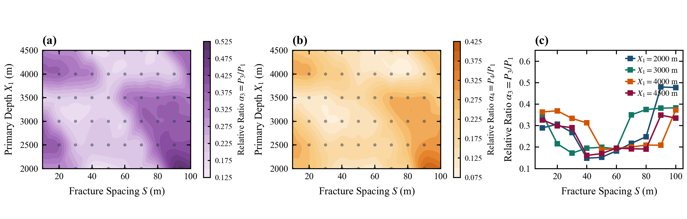

# 5.5 深度—间距交互与响应异质性

> **归属章节**：Paper A 第 5 章 — 5.5 节  
> **筛选条件**：`decay_table.csv` 中 `friction_model = steady`，$n=4$，$X_1$ 6 档 $\times$ $S$ 10 档，共 60 个独立工况、240 条裂缝级记录。  
> **峰值定义**：$P_1$ 为首缝累积倒谱表观峰值；$\alpha_i=P_i/P_1$ 为相对表观响应。极值位置只在离散网格上取 $\arg\min_S\alpha_3$，不从插值面读取。  
> **适用条件**：同 5.1。  
> **图件与派生表**：`figures/Figure_5_5_Interaction_X1_S_Phase_Maps.png`；`figures/Figure_5_5_Supp_Deep_Fracture_Coupling.png`；`data/interaction_X1_S_metrics.csv`

---

## 1. 数据证据

### 1.1 主图（Figure 5.5）

> **Figure 5.5 | $(S,X_1)$ 离散网格上的 $P_1$ 与 $\alpha_2$（$n=4$）**  
> **(a)** $P_1(S,X_1)$。色块由 60 点插值示意，不是连续相区。  
> **(b)** $\alpha_2(S,X_1)$。  
> **(c)** 6 个深度切片上的 $\alpha_2(S)$。灰色虚线为 $\alpha_2=0.50$ 参考，不是不变性证明。

### 1.2 扩展图（Figure 5.5-Supp）

> **Figure 5.5-Supp | 深部相对响应的深度—间距联合变化**  
> **(a)** $\alpha_3(S,X_1)$ 离散网格示意着色。  
> **(b)** $\alpha_4(S,X_1)$。  
> **(c)** 典型深度切片上的 $\alpha_3(S)$。低值区位置按离散点读取。

### 1.3 网格统计与 $\alpha_3$ 最小点

60 点上 $\alpha_2=0.4886\pm 0.0464$，范围为 $0.3609$–$0.6179$。同一深度下 $P_1$ 随 $S$ 的相对极差为 $14\%$–$37\%$。

| $X_1$ (m) | $\arg\min_S\alpha_3$ (m) | $\min\alpha_3$ | 该深度 $P_1$ 相对极差 |
| :---: | :---: | :---: | :---: |
| 2000 | 40 | 0.148 | 27.6% |
| 2500 | 30 | 0.213 | 20.6% |
| 3000 | 30 | 0.172 | 13.9% |
| 3500 | 10 | 0.189 | 18.8% |
| 4000 | 50 | 0.188 | 22.9% |
| 4500 | 40 | 0.161 | 36.8% |

---

## 2. 趋势描述

$P_1$ 主要随 $X_1$ 变化：浅井约 $1.6$–$2.1$，深井约 $2.5$–$3.5$。同一深度内 $P_1$ 仍随 $S$ 波动，相对极差不是零。$\alpha_2$ 比 $\alpha_3$、$\alpha_4$ 更集中，但浅井大间距可升至 $0.62$，浅井中等间距可降至 $0.36$，不是严格不变量。

$\alpha_3$ 在各深度都出现中等间距偏低、两端回升的形态，但离散最小点位于 $S=10$–$50\,\mathrm{m}$，并不固定。$X_1=4000\,\mathrm{m}$ 时低值带延至 $S=50$–$90\,\mathrm{m}$；$X_1=3500\,\mathrm{m}$ 时最小点在 $S=10\,\mathrm{m}$。大间距恢复也依赖具体深度切片。

---

## 3. 解释边界

$\alpha_2$ 相对集中不能写成正交解耦定理，也不能写成 $\partial P_1/\partial S\approx 0$。深部低值区未锁定在 $30$–$50\,\mathrm{m}$，大间距也不是全深度恢复。插值色块和光滑边界不是采样证据。当前网格不支持把 $(X_1,S)$ 无条件拆成两个独立反演问题。

---

## 4. 本节小结

深度与间距存在不能由单一缩放消除的联合变化，当前数据不支持无条件拆成两个独立反演问题。
