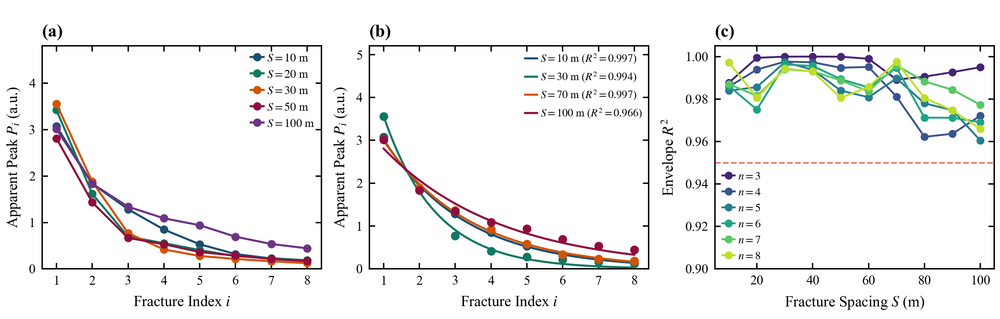
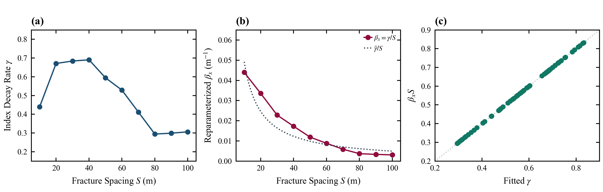

# 5.6 固定几何工况内的序号衰减经验模型

> **归属章节**：Paper A 第 5 章 — 5.6 节  
> **筛选条件**：`decay_table.csv` 中 `friction_model = steady`，$X_1=3000\,\mathrm{m}$，$n\in[2,8]$，$S\in[10,100]\,\mathrm{m}$。拟合汇总 70 个工况；平均 $R^2$ 只统计 $n=3$–$8$ 的 60 个工况。单缝不进入拟合。  
> **模型**：在固定 $(n,S)$ 内拟合
> $$P_i=A\exp[-\gamma(i-1)].$$
> $A$ 与 $\gamma$ 由同一组 `curve_fit` 得到；作图与表格使用同一个 $A_{\mathrm{fit}}$。$\gamma$ 只称序号轴经验衰减率。因 $\Delta x_i=S(i-1)$，空间写法 $A\mathrm{e}^{-\beta_x\Delta x_i}$ 满足 $\gamma=\beta_x S$，预测值、残差和 $R^2$ 必然相同。  
> **适用条件**：同 5.1。本节不裁决拓扑模型与空间模型的优劣。  
> **图件与派生表**：`figures/Figure_5_6_Spatial_vs_Topological_Decay.png`；`figures/Figure_5_6_Supp_Model_Parameters_and_Goodness.png`；`data/decay_model_fitting_metrics.csv`

---

## 1. 数据证据

### 1.1 主图（Figure 5.6）

> **Figure 5.6 | 固定工况内的序号经验包络（$X_1=3000\,\mathrm{m}$，$n=8$）**  
> **(a)** 不同 $S$ 下 $P_i$ 对裂缝序号 $i$。  
> **(b)** 同一 $A_{\mathrm{fit}}$ 与 $\gamma$ 给出的指数包络及 $R^2$。  
> **(c)** $n=3$–$8$ 共 60 个工况的包络 $R^2(S)$。

### 1.2 扩展图（Figure 5.6-Supp）

> **Figure 5.6-Supp | 经验衰减率及其空间改写**  
> **(a)** $n=8$ 时 $\gamma(S)$。  
> **(b)** 改写系数 $\beta_x=\gamma/S$。虚线是 $\bar{\gamma}/S$，只表示代数改写，不是独立物性。  
> **(c)** $n=3$–$8$ 上 $\gamma$ 与 $\beta_x S$ 落在 $1:1$ 线上，验证 $\gamma=\beta_x S$。

### 1.3 $n=8$ 拟合表（$X_1=3000\,\mathrm{m}$）

| $S$ (m) | $A_{\mathrm{fit}}$ | $\gamma$ | $R^2$ | RMSE | $P_1$ | $P_8$ |
| :---: | :---: | :---: | :---: | :---: | :---: | :---: |
| 10 | 3.024 | 0.4398 | 0.9972 | 0.050 | 3.071 | 0.186 |
| 20 | 3.357 | 0.6711 | 0.9806 | 0.144 | 3.420 | 0.184 |
| 30 | 3.564 | 0.6841 | 0.9943 | 0.085 | 3.555 | 0.124 |
| 40 | 3.324 | 0.6906 | 0.9930 | 0.087 | 3.355 | 0.137 |
| 50 | 2.749 | 0.5947 | 0.9805 | 0.118 | 2.812 | 0.167 |
| 60 | 2.857 | 0.5288 | 0.9858 | 0.105 | 2.914 | 0.173 |
| 70 | 2.992 | 0.4116 | 0.9975 | 0.046 | 3.019 | 0.187 |
| 80 | 2.851 | 0.2942 | 0.9805 | 0.112 | 3.015 | 0.425 |
| 90 | 2.823 | 0.2990 | 0.9746 | 0.126 | 3.002 | 0.460 |
| 100 | 2.806 | 0.3060 | 0.9659 | 0.147 | 3.010 | 0.443 |

$n=3$–$8$ 的 60 个工况平均 $R^2=0.9864$。$S=10\,\mathrm{m}$、$n=8$ 的 $P_8=0.186$（此前误抄为 $0.441$）。

---

## 2. 趋势描述

固定 $S$ 时，$P_i$ 随序号 $i$ 下降，指数包络拟合良好。$\gamma$ 随 $S$ 非单调：$S=20$–$40\,\mathrm{m}$ 较高（约 $0.67$–$0.69$），$S\ge 80\,\mathrm{m}$ 降至约 $0.29$–$0.31$。这与 5.1 后序缝的非单调间距响应一致。尾缝幅值仍随 $S$ 分散，$P_8$ 介于 $0.124$ 与 $0.460$ 之间，并未收成单一曲线。

把同一拟合改写到 $\Delta x$ 轴后，$R^2$ 不变，$\beta_x$ 随 $S$ 近似按 $1/S$ 下降，因为 $\beta_x=\gamma/S$。

---

## 3. 解释边界

高 $R^2$ 只说明固定工况内的经验序列包络可用指数描述。$\gamma$ 不是单节点物理透射损耗；不由此给出等效透射系数，也不承诺层剥离补偿。空间模型与序号模型在固定 $S$ 下代数等价，不能据此宣称拓扑优于空间。总跨度是否充分已由 5.4 的等段长对照回答，本节不再重复裁决。

---

## 4. 本节小结

在固定几何工况内，累积倒谱表观峰可用序号指数包络描述（$n=3$–$8$ 平均 $R^2\approx 0.986$）；该包络是经验拟合，不是拓扑唯一主导的证明。
