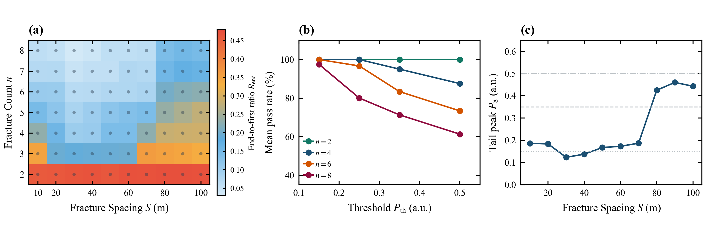

# 5.7 给定噪声参考与峰值门限下的表观峰检出敏感性

> **归属章节**：Paper A 第 5 章 — 5.7 节  
> **筛选条件**：`decay_table.csv` 中 `friction_model = steady`，$X_1=3000\,\mathrm{m}$，$n\in[2,8]$，$S\in[10,100]\,\mathrm{m}$，70 个独立工况。  
> **检出定义**：
> $$n_{\mathrm{det}}(P_{\mathrm{th}})=\sum_i\mathbf{1}(P_i\ge P_{\mathrm{th}}).$$
> 这是真值邻域表观峰的门限通过数量，不是盲检召回率。$\sigma_{\mathrm{ref}}=0.05$ 是假设参考尺度，未注入随机噪声、也未做重复采样。表观幅噪比定义为 $20\log_{10}(P_n/\sigma_{\mathrm{ref}})$。  
> **适用条件**：同 5.1。不对 $S<10\,\mathrm{m}$ 作混叠结论（网格无该范围）。不划 Operational Zone，不给出现场间距推荐。  
> **图件与派生表**：`figures/Figure_5_7_Operational_Envelope.png`；`figures/Figure_5_7_Supp_SNR_and_Field_Guidelines.png`；`data/identifiability_envelope_metrics.csv`

---

## 1. 数据证据

### 1.1 主图（Figure 5.7）

> **Figure 5.7 | 真值邻域表观峰的门限敏感性（$X_1=3000\,\mathrm{m}$）**  
> **(a)** $P_{\mathrm{th}}=0.35$ 时 $n_{\mathrm{det}}/n$ 的离散网格着色；灰点为实际采样点，色块不是连续可行域。  
> **(b)** $n=8$ 时四个门限下的 $n_{\mathrm{det}}(S)$。  
> **(c)** 相对于 $\sigma_{\mathrm{ref}}=0.05$ 的末缝表观幅噪比，同样按离散网格着色。

### 1.2 扩展图（Figure 5.7-Supp）

> **Figure 5.7-Supp | 末首峰比、平均通过率与尾缝幅值**  
> **(a)** $R_{\mathrm{end}}$ 离散网格。  
> **(b)** 平均门限通过率随 $P_{\mathrm{th}}$ 的变化（按 $n$ 分组）。  
> **(c)** $n=8$ 的 $P_8(S)$，灰色水平线为 $0.15$、$0.35$、$0.50$ 参考门限。

### 1.3 $n=8$ 门限通过数（$\sigma_{\mathrm{ref}}=0.05$）

| $S$ (m) | $P_1$ | $P_8$ | $R_{\mathrm{end}}$ | 表观幅噪比 (dB) | $P_{\mathrm{th}}=0.15$ | $0.25$ | $0.35$ | $0.50$ |
| :---: | :---: | :---: | :---: | :---: | :---: | :---: | :---: | :---: |
| 10 | 3.071 | 0.186 | 0.061 | 11.43 | 8/8 | 6/8 | 5/8 | 5/8 |
| 20 | 3.420 | 0.184 | 0.054 | 11.31 | 8/8 | 6/8 | 5/8 | 4/8 |
| 30 | 3.555 | 0.124 | 0.035 | 7.86 | 7/8 | 5/8 | 4/8 | 3/8 |
| 40 | 3.355 | 0.137 | 0.041 | 8.79 | 7/8 | 5/8 | 4/8 | 3/8 |
| 50 | 2.812 | 0.167 | 0.060 | 10.50 | 8/8 | 6/8 | 5/8 | 4/8 |
| 60 | 2.914 | 0.173 | 0.059 | 10.78 | 8/8 | 6/8 | 5/8 | 4/8 |
| 70 | 3.019 | 0.187 | 0.062 | 11.45 | 8/8 | 6/8 | 5/8 | 5/8 |
| 80 | 3.015 | 0.425 | 0.141 | 18.59 | 8/8 | 8/8 | 8/8 | 7/8 |
| 90 | 3.002 | 0.460 | 0.153 | 19.28 | 8/8 | 8/8 | 8/8 | 7/8 |
| 100 | 3.010 | 0.443 | 0.147 | 18.95 | 8/8 | 8/8 | 8/8 | 7/8 |

当 $\sigma_{\mathrm{ref}}=0.05$、$P_{\mathrm{th}}=0.35$、$n=8$ 时，$S=30/40\,\mathrm{m}$ 为 $4/8$ 个峰过门限，$S=80/90/100\,\mathrm{m}$ 为 $8/8$。

---

## 2. 趋势描述

在上述假设门限下，$n_{\mathrm{det}}(S)$ 呈中等间距偏低、大间距回升。门限越高，中等间距少检出的缝越多。$n\le 3$ 时平均通过率对门限不敏感；$n=8$ 时 $P_{\mathrm{th}}$ 从 $0.15$ 升到 $0.50$，平均通过率明显下降。这与 5.1 后序缝的非单调间距响应、5.6 中 $\gamma(S)$ 在中等间距较高是同一组幅值事实的门限投影。

---

## 3. 解释边界

$\sigma_{\mathrm{ref}}$ 不是实测仪器噪声，也未做加噪蒙特卡洛。过门限结果依赖真值邻域提峰，不能写成盲检性能、物理盲区或现场可行域。$S<10\,\mathrm{m}$ 无数据，不作混叠结论。离散网格上的着色和等值线不是实际采样边界，也不再划分 Zone I/II/III，不给出“强烈推荐 $S\ge 80\,\mathrm{m}$”一类工程外推。

---

## 4. 本节小结

中等间距下检出数量降低、大间距下恢复是给定处理流程、噪声参考和门限下的条件化现象，不构成盲检性能或现场物理边界。
