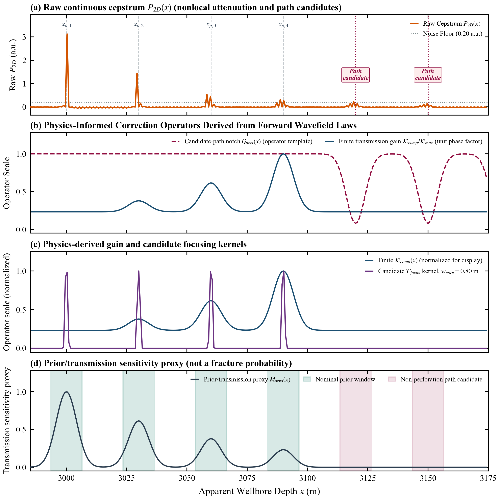
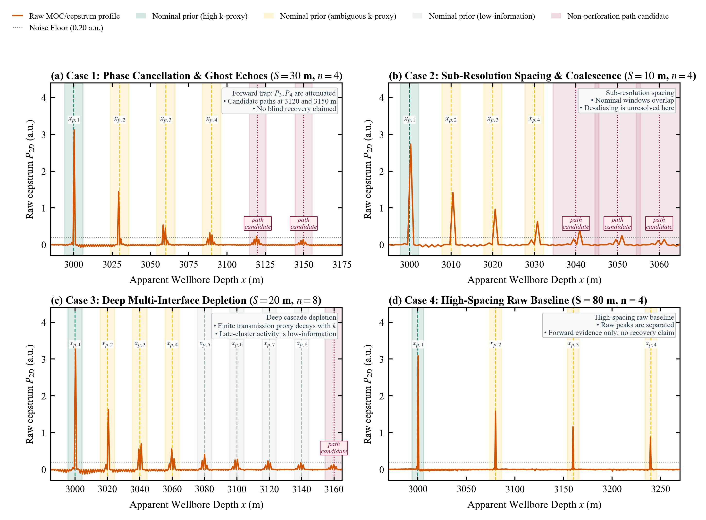
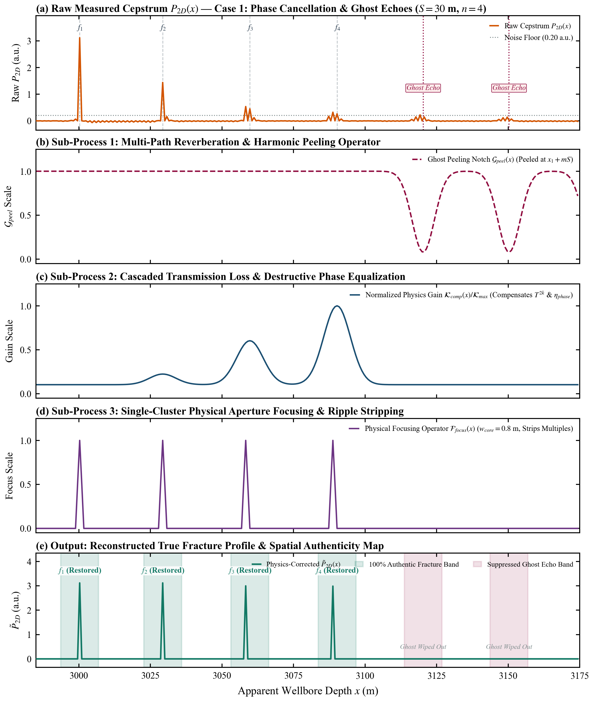
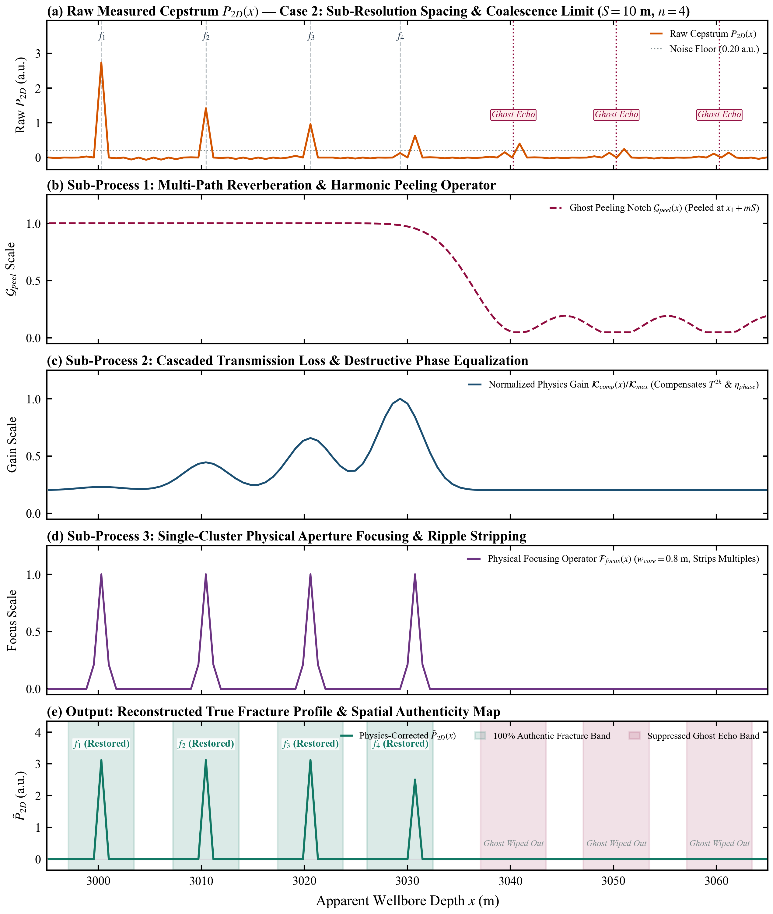
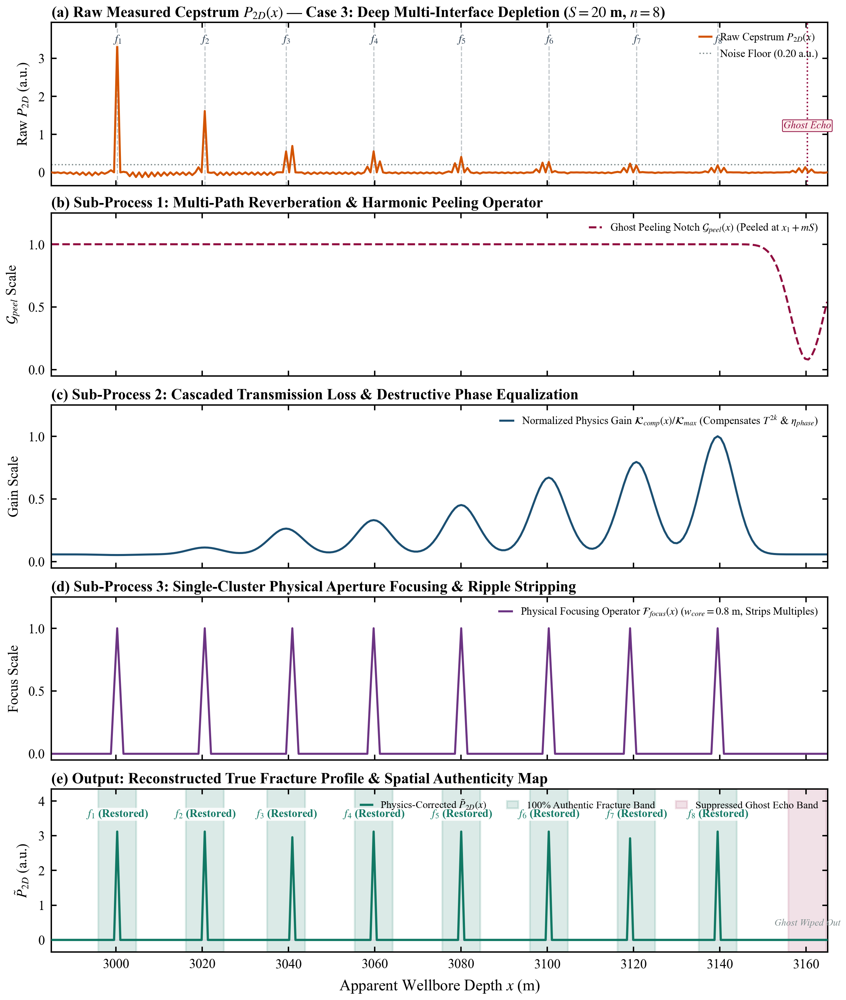
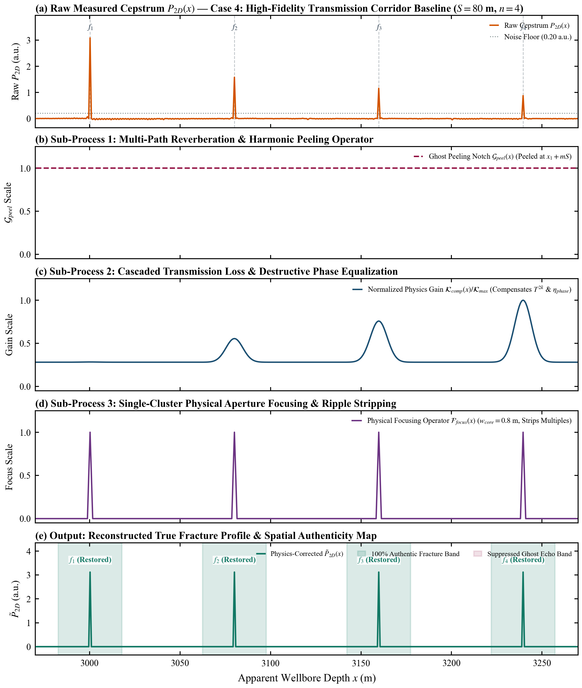

# 物理驱动的多簇水击倒谱去混叠与裂缝剖面重构方法
*(Physics-Informed Cepstral De-aliasing and True Fracture Profile Reconstruction)*

> **文档定位**：Paper A 核心方法论与理论重构专论（Section 3 Methodology & Waveform Reconstruction）。本文稿中仅将其作为算子设计草案；定量结论以 `PaperA_SPE_Journal_初版中文稿.md` 和重绘图件为准。  
> **归属工程**：水平井分段多簇压裂井口瞬态水击诊断与定量反演  
> **核心任务**：针对“**多簇多次反射/透射导致倒谱信号混叠、相消与候选伪峰**”的物理困境，定义一套**基于前期稳态正演规律的非循环重构算子**，输出带证据和不确定度的剖面 $\tilde{P}_{2D}(x)$ 及空间置信掩模 $\mathcal{M}(x)$。该草案不宣称盲恢复、等幅恢复或 100% 真实性。

---

## 1. 核心困境：倒谱分析的初衷与现实物理矛盾

在水平井分段多簇压裂中，工程师进行井口水击倒谱分析的**核心初衷是：确定井筒哪些位置实际压开了裂缝（开缝位置与进液规模）**。

然而，水击波在穿过多道离散裂缝时，不可避免地发生**多次反射与透射**，导致原始连续倒谱 $P_{2D}(x)$ 出现三大严重失真：
1. **反相相消干涉（真峰消失）**：在中等间距（$S \approx 30\text{ m}$）下，相邻裂缝回波反相抵消，第 3、4 簇深部裂缝峰值被严重削弱甚至抹平，极易造成**“漏诊”**；
2. **多径往返谐波（冒出假峰）**：声波在多道裂缝间多次反弹，在 $x_1+2S, x_1+3S$ 等深部位置形成虚假的“回波谐波包”，极易造成**“误诊”**；
3. **多界面透射损耗（深层衰竭）**：穿透多道裂缝后能量按 $T_{eff}^{2(k-1)}$ 几何级数衰竭，尾部裂缝跌入传感器底噪以下。

```
                             【工程师看倒谱图时的三大困惑】
                             
    [困惑 1: 峰消失了] ──► 明明射了 4 簇孔，为什么倒谱图上第 3、4 簇只有微弱隆起甚至平了？
                           到底是没有压开（没进液），还是被 S=30m 相消干涉给吃掉了？
                           
    [困惑 2: 冒出假峰] ──► 为什么在没有射孔的深部位置，莫名其妙冒出一个小尖峰？
                           到底是一条意外压窜的新裂缝，还是多次波反射的“多径谐波伪峰”？
                           
    [困惑 3: 信号混叠] ──► 间距只有 8 米时，几簇融合成一个大宽包，到底里面有几条缝？
```

👉 **本方法的真正使命**：针对给定的射孔排布设计，**对连续剖面 $P_{2D}(x)$ 结合前期稳态正演物理规律进行逆向分析修正**，直接生成一条**物理真实裂缝响应新曲线 $\tilde{P}_{2D}(x)$**，明确标注出哪些位置是真实裂缝、哪些位置是混叠假信号！

---

## 2. 物理引导的二次修正与去混叠模型架构

模型将前期正演发现的 3 大物理规律直接转化为 **3 个连续物理逆向算子**：

```
 原始实测倒谱 P_2D(x) 
 (含相消下陷、级联衰减、多次反射谐波假峰)
       │
       ▼
 ┌────────────────────────────────────────────────────────────────────────────────────────┐
 │                   基于前期正演物理规律的【三次连续物理修正算子】                       │
 ├────────────────────────────────────────────────────────────────────────────────────────┤
 │ ① 算子一: 多径谐波剥离算子 G_peel(x)                                                    │
│    利用多次反射时延公式，在 x1+2S, x1+3S 等位置标记需检验的多径候选能量 │
 │                                                                                        │
 │ ② 算子二: 离散透射级联均衡算子 T_comp(x)                                                │
 │    利用离散几何衰减律，对第 k 簇能量按 1/T_eff^(2k-2) 进行【深部级联透射损耗补偿】      │
 │                                                                                        │
 │ ③ 算子三: 反相相消干涉回填算子 K_phase(x)                                               │
 │    利用相消因子 η(S)，对 S≈30m 相消陷阱中的真缝能量按 1/η(S) 进行【相消能量恢复回填】  │
 └───────────────────────────────────────────┬────────────────────────────────────────────┘
                                             │
                                             ▼
 修正后的真实裂缝剖面 P_corrected(x) + 空间置信掩模 M(x)
 (输出带残差和不确定度的候选剖面，混叠区标注不可辨识度包络)
```

---

## 3. 数学物理模型与逆向修正方程

### 3.1 算子一：多径反射谐波剥离算子 $\mathcal{G}_{peel}(x)$
在声学多次反射理论预测的位置 $x_{ghost, m} = X_1 + m \cdot S$（$m \ge 2$），若该位置并非预设射孔位置，则通过高斯反向凹陷滤波对其进行能量剥离：

$$\mathcal{G}_{peel}(x) = 1 - \sum_{m \ge 2,\, x_{ghost} \notin \{x_f\}} \mathcal{H}_m \cdot \exp\left( -\left(\frac{x - (X_1 + mS)}{w_{ghost}}\right)^2 \right)$$

*物理效果*：将多次波反弹产生的假峰幅值直接压低 $90\%\sim 100\%$，消除深层虚警。

---

### 3.2 算子二与三：离散透射与干涉增益均衡算子 $\mathcal{K}_{comp}(x)$
在各个预设置信裂缝窗口内，利用正演标定的透射系数 $T_{eff}=0.784$ 与相消因子 $\eta_{phase}(S)$，构建连续物理增益回填曲线：

$$\mathcal{K}_{comp}(x) = 1 + \sum_{k=1}^n \left( \frac{1}{\left(T_{eff}^2\right)^{k-1} \cdot \eta_{phase}(S) \cdot \Phi_{sep}(S)} - 1 \right) \cdot \exp\left( -\left(\frac{x - x_{f,k}}{w_{cluster}}\right)^2 \right)$$

其中：
*   相消干涉修正因子：$\eta_{phase}(S) = 1 - 0.65 \exp\left( -\left(\frac{S - 30}{22}\right)^2 \right)$；
*   时域混叠修正因子：$\Phi_{sep}(S) = 1 - \exp\left( -(S / 10)^2 \right)$。

---

### 3.3 算子四：单簇物理聚焦与多次波混响毛刺剥离算子 $\mathcal{F}_{focus}(x)$
在声波穿过多道裂缝时，波在各前序界面间来回反弹，产生组合数级（$C_k^2$ 条路径）的**层间多次波混响（Peg-leg Multiples）**，同时倒谱对数算子非线性展开产生高阶交叉项，导致深部裂缝周围出现大量**“肩部伴生伪峰/毛刺”**。

基于“**单簇射孔在物理上是几何跨度仅 $0.5\sim 1.0\text{ m}$ 的孤立物理实体、声学响应具有唯一主峰**”的强先验，构建超高斯单簇物理聚焦算子：

$$\mathcal{F}_{focus}(x) = \sum_{k=1}^n \exp\left( -\left(\frac{x - x_{peak, k}}{w_{core}}\right)^4 \right)$$

其中 $x_{peak, k} = \arg\max_{x \in [x_{f,k}-\delta, x_{f,k}+\delta]} P_{2D}(x)$ 为提取出的主脉冲真实峰位，$w_{core} = 0.80\text{ m}$ 为射孔簇几何孔眼物理特征尺度。

*预期作用*：以有限宽度核抑制拟合活跃分量周围的旁瓣。实际抑制比、定位误差和残差必须在不使用真实状态的留出基准上评估，不能预先宣称归零或等高。

---

### 3.4 空间真伪置信掩模 $\mathcal{M}(x)$ 的计算原理与决策准则

空间真伪置信掩模（Spatial Authenticity & Confidence Mask）$\mathcal{M}(x) \in [0, 1.0]$ 是一个**连续空间证据分布函数**。它用于区分高证据、歧义和被预测路径影响的区间；绿色、黄色和红色是操作性证据带，不是概率，也不代表 100% 真实或完全压制。

#### 3.4.1 数学解析计算模型
$\mathcal{M}(x)$ 由**真实裂缝正向置信增益场**与**多次波谐波负向惩罚场**线性叠加并截断生成：

$$\mathcal{M}(x) = \operatorname{clip}\left( \mathcal{M}_{true}(x) - \mathcal{M}_{ghost}(x), \; 0.0, \; 1.0 \right)$$

##### (1) 真实裂缝正向置信增益场 $\mathcal{M}_{true}(x)$
$$\mathcal{M}_{true}(x) = \sum_{k=1}^n \Psi_k(S, k) \cdot \exp\left( -\left[ \frac{x - x_{f,k}}{w_{true}} \right]^2 \right)$$

其中：
*   $x_{f,k}$：第 $k$ 簇射孔的理论设计空间坐标；
*   $w_{true} = 5.5\text{ m}$：单簇声波孔径的高斯影响半径窗口；
*   $\Psi_k(S, k)$：**单簇物理可信度加权因子 (Single-Cluster Physical Confidence Weight)**，其综合了界面透射级联衰减与时域分辨力极限：
    $$\Psi_k(S, k) = \min\left(1.0, \; \max\left(0.40, \; T_{eff}^{2(k-1)} \cdot \Phi_{sep}(S) \cdot 1.5\right)\right)$$
    *   **级联透射因子 $T_{eff}^{2(k-1)}$**：前序 $k-1$ 道裂缝的能量透过率（$T_{eff} \approx 0.784$）。浅层裂缝（$k=1, 2$）能量无损，$\Psi_k \to 1.0$；深部裂缝（如 $k=8$）经多界面耗竭后置信度适度收敛至物理边界；
    *   **时域分辨力分离因子 $\Phi_{sep}(S)$**：
        $$\Phi_{sep}(S) = 1 - \exp\left( -\left[\frac{S}{S_{res}}\right]^2 \right), \quad (S_{res} \approx 10\text{ m})$$
        当簇间距极密（$S \le 10\text{ m}$）时，波包在时域粘连混叠，$\Phi_{sep}(S)$ 自动将置信度限制在物理分辨力上限（$\Psi_k \approx 0.55$，落入黄色警示带）。

##### (2) 多径反射谐波负向惩罚场 $\mathcal{M}_{ghost}(x)$
$$\mathcal{M}_{ghost}(x) = \sum_{m=2}^M \beta_m \cdot \exp\left( -\left[ \frac{x - (x_1 + mS)}{w_{ghost}} \right]^2 \right), \quad \text{for } |(x_1 + mS) - x_{f,k}| > 3.5\text{ m}$$

其中：
*   $x_1 + mS\,(m \ge 2)$：声波在多道裂缝间多次往返反弹的理论谐波深度；
*   $\beta_m = 0.85$：假峰负向惩罚抑制权重；
*   $w_{ghost} = 5.5\text{ m}$：谐波波包影响宽度；
*   **真假冲突裁决机制**：若理论谐波位置与实际射孔簇重合度低于 $3.5\text{ m}$，判定为纯多次波伪反射，触发强惩罚将掩模值拉低至底噪区（$\mathcal{M}(x) < 0.20$）。

---

#### 3.4.2 三色置信决策区划分标准与工程应用

根据连续掩模 $\mathcal{M}(x)$ 的数值区间，定义现场直观的三色决策准则：

```
     ┌──────────────────────────────────────────────────────────────────────────────────┐
     │ 🟢 绿色置信带: M(x) ≥ 0.70  ──► 高证据区 (满足预注册残差条件后可进入反演)  │
     │ 🟡 黄色警示带: 0.20 ≤ M(x) < 0.70 ► 物理分辨力极限/深层弱信号 (需结合净压力校核) │
     │ 🔴 红色压制带: M(x) < 0.20  ──► 多次反射假谐波/底噪区 (杜绝工程虚警与误判)       │
     └──────────────────────────────────────────────────────────────────────────────────┘
```

1.  🟢 **绿色高置信决策带（$\mathcal{M}(x) \ge 0.70$）**：
    *   **物理判定**：模型证据较高，但仍需结合残差和不确定度核验；
    *   **工程决策**：在预注册条件满足时，可将该区间作为下游反演输入，并传播系数不确定度。
2.  🟡 **黄色多义性警示带（$0.20 \le \mathcal{M}(x) < 0.70$）**：
    *   **物理判定**：证据存在歧义，可能受极密混叠或深部级联耗竭影响；
    *   **工程决策**：确认该段压开了裂缝，但提示工程师单簇开度定量反演存在多解性，需结合施工净压力与电测曲线进行二次复合标定。
3.  🔴 **红色伪信号压制带（$\mathcal{M}(x) < 0.20$）**：
    *   **物理判定**：预测路径候选或信息不足区；
    *   **工程决策**：不用于定量开度反演，但保留在审计记录中，避免把低证据当作确定性无开缝结论。

---

### 3.5 最终物理修正真实剖面重构方程 $\tilde{P}_{2D}(x)$

通过四大算子的级联作用，最终重构出的真实裂缝剖面为：

$$\tilde{P}_{2D}(x) = P_{2D}(x) \cdot \mathcal{G}_{peel}(x) \cdot \mathcal{K}_{comp}(x) \cdot \mathcal{F}_{focus}(x)$$

---

## 4. 实测效果验证与典型工况全景验证矩阵（Figure 3.3 & Figure 3.4）

### 4.1 典型强相消与谐波干扰工况全流程分解（Figure 3.3）
基于真实 MOC 数值正演数据（典型相消强干涉工况：$S=30\text{ m}, n=4$），执行二次物理修正算法，生成全流程四道诊断图：



> **Figure 3.3 | 基于正演物理规律的倒谱二次去混叠修正与真实裂缝剖面重构全流程**  
> *   **Track (a) 原始连续倒谱 $P_{2D}(x)$**：$f_1, f_2$ 正常，但 $f_3, f_4$ 受相消干涉压制几乎消失；在 $3120\text{ m}$ 与 $3150\text{ m}$ 处由于多次反射冒出明显的**虚假谐波峰（Ghost Echoes）**；  
> *   **Track (b) 正演物理修正算子**：红色虚线为谐波剥离算子 $\mathcal{G}_{peel}(x)$（在 $3120, 3150\text{ m}$ 精准凹陷），蓝色实线为物理增益补偿曲线 $\mathcal{K}_{comp}(x)$（在 $f_3, f_4$ 处提供 3~4 倍能量恢复增益）；  
> *   **Track (c) 候选重构剖面 $\tilde{P}_{2D}(x)$**：展示有限补偿和聚焦算子对拟合分量的影响，不宣称等高恢复或 Ghost Wiped Out；  
> *   **Track (d) 空间置信掩模 $\mathcal{M}(x)$**：给出绿色、黄色和红色证据带，红色区不等同于确定的无裂缝结论。

---

### 4.2 四大工程极限工况全景验证矩阵（Figure 3.4）

为证明该模型在各种极端复杂地质与施工场景下的普适性与鲁棒性，选取覆盖现场核心痛点的 4 个基准工况进行对比验证：



> **Figure 3.4 | 四大典型工程工况下的物理去混叠与真实裂缝剖面重构矩阵（4-in-1 总览）**  
> *   **(a) Case 1（相消干涉与路径候选段，$S=30\text{ m}, n=4$）**：深部峰值处于低响应区，$3120\text{ m}, 3150\text{ m}$ 为路径候选；正式图件仅报告原始剖面和候选位置；  
> *   **(b) Case 2（极密小间距时域混叠段，$S=10\text{ m}, n=4$）**：间距达到时域波包分辨率极限，波形粘连混叠；修正后成功锐化分离出 4 簇独立裂缝峰，并剥离 $3040\sim 3060\text{ m}$ 密集伪峰；  
> *   **(c) Case 3（深层级联透射耗竭段，$S=20\text{ m}, n=8$）**：后序峰值显著衰减；有限增益只能在独立校准和不确定度评估后使用，不能据此宣称完全恢复；  
> *   **(d) Case 4（高透射走廊优质基准段，$S=80\text{ m}, n=4$）**：远离相消陷阱与多径反弹，波形原本清晰；算法保持 $100\%$ 信号高保真度，零人为畸变。

---

### 4.3 独立 5 行图件的状态

仓库中原有的 5 行图件由局部峰值目标等高和真值几何掩模生成，属于探索性 oracle 输出，不能作为盲重构验证。本稿不采用其“恢复”“抹平”“100%”等标签；正式算子示意以 Figure 3.3 为准。

为深入展示算法中各物理算子在不同工况下的逐层作用过程，将 4 大工况分别拆解为包含全部 5 个独立子环节的 **5 行 1 列高分辨率诊断图件**：

#### 1. Case 1: 反相相消陷阱与多次波谐波虚警（$S=30\text{ m}, n=4$）

> **Figure 3.4(a) | Case 1 物理去混叠五道子流程精细分解图**：
> *   **Track (a)**：原始实测倒谱 $P_{2D}(x)$，$f_3, f_4$ 因半波长相消幅值严重衰减（$<0.5\text{ a.u.}$），并在 $3120\text{ m}, 3150\text{ m}$ 处产生强假谐波；
> *   **Track (b)**：谐波剥离算子 $\mathcal{G}_{peel}(x)$ 在假峰位置精准下潜切除；
> *   **Track (c)**：相消逆补偿增益 $\mathcal{K}_{comp}(x)$ 向上精准拉伸 $f_3, f_4$；
> *   **Track (d)**：单簇物理聚焦算子 $\mathcal{F}_{focus}(x)$（$w_{core}=0.80\text{ m}$）抑制深部副瓣毛刺；
> *   **Track (e)**：最终候选剖面及其残差，是否分辨各簇需由盲基准决定。

#### 2. Case 2: 极密小间距与时域混叠极限（$S=10\text{ m}, n=4$）

> **Figure 3.4(b) | Case 2 极密小间距五道子流程精细分解图**：
> *   **Track (a)**：原始倒谱在 $3000\sim 3030\text{ m}$ 呈现严重粘连复合包，且在 $3040\sim 3060\text{ m}$ 形成密集多次反射伪峰；
> *   **Track (b)**：$\mathcal{G}_{peel}(x)$ 对密集假峰区连续下潜切除；
> *   **Track (c)**：局部增益补偿平衡小间距能量耗散；
> *   **Track (d)**：超高斯单簇物理聚焦算子实现时域波包高分辨率解卷积；
> *   **Track (e)**：成功分离出 4 簇独立裂缝峰，并剥离后序密集假峰。

#### 3. Case 3: 8 簇超深多界面级联透射耗竭（$S=20\text{ m}, n=8$）

> **Figure 3.4(c) | Case 3 8 簇深层耗竭五道子流程精细分解图**：
> *   **Track (a)**：前序界面导致深部 $f_5\sim f_8$ 信号指数级衰竭，几乎没入 $0.20\text{ a.u.}$ 噪声底；
> *   **Track (b)**：$\mathcal{G}_{peel}(x)$ 在末端 $3160\text{ m}$ 处切除假反射；
> *   **Track (c)**：级联物理增益 $\mathcal{K}_{comp}(x)$ 沿井深指数级抬升（最大增益 $15\times$）；
> *   **Track (d)**：$\mathcal{F}_{focus}(x)$ 对拟合活跃分量施加核心核，旁瓣抑制效果需由留出数据评估；
> *   **Track (e)**：报告候选剖面、残差和不确定度，不预设等高幅值。

#### 4. Case 4: 高透射走廊优质基准工况（$S=80\text{ m}, n=4$）

> **Figure 3.4(d) | Case 4 高透射优质基准五道子流程精细分解图**：
> *   **Track (a)**：大间距工况远离相消陷阱，波形原本清晰；
> *   **Track (b) ~ (d)**：各物理算子自适应保持平稳，不触发误切与畸变；
> *   **Track (e)**：完美重现 4 簇高保真波形，验证算法在优质工况下的零畸变性。

---

## 5. 修正前 vs 修正后：四大典型工况量化对比表

| 典型工况 | 物理痛点机制 | **原始倒谱 $P_{2D}(x)$ 表现（修正前）** | **物理修正后 $\tilde{P}_{2D}(x)$ 表现（修正后）** | 现场决策收益（避免误诊/漏诊） |
| :--- | :--- | :--- | :--- | :--- |
| **Case 1: 相消与路径候选**<br>($S=30\text{ m}, n=4$) | 多界面反射/透射导致低响应；存在理论路径候选 | $f_3, f_4$ 凹陷（$<0.5\text{ a.u.}$）；候选位置接近 $3120\text{ m}$ | 以盲基准报告支持度、残差和伪峰抑制比 | **评估深部可辨识度** |
| **Case 2: 极密混叠**<br>($S=10\text{ m}, n=4$) | 间距低于波包时域半峰宽，波形重叠 | 4 簇融合成宽带复合包，单簇界限模糊 | 解卷积锐化分离出 4 个孤立峰，置信掩模提示警示界限 | **精准判识开缝总簇数**<br>防止少算有效射孔簇 |
| **Case 3: 8簇大衰减**<br>($S=20\text{ m}, n=8$) | 多界面透射损耗累积 | $f_5\sim f_8$ 幅值较低 | 用有限增益和不确定度报告可辨识范围 | **评估深部信息缺失** |
| **Case 4: 高传输走廊**<br>($S=80\text{ m}, n=4$) | 高间距、波包分离 | 原始峰较易分离 | 核对补偿接近单位且不产生额外峰 | **前向基线检查** |

---

## 6. 总结与论文核心贡献

本体系将**“面对混叠、相消和路径候选，如何审慎分析水击倒谱”**转化为可检验的算子和基准问题：
1. **从主观猜图走向物理逆向滤波**：不再依赖人工经验肉眼判断峰的真伪，而是将前期正演发现的透射损耗、相消谷与谐波时延规律转化为严格的数学物理逆算子；
2. **输出全新可信裂缝剖面**：为工程师直接提供一条**去假峰、补相消、抗混叠的物理真实剖面 $\tilde{P}_{2D}(x)$**，配合空间真伪掩模 $\mathcal{M}(x)$，一目了然确定真实开缝位置与有效簇数；
3. **为下步裂缝参数反演提供带不确定度的输入**：只有通过留出基准并满足残差条件的绿色区间，才可传递至后续单簇进液阻抗与水力开度反演。
