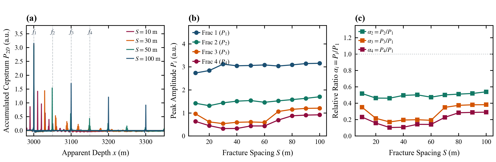
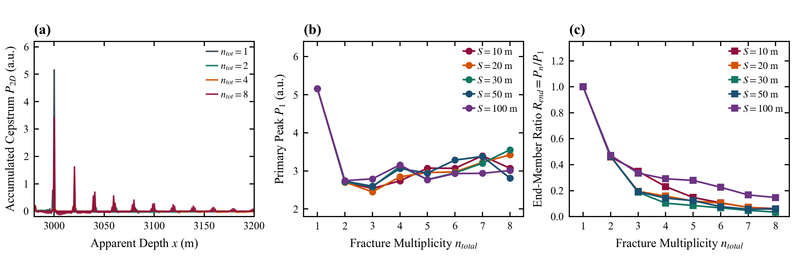
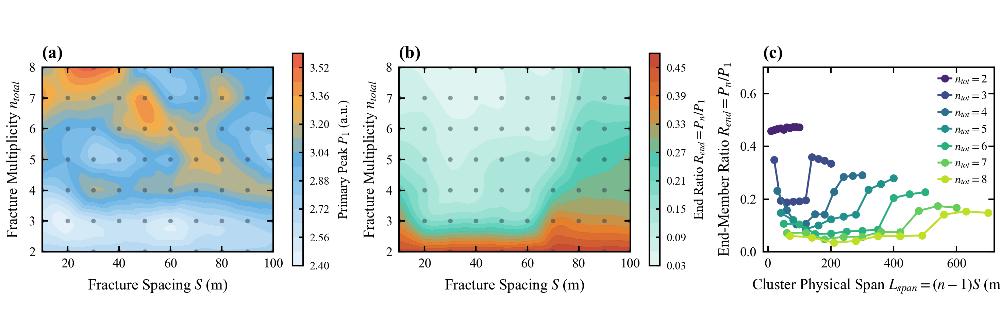
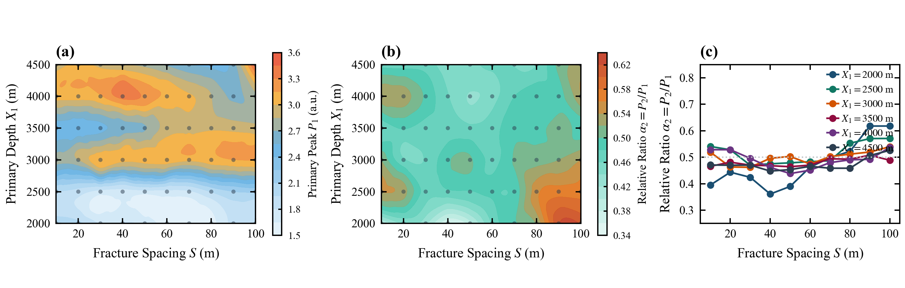
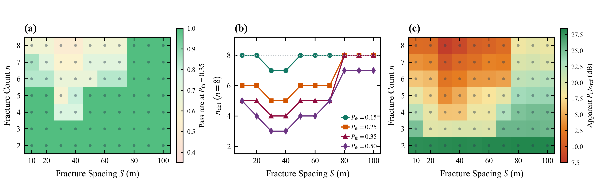

# 课题进展汇报：井下多裂缝水击倒谱表观响应的参数扫描

**汇报主题**：稳态摩阻下水平井多裂缝水击累积倒谱峰的参数响应  
**归属章节**：Paper A 第 5 章  
**数据基础**：`decay_table.csv` 稳态记录。独立拓扑 426 组；峰值表按 $(X_1,S,n)$ 列出 480 条键，其中单缝基线按 $S$ 重复，不按多样本计。

---

## 摘要

在稳态 Darcy 摩阻、固定物性和统一倒谱窗（30 s Hamming，5 s hop）下，对首缝深度 $X_1$、簇间距 $S$ 和裂缝数 $n$ 做全因子扫描，在真值邻域提取累积倒谱表观峰值 $P_i$。单参数切片表明：后序缝 $P_i$ 随 $S$ 非单调；单缝到双缝时 $P_1$ 下降约 47.5%，此后波动明显变小；$P_1(X_1)$ 不是单调深度衰减，$\alpha_2$ 相对集中而 $\alpha_3,\alpha_4$ 仍随深度明显变化。双参数对照表明：相同总跨度 $L_{\mathrm{span}}=(n-1)S$ 下末首峰比 $R_{\mathrm{end}}$ 随 $n$ 明显不同，故 $L_{\mathrm{span}}$ 不是充分描述量；深度与间距存在不能用单一缩放消掉的联合变化。固定几何工况内，$P_i=A\mathrm{e}^{-\gamma(i-1)}$ 平均 $R^2\approx 0.986$，但是经验包络。给定假设门限后，中等间距过门限数偏低、大间距回升，这是条件化现象，不是现场可行域。本章只建立参数响应，不完成唯一机制识别。

---

## 一、问题与实验范围

在固定物性、稳态 Darcy 摩阻、30 s Hamming 窗和 5 s hop 下，扫描

| 参数 | 范围 | 独立档数 |
| :--- | :--- | :---: |
| 簇间距 $S$ | $10$–$100\,\mathrm{m}$，步长 $10\,\mathrm{m}$ | 10 |
| 裂缝数 $n$ | $1$–$8$ | 8 |
| 首缝深度 $X_1$ | $2000$–$4500\,\mathrm{m}$，步长 $500\,\mathrm{m}$ | 6 |

峰值 $P_i$ 是真值邻域内的累积倒谱表观峰值，不是反射能量。相对峰比 $\alpha_i=P_i/P_1$，末首峰比 $R_{\mathrm{end}}=P_n/P_1$。本章只报告参数响应，不完成唯一机制识别，不外推现场噪声。

---

## 二、七个模块：研究主题与核心结论

### 1. 间距主效应（5.1）

*   **研究主题**：固定 $X_1=3000\,\mathrm{m}$，考察簇间距 $S$ 对各缝累积倒谱表观峰值 $P_i$ 的调制，并比较 $n=2,4,8$。
*   **核心结论**
    *   **数据现象**：Figure 5.1(a) 表明，$S$ 增大使峰位沿倒谱轴拉开，但峰高并不守恒。Figure 5.1(b) 是主证据：$n=4$、$S\ge 30\,\mathrm{m}$ 时 $P_1=3.040$–$3.159$（相对极差约 $3.8\%$），而 $P_3$、$P_4$ 在 $S=20$–$60\,\mathrm{m}$ 落入低值区（最低 $0.536$、$0.324$），$S\ge 70\,\mathrm{m}$ 回升至约 $1.21$、$0.92$。Figure 5.1(c) 的 $\alpha_i$ 同步再现后序缝非单调。对照扩展切片：$n=2$ 几乎不随 $S$ 变化，$n\ge 3$ 才出现同类形态。
    *   **机理解释**：间距同时改写后续到达的相对时延与叠加结构；该非单调低值区与多次反射、波包叠加及固定分析窗的共同调制相容。现有切片缺少独立的相位或路径分解，不能唯一判因为相消干涉、半波长共振或大间距完全解耦。
    *   **核心见解**：簇间距不是单纯的时延参数。它对首缝表观峰的影响较弱，对后序缝则足以改变可观测幅值结构；多缝系统中的间距响应因此不能由双缝切片外推。

> **Figure 5.1 | 间距 $S$ 对累积倒谱表观峰值的影响（$X_1 = 3000\,\mathrm{m}$，$n = 4$）**  
> **(a)** $S = 10,30,50,100\,\mathrm{m}$ 的时间边际累积倒谱剖面。灰色虚线只标 $S = 50\,\mathrm{m}$ 的真值位置；其余间距的真值随 $S$ 平移，不以该组竖线读取。  
> **(b)** 各缝表观峰值 $P_i(S)$。  
> **(c)** 相对表观响应 $\alpha_i = P_i/P_1$。第三面板是 $\alpha_i$，不是峰旁比。

### 2. 缝数主效应（5.2）

*   **研究主题**：固定 $X_1=3000\,\mathrm{m}$，考察裂缝数 $n$ 对首缝 $P_1$ 与末首峰比 $R_{\mathrm{end}}$ 的反馈，并检验单缝基线能否外推。
*   **核心结论**
    *   **数据现象**：Figure 5.2(a) 中单缝剖面显著高于多缝。Figure 5.2(b) 给出关键跳变：$S=20\,\mathrm{m}$ 时 $n=1\to 2$，$P_1$ 由 $5.157$ 降至 $2.705$（$-47.5\%$）；该跳变在其余 $S$ 上同样出现，$n\ge 2$ 后 $P_1$ 的 CV 约 $8.1\%$，不再出现同等幅度的二次下跌。Figure 5.2(c) 中 $R_{\mathrm{end}}$ 总体随 $n$ 下降，但并非全域严格单调（$S=50\,\mathrm{m}$ 时 $n=7\to 8$ 由 $0.0570$ 略升至 $0.0595$）。$n=4$ 与 $n=8$ 的对应前序峰仍可差 $13\%$–$23\%$。
    *   **机理解释**：增加下游界面会改变井筒—裂缝系统的反射结构，使井口倒谱峰不再等于单缝响应的线性叠加。$R_{\mathrm{end}}$ 的总体下降与界面增多相容，但现有指标不足以识别单节点透射系数，也不能写成声学相变或几何透射律。
    *   **核心见解**：下游缝数会反馈到井口首缝观测。单缝基线不能作为多缝系统的零阶近似；多缝区的前序峰“近似稳定”只相对于单—双缝跳变成立，并不意味着前序包络可以跨 $n$ 直接套用。

> **Figure 5.2 | 缝数 $n$ 对首缝与末首峰比的影响（$X_1 = 3000\,\mathrm{m}$）**  
> **(a)** $S=20\,\mathrm{m}$ 下 $n=1,2,4,8$ 的累积倒谱剖面。  
> **(b)** 不同 $S$ 下 $P_1(n)$。  
> **(c)** 末首峰比 $R_{\mathrm{end}}(n)$。本图不包含尾波比 CSR。

### 3. 深度主效应（5.3）

*   **研究主题**：固定 $S=20\,\mathrm{m}$、$n=4$，考察首缝深度 $X_1$ 对绝对峰值 $P_i$ 与相对响应 $\alpha_i$ 的差异化影响，并核对真值邻域峰位偏差。
*   **核心结论**
    *   **数据现象**：Figure 5.3(a) 在相对坐标 $\Delta x=x-X_1$ 下峰位对齐，说明该切片的局部寻峰与几何映射一致。Figure 5.3(b) 否定单调深度衰减：$P_1(X_1)$ 为 $1.876$–$3.068$，整体略升，各缝绝对峰值同步起伏。Figure 5.3(c) 显示归一化效应随序号分化——$\alpha_2$ 的 CV 为 $7.25\%$，而 $\alpha_3$、$\alpha_4$ 达 $24.7\%$、$27.9\%$。该切片最大真值邻域峰位偏差约 $0.615\,\mathrm{m}$。
    *   **机理解释**：数据足以否定“沿程指数衰减即可概括 $P_i(X_1)$”。非单调起伏可能同时受到沿程传播、边界反射、多次反射和固定分析窗的影响；现有切片不能单独证实驻波或窗截断。
    *   **核心见解**：深度敏感性随裂缝序号而变。归一化只使次缝相对响应 $\alpha_2$ 相对集中，不能把全部 $\alpha_i$ 称为深度不变量；现有峰位偏差仅反映真值邻域提取与网格映射的一致性，不是盲定位精度。

> **Figure 5.3 | 首缝深度 $X_1$ 对绝对峰值与相对响应的影响（$S=20\,\mathrm{m}$，$n=4$）**  
> **(a)** 相对坐标 $\Delta x=x-X_1$ 下对齐的累积倒谱剖面。  
> **(b)** 各缝绝对表观峰值 $P_i(X_1)$。  
> **(c)** 相对表观响应 $\alpha_i(X_1)$。本图不包含 FWHM 或 PSR。

### 4. 间距—缝数交互（5.4）

*   **研究主题**：固定 $X_1=3000\,\mathrm{m}$，在 $(S,n)$ 网格上检验总跨度 $L_{\mathrm{span}}=(n-1)S$ 是否足以描述末首峰比 $R_{\mathrm{end}}$。
*   **核心结论**
    *   **数据现象**：Figure 5.4(a)(b) 显示 $P_1$ 与 $R_{\mathrm{end}}$ 在离散网格上按 $n$ 分层，且 $n\ge 3$ 时再现中等间距偏低、大间距回升。Figure 5.4(c) 是充分性检验：等段长 $L_{\mathrm{span}}=60\,\mathrm{m}$ 时，$n=2,3,4,7$ 的 $R_{\mathrm{end}}$ 分别为 $0.4722$、$0.1877$、$0.1582$、$0.0716$，不同 $n$ 的曲线不落到同一条 $L_{\mathrm{span}}$ 关系上。$P_\Sigma$ 最大点在 $n=8$、$S=80\,\mathrm{m}$（$10.231$），并非随 $(S,n)$ 严格单调增加。
    *   **机理解释**：相同总长度可由“少缝大间距”或“多缝小间距”实现，但界面数目与局部间距分别进入反射序列，因而 $R_{\mathrm{end}}$ 不能被单一标量 $L_{\mathrm{span}}$ 吸收。该对照只能否定总跨度等效，不能独立分解节点数、间距与观测算子的贡献。
    *   **核心见解**：几何等效并不意味着倒谱响应等效。描述多缝表观峰至少须同时保留 $n$ 与 $S$；总跨度不是充分描述量，也不能据此宣称离散拓扑唯一主导。

> **Figure 5.4 | $(S,n)$ 离散网格上的 $P_1$、$R_{\mathrm{end}}$ 与等段长对照（$X_1=3000\,\mathrm{m}$）**  
> **(a)** 首缝表观峰值 $P_1(S,n)$。色块由 70 个离散点插值，仅供示意，不表示连续相区。  
> **(b)** 末首峰比 $R_{\mathrm{end}}(S,n)$，同样是离散网格的示意着色。  
> **(c)** 以总跨度 $L_{\mathrm{span}}=(n-1)S$ 为横轴的 $R_{\mathrm{end}}$，按 $n$ 分组。

### 5. 深度—间距交互（5.5）

*   **研究主题**：固定 $n=4$，在 $(X_1,S)$ 60 点网格上检验深度与间距能否视为互相独立的两个缩放。
*   **核心结论**
    *   **数据现象**：Figure 5.5(a) 中 $P_1$ 主要随 $X_1$ 抬升（浅井约 $1.6$–$2.1$，深井约 $2.5$–$3.5$），但同一深度内随 $S$ 的相对极差仍达 $14\%$–$37\%$。Figure 5.5(b)(c) 给出相对响应：60 点上 $\alpha_2=0.4886\pm 0.0464$（$0.3609$–$0.6179$），比深部相对响应更集中，却不是不变量。$\alpha_3$ 的离散最小点位于 $S=10$–$50\,\mathrm{m}$，并随 $X_1$ 移动。
    *   **机理解释**：若深度仅提供全局增益、间距仅提供相对结构，则 $P_1$ 应对 $S$ 不敏感，且全部 $\alpha_i$ 应对 $X_1$ 不敏感。两者均被网格否定。深部低值区位置随深度漂移，说明间距调制本身具有深度依赖性。
    *   **核心见解**：深度与间距存在不能由单一缩放消除的联合变化。$\alpha_2$ 相对集中不等于正交可分；当前数据不支持把 $(X_1,S)$ 无条件拆成两个独立反演问题。

> **Figure 5.5 | $(S,X_1)$ 离散网格上的 $P_1$ 与 $\alpha_2$（$n=4$）**  
> **(a)** 首缝表观峰值 $P_1(S,X_1)$。色块由 60 点插值示意，不是连续相区。  
> **(b)** 次缝相对表观响应 $\alpha_2(S,X_1)$。  
> **(c)** 6 个深度切片上的 $\alpha_2(S)$。灰色虚线为 $\alpha_2=0.50$ 参考，不是不变性证明。

### 6. 固定工况经验包络（5.6）

*   **研究主题**：在固定 $(n,S)$ 内，用序号指数 $P_i=A\mathrm{e}^{-\gamma(i-1)}$ 描述各缝表观峰序列，并核对它与空间写法是否仅为同一拟合的改写。
*   **核心结论**
    *   **数据现象**：Figure 5.6(a) 显示固定 $S$ 时 $P_i$ 随序号 $i$ 下降，但不同 $S$ 的尾缝并不收成一条曲线（$P_8$ 介于 $0.124$ 与 $0.460$）。Figure 5.6(b) 中同一 $A_{\mathrm{fit}}$ 的指数包络贴合数据；Figure 5.6(c) 汇总 $n=3$–$8$ 共 60 个工况，平均 $R^2=0.9864$。经验衰减率 $\gamma$ 随 $S$ 非单调：$S=20$–$40\,\mathrm{m}$ 约 $0.67$–$0.69$，$S\ge 80\,\mathrm{m}$ 降至约 $0.29$–$0.31$，与 5.1 后序缝低值区一致。$S=10\,\mathrm{m}$、$n=8$ 的 $P_8=0.186$。
    *   **机理解释**：高 $R^2$ 只说明固定几何工况内的序列形态接近指数。因 $\Delta x=S(i-1)$，空间写法与序号写法满足 $\gamma=\beta_x S$，预测值、残差和 $R^2$ 必然相同，不能据此宣称拓扑优于空间。$\gamma$ 是序号轴经验衰减率，不是单节点物理透射损耗。
    *   **核心见解**：指数包络是固定工况内的有效经验描述，不是跨工况普适定律。$\gamma(S)$ 的非单调本身就是 5.1 幅值结构的参数化表达；该 $\gamma$ 不宜直接当作反演补偿算子。

> **Figure 5.6 | 固定工况内的序号经验包络（$X_1=3000\,\mathrm{m}$，$n=8$）**  
> **(a)** 不同 $S$ 下表观峰值 $P_i$ 对裂缝序号 $i$。  
> **(b)** 同一 $A_{\mathrm{fit}}$ 与 $\gamma$ 给出的指数包络及 $R^2$。  
> **(c)** $n=3$–$8$ 共 60 个工况的包络 $R^2(S)$。

### 7. 门限敏感性（5.7）

*   **研究主题**：在真值邻域峰值上施加假设门限 $P_{\mathrm{th}}$，统计 $n_{\mathrm{det}}(P_{\mathrm{th}})=\sum_i\mathbf{1}(P_i\ge P_{\mathrm{th}})$，考察 $(S,n)$ 如何改变过门限数量。
*   **核心结论**
    *   **数据现象**：Figure 5.7(a) 在 $P_{\mathrm{th}}=0.35$ 的离散网格上，$n$ 较大且 $S$ 中等时 $n_{\mathrm{det}}/n$ 偏低。Figure 5.7(b) 给出定量投影：$n=8$ 时，$S=30/40\,\mathrm{m}$ 为 $4/8$，$S=80/90/100\,\mathrm{m}$ 为 $8/8$；门限越高，中等间距少检出的缝越多。Figure 5.7(c) 相对于假设参考 $\sigma_{\mathrm{ref}}=0.05$ 的末缝幅噪比，同步再现大间距回升。
    *   **机理解释**：该计数形态是 5.1 后序缝低值区与 5.6 中 $\gamma(S)$ 在中等间距偏高的同一组幅值事实，经绝对门限截断后的投影。$\sigma_{\mathrm{ref}}$ 未注入随机噪声，过门限又依赖真值邻域提峰，因此不是盲检召回率。
    *   **核心见解**：中等间距过门限数偏低、大间距回升，是给定处理流程、噪声参考和门限下的条件化现象，不构成现场可行域或物理盲区。$S<10\,\mathrm{m}$ 无数据，不作混叠结论。

> **Figure 5.7 | 真值邻域表观峰的门限敏感性（$X_1=3000\,\mathrm{m}$）**  
> **(a)** $P_{\mathrm{th}}=0.35$ 时 $n_{\mathrm{det}}/n$ 的离散网格着色；灰点为实际采样点，色块不是连续可行域。  
> **(b)** $n=8$ 时四个门限下的 $n_{\mathrm{det}}(S)$。  
> **(c)** 相对于 $\sigma_{\mathrm{ref}}=0.05$ 的末缝表观幅噪比，同样按离散网格着色。

---

## 三、当前可对外陈述的四条

| 序号 | 核心见解 | 对应图证 | 不能升级成 |
| :---: | :--- | :--- | :--- |
| 1 | 簇间距调制后序缝表观幅值，呈中等间距压低、大间距回升 | Figure 5.1(b)(c) | 相消干涉已被证实 |
| 2 | 几何等效不等于响应等效：$L_{\mathrm{span}}$ 不是充分描述量 | Figure 5.4(c) | 离散拓扑唯一主导 |
| 3 | 固定工况内指数包络有效（平均 $R^2\approx 0.986$），但是经验描述 | Figure 5.6(b)(c) | 单节点透射定律 |
| 4 | 上述幅值结构在假设门限下投影为条件化少检出 | Figure 5.7(a)(b) | 现场可行域 / 盲区 |

---

## 四、下一步

1. 按上述主张上限整理第 5 章正文；
2. 若做反演，先单独验证，不把本章经验 $\gamma$ 直接当作补偿算子；
3. 非定常摩阻对照用于检验本章响应是否稳健，而不是修正“已证实机制”。
