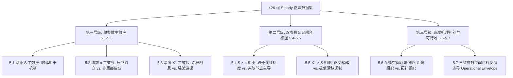

# 井口多裂缝水击倒谱响应参数敏感性分析与图表设计规范 (Steady Cases)

> **状态**：本文是实验前的假说与分流预案，不再作为结论文本。现行表述以各节 `5.x_*.md`、`稿件/cc表述修改方案.md` 和已改写的大纲/汇报稿为准。
> **文档性质**：针对非常规油气水力压裂井筒水击波监测（Paper A / 稳态摩阻基准）的**假说驱动（Hypothesis-Driven）与多预案辩证分析方案**。
> **算例来源**：`PaperA井口多裂缝水击响应/01_几何网格` 中的全部 **Steady（稳态流）** 正演工况集（426 组独立拓扑工况）。
> **核心原则**：严禁预设立场与主观定论；设立相互竞争的物理假说，制定客观判据，并对数据可能呈现的不同表征提供完备的物理分流解释预案。

---

## 1. 总体设计原则与研究假说框架

### 1.1 从单点观测到系统多维表征的分析范式
在多裂缝波导系统中，常规工程解释往往隐含两个假设：
1. **局部独立性**：首缝倒谱峰强仅由自身尺度和到井口距离决定，不受下游网络影响；
2. **空间连续性**：后续裂缝的能量衰减主要受物理传播距离（$\Delta x$）的连续阻尼控制。

本研究在稳态 Darcy 摩阻基准下，系统检验上述假设在离散多裂缝波导中的有效性，建立**“局部强度 + 空间拓扑衰减 + 信号干涉与可辨识度”**三维观测体系。

```
                         ┌─── X1 (井筒传播距离) ───► 检验: 连续粘性耗散 vs. 全井波场驻波干涉
                         │
三维控制参数空间 ────────┼─── n_total (裂缝总数) ──► 检验: 上游局部独立 vs. 下游网络非局部反馈
(426 组 Steady 工况)     │
                         └─── S (空间簇间距) ───────► 检验: 几何独立时延 vs. 多径相位相干调制
```

### 1.2 稳态工况空间全集 (Parameter Grid)
*   **首缝深度 $X_1$**：$2000, 2500, 3000, 3500, 4000, 4500\text{ m}$（6 个深度梯度）
*   **裂缝间距 $S$**：$10, 20, 30, 40, 50, 60, 70, 80, 90, 100\text{ m}$（10 个间距梯度）
*   **裂缝总数 $n_{total}$**：$1, 2, 3, 4, 5, 6, 7, 8$（8 个缝数梯度）
*   **固定物性基准**：井径 $D = 0.1397\text{ m}$，波速 $a = 1450\text{ m/s}$，密度 $\rho = 1000\text{ kg/m}^3$，裂缝柔度 $C_f = 10^{-5}\text{ m}^3/\text{Pa}$，滤失系数 $k_{leak} = 10^{-4}\text{ m}^3/(\text{s}\cdot\text{m}^{0.5})$。
*   **总工况量**：单缝基准（6 组）+ 多缝组合（$6 \times 10 \times 7 = 420$ 组）= **426 组独立拓扑工况**。

---

## 2. 观测指标体系与量化判据库

| 维度 | 指标名称 | 符号表达 | 数学定义 / 计算公式 | 物理意义与假说判据功能 |
| :--- | :--- | :--- | :--- | :--- |
| **局部特征** | 首缝倒谱幅值 | $P_1$ | $\max_{|x-X_1|\le r} \left( -\sum_t C_{2D}(q(x),t) \right)$ | 表征前向反射与前沿波场能量；检验首缝是否受下游调制 |
| | 各子缝倒谱幅值 | $P_i$ | $\max_{|x-x_i|\le r} \left( -\sum_t C_{2D}(q(x),t) \right)$ | 第 $i$ 簇裂缝位置的表观响应强度 |
| | 相对能量序列 | $\alpha_i$ | $\alpha_i = P_i / P_1$ | 消除基底波动，表征裂缝段内部的逐级能量衰减规律 |
| **拓扑与衰减** | 末首穿透比 | $R_{end}$ | $R_{end} = P_{n_{total}} / P_1$ | 衡量波场穿透整个裂缝段的能力；判别阻抗屏蔽强弱 |
| | 空间衰减拟合度 | $R^2_{dx}, \text{RMSE}_{dx}$ | $\alpha_i = (1+\Delta x_i)^{-k_{dx}}$ 或 $\exp(-(b\Delta x_i)^\beta)$ | 检验“物理距离主导耗散”假说的拟合优度 |
| | 拓扑衰减拟合度 | $R^2_{idx}, \text{RMSE}_{idx}$| $\alpha_i = \text{idx}^{-k_{idx}}$ | 检验“节点序号主导反射分流”假说的拟合优度 |
| **干涉与质量** | 峰旁比 (信噪比) | $\text{PSR}_i$ | $\text{PSR}_i = \frac{P_i - \mu_{\text{coda}}}{\sigma_{\text{coda}}}\text{ (dB)}$ | 衡量多径散射背景下真实裂缝峰的显著度（$\ge 3\text{ dB}$ 为可辨） |
| | 尾波干扰比 | $\text{CSR}$ | $\text{CSR} = E_{\text{coda}} / E_{\text{primary}}$ | 尾波区能量与主反射区能量之比；表征多径散射杂波严重度 |
| | 倒谱主峰半高宽 | $\Delta \tau_{FWHM}$ | 倒谱主峰幅值下降至 $50\%$ 的宽度 | 空间分辨率极限与脉冲展宽程度（稳态下约 1.5m） |
| | 完全识别率 | $\eta_{det}$ | $\frac{N_{\text{detected}}}{n_{total}} \times 100\%$ | 在给定误差容限（$\le 1\text{m}$）和 $\text{PSR}$ 下的完整识别度 |

---

## 3. 模块化分析方案、竞争假说与分流解释预案



---

### 5.1 空间间距 $S$ 的主效应：时延相干与多径响应机制

*   **针对 Case**：
    *   固定基准深度 $X_1 = 3000\text{ m}$，裂缝总数 $n_{total} \in \{2, 4, 8\}$；
    *   全扫描间距 $S \in [10, 20, 30, \dots, 100]\text{ m}$（共 30 组工况）。
*   **分析方法**：
    *   提取 2D 倒谱时间轴积分剖面；计算特征往返时延 $\tau_s = \frac{2S}{a}$ 与分析窗 $\Delta t_w$ 的匹配关系。
*   **观测指标**：$P_1(S)$、$P_i(S)$、$\alpha_i(S)$、$\text{PSR}_i$。
*   **核心竞争假说**：
    *   **假说 H1-A（单次散射独立响应）**：间距仅线性改变反射波到达时刻，各缝峰值强度与间距 $S$ 无关，$P_i(S) \approx \text{Const}$。
    *   **假说 H1-B（相位相干与多次波干涉）**：缝间多次往返反射波在分析窗内相干叠加，间距调控的时延导致 $P_i(S)$ 出现相长/相消的非单调振荡；小间距下滋生等间距高次散射伪峰。
*   **辩证分流解释预案 (Contingency Scenarios)**：
    *   **分支 1（若数据呈现强非单调振荡）** $\rightarrow$ 证实 H1-B。深入分析相消谷值点与反射波相位反转的对应关系，阐明多裂缝系统的波导干涉本质。
    *   **分支 2（若数据呈现平稳常数或单调变化）** $\rightarrow$ 支持 H1-A。表明在当前柔度/滤失参数下，一次反射占绝对主导，缝间高次透反射能量迅速衰减，未能构成强相干源。
    *   **分支 3（若 $S=10\text{ m}$ 小间距主峰尖锐但伴随深部伪峰）** $\rightarrow$ 结合预实验 FWHM（~1.45m）指出稳态下几何可分辨性良好，但多径伪峰（Coda）是导致深部误判的主因。
*   **配套图件规范 (Figure 5.1)**：
    *   **类型**：三面板组合图（3-Panel Plot）
    *   **(a) 典型间距倒谱剖面对比**：$X_1=3000\text{ m}, n=4$ 下 $S=10, 30, 50, 100\text{ m}$ 四条曲线；标出真值位置与伪峰区。
    *   **(b) 各缝峰值随间距演化轨迹**：$P_1, P_2, P_3, P_4$ 随 $S$ 的变化曲线。
    *   **(c) 峰旁比演化**：$\text{PSR}_i$ 随 $S$ 变化曲线，标注 $3\text{ dB}$ 工程阈值线。

---

### 5.2 裂缝总数 $n_{total}$ 的主效应：局部独立性 vs. 非局部网络反馈

*   **针对 Case**：
    *   固定基准深度 $X_1 = 3000\text{ m}$，固定典型间距 $S = 20\text{ m}$（密间距）与 $S = 80\text{ m}$（疏间距）；
    *   扫描裂缝总数 $n_{total} \in [1, 2, 3, 4, 5, 6, 7, 8]$（共 16 组工况）。
*   **分析方法**：
    *   提取首缝及末缝峰值序列；统计尾波区背景 RMS 能级演化。
*   **观测指标**：$P_1(n_{total})$、$P_{n_{total}}(n_{total})$、$R_{end}$、$\text{CSR}$。
*   **核心竞争假说**：
    *   **假说 H2-A（前向因果与局部独立性）**：首缝响应发生在上游，下游裂缝的增减只影响其自身的透射分流，首缝表观峰值 $P_1(n_{total})$ 应保持不变。
    *   **假说 H2-B（全网络非局部反馈）**：下游新增裂缝形成逆向反射波系传回井口，并在倒谱窗内对首缝进行反向相干叠加，导致 $P_1(n_{total})$ 随 $n$ 波动。
*   **辩证分流解释预案**：
    *   **分支 1（若 $P_1$ 随 $n_{total}$ 发生非单调波动）** $\rightarrow$ 证实 H2-B。推翻“首缝等同于孤立单缝”的传统工程直觉，证明多裂缝波导具有非局部反馈特性。
    *   **分支 2（若 $P_1$ 严格恒定，而后缝单调递减）** $\rightarrow$ 证实 H2-A。说明在稳态条件下前向因果律严格成立，工程上可将首缝作为独立标定基准。
    *   **分支 3（若末首比 $R_{end} \ll 0.1$ 发生能量骤降）** $\rightarrow$ 解释为离散节点级联反射带来的“阻抗屏蔽（Impedance Shielding）”效应，评估有效探测深度极限。
*   **配套图件规范 (Figure 5.2)**：
    *   **类型**：双面板折线 + 柱状组合图（2-Panel Plot）
    *   **(a) 前后裂缝能量演化**：$S=20\text{ m}$ 与 $S=80\text{ m}$ 下 $P_1$ 与 $P_{n_{total}}$ 随 $n$ 的演化曲线。
    *   **(b) 穿透比与尾波比**：左轴 $R_{end}$ 折线，右轴 $\text{CSR}$ 柱状堆叠图。

---

### 5.3 井筒深度 $X_1$ 的主效应：连续粘性阻尼 vs. 全井驻波谐振

*   **针对 Case**：
    *   扫描井口至首缝深度 $X_1 \in [2000, 2500, 3000, 3500, 4000, 4500]\text{ m}$；
    *   对比单缝基准（$n_{total}=1$）与多缝系统（$n_{total}=4, 8$，固定 $S = 20\text{ m}$）（共 18 组工况）。
*   **分析方法**：
    *   空间传播距离一维回归；分析倒谱主峰半高宽 $\Delta \tau_{FWHM}$ 与信噪比。
*   **观测指标**：$P_i(X_1)$、$\Delta \tau_{FWHM}(X_1)$、$\text{PSR}_1(X_1)$。
*   **核心竞争假说**：
    *   **假说 H3-A（经典单调粘性耗散）**：水击波沿程受达西摩阻连续耗散，幅值随深度单调指数衰减 $P_1 \propto \exp(-\mu X_1)$。
    *   **假说 H3-B（全井腔体驻波干涉）**：井口截流边界与裂缝群形成谐振腔，特定深度使全井反射波发生相长/相消，使 $P_1(X_1)$ 呈现非单调起伏。
*   **辩证分流解释预案**：
    *   **分支 1（若呈现严格单调指数衰减）** $\rightarrow$ 支持 H3-A。表明稳态阻尼是长距离传播的主控因素，衰减率可用于标定管壁摩阻。
    *   **分支 2（若出现非单调波动/特定深度反弹）** $\rightarrow$ 支持 H3-B。表明井筒几何边界诱发的全局驻波效应不可忽略，不能简单按局部距离换算衰减。
    *   **分支 3（若主峰宽度 $\Delta \tau_{FWHM}$ 随深度几乎不展宽）** $\rightarrow$ 明确指出稳态达西摩阻缺乏高频频散机制（高频与低频同速传播），为后续引入非定常摩阻（Brunone 模型）提供关键的物理对比基准。
*   **配套图件规范 (Figure 5.3)**：
    *   **类型**：双面板对比图（2-Panel Plot）
    *   **(a) 深度衰减曲线**：单缝（$n=1$）与多缝（$n=4, 8$）的 $P_1(X_1)$ 衰减对比。
    *   **(b) 展宽与信噪比**：左轴 $\Delta \tau_{FWHM}$，右轴 $\text{PSR}_1$ 随 $X_1$ 变化。

---

### 5.4 间距与缝数交叉耦合 ($S \times n_{total}$)：连续几何段长 vs. 离散节点拓扑

*   **针对 Case**：
    *   固定 $X_1 = 3000\text{ m}$，覆盖完整的 2D 参数矩阵：$S \in [10, 100]\text{ m} \times n_{total} \in [2, 8]$（共 70 组工况）。
*   **分析方法**：
    *   构建 2D 等高线热力相图；以总段长 $L_{stage} = (n_{total}-1)S$ 为自变量进行数据归一化坍缩测试。
*   **观测指标**：$P_1(S, n_{total})$、$\eta_{det}(S, n_{total})$、$CV_{peaks} = \frac{\sigma(P_1,\dots,P_n)}{\mu(P_1,\dots,P_n)}$。
*   **核心竞争假说**：
    *   **假说 H4-A（连续介质等效/总段长标度）**：响应主要受总压裂段跨度 $L_{stage}$ 控制，相同 $L_{stage}$ 下密集多缝与稀疏少缝具有等效的波导行为。
    *   **假说 H4-B（离散节点拓扑主导）**：离散节点的反射/透射阶数具有不可替代性，节点数 $n$ 与间距 $S$ 呈现非对称的非线性耦合。
*   **辩证分流解释预案**：
    *   **分支 1（若等高线平行于 $L_{stage}=\text{Const}$ 且曲线良好坍缩）** $\rightarrow$ 证实 H4-A。建立基于总段长 $L_{stage}$ 的无量纲相似准则。
    *   **分支 2（若相同 $L_{stage}$ 下数据显著离散/相图呈非对称斑块）** $\rightarrow$ 证实 H4-B。说明多裂缝系统的本质是离散多体散射网络，而非均匀等效介质。
    *   **分支 3（在小 $S$、大 $n$ 区域检出率 $\eta_{det}$ 骤降）** $\rightarrow$ 划定多径干涉盲区，确定稳态倒谱方法的几何容限边界。
*   **配套图件规范 (Figure 5.4)**：
    *   **类型**：二维等高线热力相图 + 标度折线图（2-Panel Plot）
    *   **(a) 2D 响应等高线相图**：横轴 $S$，纵轴 $n_{total}$，色阶 $\eta_{det}$ 或 $P_1$，叠加 $\eta_{det}=100\%$ 等值线。
    *   **(b) 总段长标度坍缩图**：横轴 $L_{stage}$，纵轴归一化幅值，按 $n_{total}$ 着色检验是否坍缩为单线。

---

### 5.5 深度与间距交叉耦合 ($X_1 \times S$)：正交解耦 vs. 极值漂移调制

*   **针对 Case**：
    *   固定 $n_{total} = 4$，扫描二维矩阵：$X_1 \in [2000, 4500]\text{ m} \times S \in [10, 100]\text{ m}$（共 60 组工况）。
*   **分析方法**：
    *   在不同深度切片下提取 $P_1(S)$ 曲线；追踪干涉极值点间距 $S_{ext}(X_1)$ 的空间轨迹。
*   **观测指标**：$\text{PV Ratio} = \frac{P_{1,\max}(S)}{P_{1,\min}(S)}\Big|_{X_1}$、$\Delta t_{margin} = \frac{2S}{a} - \Delta \tau_{FWHM}(X_1)$。
*   **核心竞争假说**：
    *   **假说 H5-A（正交独立解耦）**：深度仅引起整体幅值缩放，发生相长/相消干涉的特征间距 $S_{ext}$ 严格固定，不随深度漂移。
    *   **假说 H5-B（全井相位调制/极值漂移）**：传播距离引起的波形微弱演化或全井相位累积导致干涉极值点 $S_{ext}$ 随深度发生规律性漂移。
*   **辩证分流解释预案**：
    *   **分支 1（若各深度下极值点 $S_{ext}$ 垂直对齐无位移）** $\rightarrow$ 支持 H5-A。表明干涉严格由局部缝间往返时延 $\tau_s = 2S/a$ 决定，与井筒总长解耦。
    *   **分支 2（若极值点随深度呈现单调漂移）** $\rightarrow$ 支持 H5-B。分析井筒全波长与局部子波相位的交互调制机制。
    *   **分支 3（若随深度增加干涉峰谷比 $\text{PV Ratio} \to 1$ 趋于平坦）** $\rightarrow$ 解释为长距离阻尼对高次反射能量的优先耗散，减弱了深部的相干干涉强度。
*   **配套图件规范 (Figure 5.5)**：
    *   **类型**：2D 热力相图 + 极值轨迹图（2-Panel Plot）
    *   **(a) 深度-间距干涉相图**：横轴 $S$，纵轴 $X_1$，色阶 $P_1$，叠加极小值轨迹连线。
    *   **(b) 峰谷比与分辨裕度**：左轴 $\text{PV Ratio}$，右轴 $\Delta t_{margin}$ 随深度演化。

---

### 5.6 全缝空间衰减包络：物理距离模型 vs. 拓扑序号模型

*   **针对 Case**：
    *   遍历全部多缝 Steady 算例集（$X_1 \in [2000, 4500]\text{ m}, S \in [10, 100]\text{ m}, n_{total} \in [3, 8]$，共 360 组工况）。
*   **分析方法**：
    *   分别按**物理距离自变量 $\Delta x_i = (i-1)S$** 和**拓扑序号自变量 $\text{idx}_i = i$** 对相对能量 $\alpha_i = P_i / P_1$ 进行非线性最小二乘拟合；
    *   统计模型决定系数差值 $\Delta R^2 = R^2_{idx} - R^2_{dx}$ 及残差分布。
*   **核心竞争假说**：
    *   **假说 H6-A（物理空间距离控制律）**：相对幅度由物理位移 $\Delta x$ 组织（单指数 $\exp(-k \Delta x)$ 或展宽指数 $\exp(-(b\Delta x)^\beta)$），曲线族应在 $\Delta x$ 轴上对齐。
    *   **假说 H6-B（拓扑节点序号控制律）**：相对幅度主要由节点反射/透射/分流次数组织（拓扑幂律 $\text{idx}^{-k}$），曲线族在 $\text{idx}$ 轴上紧密坍缩，而在 $\Delta x$ 轴上随间距发散。
*   **辩证分流解释预案**：
    *   **分支 1（若 $\Delta R^2 > 0$ 且 $\text{idx}$ 展现高度坍缩）** $\rightarrow$ 证实 H6-B。论证在多缝波导中，节点阻抗不连续带来的透反射分流损失远大于缝间管段的沿程粘性耗散，提出基于拓扑组织的衰减新理论。
    *   **分支 2（若 $\Delta x$ 轴展现更优对齐且 $R^2_{dx} > R^2_{idx}$）** $\rightarrow$ 证实 H6-A。表明管段粘性阻尼仍是主导机制，传统距离标定方法依然适用。
    *   **分支 3（关于展宽指数模型拟合优度的辩证评估）** $\rightarrow$ 若展宽指数模型因参数自由度（2参数）在数值上拟合度最高，必须客观澄清：其仅作为经验数学描述，不可在缺乏物理证据下过度引申为微观“反常扩散”或“非德拜弛豫”。
*   **配套图表规范 (Figure 5.6 & Table 5.1)**：
    *   **图件类型**：三面板衰减对比图（3-Panel Plot）
    *   **(a) 空间距离 vs. 拓扑序号对齐对比**：左子图 $\alpha_i$ vs. $\Delta x_i$（发散曲线族）；右子图 $\alpha_i$ vs. $\text{idx}_i$（紧密坍缩包络）。
    *   **(b) 拟合残差对比**：不同模型在各裂缝节点处的残差分布柱状图。
    *   **(c) 拟合参数演化**：尺度因子 $b$、展宽指数 $\beta$、拓扑指数 $k$ 随几何参数的变化规律。
    *   **Table 5.1**：360 组工况下各模型拟合优度统计（$R^2$ 中位数、95% 置信区间、胜出工况比例）。

---

### 5.7 全局多缝可辨识度边界与可行域评估 (Operational Envelope)

*   **针对 Case**：
    *   汇总 01 网格全部 **426 组 Steady 工况**。
*   **分析方法**：
    *   全样本误差统计与多维参数空间可行域边界投影（Feasibility Boundary Mapping）。
*   **观测指标**：完全识别率 $\eta_{det}$、定位绝对误差 $\Delta x_{err} = |\hat{x}_i - x_{i,\text{true}}|$、极限分辨边界 $S_{\min}(X_1, n_{total})$。
*   **核心竞争假说**：
    *   检验稳态倒谱方法是否在三维参数空间内存在一个封闭/半封闭的工程可行域边界（Operational Envelope）。
*   **辩证分流解释预案**：
    *   **分支 1（若全域均实现 100% 识别与高精度定位）** $\rightarrow$ 客观指出这是稳态达西阻尼无频散、信噪比偏高带来的理论上限，强调该结果是理想基准，现场应用必须考虑非定常色散降级。
    *   **分支 2（若在特定小间距/深井/多缝组合下出现识别失效）** $\rightarrow$ 精确圈定失效机理（相消干涉导致的峰值湮灭，或高次尾波伪峰被误判为主峰），为实际压裂监测方案设计提供定量规避准则。
*   **配套图件规范 (Figure 5.7)**：
    *   **类型**：箱线误差统计 + 2D 识别可行域包络图（2-Panel Plot）
    *   **(a) 裂缝定位误差分布**：按间距 $S$ 和缝数 $n$ 分组的绝对定位误差箱线图（Boxplot）。
    *   **(b) 三维参数空间可行域投影**：横轴 $X_1$，纵轴 $S$，曲线族对应不同 $n_{total}$ 下的临界边界，阴影标注“可靠识别区”与“不可靠/失效区”。

---

## 4. SCI 论文撰写与逻辑推进执行清单

1. **图表绘制与检验顺序**：
   * **Step 1 (基准主效应)**：生成 Figure 5.1 - 5.3，检验单参数下是否存在单调/非单调现象；
   * **Step 2 (耦合相图)**：生成 Figure 5.4 - 5.5，检验段长等效性与极值漂移规律；
   * **Step 3 (机理判别与包络)**：生成 Figure 5.6 并计算 Table 5.1，严格以 $\Delta R^2$ 判据裁决空间组织 vs 拓扑组织；生成 Figure 5.7 划定可行域。
2. **严谨撰写规范**：
   * 采用中立、客观的科学语言，避免绝对化断言；
   * 凡提出机理，必须给出数据直接支撑与对应的假说分支判据；
   * 辩证讨论稳态假设的物理边界，为后续论文引入非定常摩阻（Brunone 机制）建立清晰的方法学桥梁。
