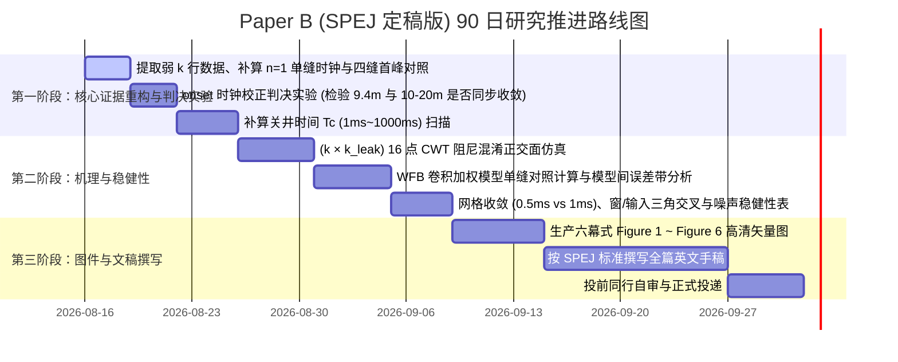

# Paper B 研究方案：非稳态摩阻下的耗散子波特征与倒谱时钟失配机理研究 (定稿修订版)

**项目名称**：井筒水击非稳态摩阻对倒谱时延特征与裂缝深度估计的系统性影响机理  
**英文标题**：Cepstral Depth as the Centroid of a Dissipative Wavelet: Clock Misspecification and Systematic Bias under Wellbore Unsteady Friction  
**目标期刊**：*SPE Journal*（SPE 旗舰顶刊，唯一主锁定期刊；备选：*Geoenergy Science and Engineering*）  
**核心卖点 (Key Message)**：  
> **非定常摩阻并不把井口水击记录里的裂缝走时信息抹掉；它改变的是倒谱所跟踪的时钟——倒谱峰跟随耗散子波的能量重心（Centroid）而非物理首波前（First Break/Onset）。在阶跃关井与弱常数阻尼（$k=0.01$）下，能量重心后移造成 $\approx \mathbf{9.4\text{ m}}$ 的测距偏深；在现场有限关井时间（$T_c = 0.2 \sim 1.0\text{ s}$）下，偏深幅度有所收敛但稳固保持在 $\approx \mathbf{5 \sim 7\text{ m}}$；而在雷诺数自适应动态 $k(Re)$ 下，盲倒谱估计器产生 $\mathbf{10 \sim 20\text{ m}}$ 的系统性偏深（历史 1D 实倒谱 $+11.8\text{ m}$，冻结全谱 $|C|$ 倒谱 $+18.7\text{ m}$）。相比之下，物理首波前（Onset 时钟）在现场快关井（$T_c \le 200\text{ ms}$）与动态 $k(Re)$ 下均可将测距绝对误差稳定控制在 $\sim \mathbf{1.3\text{ m}}$ 的物理声速无偏水平。此外，若将井口水锤阻尼比直接等同于地层缝网复杂度，存在将井筒非稳态壁面剪切耗散误判为地层响应的混淆风险。**  
> *(Cepstral depth is the centroid of a dissipative wavelet, not the fracture two-way time.)*

---

## 一、对标文献的缺陷驱动分析（Gap Analysis）与立论靶子

### 1.1 现有研究的三大并行范式与交叉空白
当前国际文献在水击与裂缝监测领域存在三个各自独立演化、缺乏深层交叉的学术共同体：

| 学术共同体 | 代表文献 | 主流范式 | 核心盲区与致命硬伤 |
| :--- | :--- | :--- | :--- |
| **压裂水锤诊断** | Sun 2025 SPEJ; Wang 2025 SPEJ; Gabry 2025 SPEJ; Zhang 2026 SPEJ; Luo 2023 SPEJ; Qiu 2022 JPSE; Dong 2024 GSE | 关井高频水锤 $\to$ 时/频/倒谱 $\to$ 反演裂缝深度、几何及缝网复杂度 | **准稳态摩阻假设**；默认 $x = a\tau/2$ 成立；将水锤全衰减笼统归因于裂缝与射孔阻尼 |
| **管道瞬变波故障诊断** | Che 2021 MSSP (综述); Wang 2002 JHE (TWD); Wang 2018 MSSP (MLE/CRB); Waqar 2025 MSSP; Meniconi 2021 WRR | TTBT / FRA / TWD / 时间反演 / 全波形匹配；明确将非定常摩阻列为诊断瓶颈 | 研究对象为输水管泄漏/堵塞；未深入井筒-裂缝大尺度系统；未打开同态倒谱这一变换机制 |
| **水动力学非定常摩阻** | Brunone 1991/2000; Vardy–Brown 1996/2003; Ghidaoui 2005 AMR; Vítkovský 2006 (IAB vs WFB) | 瞬时加速度模型 (IAB) 与加权函数卷积模型 (WFB) 理论构建 | 停留在流体力学与波形阻尼计算本身，从未延伸至倒谱变换与地学反演 |

**本研究的 True Gap**：
Qiu (2022) 将倒谱引入压裂水锤，Che (2021) 指出非定常摩阻（UF）是声学回声诊断的理论天花板，Brunone (1991) 给出了一维瞬态加速度耗散核。**三者此前从未在同一条因果链上闭合——非定常耗散子波改变了倒谱所采样的时钟（能量重心），而不是介质波速本身变了；同态卷积核则作为解释这一现象的候选物理机制。**

### 1.2 批判性对标靶子（Target Literature）
1. **主对标靶子（压裂倒谱基准）**：Qiu et al. (2022, JPSE) 与后续倒谱定位文献。其假定井口回声满足 Childers (1977) 经典的尖锐梳状对数谱前提；本研究**检验非定常高频耗散下，倒谱峰因梳状谱平滑而跟随能量重心漂移**。
2. **阻尼混淆靶子（复杂度诊断）**：Gabry et al. (2025, SPEJ) 与 Luo et al. (2023, SPEJ)。其利用 CWT 包络阻尼比直接表征缝网复杂度；本研究揭示：井筒非定常摩阻产生的阻尼与地层滤失阻尼在井口同属指数包络，**存在将井筒壁面剪切阻尼误判为地层缝网复杂度的混淆风险**。
3. **走时测距靶子**：Dong et al. (2024, GSE)。其将波峰极大值走时直接读为几何距离；本研究揭示起跳时钟与波峰时钟的分叉。
4. **历史宽松评价靶子**：早期项目采用 135 m 的超宽匹配容差，完全掩盖了 10–20 m 的真实物理偏差。本研究通过严格容差扫描揭示该隐蔽误差。

---

## 二、三大科学假说（Hypotheses）与辩证预案

```
                               ┌─────────────────────────────────────────┐
                               │   非定常摩阻 J_u ∝ k(∂tV + a sign|∂xV|)  │
                               └────────────────────┬────────────────────┘
                                                    │
                 ┌──────────────────────────────────┴──────────────────────────────────┐
                 ▼                                                                     ▼
┌─────────────────────────────────┐                                   ┌─────────────────────────────────┐
│     【假说 H1：特征时钟失配】    │                                   │     【假说 H2：阻尼机制混淆】    │
│ • 物理首波前 onset 速度几乎不变  │                                   │ • 井筒壁面剪切阻尼 (k)          │
│ • 波峰与倒谱峰追踪能量重心      │                                   │ • 地层裂缝滤失阻尼 (k_leak)     │
│ • Δt_onset << Δt_peak ≈ Δτ_cep  │                                   │ • 目标：检验二者阻尼比混淆边界  │
└────────────────┬────────────────┘                                   └────────────────┬────────────────┘
                 │                                                                     │
                 └──────────────────────────────────┬──────────────────────────────────┘
                                                    ▼
                                  ┌───────────────────────────────────┐
                                  │      【假说 H3：同态耗散机制解释】 │
                                  │ • ln|Y(f)| = ln|Y0(f)| - α(f)     │
                                  │ • Cepstrum = δ(τ-τ0) * F^{-1}{-α} │
                                  │ • 作为定性/半定量机制模型予以验证  │
                                  └───────────────────────────────────┘
```

### 假说 H1 | 特征算子与时钟失配假说（主文必证核心假说）
*   **科学假说**：非定常摩阻对陡峭波前的削蚀主要改变了波包能量形态与能量重心，而物理首波前起跳点（First Break/Onset）以接近无阻尼声速 $a$ 传播。传统公式 $x = a\tau/2$ 将依赖全频带调制的倒谱峰（对应能量重心 Centroid）错误地等同于首波前走时：
    - 在弱常数阻尼阶跃工况（$k=0.01$）下造成 $\mathbf{9.4\text{ m}}$ 偏深；
    - 在现场有限关井（$T_c = 0.2 \sim 1.0\text{ s}$）下偏深收敛至 $\mathbf{5 \sim 7\text{ m}}$ 但未消失；
    - 在雷诺数自适应动态 $k(Re)$ 下造成 $\mathbf{10 \sim 20\text{ m}}$ 系统性偏深（历史 1D 实倒谱 $+11.8\text{ m}$，冻结全谱 $|C|$ 倒谱 $+18.7\text{ m}$）。
*   **可证伪预测**：$\Delta t_{\text{onset}} \ll \Delta t_{\text{peak}} \approx \Delta\tau_{\text{cep}}$。
*   **判决性判据**：改用 onset 时钟提取后，单缝阶跃偏深（9.4 m）、有限关井偏深（5~7 m）与动态 $k(Re)$ 盲倒谱系统误差（10–20 m）均同步收敛至 $\sim 1.3\text{ m}$ 物理无偏水平。

### 假说 H2 | 井筒摩阻与缝网复杂度阻尼混淆假说（目标主张与正交检验）
*   **科学假说**：在固定裂缝参数下，单纯增加井筒非定常摩阻系数 $k$，井口水锤 CWT 包络阻尼比与模态阻尼比 $\alpha$ 的变化幅度，与改变裂缝滤失系数 $k_{\text{leak}}$ 处于同一量级。文献中将水锤总衰减直接等同于“缝网复杂度”，存在将井筒管壁剪切误判为地层物理响应的混淆风险。
*   **检验方案**：在 $(k \times k_{\text{leak}})$ 16 组正交模拟中提取与 Gabry 同类的 CWT 包络阻尼比等高线；若二者等高线高度重叠，则证实井口单通道衰减无法解耦地层与井筒，必须控制井筒摩阻。

### 假说 H3 | 同态域耗散机制解释（机制模型，不作硬性绑定）
*   **机理解释**：非定常摩阻在频域引入的频率选择性衰减因子 $e^{-\alpha(f)}$，经过对数傅里叶变换后转化为加性项 $\ln|Y(f)| = \ln|Y_0(f)| - \alpha(f)$。在倒谱域中，这表现为真实回声与耗散核 $h_{\text{UF}}(\tau) = \mathcal{F}^{-1}\{-\alpha(f)\}$ 的卷积。
*   **辩证定位**：在弱 $k$ 档下作为解释倒谱峰不对称展宽与钝化的机制模型；若实测子波不对称占主导，则在讨论节作为半定量理论模型呈现，不强行作为定理捆绑。

---

## 三、实验设计与七项方法论硬伤修补方案

### 3.1 叙述权重与主锚点调整：弱 $k$ 为主，三笔账严格分列
*   **主文数据基准**：严格采用现场物理可实现的**弱 Brunone 档**：$k \in [0.01, 0.03]$（对齐 LHS 全场探针中位数 $0.014$ 与 P95 上界 $0.0345$）；$k=0.05$ 作为主文趋势上沿。
*   **三笔账严格分列核算（消除数字与概念混淆）**：
    1. **第 1 笔账（阶跃关井 + 弱常数 $k=0.01$ 单缝）**：首峰相对稳态滞后 $\Delta t_{\text{peak}} = 13.0\text{ ms} \implies \delta x_{\text{peak}} = \mathbf{9.4\text{ m}}$，倒谱相对稳态滞后 $\delta x_{\text{cep}} = \mathbf{9.4\text{ m}}$（四缝 Matrix A 首峰与单缝 $n=1$ 严格对齐，证实 9.4 m 确为单界面能量重心滞后效应）；
    2. **第 2 笔账（现场斜坡关井 $T_c = 0.2 \sim 1.0\text{ s}$ + 弱常数 $k=0.01$）**：倒谱相对稳态偏深单调收敛至 $\delta x_{\text{cep}} = \mathbf{5.80\text{ m}} \ (200\text{ ms})$ 与 $\mathbf{5.08\text{ m}} \ (1000\text{ ms})$，峰时钟相对偏深为 $\delta x_{\text{peak}} = \mathbf{5.08\text{ m}} \ (200\text{ ms})$ 与 $\mathbf{7.25\text{ m}} \ (1000\text{ ms})$，证实**偏深随关井变缓而收敛但未完全消失**；
    3. **第 3 笔账（阶跃关井 + 动态 $k(Re)$ 单缝）**：历史 1D 实倒谱估计器偏差 $\Delta x_{\text{cep}} = \mathbf{+11.80\text{ m}}$，冻结全谱 $|C(\tau)|$ 估计器偏差 $\Delta x_{\text{cep}} = \mathbf{+18.73\text{ m}}$；**10–20 m 系统性偏深仅特指动态 $k(Re)$ 下的盲倒谱估计器**。
*   **强阻尼极端值**：$k=0.2$（$\Delta t_{\text{peak}} = 277\text{ ms}$，等效 $200.8\text{ m}$）仅作为理论应力测试（Stress Test）列于 SI 附录。

### 3.2 停泵关井时间敏感性检验 ($T_c$ Sweep) 边界审定
*   **实验完成状态**：已完成 $T_c \in \{1\text{ ms}, 50\text{ ms}, 200\text{ ms}, 1000\text{ ms}\}$ 正演与时钟提取（$T_c=2000\text{ ms}$ 记录为未做项）。
*   **审定定论**：
    - 倒谱偏深随关井时间变缓单调下降（$9.4\text{ m} \to 7.3\text{ m} \to 5.8\text{ m} \to 5.1\text{ m}$）；
    - 峰值时钟在 $1\text{ s}$ 大斜坡下因波包展宽回升至 $+7.25\text{ m}$；
    - Onset 首波前在 $T_c \le 200\text{ ms}$ 下牢固保持在 $|\Delta x| \le 0.85\text{ m}$；在 $T_c = 1000\text{ ms}$ 下因背景升压斜坡提前触发属拾取器失效，非物理早到；
    - $E_{50}$ 时钟在斜坡关井下被波包严重右拉，正文斜坡分析中弃用。

### 3.3 模型等级三角对照：IAB vs WFB vs 稳态 Darcy
*   在单缝与代表性双缝工况下，对比 Brunone 瞬时加速度模型 (IAB)、Vardy–Brown 卷积加权模型 (WFB) 与稳态 Darcy 模型，定量评估 IAB 是否过估阻尼，给出**模型间差异 / 误差带**。

### 3.4 拓扑与物理机制解耦：单缝、双缝与多缝分工
*   **单缝系统 ($n=1$, $X_1 = 4100\text{ m}$)**：专门用于检验假说 H1，解剖单一回声下的四种时钟分叉，对四缝首峰 9.4 m 偏差与动态 $k(Re)$ 的 10–20 m 偏差进行机制复核与解耦；
*   **双缝系统 ($n=2$, $D \in \{5, 10, 20, 50\}\text{ m}$)**：专门用于评估相邻波包重叠干涉与双峰对比度 $C_v$；
*   **四缝系统 ($n=4$)**：仅作为复杂工程场景验证，不用于单反射物理机制的归因。

### 3.5 阻尼混淆正交面 ($k \times k_{\text{leak}}$)
*   构建 $k \in \{0, 0.01, 0.02, 0.05\} \times k_{\text{leak}} \in \{10^{-5}, 5\times 10^{-5}, 10^{-4}, 5\times 10^{-4}\}$ 的 16 组正交面，提取水锤 **CWT 包络阻尼比** 与倒谱峰位，定量评价井筒壁面阻尼与裂缝滤失阻尼的混淆程度（精准对标 Gabry 2025 SPEJ）。

### 3.6 流变描述的科学严谨性
*   删除未经流变实测的“滑溜水 / 线性胶 / 冻胶”商品名标签；
*   严格表述为“牛顿流体运动粘度参数敏感性数值实验（$\nu \in [10^{-6}, 10^{-4}]\text{ m}^2/\text{s}$）”，讨论流体粘度通过改变雷诺数 $Re$ 进而调制 Vardy 剪切衰减系数 $C(Re)$ 的物理过程（主文不做扩展，仅作为 SI 附录数值实验或视版面精简）。

### 3.7 数值鲁棒性与方法三角交叉 (Method Triangulation)
*   **网格收敛性**：对比 $\Delta t = 0.5\text{ ms}$ 与 $1.0\text{ ms}$ 下的时钟漂移量，确保数值收敛；
*   **同态分析窗敏感性**：给出 Hamming / Hann / 矩形窗及不同窗长（10s / 30s / 50s）下的倒谱保真度对照表；
*   **输入信号三角验证**：对比压力水头 $H$、导数 $\mathrm{d}H/\mathrm{d}t$ 及带通滤波水头作为倒谱输入时的偏差一致性；
*   **噪声鲁棒性**：施加 $\text{SNR} = 20, 40, 60\text{ dB}$ 加性噪声，检验时钟漂移的稳定性。

---

## 四、六幕式 SCI 论文叙事与成果图件规划 (Figure 1 ～ Figure 6)

```text
┌───────────────────────────────────────────────────────────────────────────────────────┐
│                           Paper B 六幕式科学叙事结构                                   │
├───────────────────────────────────────────────────────────────────────────────────────┤
│ Act I. 隐蔽的假定 ── 揭示文献中倒谱测距与阻尼诊断对准稳态及尖锐梳状谱的默认假定 (Fig.1)  │
│ Act II. 弱阻尼下的隐蔽偏差 ── 在现场可实现的 k 档下，波形完好却已产生系统偏差 (Fig.2)    │
│ Act III. 四种时钟的分道扬镳 ── 揭示 onset 几乎不动、peak 与 cepstrum 随重心漂移的分叉 (Fig.3)│
│ Act IV. STFT 频带耗散与同态核 ── 弱阻尼下的频带衰减 (-1.6dB vs -17dB) 与倒谱核机理 (Fig.4) │
│ Act V. 两种失效模式 ── 系统性偏深与近距双峰干涉融合 (Fig.5)                             │
│ Act VI. 阻尼混淆与工程建议 ── 拆解井筒 UF 与地层阻尼贡献，给出关井与反演修正建议 (Fig.6) │
└───────────────────────────────────────────────────────────────────────────────────────┘
```

### Figure 1 | 耗散波包下的特征时钟失配与研究概念图（通栏）
*   **(a) 物理问题场景**：关井瞬变流在井筒内传播，壁面非稳态剪切耗散波前，在裂缝处反射；
*   **(b) 耗散子波上的四种时钟定义**：物理起跳点 $t_{\text{onset}}$、峰值点 $t_{\text{peak}}$、能量中位点 $t_{E50}$ 与倒谱峰时延 $\tau_{\text{cep}}$；
*   **(c) 文献前提崩塌示意**：稳态尖锐梳状谱（Childers 前提）vs 非定常高频耗散平滑谱。

### Figure 2 | 弱非稳态阻尼下的波形演化与隐蔽偏差（半栏/通栏）
*   **(a) 真实波形演化与基准对照**：$k \in \{0, 0.01, 0.02\}$（稳态对照与弱阻尼主文线；$k=0.05$ 作趋势上沿，$k=0.2$ 作为虚线/SI 对照）的时程对比；
*   **(b) 局部首反射波包切片**：展示在 $k=0.01$ 时波形依然清晰，但极大值已产生 $13\text{ ms}$（$\sim 9.4\text{ m}$）的隐蔽后移；
*   **(c) 累积能量积分 $E(t)$ 与 EST 展宽**（$k=0$ 为 1.0 ms，$k=0.01$ 为 8.0 ms）。

### Figure 3 | 四种特征时钟分道扬镳的定量证据（Figure 3，核心创新图）
*   **(a) 四种时钟随 $k$ 的演化曲线**：清晰展示 $t_{\text{onset}}$ 变化极小（$k=0.01$ 时仅变化 $1\text{ ms}$ / $0.02\%$），而 $t_{\text{peak}}$、$t_{E50}$ 与 $\tau_{\text{cep}}$ 同步显著后移；
*   **(b) 表观波速对比**：$a_{\text{onset}}$（$k=0.01$ 时为 $1450\text{ m/s}$，几乎恒定）vs $a_{\text{peak}}$ vs $a_{f0}$，证明“并非声速变慢，而是算子时钟失配”。

### Figure 4 | STFT 频带耗散与同态耗散机制（Figure 4）
*   **(a) STFT 共同参考时频谱**：$k=0$ vs $k=0.02$ 的高频能量演变；
*   **(b) 弱阻尼频带相对衰减柱状图**（**采用严格审计数据**）：
    *   $k=0.01$：0–20 Hz 衰减 **$-1.6\text{ dB}$**，60–150 Hz 衰减 **$-17.0\text{ dB}$**；
    *   $k=0.02$：0–20 Hz 衰减 **$-2.7\text{ dB}$**，60–150 Hz 衰减 **$-26.2\text{ dB}$**；
    *   *注：$k=0.2$ 的 $-12.9\text{ dB} / -44.1\text{ dB}$ 作为 SI 极端应力测试对照*。
*   **(c) 同态卷积核示意**：$\alpha(f)$ 谱滚降与其逆变换核 $h_{\text{UF}}(\tau)$，阐明倒谱峰变宽变矮的机制。

### Figure 5 | 倒谱识别的两种物理失效模式（Figure 5）
*   **(a) 失效模式 1：系统性深度偏深**：
    *   分列呈现：四缝首峰时钟偏深 $\approx \mathbf{9.4\text{ m}}$（Matrix A, $D=20\text{ m}, k=0.01$），与单缝盲倒谱系统偏差 $\mathbf{10 \sim 20\text{ m}}$（EXP-20260801-001 动态 $k(Re)$ 容差扫描：10 m 时 $F_1=0$，20 m 时 $F_1=1.0$）；
    *   对比稳态对照在 $2\text{ m}$ 容差下 $F_1=1.0$；对比历史 $135\text{ m}$ 宽容差掩盖误差。
*   **(b) 失效模式 2：近距干涉融合与空间可分离性**：
    *   间距 $D \in \{5, 10, 20, 50\}\text{ m}$ 下双峰对比度 $C_v$ 随 $k$ 的演化（注：*现有数据基于四缝 Matrix A，呈现 $k=0.01$ 下 $D=5\text{ m}$ 融合 $C_v=0$ 而 $D=20\text{ m}$ 可分 $C_v=1.00$；双缝矩阵 $n=2$ 正在补算复核中*）；
*   **(c) 倒谱品质因子 Q-factor 与峰旁比 PVR 衰减曲线**。

### Figure 6 | 井筒摩阻与裂缝阻尼的混淆检验及稳健性验证（Figure 6）
*   **(a) $(k \times k_{\text{leak}})$ CWT 阻尼混淆响应面**：展示井口水锤 CWT 包络阻尼比对井筒 $k$ 与裂缝 $k_{\text{leak}}$ 的联合响应，检验阻尼直接等同于裂缝复杂度的混淆风险；
*   **(b) 关井时间 $T_c$ 敏感性**：$T_c = 1\text{ ms} \sim 1000\text{ ms}$ 下特征时钟漂移量的演化；
*   **(c) 模型间对比 (IAB vs WFB vs Darcy)**：验证结论在加权函数卷积模型下的自洽性与误差带。

---

## 五、实施里程碑与 90 日行动路线



---

## 六、与系列论文 Paper C 的明确边界划分

*   **Paper B（本篇）**：深入物理耗散机理与信号特征泛函失配；解剖倒谱作为一个已有估计器为何产生 10–20 m 系统偏差，引用 Paper C 中“Brunone 下位置 CRB 仅膨胀 1.12–1.32 倍”作为信息论背景，不重复计算 Fisher 信息矩阵；
*   **Paper C（姊妹篇）**：专注全波形反演可辨识性、Cramér–Rao 界、MLE 贴界效率比，以及摩阻形式失配（稳态核拟合 Brunone 数据）导致的 ~30 m 深度偏差。
