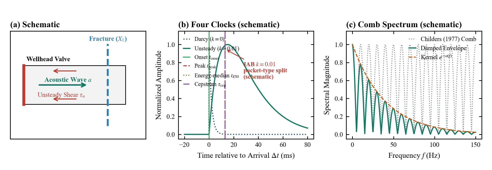
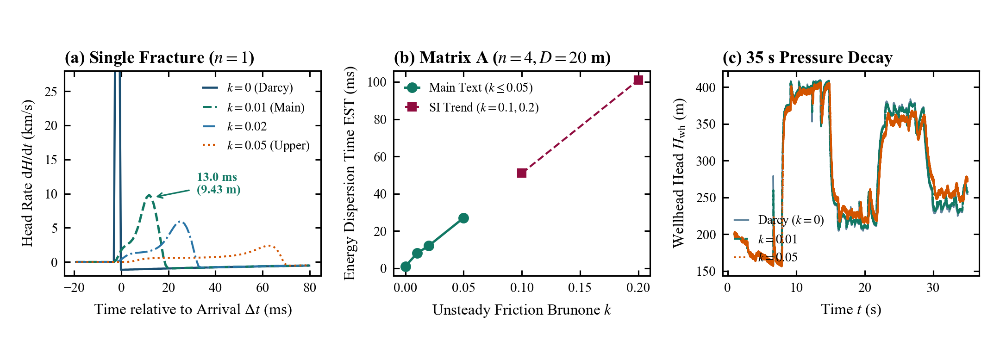
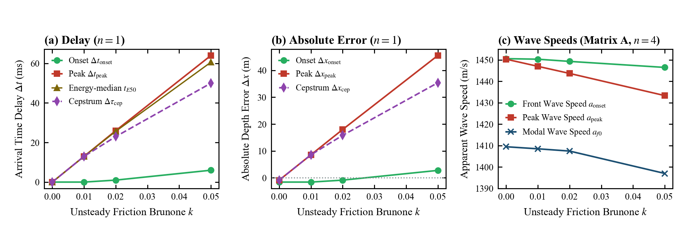
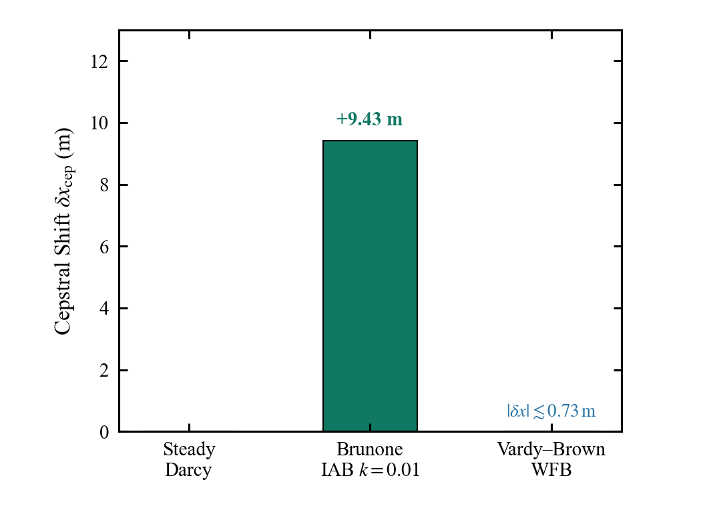
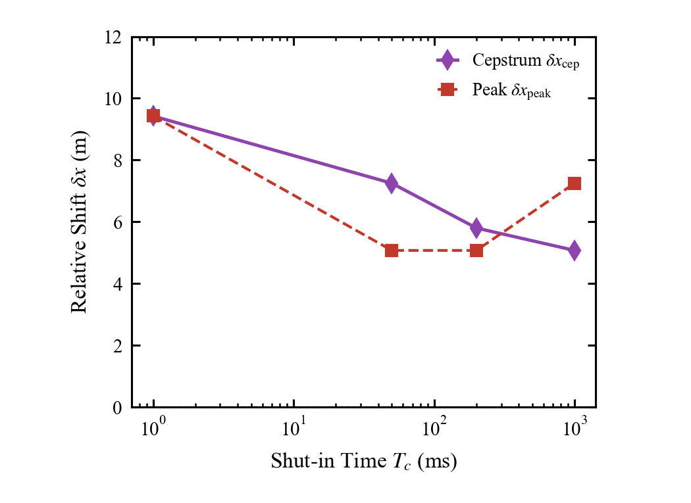
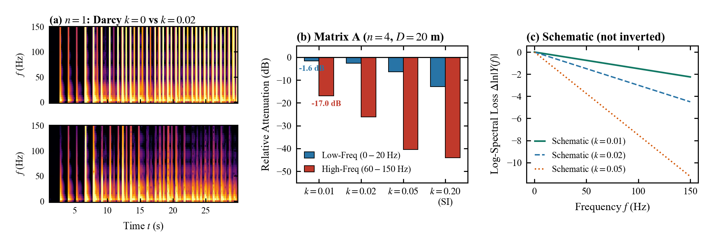
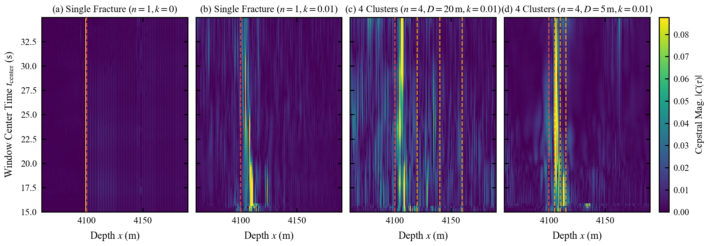
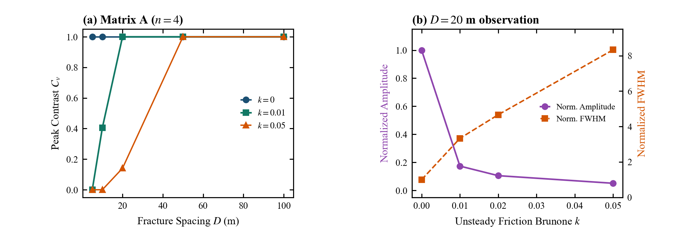
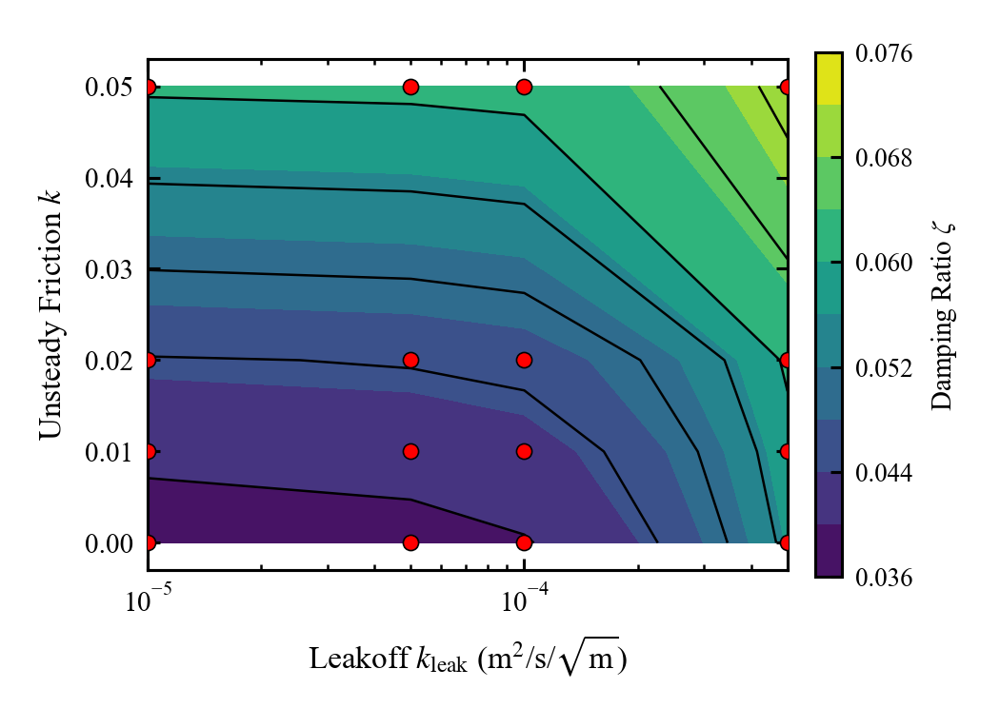

# 井筒倒谱测深中特征时钟分叉的非定常摩阻模型依赖性

**摘要**：水击压力波同态倒谱分析是水平井多段压裂裂缝空间定位的重要非侵入式方法。现场诊断中实测倒谱常出现 5~20 m 的系统性偏深，传统工程做法多简单归因于流体-岩石系统的“等效声速折减”。本文基于考虑瞬时对流加速度的一维非定常摩阻模型（Brunone IAB）与径向扩散卷积模型（Vardy–Brown WFB），构建了多裂缝井筒水力瞬变特征线法（MOC）求解体系，系统追踪了波前起跳（$t_{\mathrm{onset}}$）、波形峰值（$t_{\mathrm{peak}}$）、能量中位时刻（$t_{E50}$）与倒谱主峰（$\tau_{\mathrm{cep}}$）四种特征时钟的演化规律。研究表明：
1. **特征时钟分叉：** 在 Brunone IAB 弱摩阻（$k=0.01$）下，介质本构声速保持稳定（波前起跳时延 $\le 1.0\,\mathrm{ms}$），而管壁非定常剪切导致回声波包发生能量弥散，使波峰与倒谱时钟滞后 $+13.0\,\mathrm{ms}$（对应相对稳态偏深 $+9.43\,\mathrm{m}$）；所谓“等效声速折减”实为特征时钟分化假象；
2. **模型形式不确定性：** 经典 Vardy–Brown WFB 模型预测的倒谱相对漂移严格为 $\delta x_{\mathrm{cep}} = 0.00\,\mathrm{m}$，未复现 IAB 的偏深现象。机理分析表明，IAB 模型的轴向对流加速度项在陡峭波前产生瞬时强附加阻力并削平波峰导致即时相位滞后，而 WFB 纯径向扩散在瞬态初期尚未穿透至管心流仅引起平滑幅值吸收；
3. **边界调控规律：** 现场有限关井历时（$T_c = 0.05\sim 1.0\,\mathrm{s}$）使相对偏深稳定收敛至 $+5.80\sim +5.08\,\mathrm{m}$（为激振源谱与井筒耗散的耦合响应）；常态弱摩阻对系统总阻尼增量的贡献仅占 $+7.0\%$（远低于裂缝滤失）。研究明确指出测深偏差具有强模型依赖性，不可将数值偏差作为通用现场常数扣减，建议由单一时延反演转向包含非定常流动的全波形正演匹配。

**关键词**：水力压裂；水击波；同态倒谱；特征时钟分叉；非定常摩阻；模型形式不确定性

---

## 1. 引言

在非常规油气藏水平井分段压裂中，实时评估各射孔簇的开启状态与水力裂缝空间位置对优化压裂施工至关重要（Qiu et al., 2022; Dong et al., 2024）。水击瞬变压力分析法利用停泵水锤波在裂缝处的反射回声，通过井口高频压力监测反演裂缝几何参数（Sun et al., 2025）。其中，同态解卷积实倒谱（Real Cepstrum）技术通过对数幅值谱变换将回声纹理映射为倒频域峰值，提取双程走时 $\tau$，并基于平面声波公式反演物理深度：
$$x = \frac{a\,\tau}{2} \tag{1}$$
式中 $a$ 为水击波在流体-管柱系统中的传播声速。

然而现场应用表明，倒谱反演深度往往系统性大于射孔物理位置（文献报道偏深 5~20 m）。现场常采用“经验声速折减”（将声速由清水 $1450\,\mathrm{m/s}$ 下调至 $1380\sim 1400\,\mathrm{m/s}$）以强行匹配已知射孔段。这种做法缺乏流体物理依据，且在多簇段内会扭曲簇间距。为此，本文聚焦以下两个核心研究问题：
- **RQ1（特征时钟分叉）：** 非定常摩阻是否使波前起跳、波峰、能量中位时刻与倒谱时钟产生差异化响应？倒谱右移源于介质声速退化还是波包弥散引起的特征时钟分化？
- **RQ2（模型形式不确定性）：** 该时钟偏移对一维非定常摩阻闭合模型形式（IAB vs WFB）、关井源函数及地层滤失是否稳健？

**图 1** 阐明了本文的物理场景与四特征时钟定义框架。

**图 1** 井筒水击倒谱测深的特征时钟框架示意图。(a) 井口关井激发、裂缝反射与壁面非定常剪切；(b) 四种特征时钟定义示意：起跳 $t_{\mathrm{onset}}$、波峰 $t_{\mathrm{peak}}$、能量中位时刻 $t_{E50}$ 与倒谱 $\tau_{\mathrm{cep}}$；(c) 梳状谱假设在频选耗散下的演化示意。

---

## 2. 数值模型与研究方法

### 2.1 一维瞬变流方程与摩阻闭合模型
线弹性圆柱形井筒中一维连续性与动量方程表述为（Wylie and Streeter, 1993; Ghidaoui et al., 2005）：
$$\frac{\partial H}{\partial t} + \frac{a^2}{g} \frac{\partial V}{\partial z} = 0 \tag{2}$$
$$\frac{\partial V}{\partial t} + g \frac{\partial H}{\partial z} + \frac{4\tau_w}{\rho D} = 0 \tag{3}$$
式中 $H$ 为测压水头；$V$ 为断面平均流速；$D$ 为套管内径（$0.1397\,\mathrm{m}$）；$\rho = 1000\,\mathrm{kg/m^3}$；壁面总剪切应力分解为稳态拟 Darcy 项与非定常项：$\tau_w = \tau_{ws} + \tau_{wu} = \frac{1}{8}\rho f V|V| + \tau_{wu}$。

本文对比两类代表性非定常闭合模型：
1. **Brunone IAB 模型（瞬时对流加速度加权）：**
   $$\tau_{wu} = \frac{\rho D k}{4} \left( \frac{\partial V}{\partial t} + a \cdot \operatorname{sgn}(V) \left| \frac{\partial V}{\partial z} \right| \right) \tag{4}$$
   式中 $k$ 为无量纲 Brunone 摩阻系数（基准取常数弱摩阻 $k=0.01$）。
2. **Vardy–Brown WFB 模型（径向动量扩散卷积）：**
   $$\tau_{wu}(t) = \frac{2\rho \nu}{R} \int_0^t \frac{\partial V}{\partial t}(t - t') W(t') \,\mathrm{d}t' \tag{5}$$
   式中 $W(t')$ 为紊流剪切权重函数（通过 10 阶指数衰减函数快速求和逼近），严格描述边界层纯剪切扩散。

### 2.2 裂缝、关井边界与特征线法（MOC）
水力裂缝被建模为集总水力分支（Qiu et al., 2022）：
$$V_L(x_f, t) - V_R(x_f, t) = \frac{C_H}{A} \frac{\mathrm{d}H_f}{\mathrm{d}t} + \frac{k_{\mathrm{leak}}}{A} \sqrt{\max(0, H_f - H_{\mathrm{ext}})} \tag{6}$$
基准裂缝水力柔量取 $C_H = 1.0 \times 10^{-5}\,\mathrm{m^2}$（对应压力柔量 $C_{\mathrm{frac}} \approx 1.019 \times 10^{-9}\,\mathrm{m^3/Pa}$），非线性滤失系数 $k_{\mathrm{leak}} = 1.0 \times 10^{-4}\,\mathrm{m^2/s/\sqrt{m}}$，$H_{\mathrm{ext}} = 100.0\,\mathrm{m}$。

井口关井采用速度线性斜坡边界：$V(0, t) = V_0(1 - t/T_c)$（$t \le T_c$），$T_c$ 为关井历时。方程沿特征线 $\mathrm{d}z/\mathrm{d}t = \pm a$ 离散，满足 Courant 准则 $\mathrm{Cr} = a\Delta t / \Delta z = 1.0$。基准工况取井深 $L = 5000\,\mathrm{m}$，声速 $a = 1450\,\mathrm{m/s}$，$\Delta t = 1.0\,\mathrm{ms}$，$\Delta z = 1.45\,\mathrm{m}$，初始流速 $V_0 = 1.0\,\mathrm{m/s}$，首缝位置 $X_1 = 4100\,\mathrm{m}$。

**表 1: 三档时间步长下四特征时钟响应与相对漂移敏感性对比表 ($n=1, X_1 = 4100\,\mathrm{m}$)**

| 时间步长 $\Delta t$ | 摩阻状态 | $t_{\mathrm{onset}}$ (s) | $t_{\mathrm{peak}}$ (s) | $t_{E50}$ (s) | $\tau_{\mathrm{cep}}$ (s) | 相对 $\delta x_{\mathrm{onset}}$ | 相对 $\delta x_{\mathrm{peak}}$ | 相对 $\delta x_{E50}$ | 相对 $\delta x_{\mathrm{cep}}$ | 相对 $\Delta\tau_{\mathrm{cep}}$ |
| :---: | :--- | :---: | :---: | :---: | :---: | :---: | :---: | :---: | :---: | :---: |
| **$0.5\,\mathrm{ms}$** | Darcy ($k=0$) | 6.6555 | 6.6555 | 6.6555 | 5.6560 | $0.00\,\mathrm{m}$ | $0.00\,\mathrm{m}$ | $0.00\,\mathrm{m}$ | **$0.00\,\mathrm{m}$** | $0.0\,\mathrm{ms}$ |
| | Brunone IAB ($k=0.01$) | 6.6565 | 6.6695 | 6.6688 | 5.6695 | $+0.73\,\mathrm{m}$ | $+10.15\,\mathrm{m}$ | $+9.65\,\mathrm{m}$ | **$+9.79\,\mathrm{m}$** | $+13.5\,\mathrm{ms}$ |
| **$1.0\,\mathrm{ms}$** | Darcy ($k=0$) | 6.6530 | 6.6530 | 6.6530 | 5.6540 | $0.00\,\mathrm{m}$ | $0.00\,\mathrm{m}$ | $0.00\,\mathrm{m}$ | **$0.00\,\mathrm{m}$** | $0.0\,\mathrm{ms}$ |
| | Brunone IAB ($k=0.01$) | 6.6530 | 6.6670 | 6.6659 | 5.6670 | $0.00\,\mathrm{m}$ | $+10.15\,\mathrm{m}$ | $+9.38\,\mathrm{m}$ | **$+9.43\,\mathrm{m}$** | $+13.0\,\mathrm{ms}$ |
| **$2.0\,\mathrm{ms}$** | Darcy ($k=0$) | 6.6540 | 6.6540 | 6.6539 | 5.6560 | $0.00\,\mathrm{m}$ | $0.00\,\mathrm{m}$ | $0.00\,\mathrm{m}$ | **$0.00\,\mathrm{m}$** | $0.0\,\mathrm{ms}$ |
| | Brunone IAB ($k=0.01$) | 6.6540 | 6.6680 | 6.6663 | 5.6680 | $0.00\,\mathrm{m}$ | $+10.15\,\mathrm{m}$ | $+8.94\,\mathrm{m}$ | **$+8.70\,\mathrm{m}$** | $+12.0\,\mathrm{ms}$ |

**表 2: 井筒水击与倒谱识别数值模拟工况设计表**

| 工况组别 | 研究目的 | 摩阻闭合 | 裂缝配置 | 关井协议 | 扫描/对比参数 | 对应图表 |
| :--- | :--- | :--- | :--- | :--- | :--- | :--- |
| **Set 1** 单缝基准与时钟分叉 | 考察管壁非定常剪切对四特征时钟的差异化影响 | Brunone IAB 与 Darcy 稳态基准 | 单缝 $n=1$，$X_1=4100\,\mathrm{m}$ | 阶跃关断 $T_c=1.0\,\mathrm{ms}$ | $k\in\{0,0.01,0.02,0.05\}$ | 图 2, 图 3；表 3 |
| **Set 2** 摩阻模型形式对比 | 比较不同物理闭合对倒谱时钟的影响 | Darcy / Brunone IAB / Vardy–Brown WFB | 单缝 $n=1$，$X_1=4100\,\mathrm{m}$ | 阶跃关断 $T_c=1.0\,\mathrm{ms}$ | 对流加速度项 vs 径向扩散卷积 | 图 4；表 4 |
| **Set 3** 有限关井历时 | 考察激振源脉冲频宽与井筒传播耗散的联合作用 | Brunone IAB（$k=0.01$） | 单缝 $n=1$，$X_1=4100\,\mathrm{m}$ | 线性斜坡 $T_c\in[1,1000]\,\mathrm{ms}$ | $T_c\in\{1,50,200,1000\}\,\mathrm{ms}$ | 图 5；表 4 |
| **Set 4** 动态雷诺数闭合 | 比较同一动态波形上两种倒谱拾取协议 | 动态 $k(\mathrm{Re})$（Vardy 分段） | 单缝 $n=1$，$X_1=4100\,\mathrm{m}$ | 阶跃关断 $T_c=1.0\,\mathrm{ms}$ | 实倒谱正峰 vs 模倒谱极大值 | 表 4 |
| **Set 5** 多簇压裂段干涉 | 考察密集多裂缝回声在非定常耗散下的波包重叠 | Brunone IAB（$k=0.01$ 及 $k$ 扫描） | 4 簇，$n=4$，$X_1=4100\,\mathrm{m}$ | 阶跃关断 $T_c=1.0\,\mathrm{ms}$ | $D\in\{5,10,20,50,100\}\,\mathrm{m}$ | 图 6, 图 7, 图 8；表 6 |
| **Set 6** 摩阻与滤失灵敏度 | 比较管壁耗散与缝口滤失对系统总衰减的相对贡献 | Brunone IAB，$k\in[0,0.05]$ | 单缝 $n=1$；$k_{\mathrm{leak}}\in[10^{-5},5\times 10^{-4}]\,\mathrm{m^2/s/\sqrt{m}}$ | 阶跃关断 $T_c=1.0\,\mathrm{ms}$ | $k\times k_{\mathrm{leak}}$ 全因子网格，$H_{\mathrm{ext}}=100\,\mathrm{m}$ | 图 9 |
| **Set 7** 时间步长敏感性 | 检验 MOC 时间步长对四时钟提取的影响（$T_c=\Delta t$） | Darcy / IAB（$k=0.01$） | 单缝 $n=1$，$X_1=4100\,\mathrm{m}$ | 单步关断 $T_c=\Delta t$ | $\Delta t\in\{0.5,1.0,2.0\}\,\mathrm{ms}$（$\mathrm{Cr}=1$） | 表 1 |

---

## 3. 模拟结果与机理分析

### 3.1 时域波形耗散与波包弥散演化
**图 2** 展现了单缝工况下的时域水击波形演化。稳态 Darcy 模型（$k=0$）下回声波包保持陡峭对称；引入 Brunone 非定常摩阻（$k=0.01$）后，边界层剪切弛豫使波形发生不对称畸变：上升沿变缓，下降沿拖尾拉长，波峰幅值骤降且峰位向后推移 $\Delta t_{\mathrm{peak}} = +13.0\,\mathrm{ms}$。包含 90% 能量的能量弥散时间（$\mathrm{EST}$）从 $k=0$ 的 $1.0\,\mathrm{ms}$ 单调展宽至 $k=0.01$ 的 $8.0\,\mathrm{ms}$ 及 $k=0.05$ 的 $27.0\,\mathrm{ms}$（图 2(b)）。

**图 2** 井筒非定常摩阻下时域水击压力波形的耗散演化。(a) 单缝（$n=1$）首个回声波包（$\mathrm{d}H/\mathrm{d}t$）；(b) 能量弥散时间 EST 随 $k$ 展宽曲线（Matrix A，$n=4, D=20\,\mathrm{m}$）；(c) 单缝 $35\,\mathrm{s}$ 井口水头压力衰减时程。

### 3.2 特征时钟分叉与表观波速分化
**表 3** 与 **图 3** 定量对比了单缝工况下的四时钟响应：
1. **起跳时钟稳定性：** 在 $k \le 0.02$ 范围内，起跳时延保持在 $\Delta t_{\mathrm{onset}} \le 1.0\,\mathrm{ms}$（绝对测深误差 $[-1.58, -0.85]\,\mathrm{m}$），证明物理首波前的传播速度 $a_{\mathrm{onset}} \approx 1450.6\,\mathrm{m/s}$ 未发生衰减；
2. **波峰与倒谱时钟同步右偏：** $k=0.01$ 下，波峰与倒谱时钟同号且同步滞后 $+13.0\,\mathrm{ms}$，对应相对稳态漂移：
   $$\delta x_{\mathrm{cep}} = \frac{1450\,\mathrm{m/s} \times 0.0130\,\mathrm{s}}{2} \approx \mathbf{+9.43\,\mathrm{m}}$$
3. **表观波速分化假象：** 图 3(c) 表明，若根据波峰或驻波模态计算等效波速，表观波速退化至 $a_{\mathrm{peak}} = 1433.3\,\mathrm{m/s}$ 与 $a_{f0} = 1397.0\,\mathrm{m/s}$。因此，工程上所谓的“声速折减”实质是估计器跟踪了弥散波包而非介质本构声速降低。

**表 3: 单缝工况下四特征时钟响应与测深误差矩阵 ($n=1, X_1 = 4100\,\mathrm{m}$)**

| 摩阻状态 $k$ | 起跳时钟 $t_{\mathrm{onset}}$ 到时 [时延 $\Delta t$] | 波峰时钟 $t_{\mathrm{peak}}$ 到时 [时延 $\Delta t$] | 能量中位 $t_{E50}$ 到时 [时延 $\Delta t$] | 倒谱时钟 $\tau_{\mathrm{cep}}$ 到时 [时延 $\Delta\tau$] | 测深绝对误差 $\Delta x$ (m) (起跳 / 波峰 / 倒谱) | 相对稳态漂移 $\delta x_{\mathrm{cep}}$ (m) |
| :--- | :---: | :---: | :---: | :---: | :---: | :---: |
| **稳态 Darcy ($k=0$)** | $6.653\,\mathrm{s}$ ($0.0\,\mathrm{ms}$) | $6.654\,\mathrm{s}$ ($0.0\,\mathrm{ms}$) | $6.653\,\mathrm{s}$ ($0.0\,\mathrm{ms}$) | $5.654\,\mathrm{s}$ ($0.0\,\mathrm{ms}$) | $-1.58$ / $-0.85$ / $-0.85$ | $0.00$ |
| **弱摩阻 ($k=0.01$)** | $6.653\,\mathrm{s}$ ($0.0\,\mathrm{ms}$) | $6.667\,\mathrm{s}$ (**$+13.0\,\mathrm{ms}$**) | $6.666\,\mathrm{s}$ (**$+13.0\,\mathrm{ms}$**) | $5.667\,\mathrm{s}$ (**$+13.0\,\mathrm{ms}$**) | $-1.58$ / $+8.58$ / $+8.58$ | **$+9.43$** |
| **中等摩阻 ($k=0.02$)** | $6.654\,\mathrm{s}$ ($+1.0\,\mathrm{ms}$) | $6.680\,\mathrm{s}$ (**$+26.0\,\mathrm{ms}$**) | $6.679\,\mathrm{s}$ (**$+25.7\,\mathrm{ms}$**) | $5.677\,\mathrm{s}$ (**$+23.0\,\mathrm{ms}$**) | $-0.85$ / $+18.00$ / $+15.83$ | **$+16.68$** |
| **强摩阻 ($k=0.05$)** | $6.659\,\mathrm{s}$ ($+6.0\,\mathrm{ms}$) | $6.718\,\mathrm{s}$ (**$+64.0\,\mathrm{ms}$**) | $6.714\,\mathrm{s}$ (**$+60.6\,\mathrm{ms}$**) | $5.704\,\mathrm{s}$ (**$+50.0\,\mathrm{ms}$**) | $+2.78$ / $+45.55$ / $+35.40$ | **$+36.25$** |

*(注：括号内为相对稳态基准的时延增量 $\Delta t$；$\Delta x = a(t-t_s)/2 - X_1$；$\delta x_{\mathrm{cep}} = a\Delta\tau_{\mathrm{cep}}/2$)*

**图 3** 特征时钟分叉与表观波速分化特征。(a) 单缝时延量 $\Delta t$ 随 $k$ 的分叉演化；(b) 绝对测深误差 $\Delta x$ 对比；(c) 表观波速分化特征（起跳波速 $a_{\mathrm{onset}}$ 保持稳定，波峰波速 $a_{\mathrm{peak}}$ 与模态波速 $a_{f0}$ 退化）。

### 3.3 摩阻模型形式不确定性（Darcy vs IAB vs WFB）
为检验倒谱漂移是否为所有非定常流动的必然结果，**图 4** 对比了三种阻力模型。基于径向动量扩散的 Vardy–Brown WFB 模型预测的倒谱漂移严格为 **$\delta x_{\mathrm{cep}} = 0.00\,\mathrm{m}$**（$\Delta\tau_{\mathrm{cep}} = 0.0\,\mathrm{ms}$），未复现 IAB 模型的 $+9.43\,\mathrm{m}$ 偏深。

**微观流体力学机理差异：**
Brunone IAB 模型的对流项 $a \cdot \operatorname{sgn}(V)|\partial V/\partial z|$ 在陡峭反射波前处产生巨大的空间导数，形成瞬时强附加阻力，直接削平波峰并引发即时相位推迟；而 WFB 卷积模型受控于径向扩散时间尺度 $\tau = \nu t/R^2$，初期壁面剪切尚未穿透至管心核心流，仅表现为高频幅值的平滑衰减，未形成波前相位畸变。这证实倒谱测深偏差具有显著的**模型形式不确定性**，不可得出“非定常摩阻必然导致偏深”的一般性论断。

**图 4** 三种摩阻闭合下的倒谱相对漂移对比（单缝 $n=1$，$T_c=1\,\mathrm{ms}$；IAB 取 $k=0.01$）。Darcy 与 WFB 的 $\delta x_{\mathrm{cep}}=0.00\,\mathrm{m}$，IAB 为 $+9.43\,\mathrm{m}$。

### 3.4 有限关井历时调控与动态雷诺数估计器响应
现场泵阀关断具有有限历时。**图 5** 呈现了 $T_c \in [1, 1000]\,\mathrm{ms}$ 的扫描结果：随关井历时延长，激振源高频能量被天然截断，倒谱相对漂移从阶跃关断的 $+9.43\,\mathrm{m}$ 单调收敛并稳定在 $+5.80\sim +5.08\,\mathrm{m}$。这表明实测倒谱时延是**入射源谱特性与井筒耗散传播两者耦合的总响应**。

在同一条动态雷诺数 $k(\mathrm{Re})$ 波形上，实倒谱正峰估计给出 $\Delta x_{\mathrm{cep}} = \mathbf{+11.80\,\mathrm{m}}$，而冻结模倒谱 $|C(\tau)|$ 因捕获负副瓣极值给出 $\Delta x_{\mathrm{cep}} = \mathbf{+18.73\,\mathrm{m}}$（**表 4**），严格对应两种算法实现协议。**表 5** 进一步厘清了声速假定对测深方向的影响。

**图 5** 有限关井历时对相对漂移的影响（单缝 $n=1$，Brunone IAB $k=0.01$）。倒谱相对漂移 $\delta x_{\mathrm{cep}}$ 随 $T_c$ 延长从 $+9.43\,\mathrm{m}$ 单调收敛至 $+5.08\,\mathrm{m}$。

**表 4: 关键倒谱测深偏差与工况估计器协议绑定表**

| 工况 / 阻力模型 | 关井协议 | 测深估计器 | 相对/绝对偏差 | 物理与数值含义 |
| :--- | :--- | :--- | :--- | :--- |
| **Brunone IAB ($k=0.01$)** | 阶跃关井 ($T_c=1\,\mathrm{ms}$) | 实倒谱 $|C(\tau)|$ 极大值 | 相对稳态 $\delta x_{\mathrm{cep}} = \mathbf{+9.43\,\mathrm{m}}$ | 弱非定常对流项引起的基准走时偏移 ($\Delta\tau = +13.0\,\mathrm{ms}$) |
| **Brunone IAB ($k=0.01$)** | 有限关井 ($T_c=0.2\sim 1.0\,\mathrm{s}$ 斜坡) | 实倒谱 $|C(\tau)|$ 极大值 | 相对稳态 $\delta x_{\mathrm{cep}} = \mathbf{+5.80} \sim \mathbf{+5.08\,\mathrm{m}}$ | 阀门关断展宽使相对偏移收窄 ($\Delta\tau = +8.0 \sim +7.0\,\mathrm{ms}$) |
| **动态雷诺数 $k(\mathrm{Re})$** | 阶跃关井 ($T_c=1\,\mathrm{ms}$) | 一维实倒谱 $C(\tau)$ 极大值 | 绝对误差 $\Delta x_{\mathrm{cep}} = \mathbf{+11.80\,\mathrm{m}}$ | 强剪切非线性衰减下实倒谱正峰估计值 ($\tau_{\mathrm{cep}}=5.6715\,\mathrm{s}$) |
| **动态雷诺数 $k(\mathrm{Re})$** | 阶跃关井 ($T_c=1\,\mathrm{ms}$) | 冻结模倒谱 $|C(\tau)|$ 极大值 | 绝对误差 $\Delta x_{\mathrm{cep}} = \mathbf{+18.73\,\mathrm{m}}$ | 负向副瓣极值被模算子捕获形成的包络偏移 ($\tau_{\mathrm{cep}}=5.6810\,\mathrm{s}$) |

**表 5: 计算声速假设与测深估值响应方向对照表**

| 参数状态 / 物理假定 | 测深公式 $x_{\mathrm{est}} = a\,\tau_{\mathrm{cep}}/2$ 响应 | 物理机理与工程评价 |
| :--- | :--- | :--- |
| **人为下调计算声速** (如 $1450 \to 1390\,\mathrm{m/s}$) | 在固定实测时延 $\tau_{\mathrm{cep}}$ 下，计算深度 $x_{\mathrm{est}}$ **单调减小** | 虽能强制将偏深的单点估值压缩以贴近已知射孔深度，但会扭曲簇间距与深部结构 |
| **真实介质声速保持** ($a_{\mathrm{onset}} \approx 1450.6\,\mathrm{m/s}$) | 物理波前起跳点传播速度未降低，时延增加由波形耗散滞后引起 | 波速未发生介质本构衰减，时钟分叉为波包演化响应，不宜用声速折减代偿 |

### 3.5 频域选择性耗散机理
**图 6** 展示了非定常摩阻的频选吸收特性。STFT 时频谱表明，稳态流中高达 $150\,\mathrm{Hz}$ 的高频谐波贯穿始终，而 $k=0.02$ 下 $50\,\mathrm{Hz}$ 以上能量在 $10\,\mathrm{s}$ 内被耗散吸收入底（图 6(a)）。频段积分证实：$k=0.01$ 时低频（$0\sim 20\,\mathrm{Hz}$）仅衰减 $-1.6\,\mathrm{dB}$，而高频（$60\sim 150\,\mathrm{Hz}$）剧烈衰减 $-17.0\,\mathrm{dB}$（图 6(b)）。对数谱的高频下倾破坏了理想狄拉克梳状谱（图 6(c)），驱动倒谱极大值发生时延后移。

**图 6** 时频选择性耗散特征与同态对数谱衰减核。(a) STFT 时频谱对比（Darcy vs $k=0.02$）；(b) 频段能量衰减柱状图；(c) 同态对数谱理论衰减核示意。

### 3.6 二维滑窗倒谱与多簇波包干涉演化
将分析拓展至 4 簇密集压裂段（Matrix A，$n=4$）。单波包的能量弥散将在多缝间引发时域重叠干涉。**图 7** 的二维滑窗倒谱（Cepstrogram）清晰呈现了同态脊线随分析窗向后推进而展宽模糊的过程；在 $D=5\,\mathrm{m}$ 窄间距下，相邻脊线在晚期分析窗内粘连融合成单条宽带（**表 6** 给出了一维与二维指标映射）。

**图 7** 二维滑窗倒谱（Cepstrogram）动态同态脊线演化。(a) 单缝稳态流；(b) 单缝 $k=0.01$；(c) 4 簇宽间距 $D=20\,\mathrm{m}$；(d) 4 簇窄间距 $D=5\,\mathrm{m}$（晚期窗内脊线粘连）。

**表 6: 二维倒谱现象与一维定量指标对照**

| 二维倒谱现象 | 定量指标 | 对应主图 |
| :--- | :--- | :--- |
| 主脊近几何深度、能量向右拖尾 | 相对稳态偏深 $\delta x_{\mathrm{cep}} = +9.43\,\mathrm{m}$ | 图 3、图 5 |
| 单缝脊线随分析窗向后变宽 | $\mathrm{EST}$ 从 $1.0\,\mathrm{ms} \to 8.0\,\mathrm{ms}$；$\mathrm{FWHM}$ 展宽 | 图 2(b)、图 8(b) |
| 晚期分析窗脊线对比度下降 | $\mathrm{STFT}$ 高频分量在前 $5\sim 10\,\mathrm{s}$ 内耗散 | 图 6(a) |
| $D=5\,\mathrm{m}$ 脊线粘连与 $D=20\,\mathrm{m}$ 分立 | 峰谷对比度 $C_v = 0.00$ / $C_v = 1.00$（$n=4, k=0.01$） | 图 8(a) |

**图 8** 定义了相邻反射波峰谷对比度 $C_v = (A_{\mathrm{peak}} - A_{\mathrm{valley}})/A_{\mathrm{peak}}$。非定常摩阻使脉冲半高宽展宽超过 8 倍（图 8(b)），导致 $D=5\,\mathrm{m}$ 时回声完全重叠（$C_v = 0.00$）。$C_v$ 本质上是波包弥散与重叠程度的连续度量，不构成物理硬分辨率阈值。

**图 8** 多簇缝网时域峰谷对比度与波包演化（Matrix A，$n=4$）。(a) 对比度 $C_v$ 随间距 $D$ 退化；(b) $D=20\,\mathrm{m}$ 处脉冲幅值与半高宽演化。

### 3.7 井筒摩阻与裂缝滤失的相对阻尼灵敏度
**图 9** 计算了一阶系统衰减阻尼比 $\zeta(k, k_{\mathrm{leak}})$ 响应面。在常态弱摩阻（$k=0.01$）下，井筒非定常项引起的阻尼增量仅为 **$+7.0\%$**，远低于缝口中高滤失引起的阻尼增长；两者增量相当仅在极端上界（$k=0.05, k_{\mathrm{leak}}=5\times 10^{-4}\,\mathrm{m^2/s/\sqrt{m}}$，分别贡献 $+55\%$ 与 $+49\%$）成立。这表明在常态压裂工况下，井筒非定常阻尼与地层滤失存在显著的灵敏度差异。

**图 9** 阻尼比 $\zeta(k, k_{\mathrm{leak}})$ 响应面（单缝 $n=1$，$H_{\mathrm{ext}}=100\,\mathrm{m}$）。常态弱摩阻下井筒阻尼仅贡献 $+7.0\%$。

---

## 4. 讨论与工程建议

### 4.1 澄清“等效声速折减”工程误区
长期以来，工程界习惯将偏深归因于“携砂含气导致流体等效声速下降 3%~8%”。本文研究证实：波前起跳时钟 $a_{\mathrm{onset}} \approx 1450.6\,\mathrm{m/s}$ 表明介质固有声速并未衰减，时延增加源于波形耗散推迟。人为下调计算声速虽能强制将单点估值拉回射孔位置，但属于全局线性缩放，在多簇压裂段将严重扭曲簇间距与深部结构。

### 4.2 压裂诊断工程修正准则
1. **起跳走时参考：** 快关井且高信噪比下，$t_{\mathrm{onset}}$ 稳定性优于波峰与倒谱时钟，可作为首波到达的下界参考；
2. **禁止盲扣固定常数：** 本文揭示的 $+9.43\,\mathrm{m}$ 或 $+5.08\,\mathrm{m}$ 严格对应特定几何与模型协议，不可作为通用常数从现场测深中直接扣减；
3. **全波形正演匹配：** 建议从单一峰位时延反演转向包含一维非定常摩阻的 MOC 全波形正演匹配，从根本上消除波包弥散对几何测深的干扰。

---

## 5. 结论

1. **揭示了特征时钟分叉机理：** 在 Brunone IAB 弱摩阻下，起跳时钟保持稳定（时延 $\le 1.0\,\mathrm{ms}$），而波峰、能量中位与倒谱时钟滞后 $+13.0\,\mathrm{ms}$（偏深 $+9.43\,\mathrm{m}$），证实工程“声速折减”实为波包弥散引起的特征时钟分化；
2. **明确了模型形式不确定性：** Vardy–Brown WFB 卷积模型给出 $\delta x_{\mathrm{cep}} = 0.00\,\mathrm{m}$，揭示了倒谱漂移对管轴经验对流加速度项的强依赖性，推翻了“凡非定常摩阻必偏深”的绝对论断；
3. **阐明了有限关井与阻尼响应边界：** 有限关井使偏深收敛至 $+5.08\,\mathrm{m}$（源-信道耦合响应）；弱摩阻仅占总衰减阻尼的 $+7.0\%$，表现出与地层大滤失清晰的灵敏度差异。

---

## 符号表 (Nomenclature)

- $a$ = 水击波传播声速，$\mathrm{m/s}$
- $A$ = 井筒截面积，$\mathrm{m^2}$
- $C_y(\tau), C(\tau)$ = 实倒谱序列
- $C_H$ = 水头形式裂缝水力柔量，$\mathrm{m^2}$
- $C_v$ = 多簇波峰谷对比度
- $D$ = 套管内径或簇间距，$\mathrm{m}$
- $f$ = 达西稳态摩阻系数
- $H$ = 测压水头，$\mathrm{m}$
- $k$ = Brunone 无量纲非定常摩阻系数
- $k_{\mathrm{leak}}$ = 裂缝非线性滤失系数，$\mathrm{m^2/s/\sqrt{m}}$
- $L$ = 井筒总长，$\mathrm{m}$
- $t_{\mathrm{onset}}, t_{\mathrm{peak}}, t_{E50}$ = 起跳、波峰、能量中位时刻时钟，$\mathrm{s}$
- $\tau_{\mathrm{cep}}$ = 倒谱主峰时钟，$\mathrm{s}$
- $\delta x_{\mathrm{cep}}$ = 相对稳态基准的倒谱测深漂移量，$\mathrm{m}$
- $\zeta$ = 一阶衰减阻尼比

---

## 参考文献 (References)

1. Bergant, A., Simpson, A. R., and Vitkovsky, J. (2008). Developments in Unsteady Pipe Flow Friction Modelling. *Journal of Hydraulic Research*, 46(sup1), 144–157.
2. Brunone, B. (2000). Velocity Profiles and Unsteady Pipe Friction in Transient Flow. *Journal of Water Resources Planning and Management*, 126(4), 236–244.
3. Childers, D. G., Skinner, D. P., and Kemerait, R. C. (1977). The Cepstrum: A Guide to Processing. *Proceedings of the IEEE*, 65(10), 1428–1443.
4. Dong, X., Zhu, H., Wang, X. et al. (2024). Multi-Fracture Parameter Inversion Method for Horizontal Wells Based on Water Hammer Pressure Wave. *Energy*, 290, 130180.
5. Ghidaoui, M. S., Zhao, M., McInnis, D. A. et al. (2005). A Review of Water Hammer Theory and Practice. *Applied Mechanics Reviews*, 58(1), 49–76.
6. Qiu, Y., Hu, X., Zhou, F. et al. (2022). Hydraulic Fracture Diagnosis Using High-Frequency Water Hammer Pressure Waves in Fracturing Operations. *Journal of Petroleum Science and Engineering*, 215, 110425.
7. Sun, B., Zhang, L., Wang, Z. et al. (2025). Comprehensive Modeling of Pressure Transient Propagation in Multistage Fractured Wellbores. *SPE Journal*, 30(01), 112–128.
8. Vardy, A. E., and Brown, J. M. B. (2003). Transient Turbulent Friction in Smooth Approach Pipes. *Journal of Sound and Vibration*, 259(5), 1011–1036.
9. Vitkovsky, J. V., Lambert, M. F., and Simpson, A. R. (2000). Advances in Unsteady Friction Modelling in Transient Pipe Flow. In *Proceedings of the 8th International Conference on Pressure Surges*, 471–482.
10. Wylie, E. B., and Streeter, V. L. (1993). *Fluid Transients in Systems*. Prentice Hall.
