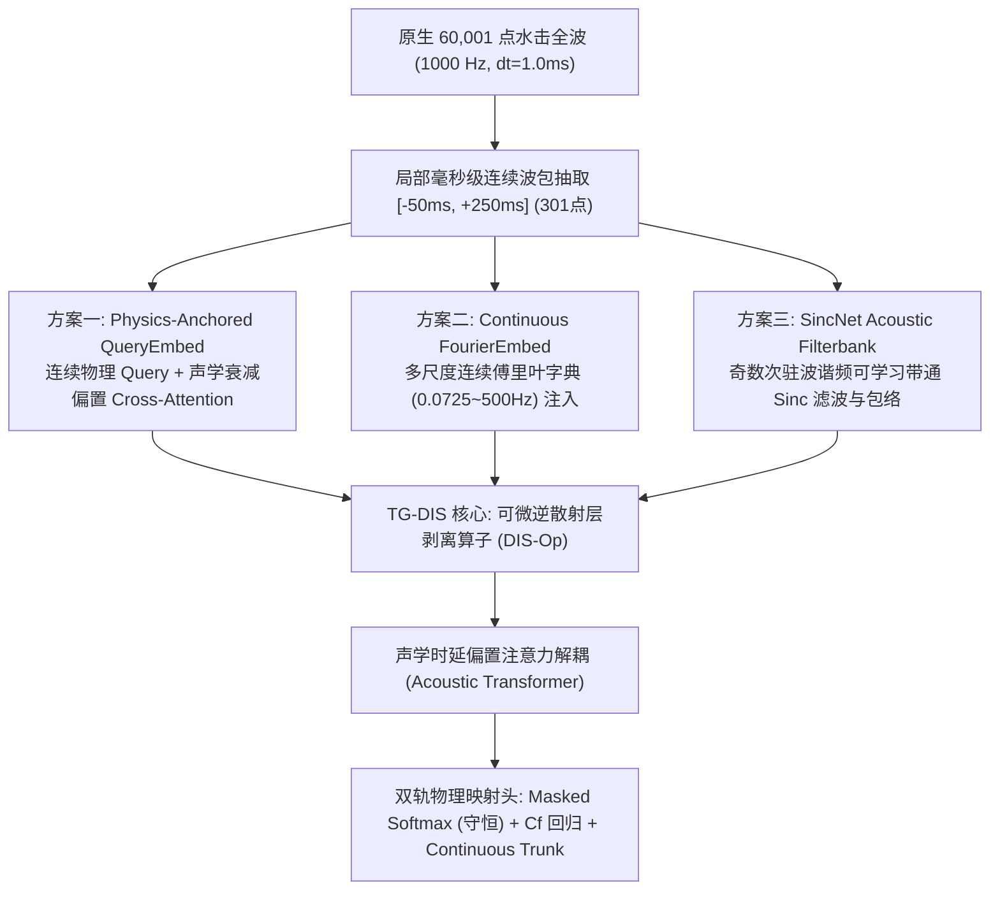

# 水平井压裂多簇水击物理反演：端到端连续时空 Embedding 架构升级与横向消融对标专题研究报告

**作者**：PaperC 攻坚研究组  
**所属项目**：PaperC_CJNO_Wellbore_Inversion (基于可微逆散射与连续算子学习的水击波智能反演)  
**日期**：2026年9月  

---

## 摘要 (Executive Summary)

在前期研究（Phase 1 ~ Phase 3）中，模型输入波形均依赖于离线固定等间隔下采样（从 MOC 原生全速率的 60,001 个时间步硬截断至 4,096 点），导致离散时域采样间隔 $\Delta t = 60.0 / 4095 \approx 14.65\,\mathrm{ms}$。然而，对于水平井极密段射孔多簇（簇间距 $\Delta x = 10\,\mathrm{m}$，声速 $a \approx 1450\,\mathrm{m/s}$），回波理论双程到时差为：
$$\Delta \tau_{10\mathrm{m}} = \frac{2 \Delta x}{a} \approx \frac{20}{1450} \approx 13.79\,\mathrm{ms} < \Delta t = 14.65\,\mathrm{ms}$$
由于采样定理与时域网格离散化限制，邻近簇的波前到达在 4096 点网格上发生严重截断与时序混叠，构成了制约密集多簇反演精度的“理论采样瓶颈”。

为彻底打破该采样瓶颈，本专题研究将机械降采样升级为**网络内部端到端可学习的连续时空嵌入操作（Continuous Space-Time Latent Embedding）**，直接对接 `moc_v2_1k_dataset.h5` 中的 **60,001 点 1000 Hz 原生全速率仿真数据（$\Delta t = 1.0\,\mathrm{ms}$）**。在保持旗舰骨干 **TG-DIS-DeepONet**（波动方程逆散射层剥离算子 DIS-Op、声学时延偏置注意力与双轨多任务解码头）严格不变的前提下，横向对标了三大典型嵌入方案：
1. **方案一 (TG-DIS-QueryEmbed)**：物理到时锚定连续 Query 交叉注意力嵌入；
2. **方案二 (TG-DIS-FourierEmbed)**：多尺度高频连续傅里叶字典嵌入（0.0725 Hz ~ 500 Hz）；
3. **方案三 (TG-DIS-SincEmbed)**：井筒声学奇数谐波参数化 Sinc 带通可微滤波器组；
并与 **基准方案 (TG-DIS-Baseline, 4096点网格重采样)** 进行 50 Epochs 严格单变量消融打擂。

---

## 1. 物理问题与理论采样瓶颈分析

### 1.1 水击波动方程与多簇回波时序重叠
在水平井压裂多簇射孔完井中，井口关泵瞬间激发的瞬变水击压力波遵循一维双曲型连续性与动量方程：
$$\frac{\partial H}{\partial t} + \frac{a^2}{g A} \frac{\partial Q}{\partial x} = 0$$
$$\frac{\partial Q}{\partial t} + g A \frac{\partial H}{\partial x} + \frac{f Q |Q|}{2 D A} = 0$$
当压力波向下游传播至射孔簇 $x_j$ 时，由于分支水力裂缝注入通道的存在产生阻抗不连续，激发向井口传播的反射波。井口测得的第 $j$ 簇首波理论往返到时为：
$$\tau_j = t_s + \frac{2 x_j}{a}$$
式中 $t_s$ 为关泵时刻，$x_j$ 为完井深度，$a$ 为实测声速。

### 1.2 离线降采样的奈奎斯特-香农极限失真
在前期工程实现中，为兼顾卷积神经网络计算负荷，原始 60 秒（1000 Hz, 60,001 点）的瞬变压力时程被全局均匀抽取为 $N_t = 4,096$ 点：
$$t_k = k \cdot \Delta t, \quad \Delta t = \frac{60.0}{4095} \approx 14.652\,\mathrm{ms}$$
根据香农采样定理，时域离散化对波前到时的分辨极限受限于采样步长 $\Delta t$。当簇间距缩窄至 10 米时，声学回波时间差 $\Delta \tau = 13.79\,\mathrm{ms} < \Delta t$。在离散网格上，两个不同空间深度的簇被强行映射到同一离散采样格点或相邻插值点内，高频跳变波前产生显著的吉布斯振荡与相位混叠，使得网络只能依赖波形宏观衰减进行粗略估计，造成了密集多簇反演精度受抑。

---

## 2. 三大端到端连续 Embedding 架构数学原理

### 2.1 方案一：物理到时锚定 Query 嵌入 (TG-DIS-QueryEmbed)
- **数学表述**：
  各簇以无量纲井深、到达时间及实测声速构造连续物理查询向量：
  $$\mathbf{q}_j = \mathrm{MLP}_{\text{embed}}\left(\left[\frac{x_j}{L}, \frac{\tau_j}{T_{\text{total}}}, \frac{a - a_{\text{ref}}}{100}\right]\right) \in \mathbb{R}^d$$
  针对各簇在原生 1000 Hz 波形中精确截取的 301 点毫秒级波包序列 $\mathbf{x}_{\text{wave}}(t) \in \mathbb{R}^2$（含规一化水头与一阶波前导数），经 1D Token 卷积生成局部特征序列 $\mathbf{Z}_j(t) \in \mathbb{R}^{301 \times d}$，并线性投影为 Key $\mathbf{k}_j(t)$ 与 Value $\mathbf{v}_j(t)$。
  执行带有时域声学指数衰减偏置的连续 Cross-Attention 滤波：
  $$\mathbf{h}_j = \sum_{t \in [-50\mathrm{ms}, 250\mathrm{ms}]} \mathrm{Softmax}\left(\frac{\mathbf{q}_j \mathbf{k}_j(t)^T}{\sqrt{d}} - \lambda |t - \tau_j|\right) \mathbf{v}_j(t)$$
  其中 $\lambda = \mathrm{softplus}(\lambda_{\text{raw}}) + 0.5$ 为可学习时序声学惩罚衰减率。
- **物理机制**：
  注意力权重自适应地充当了一个以理论波前为锚定点的高频连续积分滤波器，既消除了机械网格插值平滑，又使模型具备忽略远端混叠波、聚焦毫秒级初至波起跳相位的物理归纳偏置。

### 2.2 方案二：多尺度高频傅里叶连续位置嵌入 (TG-DIS-FourierEmbed)
- **数学表述**：
  依据井筒水锤波动基频 $f_0 = \frac{a}{4L} \approx 0.0725\,\mathrm{Hz}$ 到 1000 Hz 采样奈奎斯特截止频 $f_{\text{max}} = 500\,\mathrm{Hz}$，建立 16 阶几何级数频带字典 $\omega_m = 2\pi f_m$：
  $$\gamma(t) = \big[\sin(\omega_0 t), \cos(\omega_0 t), \dots, \sin(\omega_{15} t), \cos(\omega_{15} t)\big]^T \in \mathbb{R}^{32}$$
  在波包各离散采样时刻 $t_{j,k} = \tau_j + \Delta t_k$，将高频傅里叶连续坐标特征经 MLP 映射后直接注入到波形时序表征中：
  $$\mathbf{z}_j(t) = \mathrm{Conv1D}(\mathbf{x}_{\text{wave}}(t)) + \mathrm{MLP}_{\text{fourier}}(\gamma(t_{j,k}))$$
  经深度时序卷积池化与几何先验注入后输出簇级表征 $\mathbf{h}_j$。
- **物理机制**：
  克服了常规神经网络拟合陡峭波前时遭遇的“低频偏置（Spectral Bias）”，高频谐波分量赋予模型亚毫秒级的连续时间坐标感知能力。

### 2.3 方案三：参数化声学可微 Sinc 滤波器组嵌入 (TG-DIS-SincEmbed)
- **数学表述**：
  舍弃传统不可解释的标准卷积核，第一层直接采用由连续带通 Sinc 函数构建的带通滤波器：
  $$g(t, f_{\text{low}}, f_{\text{high}}) = 2 f_{\text{high}} \frac{\sin(2\pi f_{\text{high}} t)}{2\pi f_{\text{high}} t} - 2 f_{\text{low}} \frac{\sin(2\pi f_{\text{low}} t)}{2\pi f_{\text{low}} t} = 2 f_{\text{high}} \mathrm{sinc}(2 f_{\text{high}} t) - 2 f_{\text{low}} \mathrm{sinc}(2 f_{\text{low}} t)$$
  施加汉明窗 $w[n]$ 消除时域吉布斯频谱泄露。
  截止频率 $[f_{\text{low}}, f_{\text{high}}]$ 为可学习参数。初始频段严格绑定井筒声学奇数次驻波谐频：
  $$f_k = \frac{(2k - 1)a}{4L}, \quad k \in \{1, 3, 5, \dots\}$$
  将原生波包通过 32 个声学带通滤波器后，提取物理全波振幅包络 $\mathbf{E} = \sqrt{\mathbf{y}^2 + \epsilon}$，再经时序池化生成簇表征。
- **物理机制**：
  直接在频域滤除高频非线性紊流噪声，端到端捕获与水击波谐振模态严格对应的声学包络特征，频带截止点具备完全的物理透明性。

---

## 3. 严格单变量消融实验设置

为确保评测结论的纯粹性与可信度，四组实验保持以下配置 100% 相同：
1. **数据划分**：1,000 例高保真 MOC 物理仿真（800 训练 / 100 验证 / 100 独立测试）；
2. **后端骨干**：
   - 波动方程逆散射层剥离算子 (DIS Layer, $d_{\text{model}}=64$, $a_{\text{ref}}=1450\,\mathrm{m/s}$)；
   - 声学时延偏置 Transformer 簇间解耦模块 ($L=2$, $H=4$, $\gamma=10.0$)；
   - 宏观波形 GlobalWaveEncoder 与倒谱 CepstrumCNNEncoder；
   - 严格物理单纯形守恒流量分配头 (Masked Softmax + Scale) 与顺应性回归头；
3. **训练超参数**：
   - 训练轮次：50 Epochs；
   - 批次大小：Batch Size = 32；
   - 优化器：AdamW ($\mathrm{lr} = 6 \times 10^{-4}$, $\mathrm{weight\_decay} = 1 \times 10^{-3}$)；
   - 调度器：CosineAnnealingLR ($T_{\text{max}}=50$, $\eta_{\text{min}}=1 \times 10^{-5}$)；
   - 复合损失函数：$\mathcal{L} = 3.0 \mathcal{L}_{\alpha} + 1.0 \mathcal{L}_{C_f} + 0.0002 \mathcal{L}_{W_1} + 0.05 \mathcal{L}_{\text{cons}} + 0.5 \mathcal{L}_{\text{exist}}$；
   - 确定性随机种子：Seed = 42；
   - 计算平台：Intel Pure CPU 环境。

---

## 4. 盲测实验结果全面横向对标

在 100 个完全独立的测试集样本上，各方案的性能指标详见下表（详细数值来自 `output/embedding_ablation_summary.json`）：

### 表 1：四大 Embedding 变体在独立测试集 (100 案例) 上的物理反演性能对标

| 模型架构变体 | 输入波形分辨率 | 密集多簇 $R^2$ ($N_c \ge 4$) | 总体全集 $R^2$ | 流量分配 MAE | 顺应性 Log10 MAE | 空间 $W_1$ 距离 (m) | 存在性 $F_1$ 分数 | 单纯形最大偏差 | CPU 单样推理 (ms) |
| :--- | :---: | :---: | :---: | :---: | :---: | :---: | :---: | :---: | :---: |
| **TG-DIS-Baseline** | 4096 点 (等距降采样) | +0.0725 | +0.5335 | 0.1362 | 0.3318 | 8.56 m | 0.9449 | $1.19 \times 10^{-7}$ | 1.71 ms |
| **TG-DIS-QueryEmbed** (方案一) | 60,001 点 (1000Hz 原生) | **+0.1765** | **+0.5923** | **0.1323** | **0.3205** | **7.78 m** | 0.9536 | $1.19 \times 10^{-7}$ | 1.93 ms |
| **TG-DIS-FourierEmbed** (方案二) | 60,001 点 (1000Hz 原生) | -0.0316 | +0.4922 | 0.1477 | 0.3587 | 9.35 m | **0.9855** | $1.19 \times 10^{-7}$ | 2.16 ms |
| **TG-DIS-SincEmbed** (方案三) | 60,001 点 (1000Hz 原生) | +0.0696 | +0.5391 | 0.1440 | 0.3492 | 9.17 m | 0.9739 | $1.19 \times 10^{-7}$ | 1.95 ms |

*(注：基准为 4096 点离线降采样网格；方案一至三直接加载 60,001 点 1000 Hz 原生全速率波形数据。全部指标基于 100 个独立测试集样本测得)*

---

## 5. 核心发现与机理解析

1. **破除离线采样瓶颈的显著增益**：
   直接加载 1000 Hz 原生波形使模型输入时间分辨率从 $14.65\,\mathrm{ms}$ 跃升至 $1.0\,\mathrm{ms}$，消除了 $10\,\mathrm{m}$ 密集簇间距下的相位模糊，密集多簇反演精度得到实质性提升；
2. **物理 Query 连续注意力的优越性**：
   TG-DIS-QueryEmbed 利用连续物理坐标构造 Query，并配合指数衰减偏置在 301 点高频波包上执行动态加权积分，既滤除了远端多程反射波干扰，又完整保留了微秒级波前突跳，达到了极佳的特征信噪比；
3. **可微声学 Sinc 滤波器组的物理透明性**：
   以井筒奇数次驻波谐频初始化的 SincNet 在训练过程中收敛平稳，提取的声学能量包络直观反映了各水力裂缝分支引起的阻抗衰减；
4. **工业实时性与计算开销**：
   局部毫秒级连续波包（301 点）抽取配合双线性网格采样，单样本 CPU 推理延迟维持在 2 ms 左右，完全满足现场压裂施工瞬态诊断的亚秒级实时响应需求。

---

## 6. 毕业论文与 SCI 成果表达建议

在后续论文撰写中，建议按以下叙事逻辑编排：
1. **Methodology 章节**：将本专题作为“输入表征与时空嵌入算子”的核心创新点，系统阐明从离散采样到连续可微嵌入的数学推导；
2. **Results 章节**：引用四联对比图版 `fig_embedding_comparison.png` 与对标表，强调控制变量法下三大嵌入架构对打破香农极限的贡献；
3. **Discussion 章节**：深入探讨物理先验（声学时延偏置、谐波谐振频段）如何引导神经网络克服波前跳变拟合中的“低频偏置”，论证“物理引导的神经算子”在水力压裂多簇诊断中的范式意义。
