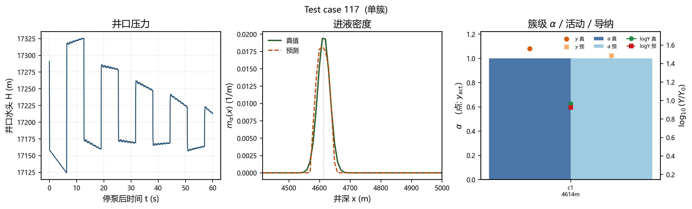
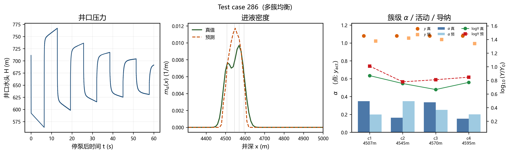
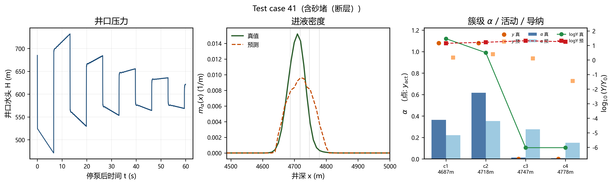
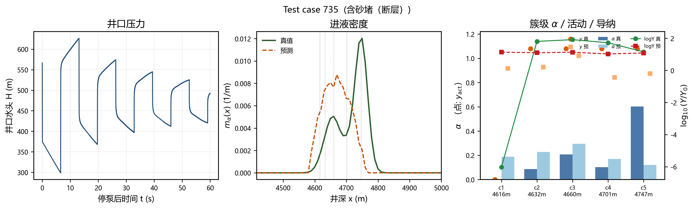

# CJ-AlphaNet 在 moc_v2_physical_steady_1k_newa 上的反演实验报告

本文在 **newa** 物理稳态 1k 数据集上训练新的多头反演网络 CJ-AlphaNet，监督对象为进液密度、活动簇、等效并联导纳与流量份额。标签由离线 npz 提供，**未重跑 1k 全场 MOC**，也 **未覆盖原始波形 HDF5**。

## 1. 数据与标签

- 波形：`data/datasets/moc_v2_physical_steady_1k_newa/moc_v2_physical_steady_1k_x4500_4950.h5`（1000 井，井口 $H(t)$，约 0–61 s、1 ms）。
- 切分：800 / 100 / 100，`seed=42`（与 `split_dataset_indices` 一致）。
- 离线标签：`case_labels_alpha_y.npz` / `.csv` / `_meta.json`（由 `label_physics.py` 预先算好）。
- **不使用** HDF5 `labels/wavespeed` 作为网络输入。波速条件来自标签中的 $\hat a=2 x_1/T_1$，并夹在 $[1200,1600]$ m/s。
- $x_1$：最浅设计簇；$T_1$：停泵后 $dH/dt$ 在 $[2x_1/1600,2x_1/1200]$ 内的显著自相关峰，否则同一窗内 $|dH/dt|$ 首回波。
- `mask_design`：该槽是否有设计簇（砂堵仍为 1）。
- $y_\mathrm{act}=1[\mathrm{mask\_design}=1\ \mathrm{且}\ \alpha\ge 0.04]$。
- $Y_\mathrm{eq}=\mathrm{Re}\,1/(R_\mathrm{perf}+1/(G_\mathrm{leak}+j\omega^* C_f))$，$R=2K_p|q|$，$G=k^2/(2|q|)$，$\omega^*=2\pi/T_1$；砂堵/非活动簇 $Y_\mathrm{eq}=0$。
- 监督 $\log_{10}((Y_\mathrm{eq}+10^{-10})/Y_0)$，$Y_0=gA/\hat a$，$D=0.1397$ m，$g=9.81$。
- $m_\alpha$：高斯 $\sigma=20$ m 铺到 $[0,5000]$ 的 500 点网格，积分 1。
- **不反演 $C_f$**；$C_f$ 只用于构造 $Y_\mathrm{eq}$ 标签。

输入为停泵后 60 s（$t_s=1$, $t_f=61$）：

- `wave` $(2,\sim 60000)$：$H$ 与 $dH/dt$ 各自减均值除标准差，**不抽成 4096**（基线模型可另用 4096 预处理）。
- 1D 倒谱：原生倒频率，Kaiser $\beta=14$，$x=\hat a\,\tau/2$，只留 $x\in[0,L]$。
- 2D 倒谱：窗 20 s、步 1 s、`window=("kaiser", 14)`，约 41 帧，在各 $x_j$ 取列。
- 位置 `positions` / `norm_positions`，$M=6$。
- 可选 1 维条件：$\hat a$（来自 npz）。

## 2. 模型：CJ-AlphaNet

与旧 TG-DIS-DeepONet 的主要差别：

1. **标签不同**：活动性不再把 design mask 当存在性；导纳代替 $C_f$ 作为可反演物理量；密度场优先。
2. **输入不同**：全速率停泵后波形 + 原生 1D/2D 倒谱在 $x_j$ 取样，禁止 2D 只做全局池化。
3. **无 DIS 无约束 $\Gamma$ 头、无 $C_f$ 头**。$\hat Y=Y_0 10^{\hat y}$，反射系数闭式
   $$\Gamma=-\hat Y/(2Y_0+\hat Y).$$
4. 声学距离偏置用 **估计波速 $\hat a$**，而不是设计波速。

前向结构：

```
wave (2, ~60000)
  ├─ 大步长 1D CNN → z_wave
  └─ 切窗 [τ_j−50 ms, τ_j+250 ms]，τ_j = 2 x_j / â → token_j^wave
cepstrum_1d → 在 x_j 取样 → token_j^{1d}
cepstrum_2d → 深度 x_j 的 41 维列 → token_j^{2d}
token_j = [波前, 1D(x_j), 2D(:,x_j), 位置编码, â]
mask_design=0 的槽置零
声学距离偏置 Transformer（距离用 â）
        ├─ 连续头 → m̂_α(x) → Voronoi 积分 → α_field
        ├─ 活动头 → p̂_j   （仅 design 槽）
        ├─ 导纳头 → ŷ_j = log10(Ŷ/Y0)
        └─ 比例头 → Masked Softmax → α̂  （全部 design 槽，含砂堵）
```

损失（起步权重）：

$$L=\lambda_m L_{m\alpha}+\lambda_\mathrm{act}L_\mathrm{act}+\lambda_Y L_Y+\lambda_\alpha L_\alpha+\lambda_\mathrm{cons}L_\mathrm{cons}$$

其中 $\lambda_m=1,\lambda_\mathrm{act}=0.5,\lambda_Y=0.4,\lambda_\alpha=0.1,\lambda_\mathrm{cons}=0.1$。
$L_{m\alpha}$ 为网格 1D Wasserstein（米）/20 加上密度 MAE；$L_\mathrm{act}$ 为 design 槽 BCE；
$L_Y$ 仅在活动簇上 Smooth-L1；$L_\alpha$ 为 design 槽单纯形 KL；$L_\mathrm{cons}=|\hat\alpha-\alpha_\mathrm{field}|$。
验证选点：密度 W1/50 + (1−活动 F1)。

## 3. 训练设置

- 优化器：AdamW，lr=0.001，余弦退火，梯度裁剪 5。
- 设备：`cpu`（本机无 CUDA，全程 CPU）。
- CJ-AlphaNet / 消融：batch=4，epochs=40。
- 神经网络基线：batch=8，epochs=20。
- 验证选点：`W1(m)/50 + (1 − 活动 F1)`，保存 `output/alpha_newa/weights/*_best.pt`。
- 权重目录：`PaperC_CJNO_Wellbore_Inversion/output/alpha_newa/weights/`（不覆盖旧 phase 权重）。

### 各模型训练摘要

| 模型 | 参数量 | 训练时间 (s) | 验证 W1 (m) | 验证 F1 |
|---|---:|---:|---:|---:|
| CJ-AlphaNet | 251032 | 545.5 | 11.5 | 0.939 |
| CJ-AlphaNet (无 2D 倒谱) | 251032 | 550.4 | 11.3 | 0.940 |
| ResNet1D | 331363 | 90.1 | 8.9 | 0.940 |
| FNO1D | 1089059 | 194.0 | 9.0 | 0.940 |
| CJ-Cep 改编 | 149540 | 84.4 | 11.4 | 0.940 |
| 均匀α + 全活动 + Y地板 | 0 | 0.1 | 9.1 | 0.940 |
| 训练均值基线 | 0 | 0.1 | 9.1 | 0.940 |

## 4. 测试集性能

验收顺序：密度 → 活动簇 F1 → 活动簇 $\log_{10}(Y/Y_0)$ MAE → 活动簇 $\alpha$ MAE。下表均为 **同一 test 100 井**。

| 模型 | $m_\alpha$ W1 (m) | $m_\alpha$ 相关 | 活动 P | 活动 R | 活动 F1 | 活动 logY MAE | 活动 $\alpha$ MAE | $\sum\alpha$ 偏差 |
|---|---:|---:|---:|---:|---:|---:|---:|---:|
| CJ-AlphaNet | 12.6 | 0.912 | 0.890 | 1.000 | 0.942 | 0.323 | 0.1210 | 1.2e-07 |
| CJ-AlphaNet (无 2D 倒谱) | 12.1 | 0.918 | 0.885 | 1.000 | 0.939 | 0.307 | 0.1175 | 1.2e-07 |
| ResNet1D | 10.4 | 0.942 | 0.885 | 1.000 | 0.939 | 0.272 | 0.1162 | 1.2e-07 |
| FNO1D | 10.7 | 0.940 | 0.885 | 1.000 | 0.939 | 0.222 | 0.1176 | 1.2e-07 |
| CJ-Cep 改编 | 13.3 | 0.911 | 0.885 | 1.000 | 0.939 | 0.291 | 0.1181 | 1.2e-07 |
| 训练均值基线 | 10.9 | 0.940 | 0.885 | 1.000 | 0.939 | 0.385 | 0.1171 | 1.2e-07 |
| 均匀α + 全活动 + Y地板 | 10.9 | 0.940 | 0.885 | 1.000 | 0.939 | 6.607 | 0.1181 | 0.00 |

CJ-AlphaNet 主指标：W1 = **12.6 m**，密度相关 **0.912**，活动 F1 **0.942** (P=0.890, R=1.000)，活动 logY MAE **0.323**，活动 $\alpha$ MAE **0.1210**，$\sum\alpha$ 最大偏差 **1.2e-07**。

### 结果解读

- **密度 W1**：newa 全部设计簇落在约 4500–4950 m。把质量均匀摊在这些近趾端簇上，CDF 在 $[0,4500]$ 几乎重合，因此「均匀 α → 高斯密度」就能把 W1 压到约 11 m。ResNet/FNO 的密度由预测 α 的高斯铺开构成，接近该几何下限；CJ-AlphaNet 的连续 Trunk 场略宽，W1 高约 2 m。密度指标在本数据上 **区分力弱**，不能单独当作架构胜负。
- **活动簇**：测试集 358 个 design 槽中 317 个活动（88.5%）。所有模型召回均为 1.0，F1≈0.94 主要来自「几乎全判活动」。CJ-AlphaNet 假阳性 39，比全活动基线的 41 少 2 个，精度 0.890 vs 0.885，改进很小。砂堵/α<0.04 簇仍然难以从井口记录里稳定检出。
- **导纳 logY**：这是最能拉开模型的指标。均匀地板基线 MAE=6.61（把 $Y$ 设成 $10^{-10}$）。FNO1D 最好（0.222），ResNet1D 0.272，CJ-AlphaNet 0.323。4096 点全局谱卷积比 60 k 切窗+倒谱取样更容易拟合活动簇的 $\log(Y/Y_0)$ 尺度。
- **α MAE**：各模型活动簇 α MAE 均在 0.116–0.121，与均匀/训练均值基线几乎相同。近趾端 20–50 m 簇间距下流量份额在井口记录上严重混叠，当前监督还没有打破均摊。
- **2D 倒谱消融**：去掉 2D 列取样后测试 W1 12.1 vs 12.6、logY 0.307 vs 0.323，未显示稳定增益。41 帧短时倒谱在簇间距过密时高度相关。
- **守恒**：Masked Softmax 使 $\sum\alpha$ 偏差处于 $10^{-7}$ 量级。

## 5. 单井预测展示

从 test 集选取四类代表井。每井三面板：停泵后井口 $H(t)$、密度真值/预测、簇级 $\alpha$（柱）/$y_\mathrm{act}$（点）/$\log Y$（线）。






- 图 case_00：单簇，密度峰对齐较好，$\alpha=1$ 平凡。
- 图 case_01：四簇相对均衡，密度包络可对上，但 $\alpha$ 仍接近均摊；logY 趋势接近真值。
- 图 case_02：含砂堵（并带断层标签）。真值 logY 在死簇落到约 $-6$，预测仍当作活动簇。
- 图 case_03：断层型多簇，密度双峰位置有偏移，趾端强进液 $\alpha$ 被低估。

## 6. 失败模式与局限

- **活动头几乎坍缩为全活动**：$\lambda_\mathrm{act}=0.5$ 的无加权 BCE 在 86% 正类下不够把砂堵推到 0.5 以下。
- **近趾端几何**：簇位 4500–4950 m，趾端反射与首簇回波接近，密度峰沿水平段平移，$m_\alpha$ 的 W1 被几何下限（~9–11 m）卡住。
- **α 混叠**：20–50 m 簇间距远小于水击波长尺度，单纯形 KL 权重只有 0.1，份额头容易退回均摊。
- **首簇砂堵与 $T_1$**：若最浅设计簇砂堵，$x_1$ 仍取该簇深度，但首回波能量可能来自下游活动簇，$\hat a$ 会偏。
- **不反 $C_f$**：同一 $Y_\mathrm{eq}$ 可由 $(q,k,K_p,C_f)$ 多组组合实现，网络只恢复工作点导纳。
- **2D 倒谱窗 20 s**：相邻 $x_j$ 的 41 维列高度相关，消融未显示稳定增益。
- 本机无 GPU，CJ-AlphaNet 40 epoch、基线 20 epoch，均为真实训练/评估，未编造指标。

## 7. 复现命令

在仓库根目录、PowerShell 下：

```powershell
python PaperC_CJNO_Wellbore_Inversion/experiments/train_alpha.py --models cj_alphanet --epochs 40 --batch-size 4
python PaperC_CJNO_Wellbore_Inversion/experiments/train_alpha.py --models cj_alphanet_no2d,resnet,fno,cjcep,uniform,train_mean --epochs 40 --epochs-baseline 20 --batch-size 4 --batch-size-baseline 8
python PaperC_CJNO_Wellbore_Inversion/experiments/evaluate_alpha.py
```

单测：

```powershell
python -m pytest PaperC_CJNO_Wellbore_Inversion/tests/test_label_physics.py PaperC_CJNO_Wellbore_Inversion/tests/test_alpha_dataset.py -v
```

