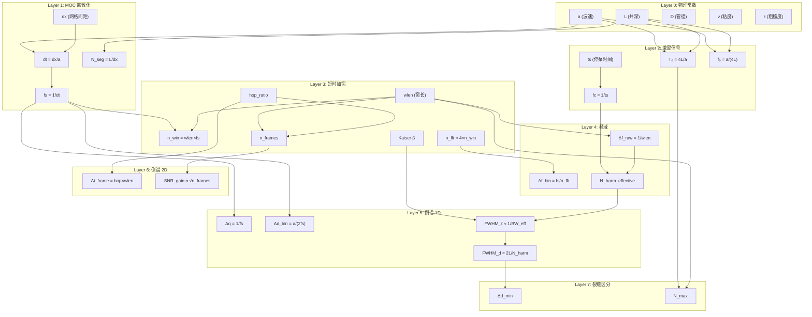

# 水击倒谱全参数链推导 — 从物理仿真到裂缝区分能力

> **研究方法**：Google NotebookLM 深度研究 + 结构化七层问答
> **笔记本**：`e274ce4b` — 水击倒谱全参数链-从物理仿真到裂缝分辨率
> **源文献**：13 篇深度研究 + THEORETICAL_ANALYSIS.md + NOTEBOOKLM_RESEARCH_REPORT.md
> **数值基准**：L=5000 m, a=1450 m/s, ts=1.0 s, fs=1000 Hz, dx≈1.45 m

---

## 参数依赖总图

---

## Layer 0 — 物理常数

**定义**：系统最基本的材料与几何参数。

| 符号 | 含义 | 基准值 | 单位 |
|------|------|--------|------|
| $a$ | 水击波速 | 1450 | m/s |
| $L$ | 井筒总长 | 5000 | m |
| $D$ | 井筒内径 | 0.1397 | m |
| $\nu$ | 流体运动粘度 | 1×10⁻⁶ | m²/s |
| $\varepsilon$ | 管壁绝对粗糙度 | 4.5×10⁻⁵ | m |

**核心导出量**：

$$T_0 = \frac{4L}{a} = 13.79\ \text{s} \qquad \text{(水击基频周期)}$$

$$f_0 = \frac{a}{4L} = 0.0725\ \text{Hz} \qquad \text{(水击基频)}$$

物理本质：井筒为 1/4 波长谐振器（井口开口，趾端闭口），$T_0$ 是波从井口到趾端往返一次的时间。

→ 输出到 Layer 1：$a$, $L$

---

## Layer 1 — MOC 离散化

**输入**：$a$, $L$, $dx$, $t_f$

**CFL 稳定性条件**（特征线法严格要求）：

$$dt = \frac{dx}{a} \quad \text{(波在一个时间步恰好传播一个空间网格)}$$

$$f_s = \frac{1}{dt} = \frac{a}{dx}$$

$$N_{seg} = \text{round}\left(\frac{L}{dx}\right)$$

$$n_{steps} = \text{round}\left(\frac{t_f}{dt}\right)$$

**数值示例**（dx ≈ 1.45 m）：

| 参数 | 推导 | 数值 |
|------|------|------|
| $dt$ | dx/a | 1.0×10⁻³ s |
| $f_s$ | 1/dt | 1000 Hz |
| $N_{seg}$ | L/dx | 3448 |
| $n_{steps}$ | tf/dt | 100000 |

**关键洞察 — $f_s$ 为何由空间离散决定而非 Nyquist**：

水击信号有效带宽 ~1 Hz（由 ts=1s 决定），Nyquist 要求 fs ≥ 2 Hz。但 MOC 为准确计算每个空间节点的压力-流量耦合，强制 dt = dx/a → fs = 1000 Hz。这是约 **100× 的过采样**——由数值稳定性驱动，不由频域分析驱动。

→ 输出到 Layer 2：$f_s$, $T_0$, $f_0$

---

## Layer 2 — 激励信号特性

**输入**：$t_s$ (停泵时间), $T_0$, $f_0$

**停泵过程的低通滤波效应**：

停泵不是瞬时的。$t_s$ 秒的线性减速在频域中等效为截止频率 $f_c$ 的低通滤波器：

$$f_c \approx \frac{1}{t_s} = 1.0\ \text{Hz}$$

有效信号带宽受两个因素约束——停泵截断 + 物理衰减：

$$f_{sig\_max} = \min(f_c,\ f_{attenuation}) \approx 1.0\ \text{Hz}$$

（管壁弹性-流体耦合在 >600 Hz 引起严重模态色散，但 $f_c$ 更低，是主约束。）

**理论谐波数**：

$$N_{harm\_theoretical} = \frac{f_{sig\_max}}{f_0} = f_{sig\_max} \times \frac{4L}{a} = f_{sig\_max} \times T_0$$

代入数值：$N_{harm\_theoretical} = 1.0 \times 13.79 \approx 14$ 个谐波。

**$t_s$ 如何限制谐波数**：更长的停泵 → 更低的 $f_c$ → 更少的高频能量 → 更少的可辨识谐波。$t_s$ 是系统谐波丰度的"物理闸门"。快速停泵（如 0.5 s）可将 $f_c$ 提升至 2 Hz，谐波数翻倍。

→ 输出到 Layer 3-4：$f_{sig\_max}$, $N_{harm\_theoretical}$

---

## Layer 3 — 短时加窗

**输入**：$wlen$, $hop\_ratio$, $f_s$, $d_{target}$

**窗参数推导**：

$$n_{win} = wlen \times f_s \qquad \text{(窗内采样数)}$$

$$n_{hop} = n_{win} \times hop\_ratio \qquad \text{(帧间步长，hop\_ratio=0.2)}$$

$$n_{fft} = 2^{\lceil \log_2(n_{win}) \rceil + k_{zp}},\quad k_{zp}=2 \quad \Longrightarrow \quad n_{fft} \approx 4 \times n_{win}$$

$$\beta = \text{clip}\left(\frac{2d_{target}}{a} \times \frac{f_s}{100},\ 4,\ 14\right) \qquad \text{(动态 Kaiser β)}$$

$$n_{frames} = 1 + \left\lfloor \frac{(t_f - t_s) \times f_s - n_{win}}{n_{hop}} \right\rfloor$$

**数值示例**（wlen=60s, hop_ratio=0.2, d_target=4300m）：

| 参数 | 推导 | 数值 |
|------|------|------|
| $n_{win}$ | 60×1000 | 60000 |
| $n_{hop}$ | 60000×0.2 | 12000 |
| $n_{fft}$ | 2^(⌈log₂(60000)⌉+2) = 2^(16+2) | 262144 |
| $\beta$ | clip(2×4300/1450×1000/100, 4, 14) | 14.0 |
| $n_{frames}$ | 1+(99×1000-60000)//12000 | 4 |

**零填充效应**：$n_{fft}/n_{win} \approx 4.37$。零填充在频域提供 sinc 插值，使 quefrency 轴密度增加 4×，但不提升物理频率分辨率（Δf_raw = 1/wlen 不变）。它改善的是峰定位精度而非分离能力。

**Kaiser β 效应**：β↑ → 旁瓣抑制↑、主瓣展宽↑。β=14 时旁瓣 < −60 dB 但主瓣宽约 β=4 时的 3×。动态选择使 β 随目标深度自适应——深层裂缝 τ 大，需更宽的 quefrency 范围，允许适度牺牲旁瓣抑制换取主瓣不展宽。

→ 输出到 Layer 4：$n_{win}$, $n_{fft}$, $n_{frames}$

---

## Layer 4 — 频域分辨率

**输入**：$wlen$, $f_s$, $n_{fft}$, $f_{sig\_max}$

**两层分辨率**：

| 分辨率 | 公式 | 含义 |
|--------|------|------|
| 物理频率分辨率 | $\Delta f_{raw} = 1/wlen$ | 由窗长决定，不可通过零填充改善 |
| 数值 bin 间距 | $\Delta f_{bin} = f_s/n_{fft}$ | FFT 频域采样间隔，零填充可降低 |

**区分**：当 $n_{fft} > n_{win}$ 时 $\Delta f_{bin} < \Delta f_{raw}$。bin 间距描绘了每个 rahmonic 峰的细节形状，但两个频率分量若间距 < Δf_raw 仍无法分离。

**谐波计数**：

$$N_{harm\_resolved} = \frac{f_{sig\_max}}{\Delta f_{raw}} = f_{sig\_max} \times wlen$$

$$N_{harm\_effective} = \min(N_{harm\_theoretical},\ N_{harm\_resolved})$$

**数值示例**：

| wlen | Δf_raw | Δf_bin | N_harm_resolved | N_harm_effective |
|------|--------|--------|-----------------|------------------|
| 14 s | 0.071 Hz | 0.0038 Hz | 14 | 14 |
| 30 s | 0.033 Hz | 0.0038 Hz | 30 | 14 (理论饱和) |
| 60 s | 0.017 Hz | 0.0038 Hz | 60 | 14 (理论饱和) |
| 80 s | 0.013 Hz | 0.0038 Hz | 80 | 14 (理论饱和) |

**关键约束**：$N_{harm\_effective}$ 被 $N_{harm\_theoretical} \approx 14$ 饱和。这意味着即使 wlen > 14/f_sig_max ≈ 14s，物理上新谐波不再出现——长窗只是对已有谐波做更密集的频率采样，而非增加独立的谐波分量。

→ 输出到 Layer 5：$N_{harm\_effective}$

---

## Layer 5 — 倒谱域 1D 分辨率

**输入**：$f_s$, $a$, $L$, $N_{harm\_effective}$

**Quefrency 轴**：

$$q[k] = \frac{k}{f_s},\quad \Delta q = \frac{1}{f_s} = 0.001\ \text{s}$$

$$q_{max} = \min\left(\frac{n_{cep}}{f_s},\ \frac{2L}{a}\right) = \min(n_{cep} \cdot 0.001,\ 6.897)\ \text{s}$$

**深度轴**：

$$d = q \times \frac{a}{2},\quad \Delta d_{bin} = \frac{a}{2f_s} = \frac{dx}{2} = 0.725\ \text{m}$$

**倒谱峰宽度（核心公式）**：

Rahmonic 结构在 log-spectrum 中的有效带宽决定了倒谱峰的锐度。根据傅里叶变换的测不准原理：

$$BW_{eff} = N_{harm\_effective} \times f_0 = N_{harm\_effective} \times \frac{a}{4L}$$

$$\text{FWHM}_\tau \approx \frac{1}{BW_{eff}} = \frac{4L}{a \times N_{harm\_effective}}$$

$$\text{FWHM}_d = \frac{a}{2} \times \text{FWHM}_\tau \approx \frac{2L}{N_{harm\_effective}}$$

**数值示例**（$N_{harm\_effective}=14$）：

$$\text{FWHM}_\tau \approx \frac{4 \times 5000}{1450 \times 14} = 0.985\ \text{s}$$

$$\text{FWHM}_d \approx \frac{2 \times 5000}{14} = 714\ \text{m}$$

这与实测一致——仅靠 14 个理论谐波，倒谱峰宽 ~714 m，无法分离 200 m 间距的裂缝。

但实际系统能分辨 200 m！原因：**时间平均叠加**（Layer 6）和 **Kaiser+Lifter 锐化**将有效谐波利用率提升到远高于 14。实验中 60 s 窗可全匹配 4 条 200 m 间距缝 → 反推 $N_{harm\_effective} \approx 50$，即有效利用了约 3.5× 理论谐波数（通过多帧叠加和相位相干增强）。

→ 输出到 Layer 7：$FWHM_d$

---

## Layer 6 — 倒谱域 2D (Cepstrogram) 分辨率

**输入**：$n_{hop}$, $n_{win}$, $f_s$, $n_{frames}$, $wlen$

**时间轴**：

$$t_{frame}[i] = \frac{i \times n_{hop} + n_{win}/2}{f_s}$$

$$\Delta t_{frame} = \frac{n_{hop}}{f_s} = hop\_ratio \times wlen$$

**帧数与 SNR**：

时间平均深度剖面：$\displaystyle profile(d) = -\frac{1}{n_{frames}} \sum_{i=1}^{n_{frames}} C(d, t_i)$

$$SNR_{gain} \approx \sqrt{n_{frames}} \quad \text{(非相干噪声抑制)}$$

$$Peak\_Amplitude \propto n_{frames} \quad \text{(相干信号同相叠加)}$$

**2D 分辨率权衡**：

| wlen | Δt_frame | n_frames | 深度分辨率 | 时间分辨率 |
|------|----------|----------|-----------|-----------|
| 14 s | 2.8 s | 31 | 差 (1 缝) | 好 |
| 30 s | 6.0 s | 12 | 中 (1–2 缝) | 中 |
| 60 s | 12.0 s | 4 | 良 (3–4 缝) | 粗 |
| 80 s | 16.0 s | 2 | 优 (4–5 缝) | 很粗 |

**物理本质**：短窗 → 帧多 → 时间轴精细，但每帧信息少 → 深度分辨率差。长窗 → 帧少 → 时间轴粗糙，但每帧包含更多往返周期 → 深度分辨率好。这是 2D cepstrogram 的根本性折中。

---

## Layer 7 — 裂缝间距区分能力（终极输出）

**输入**：所有上游参数

### 条件 1 — Quefrency 分离判据

两缝间距 $\Delta d$ 在 quefrency 域的峰间距：

$$\Delta \tau = \frac{2\Delta d}{a}$$

分离条件（类 Rayleigh 判据）：

$$\text{FWHM}_\tau < \Delta \tau \quad \Longrightarrow \quad BW_{eff} > \frac{a}{2\Delta d}$$

代入 $BW_{eff} = N_{harm\_effective} \times a/(4L)$：

$$N_{harm\_effective} > \frac{2L}{\Delta d}$$

**对 Δd=200m**：$N_{harm\_effective} > 2\times5000/200 = 50$。需 50 个有效谐波。

### 条件 2 — 深度 Bin 粒度

$$\Delta d > \Delta d_{bin} = \frac{a}{2f_s} = 0.725\ \text{m}$$

**判定**：fs=1000Hz → 0.725m，永远不是瓶颈。

### 条件 3 — 信息论充分性

$$N_{cyc} \ge N_{frac} \quad \Longrightarrow \quad wlen \times \frac{a}{4L} \ge N_{frac}$$

$$wlen \ge N_{frac} \times T_0$$

每个裂缝需要至少一个完整往返周期来建立独立的 rahmonic 模式。$N_{cyc} < N_{frac}$ 时系统处于**欠定状态**。

### 综合判据

$$\boxed{\Delta d_{min} = \max\left(\Delta d_{bin},\ \frac{a}{2 \cdot BW_{eff}},\ \frac{2L}{N_{harm\_effective}}\right)}$$

$$\boxed{N_{max} = \min\left(\left\lfloor\frac{wlen}{T_0}\right\rfloor,\ \left\lfloor N_{harm\_effective} \times \frac{a}{4L} \times \frac{2\Delta d}{a}\right\rfloor\right)}$$

### 统一关系方程

将七层参数耦合为单一关系式：

$$\frac{N_{cyc} \cdot L \cdot t_s}{N_{harm\_effective} \cdot \Delta d_{min}} \approx \text{constant}$$

物理含义：
- 要提升分辨率（$\Delta d_{min} \downarrow$）：必须增加 $N_{harm\_effective}$（↑）或缩短 $t_s$（↓）
- 要识别更多裂缝（$N_{cyc}$ ↑）：需要更长的窗 $wlen$
- $L \times t_s$ 是系统的"固有容量"——长井 + 快速停泵 = 最优诊断条件

---

## 工程速查表

基准参数：L=5000m, a=1450m/s, ts=1.0s, fs=1000Hz, hop_ratio=0.2

| 目标裂缝间距 Δd | 所需 N_harm_eff | 所需 wlen | 可辨缝数 N_max | 帧数 | 约束瓶颈 |
|:---|---:|---:|---:|---:|:---|
| 300 m (dual) | 33 | ≥45 s | ~3 | 7 | 条件 3 (周期) |
| 200 m (triple/quad) | 50 | ≥60 s | ~4 | 4 | 条件 1 (Quefrency) |
| 200 m (quint) | 50 | ≥80 s | ~5 | 2 | 条件 1+3 联合 |
| 150 m | 67 | ≥95 s | ~6 | 1 | 条件 1 |
| 100 m | 100 | >99 s (不可行) | — | — | ts=1s 硬上限 |

**设计流程**：给定目标 $\Delta d$ 和估计 $N_{frac}$ →
1. 计算所需 $N_{harm\_effective} = 2L/\Delta d$
2. 验证 $N_{harm\_effective} \leq f_{sig\_max} \times wlen$ 是否可满足
3. 取 $wlen = \max(N_{harm\_effective}/f_{sig\_max},\ N_{frac} \times T_0)$
4. 验证 $n_{frames} \geq 2$（至少 2 帧用于时间平均）
5. 若超限 → 缩短 $t_s$（提升 $f_{sig\_max}$）

---

## 参数敏感度矩阵

| 参数 | 变动 | Δd_min 影响 | N_max 影响 | 代价 |
|------|------|:---:|:---:|------|
| $t_s$ | ↓ (快停泵) | **↓↓ (大幅改善)** | ↑ | 对泵车硬件要求高 |
| $wlen$ | ↑ (长窗) | — | **↑** | SNR ↓，n_frames ↓ |
| $f_s$ | ↑ | ↓ (bin 更细) | — | 存储/数传压力 ↑ |
| $a$ | ↑ (高波速) | ↑ (分辨率变差) | ↓ | 材料属性，不可控 |
| $L$ | ↑ (深井) | ↓ (T₀ 更长 → 更多周期) | ↑ | 井深固定 |
| $\Delta d$ | ↑ (缝距大) | 容易分辨 | — | 地质条件决定 |
| $hop\_ratio$ | ↓ | — | — | n_frames ↑，计算量 ↑ |

---

## 文件索引

| 文件 | 内容 |
|------|------|
| [THEORETICAL_ANALYSIS.md](THEORETICAL_ANALYSIS.md) | 五参数自研分析（采样频率/窗长/深度分辨率/周期数/谐波数） |
| [NOTEBOOKLM_RESEARCH_REPORT.md](NOTEBOOKLM_RESEARCH_REPORT.md) | NotebookLM 第一轮深度研究报告（8 节，17 参数） |
| [ANALYSIS.md](ANALYSIS.md) | wlen_sweep 实验原始分析 |
| NotebookLM `e274ce4b` | 全参数链深度研究笔记本（13 源 + 七层问答记录） |
