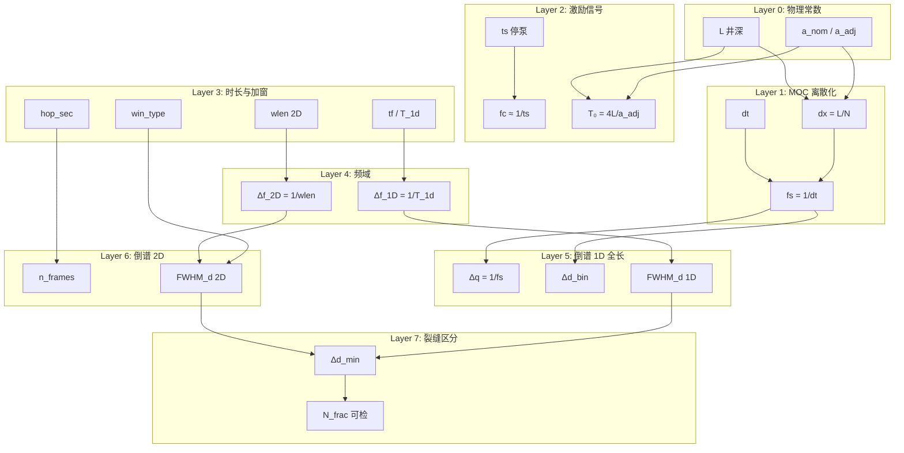

# 水击倒谱全参数链推导 — 从物理仿真到裂缝区分能力

> **数值基准**（[`validation/config.py`](../validation/config.py)）：  
> L=5000 m，a_nom=1450 m/s，a_adj≈1450.12 m/s，ts=1.0 s，dt=1×10⁻³ s，tf=100 s，  
> 2D：wlen=40 s，hop=5 s，win=hamming  
> **实证数据**：`python validation/leakoff_multi.py --friction steady_Dall --case all`  
> **可复现汇总**：`python validation/cepstrum/spacing_resolvability.py` → [`output/leakoff/SPACING_RESOLVABILITY.md`](../output/leakoff/SPACING_RESOLVABILITY.md)

---

## 参数依赖总图

**关键分栏**：1D 实倒谱用停泵后**全长**信号（T_1d≈tf−ts）；2D cepstrogram 用 **wlen/hop**。缝距定量结论以 JSON 中 `cepstrum.1d_real` 为准；2D 仅作时变可视化。

---

## Layer 0 — 物理常数

| 符号 | 含义 | 基准值 | 单位 |
|------|------|--------|------|
| $a_{\mathrm{nom}}$ | 名义波速 | 1450 | m/s |
| $a_{\mathrm{adj}}$ | Courant 调整波速 | ≈1450.12 | m/s |
| $L$ | 井筒总长 | 5000 | m |
| $D$ | 井筒内径 | 0.1397 | m |

$$T_0 = \frac{4L}{a_{\mathrm{adj}}} \approx 13.79\ \text{s},\qquad f_0 = \frac{a_{\mathrm{adj}}}{4L} \approx 0.0725\ \text{Hz}$$

倒谱深度轴使用 **$a_{\mathrm{adj}}$**（与 MOC 网格一致），不是名义 $a$。

---

## Layer 1 — MOC 离散化

CFL 精确网格（[`wellbore_moc.MocConfig`](../wellbore_moc.py)）：

$$N = \mathrm{round}\!\left(\frac{L}{a_{\mathrm{nom}}\,dt}\right),\quad dx=\frac{L}{N},\quad a_{\mathrm{adj}}=\frac{dx}{dt},\quad f_s=\frac{1}{dt}$$

| 参数 | 数值 |
|------|------|
| $dt$ | 1.0×10⁻³ s |
| $dx$ | ≈1.4501 m |
| $N$ | 3448 |
| $f_s$ | 1000 Hz |
| $\Delta d_{\mathrm{bin}}=a_{\mathrm{adj}}/(2f_s)$ | ≈0.725 m |

$f_s$ 由空间离散驱动（约 100× 过采样相对水击有效带宽），不是 Nyquist 下限。**Δd_bin ≪ 缝距，不是分辨瓶颈。**

---

## Layer 2 — 激励信号（停泵）

$$f_c \approx \frac{1}{t_s} = 1.0\ \text{Hz}\quad (t_s=1\ \text{s})$$

$$N_{\mathrm{harm,theo}} = f_c \times T_0 \approx 13.8$$

停泵越慢 → $f_c$ 越低 → 理论谐波越少。这是**物理闸门**，但 1D 全长倒谱的经验有效谐波可远高于此（见 Layer 7 / 实证）。

---

## Layer 3 — 仿真时长与 2D 加窗

| 量 | 公式 / 配置 | 数值 |
|----|-------------|------|
| $t_f$ | SIM_CONFIG | 100 s |
| $T_{1\mathrm{D}}$ | $t_f-t_s$ | 99 s |
| $wlen$ | CEPSTRUM_CONFIG | 40 s |
| $hop$ | CEPSTRUM_CONFIG | 5 s |
| $win$ | CEPSTRUM_CONFIG | hamming |
| $n_{\mathrm{frames}}$ | $1+\lfloor(T_{1\mathrm{D}}-wlen)/hop\rfloor$ | 12 |
| $\Delta t_{\mathrm{frame}}$ | hop | 5 s |

窗型影响主瓣宽度（FWHM），与 hop 同级；当前标准图用 **hamming**，不是 Kaiser β 主路径。

---

## Layer 4 — 频域分辨率

| | 1D 全长 | 2D 短时 |
|--|---------|---------|
| 物理 $\Delta f$ | $1/T_{1\mathrm{D}}\approx0.0101$ Hz | $1/wlen=0.025$ Hz |
| 停泵饱和 $N_{\mathrm{harm}}$ | $\min(f_c/\Delta f,\ N_{\mathrm{harm,theo}})\approx13.8$ | 同左 ≈13.8 |

停泵饱和给出的 ~14 个谐波若直接代入 FWHM，会得到 $\mathrm{FWHM}_d\approx 2L/14\approx725$ m——**对 1D 全长实证偏悲观**（见下节反推）。

---

## Layer 5 — 倒谱域 1D（全长）

$$q[k]=\frac{k}{f_s},\quad \Delta q=\frac{1}{f_s}=0.001\ \text{s},\quad d=q\cdot\frac{a_{\mathrm{adj}}}{2}$$

$$\mathrm{FWHM}_d \approx \frac{2L}{N_{\mathrm{harm,eff}}},\qquad \Delta d_{\min}\approx\mathrm{FWHM}_d\quad\text{(Rayleigh)}$$

实现：`real_cepstrum_1d` / `compute_moc_cepstrum_1d`（停泵后全长，不分窗）。匹配写入 `moc_leakoff.json → cepstrum.1d_real`。

---

## Layer 6 — 倒谱域 2D（cepstrogram）

短窗 → $\Delta f$ 更粗 → 深度 FWHM 更宽；帧多 → 时间轴更细。当前配置下 2D 的饱和 FWHM 估计与 1D 同量级（~725 m 悲观界），但**有效时长更短**，实际峰更钝。

**当前 JSON 无 2D 匹配率**；缝距结论勿把 `wlen=40` 套到 1D 匹配上。

---

## Layer 7 — 裂缝间距区分能力

### 瑞利判据（定义）

两缝 quefrency 间距：$\Delta\tau=2\Delta d/a_{\mathrm{adj}}$。分离条件：$\mathrm{FWHM}_\tau \lesssim \Delta\tau$，即

$$
\mathrm{FWHM}_\tau \approx \frac{1}{B_{\mathrm{coh}}},\qquad
B_{\mathrm{coh}} = N_{\mathrm{harm,eff}}\cdot f_0,\qquad
f_0=\frac{a}{4L}
$$

$$
\Delta d_{\min}
= \frac{a}{2\,B_{\mathrm{coh}}}
= \frac{2L}{N_{\mathrm{harm,eff}}}
= \mathrm{FWHM}_d
$$

另：$\Delta d>\Delta d_{\mathrm{bin}}$（本配置永远满足）；多缝还需足够峰高（滤失/干涉导致后缝衰减）。

### B_coh / N_harm,eff 正推（steady，非反推）

**操作定义**：对停泵后去均值井口幅值谱 $|S(f)|$，取相对动态范围门限
$\varepsilon=10^{-\mathrm{DR}/20}$（默认 DR=80 dB → $\varepsilon=10^{-4}$），
从低频起取 $|S|\ge\varepsilon\max|S|$ 的连通支撑右端为 $B_{\mathrm{coh}}$，再

$$N_{\mathrm{harm,eff}}=B_{\mathrm{coh}}/f_0.$$

（关断为 `velocity_step`、历时≈$dt$，**勿**用 $1/t_s=1\,\mathrm{Hz}$ 当 $B_{\mathrm{coh}}$。）

steady_D50/single 实测正推（脚本 [`analysis/forward_resolvability.py`](../analysis/forward_resolvability.py)）：

| 量 | 数值 |
|----|------|
| $B_{\mathrm{coh}}$ | ≈18.9 Hz |
| $N_{\mathrm{harm,eff}}$ | ≈261 |
| $\Delta d_{\min}$ | ≈**38 m** |

故离散间距扫描中：Δd=20 m（&lt;38 m）应不可分，Δd=50 m（&gt;38 m）应可分——与匹配矩阵一致。**匹配矩阵只作验证，不参与 N 的计算。**

完整推导与 DR 敏感性见 [`output/leakoff/FORWARD_RESOLVABILITY.md`](../output/leakoff/FORWARD_RESOLVABILITY.md)。

### 工程速查（正推下界 + 匹配验证）

| 目标 Δd | 相对正推 Δd_min(≈38 m) | dual 1D 实测 | 主导瓶颈 |
|---------|------------------------|--------------|----------|
| 10 m | 0.26× | 1/2，不可分 | 间距 |
| 20 m | 0.52× | 1/2，不可分 | 间距 |
| 50 m | 1.3× | 2/2，可分 | ≥4 缝时后缝幅值 |
| 100 m | 2.6× | 2/2，可分 | 同上 |

---

## steady_Dall 实证（验证正推）

数据：`output/leakoff/steady_D{10,20,50,100}/{single…quint}/moc_leakoff.json`。完整表见 [`SPACING_RESOLVABILITY.md`](../output/leakoff/SPACING_RESOLVABILITY.md)。

### 1D 匹配矩阵（n_matched / n_fracs）

| Δd [m] | single | dual | triple | quad | quint |
|--------|--------|------|--------|------|-------|
| 10 | 1/1 | 1/2 | 1/3 | 2/4 | 2/5 |
| 20 | 1/1 | 1/2 | 2/3 | 2/4 | 2/5 |
| 50 | 1/1 | 2/2 | 3/3 | 3/4 | 4/5 |
| 100 | 1/1 | 2/2 | 3/3 | 3/4 | 3/5 |

### 正推–实证对照

| Δd [m] | Δτ [s] | 相对正推 FWHM(≈38 m) | Rayleigh 预测 | dual 实测 |
|--------|--------|----------------------|---------------|-----------|
| 10 | 0.0138 | 0.26× | 不可分 | 1/2 |
| 20 | 0.0276 | 0.52× | 不可分 | 1/2 |
| 50 | 0.0690 | 1.3× | 可分 | 全匹配 |
| 100 | 0.1379 | 2.6× | 可分 | 全匹配 |

### 两条不同瓶颈

1. **间距瓶颈**：D10/D20 的 dual 仅检出首缝（`detected_peaks` 无第二缝峰）。  
2. **幅值衰减瓶颈**：D50/D100 的 dual/triple 全匹配，但 quad/quint 漏检后缝（id=4 或 5）——增大缝距不能完全消除。

### match_tol 注意

`match_tol_m = clip(0.45·min_spacing, 80, 250)`：小间距时容差仍 ≥80 m。匹配失败主因是峰未分离，勿把 tol 当成物理分辨率。

### 结论摘要

1. **正推**（DR=80 dB 谱支撑）：$B_{\mathrm{coh}}\!\approx\!19\,\mathrm{Hz}$，$N_{\mathrm{harm,eff}}\!\approx\!261$，$\Delta d_{\min}\!\approx\!38\,\mathrm{m}$。  
2. 匹配网格上可分辨下界落在 **50 m** 档（20 m 失败、50 m 成功），与正推一致。  
3. ≥4 缝时后缝漏检由峰高主导。  
4. 2D（wlen=40 s）弱于 1D；定量以 1D JSON 为准。  
5. Δd_bin≈0.73 m 非瓶颈；主控为谱动态范围支撑的 $B_{\mathrm{coh}}$（瞬时停泵）与 $T_{1\mathrm{D}}$。

---

## 参数敏感度（定性）

| 参数 | 变动 | 对 Δd_min | 说明 |
|------|------|-----------|------|
| 关断历时 | ↓（更近阶跃） | 改善 | 展宽 $|S|$ 支撑 → $B_{\mathrm{coh}}\uparrow$ |
| DR 门限 | ↑ | 改善（更乐观） | 把更弱谐波算进梳 |
| $T_{1\mathrm{D}}$ / $t_f$ | ↑ | 改善 1D | 更细 $\Delta f$、更稳谐波计量 |
| $wlen$ | ↑ | 改善 2D | 牺牲时间分辨率与帧数 |
| $hop$ | ↓ | — | 增加帧数 / SNR 平均 |
| $a$ | ↑ | 变差 | $\Delta\tau=2\Delta d/a$ 缩小 |
| $f_s$ | ↑ | 细化 bin | 通常非瓶颈 |
| 窗型 | 更钝 | 变差 | 主瓣展宽 |

---

## 文件索引

| 文件 | 内容 |
|------|------|
| [`validation/config.py`](../validation/config.py) | 物理 / 仿真 / 倒谱 / 间距预设 |
| [`validation/leakoff_multi.py`](../validation/leakoff_multi.py) | steady_Dall 仿真与 1D 匹配 JSON |
| [`analysis/forward_resolvability.py`](../analysis/forward_resolvability.py) | **B_coh / N_harm,eff 正推** |
| [`output/leakoff/FORWARD_RESOLVABILITY.md`](../output/leakoff/FORWARD_RESOLVABILITY.md) | 正推报告 |
| [`validation/cepstrum/spacing_resolvability.py`](../validation/cepstrum/spacing_resolvability.py) | 匹配矩阵汇总 |
| [`output/leakoff/SPACING_RESOLVABILITY.md`](../output/leakoff/SPACING_RESOLVABILITY.md) | 匹配矩阵报告 |
| [THEORETICAL_ANALYSIS.md](THEORETICAL_ANALYSIS.md) | 早期五参数分析 |
| [NOTEBOOKLM_RESEARCH_REPORT.md](NOTEBOOKLM_RESEARCH_REPORT.md) | NotebookLM 研究报告 |
| [ANALYSIS.md](ANALYSIS.md) | wlen_sweep 实验分析 |
