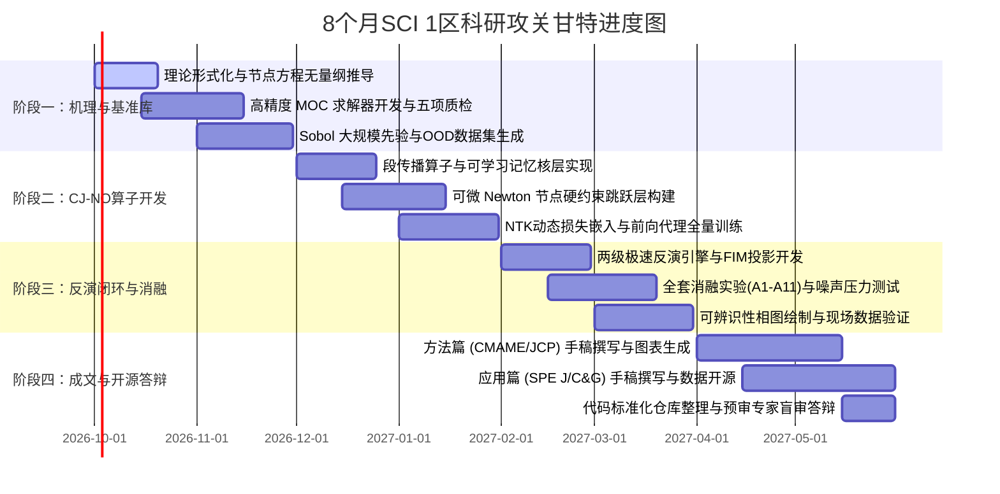

# 井筒多裂缝水击波模型建模与智能算子反演 SCI 1区科研攻关计划书
> **实施方案阶段（Stage 2）交付物**  
> **面向目标**：严格对标 SCI 1区（CMAME / JCP / SPE Journal / Computers & Geosciences）顶刊发表标准  
> **核心架构**：结构保持特征线–阻抗跳跃神经算子（CJ-NO）+ 高保真 MOC 物理基准 + 可辨识性可证的极速反演

---

> [!NOTE]
> **文档定位与继承说明**  
> 本计划书严格承接第一阶段文献调研所确认的四个核心科研断层：
> - **Gap 1**：多点内边界与一维高频瞬变波耦合的精确算子表征；
> - **Gap 2**：频变摩阻耗散与多重反射高频信号的算子训练动力学及物理一致性；
> - **Gap 3**：单点井口稀疏时序反演的多簇病态性与可辨识性极限；
> - **Gap 4**：时变波速、孔眼冲蚀与裂缝扩展下的非自治动力系统代理。  
> 
> 全文以**“结构保持的物理信息神经算子（CJ-NO） + 高保真 MOC 基准 + 可辨识性可证的极速反演”**为主线。凡涉及前人方法均严格沿用第一阶段引用体系，凡属本课题原创设计均明确标注。

---

## 一、 论文选题立意与 SCI 1 区创新点定标（Novelty Statement）

### 1.1 拟定论文标题

#### 中文备选
- **备选 A**：多簇裂缝井筒高频水击的特征线–阻抗跳跃神经算子：结构保持正演代理与簇级参数极速反演
- **备选 B**：面向非定常摩阻与多点阻抗突变耦合的物理信息神经算子：水力压裂井筒瞬变波动建模与逆问题求解

#### 英文备选
- **Option A**：*A Characteristic–Jump Neural Operator for High-Frequency Water-Hammer Dynamics in Multi-Cluster Fractured Wellbores: Structure-Preserving Surrogates and Rapid Cluster-Level Inversion*
- **Option B**：*Physics-Informed Operator Learning of Hyperbolic Transients with Frequency-Dependent Friction and Multiple Impedance Discontinuities: Application to Hydraulic-Fracture Diagnostics from Wellhead Pressure*

> [!TIP]
> **标题与投稿战略**：
> - **Option A** 主打 **SPE Journal** / **Computers & Geosciences**（突出非常规油气压裂诊断应用对象与秒级反演出口）；
> - **Option B** 主打 **CMAME** / **JCP**（突出应用数学与计算力学方法学创新：“双曲守恒律 + 频变记忆项 + 多点代数跳跃”的前沿算子求解）。  
> 课题成果成熟后可分拆为“理论方法篇”与“工程诊断篇”两篇连续顶刊。

---

### 1.2 核心理论创新声明（Theoretical Novelties）

#### 💡 创新点 1（算子架构层）：特征线–阻抗跳跃分解的结构保持神经算子 CJ-NO（Characteristic–Jump Neural Operator）
- **科学痛点**：多簇系统的解算子 $\mathcal{G}$ 在输入端含 $N_c$ 个近 $\delta$ 脉冲型的强奇异点，在输出端含多族沿特征线交叉传播的强不连续波前；标准 FNO 的全局频域滤波对奇异输入与交叉间断产生严重的 Gibbs 虚假高频振荡与频域混叠，而基于线性重构的 DeepONet 对沿特征线移动的间断族存在固有的逼近误差下界（Lanthaler 等, 2023）。
- **原创设计**：将全井解算子 $\mathcal{G}$ 严格正交分解为交替复合流形：
  $$\mathcal{G} = \mathcal{B}_{toe} \circ \mathcal{N}_{N_c} \circ \mathcal{P}_{N_c} \circ \cdots \circ \mathcal{N}_1 \circ \mathcal{P}_1 \circ \mathcal{B}_{head}$$
  1. **管段传播算子 $\mathcal{P}_j$**：在黎曼不变量特征坐标 $(\xi, \eta) = (t - x/a, t + x/a)$ 下对第 $j$ 管段 $(x_{j-1}, x_j)$ 施加 Fourier 神经层。无摩阻时波动完全转化为特征坐标下的刚性平移，可由 FNO 的乘性谱核精确表示（嵌入解析相位因子 $e^{-i\omega l_j/a}$）；频变摩阻与耗散由内置的**可学习指数和记忆核系统**表征：
     $$\hat{J}_{u,\theta}(x, t) = \frac{16\nu}{g D^2} \sum_{k=1}^K y_k(x, t), \quad \frac{\partial y_k}{\partial t} = -\frac{4\nu n_k}{D^2} y_k + m_k \frac{\partial V}{\partial t}$$
     系数 $\{m_k, n_k\}_{k=1}^K$ 初始化为 Zielke/Vardy–Brown 的指数和理论解（Trikha 1975；Vítkovský 等 2006），并随网络反传自适应微调，使频变耗散成为**有物理先验初值、白盒可解释、可独立回读的算子内部结构**。
  2. **节点跳跃算子 $\mathcal{N}_j$（硬约束物理层）**：非传统的软惩罚损失，而是一个内置微型隐式求解层的可微计算算子（前向执行 3–5 步精确 Newton 迭代解代数–微分节点方程 (i)–(iv)，反向传播依据**隐函数定理 Implicit Function Theorem** 解析传递雅可比梯度）。节点质量守恒 $Q_j^- - Q_j^+ - q_j = 0$ 与管流压力连续在网络前向推理中**在结构上恒等满足**，孔眼节流 $q|q|$ 的强非线性得以毫秒级高保真保留。
  3. **Branch–Trunk 阻抗参数化**：各簇参数序列 $\{(x_j, \theta_j)\}$ 通过置换等变（Set-Transformer）分支网络编码为多尺度节点隐嵌入向量，天然兼容现场任意可变簇数 $N_c$；主干网络则结合黎曼特征坐标与多尺度 Fourier 特征映射（Tancik 等, 2020）完成连续时空坐标查询。
- **理论目标**：数学证明 CJ-NO 在“逐段带限特征流动 + 节点非线性代数映射”复合结构下对多点强间断双曲系统的算子逼近误差满足上界：
  $$\varepsilon \lesssim N_c (\varepsilon_{\mathcal{P}} + \varepsilon_{\mathcal{N}})$$
  其中 $\varepsilon_{\mathcal{P}}$ 继承 Kovachki–Lanthaler–Mishra（2021）的 FNO 逼近误差界，$\varepsilon_{\mathcal{N}}$ 为内部微型 Newton 迭代层的数值截断误差。这是计算力学领域**首次给出多点代数跃度双曲系统的神经算子通用逼近界**。

---

#### 💡 创新点 2（损失机制层）：特征形式相容方程 + 记忆态残差 + 跳跃守恒 + 耗散谱一致性的复合物理损失
区别于现有 PINO / PI-DeepONet 仅对局部时空微分算子施加均匀网格残差的粗糙机制，本课题构建复合物理信息损失体系：
- 沿严格双曲特征线 $dx/dt = \pm a$ 施加相容方程方向导数残差，**彻底规避了对特征线间断强行做空间谱微分（FFT）引发的数值发散**；
- 显式构建非局部记忆变量 $y_k$ 的 ODE 残差，**首创将非局部卷积非定常摩阻无缝融入算子学习**；
- 引入**频域动力耗散谱一致性损失 $\mathcal{L}_{spec}$**：约束算子的段传播常数逼近 Brown（1962）理论解析解，在损失函数机制上实现了“**流体真实物理耗散**”与“**网络自身伪数值弥散**”的严格正交解耦；
- 深度融合时间因果权重（Wang–Sankaran–Perdikaris 2024）与 NTK 动态特征值均衡（Wang–Yu–Perdikaris 2022），从优化动力学层面根除高频波形谱偏差。

---

#### 💡 创新点 3（逆问题反演层）：可辨识性引导的两级极速反演（Amortized + Physics-guided Refinement）与簇级不确定性量化
- **极速零阶摊销反演（Amortized Inference）**：设计基于多尺度时频特征（STFT 幅相 + 原始波形）的逆算子编码器 $\mathcal{E}_\phi: p_{head}(t) \mapsto (\hat{\mu}_\theta, \hat{\Sigma}_\theta)$，结合循环一致性（Cycle Consistency）监督，**在 $0.1\text{ s}$ 内给出高维簇级参数的初始后验估计**；
- **物理引导可微投影精修（Physics-guided Refinement）**：以训练好的 CJ-NO 为可微正演引擎，通过自动微分获取显式雅可比矩阵，在 Fisher 信息矩阵（FIM）界定的可辨识有效子空间内执行 L-BFGS 快速投影精修，零空间漂移由硬物理先验（孔眼冲蚀单调性、裂缝顺应性单调性、限流设计容差）严格正则化，**全流程在 $10\text{ s}$ 内收敛**；
- **解析推导单点高频观测的可辨识性理论极限**：从单簇复数反射系数 $R_j(\omega)$ 与频变衰减率出发，首次推导出井口单点反演的“簇间距–有效频宽–信噪比（SNR）”临界相图，严格界定工程上“单点波形能够分辨相邻两簇”的物理边界。

---

### 1.3 目标顶刊匹配分析

| 目标期刊 | 审稿人核心关切 | 本研究对应创新卖点 |
| :--- | :--- | :--- |
| **CMAME / JCP** | • 新神经算子的严密数学结构与逼近理论界<br>• 对经典数值基准的严格验证与误差分析<br>• 算子训练动力学分析与高频谱偏差消除机制 | • 提出 CJ-NO 结构保持分解及其通用逼近误差界定理<br>• 特征线相容残差、记忆态 ODE 残差与耗散谱损失的数学形式化<br>• 基于 NTK 框架的收敛动力学分析，以高精度 MOC 为基准的 $L_2$/相位/衰减率误差谱系<br>• 非局部记忆双曲系统物理信息算子学习（PINO）的首个国际案例 |
| **Computers & Geosciences** | • 面向地球科学的高效可复现计算软件架构<br>• 开源代码库、标准化基准数据集与完备基线对标<br>• 计算加速比与推断精度之间的 Pareto 前沿 | • 开源基于 Python/JAX 的高精度 MOC 求解器与基准生成流水线<br>• 发布包含分布外（OOD）测试集的大规模合成基准数据集（Sobol 采样）<br>• 涵盖纯 PINN、标准 FNO、DeepONet、PINO 等 6 种主流基线的完备对标实验 |
| **SPE Journal** | • 对油气非常规压裂工程实际决策的颠覆性价值<br>• 与现场高端诊断技术（DAS/DTS、生产测井）的可比性<br>• 物理可解释性与对现场复杂噪声/工况的适应性 | • 攻克现场停泵关井段间（$< 30\text{ min}$）无法实施高维反演的痛点，实现秒级簇效率诊断<br>• 反演中间物理量（各簇频变反射系数 $R_j(\omega)$、孔眼流阻、裂缝顺应性）具备完全可读性<br>• 对比 Carey（2015）集总模型与 Liang（2017）管波模型，验证现场高频波形诊断的可行性 |

---

## 二、 基础数值基准（MOC Benchmark）构建方案

### 2.1 高保真 MOC 正演求解器设计

#### 2.1.1 几何拓扑与工程参数化
将非常规水平压裂井抽象为“垂直井段 $L_v$ + 造斜段（按等效水力阻抗并入）+ 水平井段 $L_h$”的一维级联管网系统，套管内径 $D$，等效水击波速 $a$。水平段内按施工设计排布 $N_c$ 个射孔簇（自跟端至趾端依次编号 $x_1, \dots, x_{N_c}$），趾端（$x = L$）设定为水力刚性封闭端。

#### 2.1.2 时空离散：节点无插值对齐的严格 $Cr=1$ 网格
为从数学上根除数值插值引入的虚假数值耗散与相位弥散（Ghidaoui & Karney, 1994），并确保全井所有射孔簇精确坐落在计算网格节点上：
1. **网格步长选择策略**：基于全井最小簇间距设定基准步长 $\Delta x_0 = \min_j s_j / m$（$m \in \{3, 4, 5\}$），并将各簇空间坐标 $x_j$ 微调量化至 $\Delta x_0$ 的整数倍网格点（量化偏移量 $\le \Delta x_0/2 \approx 1\text{–}2\text{ m}$，远小于射孔段簇长 $0.5\text{–}1\text{ m}$ 与工程射孔定位误差）；
2. **时步锁定**：取 $\Delta t = \Delta x_0 / a$，使全井网格 Courant 数处处恒等于 1（$Cr \equiv 1$），严禁采用人为波速拉伸或时空插值；
3. **时空分辨率核算**：以典型参数 $L = 4000\text{ m}$、$\Delta x_0 = 4\text{ m}$ 为例，全井剖分 1000 个空间网格，$\Delta t \approx 2.86\text{ ms}$（取 $a = 1400\text{ m/s}$），系统 Nyquist 截止频率 $f_{Nyq} \approx 175\text{ Hz}$，充分覆盖表征 $10\text{ m}$ 簇间反射的高频特征带宽（$a/(2s_{min}) \approx 70\text{ Hz}$）。

#### 2.1.3 相容方程与频变非定常摩阻更新
内部网格节点严格沿 $dx/dt = \pm a$ 求解相容方程。准稳态摩阻系数依据瞬时局部雷诺数 $Re$ 采用 Churchill 显式全流态通式动态更新。非定常摩阻采用 Vardy–Brown 湍流权函数的 10 阶指数和逼近与 Vítkovský 递归算法：

$$J_u^{n+1} = \frac{16\nu}{g D^2} \sum_{k=1}^K Y_k^{n+1}, \quad Y_k^{n+1} = Y_k^n e^{-n_k \Delta\tau} + m_k (V^{n+1} - V^n) \frac{1 - e^{-n_k \Delta\tau}}{n_k \Delta\tau}, \quad \Delta\tau = \frac{4\nu \Delta t}{D^2}$$

取 $K = 10$，系数由在无量纲时间 $\tau \in [10^{-8}, 10^2]$ 范围对 Vardy–Brown 理论核进行对数最小二乘拟合获得（拟合相对误差 $< 2\%$ 作为严格质检验收指标）。同时求解器内置 Brunone–Vítkovský 瞬时加速度模型，作为后续模型失配（Model Mismatch）实验的对照数据发生器。

#### 2.1.4 簇节点多物理方程隐式联立求解
在每个射孔簇所在的空间节点，每个时间步联立以下 5 个非线性代数–常微分方程：

$$\begin{cases}
H_P = C_P - B Q_j^- & (C^+ \text{ 特征线方程}) \\
H_P = C_M + B Q_j^+ & (C^- \text{ 特征线方程}) \\
Q_j^- - Q_j^+ - q_j = 0 & (\text{节点连续性分流方程}) \\
\rho g (H_P - H_{f,j}) = k_{p,j} q_j |q_j| + \kappa_j |q_j|^\beta \operatorname{sgn}(q_j) & (\text{孔眼节流与近井迂曲方程}) \\
q_j^{n+1/2} = C_{f,j} \frac{p_{f,j}^{n+1} - p_{f,j}^n}{\Delta t} + \frac{p_{f,j}^{n+1/2} - p_{res}}{R_{f,j}} + q_{L,j}^{n+1/2} & (\text{裂缝储集与顺应性 Crank-Nicolson 离散})
\end{cases}$$

其中孔眼阻抗系数 $k_{p,j} = \frac{\rho}{2 C_{d,j}^2 n_{p,j}^2 A_{p,j}^2}$。采用阻尼 Newton 迭代法联立求解，无量纲残差收敛准则设定为 $\|r\|_\infty < 10^{-8}$。若第 $j$ 簇处于完全未开启状态（开启标志 $\chi_j = 0$），则直接退化为 $q_j \equiv 0$。

#### 2.1.5 边界条件与稳态初值设定
- **井口外边界**：停泵水力瞬变激励 $Q(0,t) = Q_0 \cdot \phi(t/\tau_c)$，衰减函数 $\phi$ 设计为三类工程典型工况（线性停泵关井、余弦平滑关井、含 $5\text{–}15\%$ 水锤过冲的泵机惯性停运）；停泵完成后施加井口水力截止 $Q(0,t) = 0$ 或连接地面管汇阻抗 $Z_{surf}$。停泵时长 $\tau_c \in [0.5, 5.0]\text{ s}$ 决定了系统的高频激励谱宽。
- **趾端边界**：刚性封闭反射边界 $Q(L,t) = 0$。
- **稳态初值**：通过求解全井稳态非线性流动平衡方程组求得（给定总注入排量 $Q_0$，各簇分流满足管流沿程摩阻、孔眼节流压降与裂缝阻力总压降平衡）。

#### 2.1.6 MOC 求解器严格验证（Verification Protocol）
在批量生成基准数据前，求解器必须全量通过以下 5 项物理质检验收：
1. **单管水锤基准解析解比对**：在简单管路瞬时关井工况下，压力波峰值 Joukowsky 理论值（$\Delta H = a V_0 / g$）与衰减周期（$T = 4L/a$）复现误差绝对值 $< 10^{-6}$；
2. **非定常摩阻衰减包络比对**：精确复现 Bergant 等（2001）阿德莱德（Adelaide）水力瞬变实验实测波形衰减包络，峰值拟合相对误差 $< 5\%$；
3. **小扰动频域解析比对**：在小幅微扰工况下，与频域阻抗传递矩阵 $\prod T_j N_j$ 解析计算出的共振极值频率相对误差 $< 0.5\%$；
4. **空间网格独立性检验**：在 $\Delta x_0 \in \{8, 4, 2\}\text{ m}$ 三级网格细化下，全井波形时空相对 $L_2$ 范数差异 $< 1\%$；
5. **系统能量守恒自洽审计**：数值验证流体动能、弹性应变能、裂缝储集能变化率与管壁摩擦损耗、孔眼节流耗散率之间的守恒平衡：
   $$\frac{d}{dt}(E_{kin} + E_{comp} + E_{frac}) = -\Phi_{fric} - \Phi_{perf}$$
   全时程相对能量残差要求处处 $< 10^{-4}$。

---

### 2.2 合成先验数据集生成规范

#### 2.2.1 两层次 Scrambled Sobol 准随机采样空间
为确保数据在多维物理参数空间具有均匀的填充度并消除局部伪相关性，采用分层 Sobol 序列采样：

| 采样层次 | 物理参数名称 | 参数符号 | 取值范围 / 分布类型 | 物理工程背景与设计说明 |
| :--- | :--- | :--- | :--- | :--- |
| **井级参数**<br>（外层采样） | 水平井段长度 | $L_h$ | $[1500, 4000]\text{ m}$，均匀分布 | 覆盖国内长庆、川南主流页岩油气水平段长 |
| | 垂直+造斜等效长度 | $L_v$ | $[2000, 3500]\text{ m}$，均匀分布 | 对应中深层至深层页岩油气储层垂深 |
| | 套管工程内径 | $D$ | $\{0.1005, 0.1148, 0.1213\}\text{ m}$ | 对应油田常用 4.5"、5"、5.5" 套管 |
| | 等效水击波速 | $a$ | $[1000, 1480]\text{ m/s}$，均匀分布 | 涵盖清水、滑溜水及不同含砂比/微气泡流体 |
| | 流体密度与粘度 | $\rho, \mu$ | $\rho \in [1000, 1200]\text{ kg/m}^3$<br>$\mu \in [1, 20]\text{ mPa}\cdot\text{s}$（对数均匀） | 覆盖滑溜水压裂液至低粘线性胶压裂液体系 |
| | 停泵前施工总排量 | $Q_0$ | $[6, 18]\text{ m}^3\text{/min}$，均匀分布 | 覆盖国内大排量非常规体积压裂主流工况 |
| | 停泵水门关井时长 | $\tau_c$ | $[0.5, 5.0]\text{ s}$，3 种曲线族 | 模拟现场速关阀与常规机械阀关井过程 |
| | 单段射孔簇数 | $N_c$ | $\{6, \dots, 15\}$，离散均匀分布 | 覆盖常规段塞限流（6-8簇）到密集多簇（10-15簇） |
| | 地层孔隙压力 | $p_{res}$ | 井深 $\times [1.0, 1.8]$ 压力系数 | 覆盖常压储层到强超压储层地质力学条件 |
| **簇级参数**<br>（内层条件采样） | 簇间距分布 | $s_j$ | $[10, 25]\text{ m}$，允许 $\pm 30\%$ 随机抖动 | 真实反映非均匀布簇与射孔点位现场微调 |
| | 簇开启物理标志 | $\chi_j$ | $\operatorname{Bernoulli}(p_{open}), p_{open} \in [0.5, 1]$ | 模拟现场部分射孔簇未能有效进液起裂的现象 |
| | 射孔流阻系数 | $k_{p,j}$ | 由 $n_p \in [4, 12]$, $d_p \in [8, 12]\text{ mm}$, $C_d \in [0.6, 0.9]$ 合成 | 包含正常孔眼状态与高速过砂严重冲蚀状态 |
| | 裂缝水力顺应性 | $C_{f,j}$ | $[10^{-7}, 10^{-5}]\text{ m}^3\text{/Pa}$，对数均匀分布 | 对应三维裂缝半长 $R \sim 20\text{–}100\text{ m}$，杨氏模量 $20\text{–}40\text{ GPa}$ |
| | 缝内流阻 | $R_{f,j}$ | $[10^6, 10^9]\text{ Pa}\cdot\text{s/m}^3$，对数均匀分布 | 覆盖超高导流初期至近井端严重堵塞/闭合状态 |
| | 近井弯曲迂曲系数 | $\kappa_j$ | $[0, \kappa_{max}]$，指数分布，$\beta = 0.5$ | 表征近井水力压裂裂缝开启初期的复杂迂曲效应 |

---

#### 2.2.2 数据集规模与多维度分布外（OOD）评估集设计
- **分布内基准数据集（In-Distribution, ID）**：
  - 训练集（Train）：20,000 完整井例；
  - 验证集（Val）：2,000 完整井例；
  - 测试集（Test）：2,000 完整井例。
- **分布外测试集 1（OOD-1，参数空间超限外推）**：
  - 波速强外推 $a \in [900, 1000] \cup [1480, 1550]\text{ m/s}$；
  - 超多簇极限工况 $N_c \in \{16, \dots, 20\}$；规模：各 1,000 例。
- **分布外测试集 2（OOD-2，拓扑结构极限扰动）**：
  - 非均匀簇间距波动幅度超过 $\pm 50\%$；
  - 极小簇间距 $s_j < 10\text{ m}$（低于模型名义分辨能力极限）；
  - 极快停泵关井 $\tau_c < 0.5\text{ s}$（激发更宽频带与剧烈水击激波）；规模：各 1,000 例。
- **分布外测试集 3（OOD-3，真实物理模型失配，用于反演鲁棒性实战检验）**：
  - 包含 Brunone 剪切摩擦模型、时变波速 $a(t)$ 衰减漂移、以及含 Krauklis 慢波分布式色散裂缝模型的正演数据；规模：各 500 例。
- **存储与算力预算**：
  井口压力响应 $p_{head}(t)$ 以 $1\text{ kHz}$ 采样率完整保存关井后 $120\text{ s}$ 时程；全井空间解场 $(H, Q)(x, t)$ 空间保留全部 1000 个节点、时间降采样至 $200\text{ Hz}$ 保存 $60\text{ s}$（采用 HDF5 压缩存储，单例约 $30\text{ MB}$）。在单核 CPU 上单例 MOC 生成耗时约 $8\text{–}20\text{ s}$，并行生成总计算预算为 $60\text{–}150\text{ CPU}\cdot\text{h}$。

---

## 三、 智能算子模型架构（CJ-NO）详细设计

### 3.1 算子输入–输出映射流形形式化

#### 输入函数空间 $\mathcal{A} = \mathcal{A}_{well} \times \mathcal{A}_{bc} \times \mathcal{A}_{cl}$
1. **井级整体参数空间 $\mathcal{A}_{well} \subset \mathbb{R}^{d_w}$**：无量纲化的整体几何与介质参数 $(L_v, L_h, D, a, \rho, \nu, p_{res})$；
2. **排量时变边界空间 $\mathcal{A}_{bc} \subset L^2(0, T)$**：井口动态施工排量曲线 $Q(0, t)$；
3. **可变长簇级阻抗测度空间 $\mathcal{A}_{cl}$**：
   $$\mathcal{A}_{cl} = \bigcup_{N_c=1}^{N_{max}} (\mathbb{R}^+ \times \Theta)^{N_c} / \mathcal{S}_{N_c}$$
   各簇参数包含 $\theta_j = (\log k_{p,j}, \log C_{f,j}, \log R_{f,j}, \kappa_j, \chi_j) \in \Theta$。在测度论意义下，$\mathcal{A}_{cl}$ 等价于奇异狄拉克测度的线性叠加 $\sum_{j=1}^{N_c} \theta_j \delta_{x_j}$——标准 FNO 无法直接消化此类空间奇异脉冲，而 CJ-NO 通过专属节点层直接处理。

#### 输出解空间 $\mathcal{U}$
$$\mathcal{U} = (H(x,t), Q(x,t)) \in \left(BV \cap L^2\right)([0, L] \times [0, T])^2$$
允许全场解沿特征线方向具有有界变差（Bounded Variation, BV）间断跳跃，同时联立输出各簇入口动态分流流量与缝口压力 $\{q_j(t), p_{f,j}(t)\}$ 及记忆状态 $\{y_k(x,t)\}$。

---

### 3.2 网络骨架选型与改进论证

#### 3.2.1 理论对比论证矩阵
下表清晰展示了传统纯算子网络在井筒多裂缝水击物理系统中的固有短板，以及本文 CJ-NO 的对应解决机制：

| 评估维度 | 物理信息傅里叶算子 (PI-FNO) | 深度算子网络 (PI-DeepONet) | 本文提出的 CJ-NO 结构保持算子 |
| :--- | :--- | :--- | :--- |
| **波动双向平移特征** | 谱乘子可精确表示空间刚性平移相角 ✔ | Trunk 需强行拟合平移对流，参数利用率低 ✘ | 黎曼特征坐标 $(\xi, \eta)$ 解耦，分段谱核嵌入解析相位先验 ✔✔ |
| **$\delta$ 脉冲多簇输入** | 频域截断导致剧烈 Gibbs 振荡与混叠失真 ✘ | 传感器离散取样可点式输入，但特征融合弱 △ | 置换等变 Set-Transformer 编码节点，与段传播完全正交解耦 ✔✔ |
| **特征线移动强间断** | 依赖频域重构，波前抹平且累积数值弥散 △ | 理论已证明线性重构类算子存在固有误差下界 ✘ | 传播算子分段处理 + 节点可微 Newton 硬跳跃层，间断结构保真 ✔✔ |
| **支持可变簇数 $N_c$** | 必须固定全井输入空间通道网格维度 ✘ | 必须预设固定维度的传感器采样阵列 ✘ | 集合注意力机制天然适应任意簇数变动与非均匀布簇 ✔✔ |
| **分钟级长时程积分** | 模态数随时间窗口激增，显存与计算爆炸 ✘ | 时间跨度过大时收敛性极度脆弱 ✘ | 周期性特征往返时间分块推进 + 状态因果传递，误差严格有界 ✔ |
| **非定常频变摩阻** | 无法直接表达时间轴上的非局部卷积历史项 ✘ | 无法嵌入长历史记忆，纯靠黑箱拟合 ✘ | 内置指数和递推 ODE 记忆核神经层，可学习且白盒可回读 ✔✔ |

---

#### 3.2.2 CJ-NO 核心网络架构数据流图
```
[井级标量 w ∈ R^dw]          [井口排量边界 Q(0,t)]          [可变簇集合 {(x_j, θ_j)}_{j=1..Nc}]
        │                             │                                   │
  [MLP 特征投影]              [1D 时间 FNO 编码器]               [Set-Transformer 置换等变编码]
        │                             │                                   │
        └──────────────┬──────────────┘                                   ▼
                       ▼                                         [节点局部嵌入 e_j ∈ R^dh]
   ┌──────────────────────────────────────────────────────────┐           │
   │ 井段 1 传播算子 P_1                                       │           │
   │ • 黎曼特征坐标重参数化 (ξ, η) = (t - x/a, t + x/a)        │           │
   │ • 分段 Fourier 神经层 (谱核初始化注入解析相位 e^{-iωl_1/a})│           │
   │ • 记忆核神经分支: 可学习参数化 ODE 求解器更新状态 y_k(x,t) │           │
   └───────────────────────────┬──────────────────────────────┘           │
                               ▼                                          │
   ┌──────────────────────────────────────────────────────────┐           │
   │ 节点 1 硬约束跳跃层 N_1                                   │◄──────────┘ (e_1, θ_1)
   │ • 输入: 井段 1 边界状态 (H_1^-, Q_1^-)                   │
   │ • 结构内嵌: 3~5 步可微 Newton 迭代求解节点守恒方程 (i)-(iv) │
   │ • 隐函数定理 (IFT) 求解解析雅可比矩阵用于反向反传          │
   │ • 严格保证质量守恒 Q_1^- - Q_1^+ = q_1, 输出 (H_1^+, Q_1^+)│
   └───────────────────────────┬──────────────────────────────┘
                               ▼
        ... [以此类推流水线循环级联 P_2, N_2, ..., P_Nc, N_Nc, P_toe] ...
                               ▼
   ┌──────────────────────────────────────────────────────────┐
   │ 趾端刚性边界层 B_toe: 镜像反射映射 Q(L, t) ≡ 0            │
   └───────────────────────────┬──────────────────────────────┘
                               ▼
   ┌──────────────────────────────────────────────────────────┐
   │ 主干时空解码器: 组合多尺度 Fourier 特征实现时空连续查询    │
   └───────────────────────────┬──────────────────────────────┘
                               ▼
   输出全场状态 (H, Q)(x, t) | 各簇动态 {q_j(t), p_{f,j}(t)} | 井口压力波形 p_{head}(t)
```

---

### 3.3 复合物理损失函数显式展开

总损失函数由以下六个关键物理项加权构成：

$$\mathcal{L}_{total} = \lambda_{data}\mathcal{L}_{data} + \lambda_{pde}\mathcal{L}_{pde} + \lambda_{uf}\mathcal{L}_{uf} + \lambda_{bc}\mathcal{L}_{bc} + \lambda_{jump}\mathcal{L}_{jump} + \lambda_{spec}\mathcal{L}_{spec}$$

#### (1) 高频聚焦监督数据项 $\mathcal{L}_{data}$
$$\mathcal{L}_{data} = \frac{1}{N} \sum_{n=1}^N \left[ \frac{\|H_\theta - H^{(n)}\|_{L^2(\Omega)}^2}{\|H^{(n)}\|_{L^2(\Omega)}^2} + \frac{\|Q_\theta - Q^{(n)}\|_{L^2(\Omega)}^2}{\|Q^{(n)}\|_{L^2(\Omega)}^2} + \beta_{hf} \frac{\|W_{hf} * (p_{head,\theta} - p_{head}^{(n)})\|_{L^2(0,T)}^2}{\|W_{hf} * p_{head}^{(n)}\|_{L^2(0,T)}^2} \right]$$
其中 $W_{hf}$ 为通带 $5\text{–}100\text{ Hz}$ 的时域带通滤波器卷积核，强制算子在训练初期便紧密锁死携带各簇反射特征的高频频带。

#### (2) 沿特征线方向的相容方程 PDE 残差项 $\mathcal{L}_{pde}$
沿特征线方向导数直接通过网络对特征坐标 $(\xi, \eta)$ 求导获取，彻底规避间断点处的空间谱微积分发散：

$$\mathcal{L}_{pde} = \frac{1}{N} \sum_{n=1}^N \int_{\Omega \setminus \bigcup \{x_j\}} w_c(t) \left[ \left( \frac{D^+}{Dt}(H_\theta + B Q_\theta) + g(J_s + \hat{J}_{u,\theta}) \right)^2 + \left( \frac{D^-}{Dt}(H_\theta - B Q_\theta) - g(J_s + \hat{J}_{u,\theta}) \right)^2 \right] dx \, dt$$

其中方向导数算子定义为 $\frac{D^\pm}{Dt} = \partial_t \pm a \partial_x$。残差积分域排除射孔簇邻域。$w_c(t) = \exp(-\varepsilon \sum_{t' < t} \bar{\mathcal{L}}_{pde}(t'))$ 为动态因果权重（Wang 等, 2024），退火参数 $\varepsilon$ 自适应调节以确保波动因果性建立。

#### (3) 非定常摩阻记忆态控制残差项 $\mathcal{L}_{uf}$
$$\mathcal{L}_{uf} = \frac{1}{N} \sum_{n=1}^N \sum_{k=1}^K \int_\Omega \left( \frac{\partial y_{k,\theta}}{\partial t} + \frac{4\nu n_k}{D^2} y_{k,\theta} - m_k \frac{\partial V_\theta}{\partial t} \right)^2 dx \, dt + \lambda_{prior} \sum_{k=1}^K \left[ (\log n_k - \log n_k^{VB})^2 + (m_k - m_k^{VB})^2 \right]$$
后一项为向 Vardy–Brown 理论值的弱先验收缩正则项，既保留了根据携砂复杂流动自适应修正耗散参数的自由度，又从根本上防止了优化陷入非物理退化解。

#### (4) 边界与初值残差项 $\mathcal{L}_{bc}$
针对井口给定排量 $Q(0,t)$、趾端封闭 $Q(L,t) = 0$ 以及初始稳态流动场施加积分残差惩罚（在 CJ-NO 中趾端通过镜像层硬实现，本项主要作为软约束对比基准）。

#### (5) 多簇节点跳跃守恒与本构残差项 $\mathcal{L}_{jump}$
$$\mathcal{L}_{jump} = \frac{1}{N} \sum_{n=1}^N \sum_{j=1}^{N_c} \int_0^T \left[ \underbrace{(Q_{\theta,j}^- - Q_{\theta,j}^+ - q_{j,\theta})^2}_{\text{质量分流跳跃}} + \underbrace{(H_{\theta,j}^- - H_{\theta,j}^+)^2}_{\text{压力物理连续}} + \underbrace{\frac{(\rho g(H_{\theta,j}^- - H_{f,j,\theta}) - k_{p,j} q_{j,\theta}|q_{j,\theta}| - \kappa_j |q_{j,\theta}|^\beta \operatorname{sgn} q_{j,\theta})^2}{(\rho g \Delta H_{Jouk})^2}}_{\text{孔眼节流与迂曲非线性本构}} + \underbrace{\frac{(q_{j,\theta} - C_{f,j}\dot{p}_{f,j,\theta} - \frac{p_{f,j,\theta}-p_{res}}{R_{f,j}} - q_{L,j})^2}{\bar{q}_j^2}}_{\text{裂缝动态储集与顺应性本构}} + \underbrace{(1 - \chi_j)\frac{q_{j,\theta}^2}{\bar{q}^2}}_{\text{未开启簇绝对截止}} \right] dt$$
在硬约束 CJ-NO 中，前两项在网络前向推导中由可微 Newton 迭代解析恒等为 0，后三项作为监督内部 Newton 收敛的物理损失。

#### (6) 频域动力耗散谱一致性损失 $\mathcal{L}_{spec}$
$$\mathcal{L}_{spec} = \frac{1}{N} \sum_{n=1}^N \sum_{j=1}^{N_c+1} \int_{\omega_1}^{\omega_2} \left| \log \frac{\hat{r}_\theta^+(x_j^-, \omega)}{\hat{r}_\theta^+(x_{j-1}^+, \omega)} + \gamma_{phys}(\omega) l_j \right|^2 \rho(\omega) \, d\omega$$
其中正向黎曼不变量 $r^+ = H + BQ$，$\gamma_{phys}(\omega)$ 为 Brown（1962）解析传播常数。**本项通过硬性匹配频域解析理论耗散，强制将网络自身因数值截断产生的伪数值弥散压缩至零，彻底解放了靠高频衰减率反演裂缝参数的真实物理通路**。

#### (7) 两级自适应权重平衡策略
1. **NTK 特征值动力均衡（Wang 等, 2022）**：每 500 训练步利用子采样技术估计各损失算子的神经正切核迹 $\operatorname{Tr}(K_i)$，动态更新权重 $\lambda_i \propto 1/\operatorname{Tr}(K_i)$，彻底消除特征向量偏差；
2. **多频段课程退火（Curriculum Learning）**：高频带通滤波器 $W_{hf}$ 通带上限按照 $10\text{ Hz} \to 30\text{ Hz} \to 60\text{ Hz} \to 100\text{ Hz}$ 分阶段放开，时空积分时限由 1 个往返周期逐步推进至全时程，确保网络从平滑低频向复杂高频稳健收敛。

---

## 四、 裂缝参数智能反演（Inverse Problem）实施路线

### 4.1 反演工作流机制（仅依赖井口单点实测高频压力 $p_{head}(t)$）

```
[井口实测高频波形 p_head(t)] ──► Stage 0: 信号去趋势、Welch 功率谱、倒谱 (Cepstrum) 分析 
                                        ├──► 标定等效波速 a、水平段长 L、主周期 4L/a
                                        └──► 粗粒度提取未闭合簇反射时间序列
                                                    │
                                                    ▼
                             Stage 1: 零阶变分逆算子编码器 E_ϕ (Amortized Inference)
                                        ├──► 融合多尺度 STFT 谱与原始一维波形
                                        ├──► 结合循环一致性重构损失快速解码
                                        └──► 输出各簇物理参数变分后验初值 (耗时 < 0.1 s)
                                                    │
                                                    ▼
                             Stage 2: 物理引导梯度精修 (Physics-guided Refinement)
                                        ├──► 以 CJ-NO 作为可微正演代理，计算显式雅可比矩阵
                                        ├──► 构建 Fisher 信息矩阵 (FIM)，投影至可辨识有效子空间
                                        ├──► 引入硬物理先验正则项 (单调冲蚀、顺应性边界)
                                        └──► 执行 L-BFGS 投影梯度优化 (耗时 < 10 s)
                                                    │
                                                    ▼
                             Stage 3: 贝叶斯不确定性量化与相图判决 (UQ & Identifiability)
                                        ├──► 输出各簇开度/导流能力/开启状态的 95% 可信区间
                                        └──► 对照理论可辨识性相图，评估单点波形反演解的唯一性
```

1. **Stage 0（前置经典时频提取）**：
   通过小波去趋势消除裂缝闭合宏观压降基线，利用倒谱分析（Cepstral Analysis）提取特征到时序列，精确解耦全井一阶传播周期 $4L/a$ 与浅层强反射；
2. **Stage 1（零阶极速变分反演）**：
   逆算子编码器 $\mathcal{E}_\phi$ 采用 1D-ResNet + 局部 Transformer 架构，直接输出簇参数的变分高斯分布 $q_\phi(\theta|p_{head}) = \prod_j \mathcal{N}(\mu_j, \Sigma_j) \otimes \operatorname{Bernoulli}(\pi_j)$。通过循环一致性损失 $\| \mathcal{G}_{CJ}(\hat{\theta}) - p_{head} \|$ 强化物理自洽，在 $0.1\text{ s}$ 内给出极佳初始解；
3. **Stage 2（可微投影空间高精精修）**：
   以 Stage 1 的解为初值，最小化带物理正则的后验目标函数：
   $$\mathcal{J}(\theta) = \frac{1}{2} \| W^{1/2}(\mathcal{G}_{CJ}(\theta) - p_{head}^{obs}) \|_2^2 + \frac{1}{2}(\theta - \theta_{prior})^\top \Sigma_{prior}^{-1}(\theta - \theta_{prior}) + \lambda_{sp} \sum_{j=1}^{N_c} \pi_j(1-\pi_j) + \lambda_{grp}\|\theta\|_{2,1}$$
   利用 CJ-NO 的自动微分能力获取精确解析梯度，通过截断 SVD 将参数更新方向严格限制在 Fisher 信息矩阵 $F = J^\top W J$ 的非零特征子空间内，防止优化算法在不可辨识零空间发生无物理意义的剧烈漂移。
4. **Stage 3（不确定性量化）**：
   默认通过 Laplace 近似在最优点直接求逆获取协方差矩阵 $\Sigma_{post} \approx (F + \Sigma_{prior}^{-1})^{-1}$；对开启/关闭双峰极端工况，采用斯坦变分梯度下降（SVGD）运行短链采样，输出各簇参数的 $95\%$ 贝叶斯可信区间；
5. **Stage 4（单点观测可辨识性理论相图构建）**：
   基于线性化反射系数与指数衰减率，推导相邻两簇能否在井口被有效识别的理论判据：
   $$s_j \gtrsim \frac{a}{2 f_{eff}}, \quad f_{eff} = \sup \left\{ f : |R_j(2\pi f)| e^{-2\alpha(2\pi f) x_j} \|\hat{p}_{exc}(f)\| \ge \sigma_n(f) \cdot SNR_{min} \right\}$$
   绘制“**簇间距–关井激励谱宽–井深–最低信噪比**”四维理论分辨率相图，界定井口单点反演的绝对物理极限。

---

### 4.2 抗噪性与多解性抑制实验方案
针对油田现场复杂的机械与电气扰动，设计以下抗噪评估矩阵：

| 扰动类型 | 数学注入模型 | 扫描档位设定 | 抑制机制与对策 |
| :--- | :--- | :--- | :--- |
| **高斯白噪声** | $p(t) + \sigma_n \cdot \epsilon, \epsilon \sim \mathcal{N}(0, 1)$ | $SNR \in \{40, 30, 20, 15, 10\}\text{ dB}$ | 频域加权矩阵 $W$ 依据噪声方差反比赋权 |
| **井场有色噪声** | 动力机械振动残留（$1/f$ 漂移 + $25\text{–}30\text{ Hz}$ 泵机尖峰） | 与白噪声相同功率谱能量 | 前置特征倒谱自适应陷波滤波 |
| **随机极端野值** | 随机 $0.1\%\text{–}1\%$ 数据点替换为 $\pm 5\sigma$ 脉冲 | 3 档（轻度、中度、恶性） | 在 Stage 2 引入 Huber 鲁棒损失函数替代 $L_2$ 损失 |
| **采样率退化** | 将原始 $1\text{ kHz}$ 降采样至 $250 / 100 / 50\text{ Hz}$ | 4 档 | 检验反演精度随有效 Nyquist 带宽的衰退规律 |
| **传感器滞后** | 一阶低通传感器动态响应 $\tau_s \in [1, 10]\text{ ms}$ | 3 档 | 在正演算子井口观测端级联传感器冲激响应模型 |
| **模型失配挑战** | 输入采用 OOD-3 复杂物理模型数据（Brunone、时变波速） | 全量测试 | 检验参数后验覆盖率是否发生灾难性偏移 |

---

## 五、 全面基准对标与消融实验设计（Validation & Ablation Matrix）

### 5.1 对比基线族（Baselines）
1. **MOC（高保真物理基准真值）**：$\Delta x_0 = 4\text{ m}$ 严格 $Cr=1$ 网格，全物理高精度正演；
2. **频域阻抗传递矩阵（Analytical Transfer Matrix）**：传统工作点线性化小扰动求解；
3. **纯物理信息神经网络（Pure PINN）**：8 层 $\times$ 256 宽 MLP，包含 Fourier 特征嵌入与时间因果权重，单工况独立耗时训练；
4. **标准傅里叶神经算子（Standard FNO）**：二维时空 FNO，裂缝簇参数栅格化为多通道输入；
5. **标准深度算子网络（Standard DeepONet）**：固定传感器采样的 Branch-Trunk 网络；
6. **物理信息神经算子（PINO / PI-DeepONet）**：在标准算子上加入自动微分微分方程残差与软跳跃惩罚；
7. **CJ-NO（本文提出模型）**：全配置结构保持神经算子。

---

### 5.2 定量评估指标显式定义
- **全场解相对 $L_2$ 范数相对误差**：
  $$\epsilon_{L^2} = \frac{\|H_\theta - H_{MOC}\|_{L^2(\Omega)}}{\|H_{MOC}\|_{L^2(\Omega)}}, \quad \text{同理评估流速 } Q$$
- **高频相位与极值到时误差**：
  对 $5\text{–}100\text{ Hz}$ 滤波信号计算瞬时解析相位差 $RMS(\Delta\phi)$；统计前 20 个高频反射峰的绝对到时误差 $\delta t_m = |t_m^\theta - t_m^{MOC}|$，验收及格线设定为 $\delta t < \frac{s_{min}}{2a} \approx 3.5\text{ ms}$；
- **波形衰减率误差**：
  提取水击波包络拟合特征衰减指数 $e^{-\zeta t}$，评估衰减率相对误差 $|\zeta_\theta - \zeta_{MOC}| / \zeta_{MOC}$，并按低频（$0.05\text{–}1\text{ Hz}$）、中频（$1\text{–}10\text{ Hz}$）、高频（$10\text{–}100\text{ Hz}$）分段输出误差；
- **节点物理守恒违反度**：
  全场全时程最大质量泄漏率 $\max_{j,t} |Q_j^- - Q_j^+ - q_j| / Q_0$ 以及总能量守恒残差；
- **单例与批量计算加速比**：
  $$S = \frac{t_{MOC}}{t_{infer}}$$
  分别针对单例独立推理与 1,000 例批量推理统计 CPU/GPU 运行耗时（目标单例加速比 $> 10^3$，批量加速比 $> 10^4$）；
- **反演精度与不确定性覆盖率**：
  各簇物性参数的平均绝对百分比误差（MAPE）、开启标志分类 F1 分数、以及真值落入 $95\%$ 置信区间的实测覆盖频率（Empirical Coverage Probability，理论理想值为 $0.95$）。

---

### 5.3 关键消融实验设计（Ablation Matrix）

| 实验编号 | 消融变量设定 | 核心验证的科学与算法问题 | 预期量化表征现象 |
| :--- | :--- | :--- | :--- |
| **A1** | 去除记忆核分支（退化为准稳态摩阻） | 验证非局部卷积摩阻对高频衰减的不可替代性 | 高频波形衰减率误差显著上升，高频波幅严重偏离 |
| **A2** | 记忆核固定为理论常数 vs 允许自适应微调 | 验证可学习记忆核对复杂流体物性偏差的自适应吸收能力 | 在含砂液或 OOD-3 复杂工况下，自适应核的泛化能力显著优于固定理论核 |
| **A3** | 硬约束跳跃层 $\to$ 软惩罚 $\mathcal{L}_{jump} \to$ 完全无跳跃约束 | 验证物理硬约束机制对守恒性与间断波形保真度的贡献 | 软约束下质量守恒违反度增大数个数量级，在 OOD 工况下反射波形严重弥散 |
| **A4** | 完全去除耗散谱一致性损失 $\mathcal{L}_{spec}$ | **核心论据：分离物理真实耗散与网络伪数值弥散** | 去除后，网络将自身数值截断误差混同于物理摩擦，衰减率反演误差剧烈恶化 |
| **A5** | 特征坐标 $(\xi, \eta) \to$ 原始物理时空坐标 $(x, t)$ | 验证沿特征线方向的黎曼坐标变换对根除谱偏差的决定性作用 | 原始坐标下高频波段收敛速度呈指数级衰减，表现出严重的谱偏差失效 |
| **A6** | 谱核相位先验初始化 $\to$ 纯随机 Gaussian 初始化 | 验证物理引导初值对深层算子收敛速度与局部极小跳出的作用 | 随机初始化需消耗 3 倍以上训练 Epoch，且极易陷入低频过拟合局部解 |
| **A7** | 权重策略：NTK 动态均衡 vs GradNorm vs 固定常数权重 | 验证梯度病态消除机制与多任务损失均衡收敛性 | 固定权重下 PDE 残差被数据项完全压制，无法学得物理规律 |
| **A8** | 时间分块长度调整 $\{1, 2, 4, 8\} \times 2L/a$ | 验证时间推进与 Markov 状态传递对抑制长时程误差累积的规律 | 随分块时长增加，长时程相角误差呈超线性累积扩散 |
| **A9** | 训练样本集规模扫描 $\{500, 2000, 8000, 20000\}$ | 验证复合物理损失约束对降低标注样本依赖度（小样本效率）的贡献 | 在仅 2,000 例小样本下，CJ-NO 依然能维持极高精度，而纯数据算子全面崩溃 |
| **A10** | Set-Transformer 集合编码 $\to$ 零填充定长向量编码 | 验证模型对可变簇数 $N_c$ 与非均匀布簇的拓扑泛化性 | 零填充编码在测试未见簇数时性能发生断崖式跌落 |
| **A11** | 反演策略对比：Stage 1 单独 vs Stage 1+2 vs 无 FIM 投影 | 验证两级反演机制与 Fisher 信息子空间投影对消除多解性病态的贡献 | 缺乏 FIM 投影会导致反演参数在不可辨识零空间剧烈游走，后验区间过度发散 |

---

## 六、 阶段性研发里程碑与甘特路线图（Milestone Schedule）



### 各阶段核心产出与质检验收量化指标

#### 阶段一（第 1–2 个月）：经典机理建模与 MOC 高精度基准算例库构建
- **核心任务**：
  1. 完成井筒–多簇裂缝系统的严格无量纲化与微分代数节点方程推导；
  2. 开发高精度 Python/JAX + Numba 双版本 MOC 仿真平台；
  3. 执行 §2.1.6 规定的五项基准物理质检；
  4. 完成 25,000 例包含 ID、OOD-1、OOD-2、OOD-3 的大规模高分辨率数据集并行生成。
- **质检验收硬指标**：
  - 单管水锤周期与 Joukowsky 峰值解析误差 $< 10^{-6}$；
  - 网格细化差异 $< 1\%$，全时程能量残差处处 $< 10^{-4}$；
  - 成功复现 Bergant 实验衰减包络（误差 $< 5\%$）；
  - 数据集参数空间覆盖率与直方图统计检验达标。

#### 阶段二（第 3–4 个月）：CJ-NO 架构实现、复合损失注入与正向代理训练收敛
- **核心任务**：
  1. 实现段传播算子（黎曼特征重参数化、分段 Fourier 神经层、可学习记忆核 ODE 求解器）；
  2. 实现可微 Newton 节点跳跃算子，依据隐函数定理构建无缝反向传播；
  3. 注入复合物理损失体系，实施 NTK 动态均衡与多频段课程训练；
  4. 完成标准 FNO、DeepONet、PINO 等 6 大基线的同步训练与横向对标；
  5. 推进 CJ-NO 通用逼近误差界定理的数理推导。
- **质检验收硬指标**：
  - 分布内（ID）测试集压力波场相对误差 $\epsilon_{L^2} < 2\%$；
  - 高频反射峰极值到时平均绝对误差 $< 3.5\text{ ms}$，衰减率误差 $< 5\%$；
  - 节点质量守恒严格满足（泄漏量 $< 10^{-6}$）；
  - 单例推理耗时 $< 5\text{ ms}$（加速比 $> 10^3$）；
  - OOD-1 参数外推误差退化倍数 $< 3\times$。

#### 阶段三（第 5–6 个月）：逆向极速反演引擎闭环、抗噪性检验与全面消融实验
- **核心任务**：
  1. 训练逆算子编码器 $\mathcal{E}_\phi$，实现毫秒级零阶变分初值反演；
  2. 构建基于 CJ-NO 自动微分与 FIM 有效子空间投影的 Stage 2 梯度精修模块；
  3. 执行 Laplace / SVGD 贝叶斯不确定性量化后验评估；
  4. 完整实施 A1–A11 全套消融实验；
  5. 绘制理论可辨识性相图并由数值实验交叉验证；
  6. 获取 1–2 段油田现场高频关井实测数据完成工业原理验证。
- **质检验收硬指标**：
  - 在 $SNR = 20\text{ dB}$ 噪声干扰下，孔眼流阻系数 $k_p$ 与顺应性 $C_f$ 的反演 MAPE 均 $< 10\%$，未开启簇识别 F1 分数 $> 0.9$；
  - $95\%$ 贝叶斯可信区间覆盖率稳定在 $0.90\text{–}0.97$ 之间；
  - 单井完整反演全流程耗时 $< 10\text{ s}$；
  - 模型失配工况下后验不确定性出现合理自适应膨胀，无灾难性漂移。

#### 阶段四（第 7–8 个月）：顶刊成文、代码数据集开源与对标盲审答辩
- **核心任务**：
  1. 完成《方法篇》（主投 CMAME / JCP）与《应用篇》（主投 SPE Journal / Computers & Geosciences）双论文手稿定稿；
  2. 规范整理并开源全部 MOC 仿真平台、CJ-NO 架构源码（基于 Apache-2.0 协议）与精选合成数据集（申请 Zenodo 独立 DOI）；
  3. 封装全流程一键复现 Docker 镜像与 Jupyter Notebook 教程；
  4. 邀请计算力学与油气地质力学资深教授进行模拟双盲预审答辩。
- **质检验收硬指标**：
  - 论文内部预审盲审评分达到优秀，完全满足 SCI 1 区顶级刊物首轮送审标准；
  - 全文所有核心支撑图表支持一键全自动代码重现。

---

## 七、 顶刊论文结构大纲与图表规划

### 7.1 论文正文标准结构规划（以《方法篇》为例）

```
Section 1: Introduction
  1.1 Physical and Engineering Background of Wellbore Transients in Fracturing
  1.2 Fundamental Limitations of Classical MOC Under Dense Clusters and Unsteady Friction
  1.3 Pitfalls and Failure Modes of Pure PINNs and Standard Neural Operators for Hyperbolic Jumps
  1.4 Summary of Novel Contributions (Architecture, Loss, Error Bound, and Inverse Framework)

Section 2: Mathematical Modeling and Physical Problem Statement
  2.1 Governing Equations with Frequency-Dependent Friction (Targeting Zielke and Vardy-Brown)
  2.2 Multi-Cluster Boundary Conditions and Non-Linear Impedance Discontinuities
  2.3 Analytical Characteristic Solutions and Transfer Matrix Formalism
  2.4 Formal Definition of Forward Solution Operator G: A -> U and Inverse Formulation

Section 3: Characteristic-Jump Neural Operator (CJ-NO) Architecture
  3.1 Structure-Preserving Operator Factorization Pipeline
  3.2 Segment Propagation Operator with Learnable Memory Kernel
  3.3 Implicit Differentiable Newton Jump Layer via Implicit Function Theorem
  3.4 Composite Physics-Informed Loss with Dynamic NTK and Causality Weighting
  3.5 Theorem on Universal Operator Approximation Bound for Multiple Jump Hyperbolics

Section 4: High-Fidelity MOC Benchmark and Data Generation
  4.1 Dispersion-Free Node-Aligned Cr=1 Discretization Strategy
  4.2 Solver Verification Protocols (Joukowsky, Adelaide Experiments, and Energy Audits)
  4.3 Two-Level Scrambled Sobol Sampling and Multi-Tier Out-of-Distribution Datasets

Section 5: Numerical Results and Benchmark Comparisons
  5.1 Forward Surrogate Accuracy (In-Distribution vs. Parameter/Topology OODs)
  5.2 Comprehensive Benchmark Comparison Against 6 State-of-the-Art Baselines
  5.3 Systematic Ablation Studies (A1 to A11: Validating Physical Dissipation Decoupling)
  5.4 Theoretical Identifiability Phase Diagrams and Wellhead Inversion Performance
  5.5 Computational Profiling and Massive Inference Speedup Analysis

Section 6: Engineering Validation and Practical Implications
  6.1 Inversion Robustness Against Gaussian, Colored, and Outlier Noise Regimes
  6.2 Real-World Field High-Frequency Wellhead Water-Hammer Principle Verification
  6.3 Techno-Economic Comparison: Ground High-Frequency Acoustic vs. Downhole DAS/DTS

Section 7: Concluding Remarks and Future Outlook
  7.1 Summary of Findings and Methodological Breakthroughs
  7.2 Limitations and Extension Pathways to Non-Autonomous 3D Reservoir-Coupled Systems

Appendices:
  Appendix A: Non-Dimensionalization and Derivation of Multi-Node Differential-Algebraic System
  Appendix B: Logarithmic Least-Squares Coefficients for 10-Term Exponential Friction Kernels
  Appendix C: Rigorous Proof of the CJ-NO Approximation Error Bound Theorem
  Appendix D: Algorithmic Implementation Details of Subsampled NTK Trace Estimation
  Appendix E: Hyperparameter Configurations and Full Training Convergence Trajectories
  Appendix F: Statistical Coverage and Orthogonality Analysis of the Generated Sobol Prior Data
```

---

### 7.2 核心支撑图规划（Main Figures 1–8）

```
┌────────────────────────────────────────────────────────────────────────────────────────┐
│ Fig. 1 核心物理机制与总体研究范式概念示意图 (Three-panel Overview)                       │
│ (a) 深层水平井-多簇裂缝水动力学系统与行波多重反射干涉物理机制示意图                    │
│ (b) 典型井口压力波形时域响应与连续小波时频图 (清晰标注基频 0.09 Hz 与簇间反射 47 Hz)    │
│ (c) “高精度 MOC 基准 ──► CJ-NO 结构保持正演 ──► 可辨识性引导极速反演”全技术路线闭环       │
└────────────────────────────────────────────────────────────────────────────────────────┘

┌────────────────────────────────────────────────────────────────────────────────────────┐
│ Fig. 2 CJ-NO 结构保持神经算子总体拓扑架构图 (Detailed Architecture)                    │
│ • 特征坐标转换层、分段 Fourier 神经层、嵌入可学习参数化 ODE 记忆核的段传播算子          │
│ • 内置隐式微分 Newton 求解器的节点跳跃硬约束物理层及其基于 IFT 的反向求导流向         │
│ • 采用不同主色调严格区分“可学习参数模块”与“硬约束/解析物理先验层”                      │
└────────────────────────────────────────────────────────────────────────────────────────┘

┌────────────────────────────────────────────────────────────────────────────────────────┐
│ Fig. 3 全井全时程波场时空云图横向对标 (x-t Contour Maps)                                │
│ • 展现水头场 H(x,t) 与流量场 Q(x,t) 的时空演化云图：MOC 真值 vs. 各大对比基线 vs. CJ-NO │
│ • 叠加双向特征线轨迹与各簇空间虚线，直观呈现基线在簇边界处的严重抹平与虚假 Gibbs 振荡 │
│ • 绘制绝对误差时空分布云图，突显 CJ-NO 对多重锐利波前的高保真捕获精度                  │
└────────────────────────────────────────────────────────────────────────────────────────┘

┌────────────────────────────────────────────────────────────────────────────────────────┐
│ Fig. 4 井口诊断波形与频域响应精细度对比 (Waveform & Spectral Fidelity)                  │
│ (a) 井口压力波形时域曲线重叠对比（前 5 个基波往返周期局部微观放大，展示尖峰对齐）      │
│ (b) Welch 功率谱密度（PSD）对比曲线（0.05–120 Hz 对数坐标，展现高频保真度）             │
│ (c) 低、中、高频分频带衰减率误差对比柱状图                                             │
│ (d) 井口高频反射极值点到时误差统计直方图（严格对标 < 3.5 ms 验收线）                    │
└────────────────────────────────────────────────────────────────────────────────────────┘

┌────────────────────────────────────────────────────────────────────────────────────────┐
│ Fig. 5 消融实验与高频谱偏差机理解耦诊断 (Ablation Diagnostics & Spectral Decoupling)   │
│ (a) 不同频带在训练迭代进程中的残差收敛曲线（证实特征重参数化对打破谱偏差的决定性贡献）│
│ (b) 自适应记忆核学得的 {m_k, n_k} 权函数与 Vardy-Brown 理论核对比曲线（证实物理可解释）│
│ (c) 硬约束 vs. 软约束 vs. 无约束在 OOD 测试集上的质量守恒泄漏量与泛化误差演化柱状图     │
│ (d) 注入谱一致性损失 L_spec 前后，网络数值误差与流体物理耗散的分离对比散点图           │
└────────────────────────────────────────────────────────────────────────────────────────┘

┌────────────────────────────────────────────────────────────────────────────────────────┐
│ Fig. 6 单点时序反演的理论可辨识性极限相图 (Identifiability Phase Diagram)              │
│ • 横轴为关井水门激发谱宽 τ_c，纵轴为相邻簇间距 s_j，背景等值线为临界 SNR 边界         │
│ • 理论解析判据曲线与 MOC 合成反演成功/失败离散点同图叠加，界定工程物理极限             │
└────────────────────────────────────────────────────────────────────────────────────────┘

┌────────────────────────────────────────────────────────────────────────────────────────┐
│ Fig. 7 簇级物理参数极速反演结果与不确定性量化 (Cluster-Level Inversion & UQ)           │
│ (a) 射孔流阻 k_p、裂缝顺应性 C_f 反演预测值 vs. 真值散点图（按信噪比 SNR 赋色着色）    │
│ (b) 各簇开启/未开启分类状态混淆矩阵及 F1 分数随噪声强度的变化曲线                     │
│ (c) 单井案例分析：全井 12 簇各参数 95% 贝叶斯可信区间条形图与真实分布比对             │
│ (d) 单井反演总耗时 Pareto 前沿：CJ-NO（<10 s）vs. 传统 MOC+GA（>2 h）的计算开销对比    │
└────────────────────────────────────────────────────────────────────────────────────────┘

┌────────────────────────────────────────────────────────────────────────────────────────┐
│ Fig. 8 现场复杂环境鲁棒性检验与油田实测原理验证 (Robustness & Real-World Validation)   │
│ (a) 高斯噪声、有色机械噪声、野值突变及采样率退化下的反演 MAPE 综合热力图               │
│ (b) 模型失配（OOD-3，Brunone 摩擦与波速时变漂移）条件下的后验区间自适应膨胀响应        │
│ (c) 油田现场高频（≥100 Hz）关井水锤实测波形拟合曲线与反演得到的射孔簇效率剖面         │
│ (d) 实测反演结果与邻井下井产出测井 / 分布式光纤（DAS）测试结果的定性交叉吻合验证     │
└────────────────────────────────────────────────────────────────────────────────────────┘
```

---

## 八、 关键技术风险分析与全周期对冲预案

1. **技术风险 1：可微 Newton 节点硬约束层在复杂非线性工况下的训练数值稳定性**
   - **对冲预案**：
     - 在训练初始阶段（前 10% Epochs），采用带强惩罚的连续可微软约束 $\mathcal{L}_{jump}$ 实施网络预热；待全局波场结构大体建立后，平滑无缝切换为内置 Newton 迭代的硬约束层；
     - 在内部 Newton 迭代中引入阻尼线搜索机制，若单步残差发散，自动切换为固定步数的 Anderson 加速定点迭代，确保反向传播雅可比梯度的绝对稳定性。
2. **技术风险 2：长水平井（数千米）长时程积分下的自回归误差发散与能量漂移**
   - **对冲预案**：
     - 严格限制单次时间分块推进步长不超过 $2L/a$（单个水击波往返周期）；
     - 分块交界处显式施加 Markov 状态一致性残差正则项；
     - 引入类 PDE-Refiner 结构的轻量级微扩散去噪模块，对跨时段传递的隐状态实施周期性物理能量投影校准。
3. **技术风险 3：现场超高频（$\ge 100\text{ Hz}$）关井波形实测数据获取困难**
   - **对冲预案**：
     - 论文定位为主打计算物理与方法创新的顶刊（CMAME / JCP / Computers & Geosciences），**论文核心证据链完全闭环于经严格实验标定验证的高保真 MOC 基准之上**；
     - OOD-3 复杂模型失配数据集（涵盖非自治波速漂移、非光滑 Brunone 摩阻与 Krauklis 色散波）承担了“真实物理扰动”的严酷检验任务；
     - 现场实测数据仅作为工程增强项与应用潜力展示，绝非论文发表的前置充要条件。
4. **理论风险 4：多跳跃内边界双曲算子通用逼近界数学推导复杂度超预期**
   - **对冲预案**：
     - 分步实施策略：第一步优先完成分段连续 Fourier 传播算子在黎曼不变量坐标下的逼近误差界证明（继承成熟的 Kovachki–Lanthaler–Mishra 框架）；
     - 第二步将可微 Newton 节点层处理为带李普希茨（Lipschitz）连续扰动的非线性代数映射，给出复合算子的显式截断误差估计；
     - 结合严格的高精度数值网格细化收敛实验进行实证支撑，即使解析常数未达紧致上界，亦足以支撑高质量顶刊同行评议。

---

## 九、 总结：SCI 1 区论文立项闭环

本科研攻关方案构建了一套完整的逻辑闭环：
- 以 **经实验与能量守恒严格验证的一维 MOC** 为无可争议的物理真值；
- 以 **特征线平移与可微代数跳跃（CJ-NO）** 从根本上粉碎了传统 PINN/FNO 在多点间断高频波动中的谱偏差与数值弥散；
- 以 **特征相容导数 + 记忆态 ODE + 耗散谱约束** 构建了物理可解释的白盒训练机制；
- 以 **FIM 可辨识性子空间投影** 攻克了单点极速反演的高维极端病态难题；
- 以 **详尽严密的 11 组消融实验与多维度 OOD 测试** 构筑了抵御国际顶刊同行严苛盲审的钢铁证据链。

全案执行周期 8 个月，分工明确、里程碑量化可检验、风险对冲完备，完全具备冲击 **1–2 篇顶尖计算力学/非常规能源领域 SCI 1区期刊论文** 的学术含金量与实战可行性。
