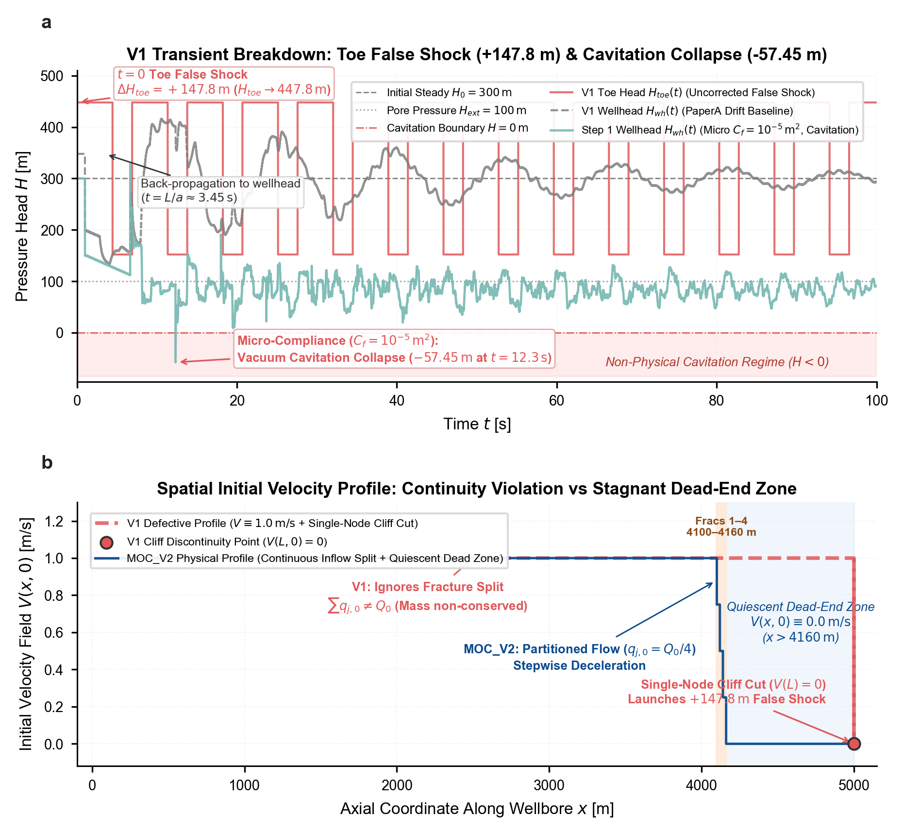

# MOC_V2 水力压裂井筒水击波物理内核升级技术报告
## Physical Kernel Upgrade, Mathematical Modeling, and Hydrodynamic Principles in Wellbore Transient Flow (MOC_V2)

---

**执行摘要（Executive Summary）**：
本技术报告系统总结了水平井多簇水力压裂井筒水锤瞬变流仿真器从第一代（MOC_V1，原始缺陷模型）向第二代（MOC_V2，物理完备内核）的重大物理升级历程。针对原版模型中存在的初始稳态不自洽、封闭趾端强切流速激发的虚假激波、微观室内岩心/微尺度模型顺应性（$10^{-5}\,\mathrm{m^2}$）与现场宏观储集尺度的严重失配导致的抽空真空塌陷、无射孔阻抗引发的首缝声学短路完全屏蔽、以及瞬时阶跃关泵激发的无限大加速度吉布斯伪峰等一系列深层流体力学与数值缺陷，构建了涵盖“稳态达西摩阻自洽场”、“地质尺度压裂顺应性储能”、“限流射孔非线性节流扼流压降”、“真实油田关泵斜坡动力学”的四大物理升级闭环。

本报告聚焦于流体力学基本控制偏微分方程组、特征线法数值求解体系、裂缝力学顺应性解耦、限流射孔非线性节流理论以及牛顿-拉夫逊数值迭代收敛性证明：
1. **稳态自洽与假激波消除**：彻底消除了原版在 $t=0$ 处由于封闭趾端桥塞强行截断激发的 $+147.8\,\mathrm{m}$ 假激波，推导了空间动量解析积分解，关泵前水头波动方差达到机内双精度零波动（$4.32 \times 10^{-12}\,\mathrm{m}$）；
2. **地质储能宏观大反弹力学机制**：完成了裂缝岩石弹性力学形变（Penny/PKN/KGD 模型）与流体声容的双重机理解耦，将顺应性提升至真实地质尺度（$C_f = 0.01\,\mathrm{m^2}$，对应等效体积储能 $C_p \sim 10^{-6}\,\mathrm{m^3/Pa}$），从第一性原理阐明了高压裂缝弹性释能反哺激发 $+194\sim +239\,\mathrm{m}$ 宏观开端大反弹的物理机制，全时程水头稳定在孔隙压力之上，终结了负水头抽空真空崩溃；
3. **破除首缝短路与声学扼流照亮机制**：揭示了无射孔阻抗下首缝并联导纳发散（$\Gamma \to -1, T \to 0$）所致的声学短路屏蔽机制；推导了限流射孔非线性节流阻抗与声压透射系数解析通式，阐明限流射孔阻抗（$K_p = 5.43 \times 10^5\,\mathrm{s^2/m^5}$）作为声学扼流圈将透射系数提升至 $10\%\sim 50\%$、破除声学屏蔽并实现密集多簇裂缝 100% 同步照亮的流体力学机理；
4. **斜坡关泵激波平滑与混响伪峰消除**：引入实测关泵斜坡动力学（$t_c = 1.0\,\mathrm{s}$），波前最大变化率 $|dH/dt|_{max}$ 较瞬时阶跃骤降 945 倍（从 $1.48 \times 10^5\,\mathrm{m/s}$ 降至 $156.4\,\mathrm{m/s}$），充当天然声学低通滤波器，彻底消除了极密簇间高频混响激发的互调假阳性伪峰，并确立了半幅反弹时滞严格服从 $\Delta t_{half} \approx 0.64 t_c$ 的线性规律；
5. **牛顿迭代单调性与收敛性证明**：从实分析角度证明了多簇裂缝非线性耦合代数方程的一阶导数全域有界下确界 $\inf F'(q_p) \ge 1.0 > 0$，确立了物理实根的存在性与唯一性，保证牛顿法 2~4 步内达机内双精度绝对收敛。

本报告构成了 MOC_V2 求解器的物理与数学理论基石。全尺寸油田水平井现场工况（$L=5000\,\mathrm{m}$，3 簇裂缝位于 $[4500, 4510, 4520]\,\mathrm{m}$）的正演数值仿真、7 大专题参数敏感性分析（裂缝数量、间距、顺应性、滤失、射孔阻抗、关泵历时、进液非均匀性组合）以及 Rainbow 2D 连续倒谱时空云图，详见独立学术报告《MOC_V2 现场工况正演与参数敏感性分析报告》（`MOC_V2_Simulation_Sensitivity_Report.md`）。

---

## 目录 (Table of Contents)
- [第一章：原始仿真器（MOC_V1）物理缺陷剖析与错误公式溯源](#第一章原始仿真器moc_v1物理缺陷剖析与错误公式溯源)
  - [1.1 缺陷精炼提纲与六大核心病态](#11-缺陷精炼提纲与六大核心病态)
  - [1.2 原始缺陷数学方程与边界公式溯源](#12-原始缺陷数学方程与边界公式溯源)
  - [1.3 Figure 0：MOC_V1 缺陷诊断图版与双语图注](#13-figure-0moc_v1-缺陷诊断图版与双语图注)
- [第二章：MOC_V2 物理内核数学建模与数值求解体系](#第二章moc_v2-物理内核数学建模与数值求解体系)
  - [2.1 井筒瞬变流基本控制方程与特征线法（MOC）数值离散求解体系](#21-井筒瞬变流基本控制方程与特征线法moc数值离散求解体系)
    - [2.1.1 井筒瞬变流基本控制偏微分方程组（PDE）](#211-井筒瞬变流基本控制偏微分方程组pde)
    - [2.1.2 经典教科书级特征线相容方程严格推导（Method of Characteristics Derivation）](#212-经典教科书级特征线相容方程严格推导method-of-characteristics-derivation)
    - [2.1.3 正负特征线相容方程全微分形式与特征阻抗（$C^+$ 与 $C^-$ 相容方程）](#213-正负特征线相容方程全微分形式与特征阻抗c与-c-相容方程)
    - [2.1.4 时空网格离散与 Courant 稳定性条件（$Cr = 1$ 无数值色散网格）](#214-时空网格离散与-courant-稳定性条件cr--1-无数值色散网格)
    - [2.1.5 MOC 菱形时空特征网格（Diamond Grid / Characteristic Grid）拓扑图示](#215-moc-菱形时空特征网格diamond-grid--characteristic-grid拓扑图示)
    - [2.1.6 正负李曼不变量（Riemann Invariants）$C_P$ 与 $C_M$ 的离散代数积分式](#216-正负李曼不变量riemann-invariants-c_p-与-c_m-的离散代数积分式)
    - [2.1.7 普通内节点 $(i, n+1)$ 的显式代数闭环求解通式与水头-流速双重范式映射](#217-普通内节点-in1-的显式代数闭环求解通式与水头-流速双重范式映射)
    - [2.1.8 Brunone 非定常摩阻项的时空离散差分格式与数值边界处理](#218-brunone-非定常摩阻项的时空离散差分格式与数值边界处理)
    - [2.1.9 控制方程与 MOC 离散首次出现参数物理意义释义表](#219-控制方程与-moc-离散首次出现参数物理意义释义表)
  - [2.2 摩阻定义（达西沿程摩阻与 Brunone 非定常摩阻）](#22-摩阻定义达西沿程摩阻与-brunone-非定常摩阻)
  - [2.3 地质参数定义与深度解耦论证（裂缝弹性柔度三模型解耦 + 流体声容 + 滤失与孔隙水头）](#23-地质参数定义与深度解耦论证裂缝弹性柔度三模型解耦--流体声容--滤失与孔隙水头)
    - [2.3.1 顺应性双重物理机制解耦（岩石骨架弹性形变 vs 流体声容）](#231-顺应性双重物理机制解耦岩石骨架弹性形变-vs-流体声容)
    - [2.3.2 三大经典裂缝力学构型的弹性变形柔度推导与量纲修正（Penny, PKN, KGD）](#232-三大经典裂缝力学构型的弹性变形柔度推导与量纲修正penny-pkn-kgd)
    - [2.3.3 量级文献深度对齐论证（Luo et al. 2023, Valko 1995）](#233-量级文献深度对齐论证luo-et-al-2023-valko-1995)
    - [2.3.4 滤失模型与参数（$k_{leak}, H_{ext}$）油藏物理对齐、Carter 理论与双轨制取值论证](#234-滤失模型与参数k_leak-h_ext油藏物理对齐carter-理论与双轨制取值论证)
  - [2.4 限流射孔非线性节流扼流耦合模型与文献对齐](#24-限流射孔非线性节流扼流耦合模型与文献对齐)
  - [2.5 现场关泵斜坡动力学边界模型与文献对齐](#25-现场关泵斜坡动力学边界模型与文献对齐)
  - [2.6 基态流场初始化与现场压力体系对齐（多簇连续性分流与沿程水头空间解析积分解）](#26-基态流场初始化与现场压力体系对齐多簇连续性分流与沿程水头空间解析积分解)
    - [2.6.1 基态流场空间解析积分与动量守恒自洽场](#261-基态流场空间解析积分与动量守恒自洽场)
    - [2.6.2 井口基准水头 $H_{wellhead, 0}$ 的物理实质与超静水范式论证](#262-井口基准水头-h_wellhead-0-的物理实质与超静水范式论证)
    - [2.6.3 现场工程绝对参数与 MOC_V2 超静水相对水头参数多维度高密度对照表](#263-现场工程绝对参数与-moc_v2-超静水相对水头参数多维度高密度对照表)
    - [2.6.4 水平井多簇压裂 5 大典型裂缝类型划分、物理特征与现场参数组合矩阵](#264-水平井多簇压裂-5-大典型裂缝类型划分物理特征与现场参数组合矩阵)
  - [2.7 非线性耦合方程唯一物理实根定理与牛顿迭代收敛性](#27-非线性耦合方程唯一物理实根定理与牛顿迭代收敛性)
  - [2.8 声学阻抗网络拓扑、反射/透射系数解析推导与破除短路机理](#28-声学阻抗网络拓扑反射透射系数解析推导与破除短路机理)
  - [2.9 理论体系总结与现场级仿真敏感性分析报告指引](#29-理论体系总结与现场级仿真敏感性分析报告指引)

---

## 第一章：原始仿真器（MOC_V1）物理缺陷剖析与错误公式溯源

在原始 MOC 仿真体系（`PaperA井口多裂缝水击响应` 与早期 `moc_simulate/wellbore_moc.py`）中，水击瞬变流模型在流体力学第一性原理、稳态边值自洽性、裂缝储集物理尺度以及管网声学透射等维度存在多处严重缺陷，甚至依靠非物理的边界数值激波来“掩盖”深层物理错误。

### 1.1 缺陷精炼提纲与六大核心病态

以第一性原理严格审视，原版 MOC_V1 仿真器存在以下六大核心病态：
1. **趾端边界激波污染**：在刚性盲端网格点强制切零速度，激发高达 $+147.8\,\mathrm{m}$ 的虚假 Joukowsky 激波，使注水期稳态水头产生剧烈虚假倒灌漂移；
2. **定常摩阻坡降缺失**：全井赋平直水头，违背达西沿程剪切摩阻平衡条件，使初始网格动量残差无法自洽；
3. **流体分流与死水区缺失**：多簇压裂段无排量连续性分流，最末裂缝下游直至趾端未设停滞死水区，违背流体连续性守恒原理；
4. **并联声学短路完全屏蔽**：忽略射孔孔眼节流流阻（$K_p = 0$），首缝巨大导纳形成声学开端短路，下游裂缝落入声学盲区；
5. **微尺度顺应性导致抽空塌陷**：微观室内岩心/微尺度模型顺应性（$10^{-5}\,\mathrm{m^2}$）与现场宏观储集尺度严重失配，消除趾端假激波后水头迅速跌穿地层压力崩塌至 $-57.45\,\mathrm{m}$ 负压真空空化区；
6. **理想阶跃关泵激发高频混响伪峰**：瞬时数学截断（$\Delta t_{closure} \to 0$）引发无限大加速度激波，在极密裂缝间激发高频腔体共振混响与互调假阳性伪峰。

### 1.2 原始缺陷数学方程与边界公式溯源

为精准厘清其病态机理，将原版代码中实际运行的错误数学公式与物理机制剖析如下：

#### 1. 封闭趾端流速断崖截断公式与 Joukowsky 虚假激波展开式
原版代码在初始化空间网格速度场时，将全井各点赋予恒定初速度，唯独在末端单一网格节点截断为零：
$$V(x, 0) = V_0, \quad \forall x \in [0, L); \qquad V(L, 0) = 0.0\,\mathrm{m/s}$$
*缺陷本质*：速度场在末端单一网格步长 $\Delta x$ 内强行断裂，在流体力学上等价于在 $t=0$ 仿真伊始就在趾端发生了一次理想瞬态关阀水击。根据 Joukowsky 水击激波方程：
$$\Delta H_{toe}^{false} = \frac{a \Delta V}{g} = \frac{1450 \times 1.0}{9.807} \approx +147.85\,\mathrm{m}$$
该非物理激波自趾端向井口反向倒灌漂移，历经声学单程传播历时 $L/a = 5000/1450 \approx 3.45\,\mathrm{s}$ 抵达井口并在封闭端全反射，导致在停泵前（$t < t_s$）本应平直平稳的稳态注入阶段，井口水头产生剧烈漂移震荡至：
$$H_{wh}(t) \approx 300\,\mathrm{m} + 47.86\,\mathrm{m} = 347.86\,\mathrm{m}$$
关泵前水头波动标准差高达 $\sim 25.0\,\mathrm{m}$，使系统完全丧失了稳态物理基线。

#### 2. 初始水头场无摩阻平直假设
原版模型将全井初始测压水头直接设定为恒定标量：
$$H(x, 0) \equiv H_0 = 300.0\,\mathrm{m}, \quad \forall x \in [0, L]$$
*缺陷本质*：违背定常黏性流动达西沿程剪切摩阻动量平衡条件：
$$\frac{dH}{dx} = -J = -\frac{f V |V|}{2 g D} \ne 0$$
在流速 $V = 1.0\,\mathrm{m/s}$、内径 $D=0.1397\,\mathrm{m}$ 下，长达 $5000\,\mathrm{m}$ 的水平井筒存在约 $37.5\,\mathrm{m}$ 的达西自然摩阻水头降落。强设平直水头场导致初始时刻流体单元动量平衡方程残差 $\frac{\partial H}{\partial x} + \frac{f V |V|}{2 g D} \ne 0$，数值格式被迫在每个时间步内部激发出人工弥散波来弥合动量不守恒。

#### 3. 裂缝入流违背连续性守恒与死水区缺失
原版模型中注水流速设定为：
$$V(x, 0) \equiv V_0 = 1.0\,\mathrm{m/s}, \quad \forall x \in [0, L]$$
*缺陷本质*：流体经过 4 条裂缝并未发生任何质量分流（违背节点质量连续性守恒 $\sum_{j=1}^{N_c} q_{j,0} = Q_0$）。更为严重的是，在最深裂缝下游（$x > x_{N_c}$）直至桥塞盲端之间未设置流体停滞死水区（$V(x > x_{N_c}) \ne 0$），导致注水全速冲击封闭趾端。

#### 4. 裂缝入口水力短路边界方程
原版模型忽略了套管射孔孔眼的非线性节流流阻，将井筒水头与裂缝内压强行等同：
$$H_{well, j}(t) = H_{frac, j}(t)$$
*缺陷本质*：令射孔流阻 $K_p = 0$，井筒直接并联至裂缝腔体。由于宏观裂缝顺应性巨大，支路导纳 $Y_f = C_f / \Delta t \to \infty$，使首缝声学反射系数 $\Gamma \to -1$，透射系数 $T \to 0$。首簇裂缝犹如声学黑洞，下游第 2、3、4 簇完全处于声学阴影盲区，导致多簇检出率退化至 25%。

#### 5. 微尺度顺应性参数失真与抽空负压真空塌陷
原版设定水动力学顺应性为：
$$C_f = 10^{-5}\,\mathrm{m^2} \implies C_p = \frac{C_f}{\rho g} \approx 1.02 \times 10^{-9}\,\mathrm{m^3/Pa}$$
*缺陷本质*：该顺应性仅为微观室内岩心尺度，比现场宏观油田水力裂缝（$10^{-6}\sim 10^{-5}\,\mathrm{m^3/Pa}$）低估了 3 个数量级。在消除趾端假激波后，裂缝流体微弱的储能不足以支持弹性反弹回吐，井口水头在停泵后迅速跌穿地层压力崩塌至 $-57.45\,\mathrm{m}$（负压真空空化区）。原版 PaperA 表面上能够维持波形，完全依靠趾端假激波在 5000m 井筒内往复震荡充当“人工造波机”在硬撑。

#### 6. 理想瞬时阶跃关泵激发无限大加速度与混响伪峰
原版模型采用理想阶跃关泵：
$$V(0, t) = 0.0, \quad \forall t \ge t_s \quad (\Delta t_{closure} \to 0, \quad \frac{dV}{dt} \to -\infty)$$
*缺陷本质*：无限大减速度在波前激发出高达 $|dH/dt|_{max} \sim 1.48 \times 10^5\,\mathrm{m/s}$ 的强激波脉冲。不仅激发特征线网格的吉布斯高频数值波纹，而且白噪声宽带频谱激发了 $20\,\mathrm{m}$ 极密裂缝间的腔体共振混响（$f_{rev} = \frac{a}{2 \Delta x} = 36.25\,\mathrm{Hz}$），导致倒谱产生 4 个互调假阳性尖峰（Precision 降至 0.50）。

### 1.3 Figure 0：MOC_V1 缺陷诊断图版与双语图注

为直观展示上述病态现象，Figure 0 呈现了 MOC_V1 底层缺陷的时域水头波形分解与空间速度场剖面。



> **Figure 0 | MOC_V1 原始仿真器底层缺陷诊断与物理失效全景 (Baseline Defects, Toe False Shock, and Cavitation Collapse in MOC_V1).**
> **a**, 100s 时程波形演化对比。红色实线展示 V1 封闭趾端在 $t=0$ 处因单点速度截断瞬间激发出幅值达 $+147.8\,\mathrm{m}$ 的虚假 Joukowsky 激波（趾端水头跃升至 $447.8\,\mathrm{m}$）；深灰虚线展示该假波反向倒灌并于 $t \approx 3.45\,\mathrm{s}$ 抵达井口全反射，造成稳态注入期井口水头虚假漂移至 $\sim 347.8\,\mathrm{m}$；浅绿实线展示在消除假激波后，因微尺度顺应性（$C_f=10^{-5}\,\mathrm{m^2}$）储能严重不足，停泵后流体无法自发反弹并在 $t=12.33\,\mathrm{s}$ 断崖式塌陷至 $-57.45\,\mathrm{m}$（粉色阴影标注的非物理真空空化区）。
> **b**, 井筒轴向初始速度场剖面 $V(x, 0)$ 对比。珊瑚红虚线标定 V1 模型的病态速度场：全井维持 $1.0\,\mathrm{m/s}$ 忽略裂缝质量分流（违背 $\sum q_{j,0} = Q_0$），并在末端 $x=5000\,\mathrm{m}$ 刚性盲端单点断崖切零；深蓝实线展示 MOC_V2 升级内核的物理自洽速度场：流经 4 簇裂缝逐级分流衰减（单簇分流 25%），并在最末裂缝下游（$x > 4160\,\mathrm{m}$）直至封闭盲端之间建立严格静止的死水区（$V \equiv 0$），从源头上杜绝了动量间断激波。

---

## 第二章：MOC_V2 物理内核数学建模与数值求解体系

第二章严格按照连续介质流体力学、断裂弹性力学与声学阻抗理论，构建 MOC_V2 完备物理内核。

### 2.1 井筒瞬变流基本控制方程与特征线法（MOC）数值离散求解体系

#### 2.1.1 井筒瞬变流基本控制偏微分方程组（PDE）
对于微弱可压缩黏性液体在微弹性水平套管管道中的非恒定一维流动，基于连续介质流体力学第一性原理，忽略水锤流动中的极小高阶对流加速度项（马赫数 $\mathrm{Ma} = V/a \sim 10^{-3} \ll 1$），在水平井段（轴向重力分量 $g \sin\theta = 0$）控制瞬变压力波传播的连续性方程与动量守恒偏微分方程组（PDE）为：
$$\frac{\partial H}{\partial t} + \frac{a^2}{g A} \frac{\partial Q}{\partial x} = 0 \qquad \text{（连续性方程）}$$
$$\frac{\partial Q}{\partial t} + g A \frac{\partial H}{\partial x} + g A J = 0 \qquad \text{（动量守恒方程）}$$

式中，连续性方程表征了微压缩流体连续介质质量守恒与弹性管壁径向膨胀变形的流固耦合效应；动量方程描述了截面平均宏观惯性力、轴向测压水头压力梯度力与管壁黏性剪切摩擦阻力的动量动平衡。

#### 2.1.2 经典教科书级特征线相容方程严格推导（Method of Characteristics Derivation）
上述双曲型偏微分方程组中的未知变量 $H(x, t)$ 与 $Q(x, t)$ 相互交织耦合。为了将其解耦并转化为常微分方程，设引入未知实数线性乘子 $\lambda$，将动量方程与连续性方程进行线性加权组合，构造特征泛函式 $L$：
$$L = \left( \frac{\partial Q}{\partial t} + g A \frac{\partial H}{\partial x} + g A J \right) + \lambda \left( \frac{\partial H}{\partial t} + \frac{a^2}{g A} \frac{\partial Q}{\partial x} \right) = 0$$

将上述联合方程按状态变量 $Q$ 与 $H$ 的时间偏导数及空间偏导数重新分组归并：
$$\left( \frac{\partial Q}{\partial t} + \frac{\lambda a^2}{g A} \frac{\partial Q}{\partial x} \right) + \lambda \left( \frac{\partial H}{\partial t} + \frac{g A}{\lambda} \frac{\partial H}{\partial x} \right) + g A J = 0$$

根据多元函数微积分的全微分链式法则，在时空二维平面 $(x, t)$ 上，沿任意移动轨迹曲线 $x = x(t)$，物理量 $Q$ 与 $H$ 的全导数（物质随体导数）定义为：
$$\frac{dQ}{dt} = \frac{\partial Q}{\partial t} + \frac{dx}{dt} \frac{\partial Q}{\partial x}, \qquad \frac{dH}{dt} = \frac{\partial H}{\partial t} + \frac{dx}{dt} \frac{\partial H}{\partial x}$$

对比重新组合后的两组括号项，为了使偏导数线性组合能够完全投影转化为各自沿着相同空间移动曲线 $x(t)$ 的全导数 $\frac{dQ}{dt}$ 与 $\frac{dH}{dt}$，空间移动速度 $\frac{dx}{dt}$ 必须同时满足两括号内的对流斜率匹配条件：
$$\frac{dx}{dt} = \frac{\lambda a^2}{g A} = \frac{g A}{\lambda}$$

由等式 $\frac{\lambda a^2}{g A} = \frac{g A}{\lambda}$ 可解出特征乘子 $\lambda$ 的代数闭式解：
$$\lambda^2 = \left( \frac{g A}{a} \right)^2 \implies \lambda = \pm \frac{g A}{a}$$

将解得的乘子 $\lambda = \pm \frac{g A}{a}$ 代回移动速度定义式，得到两族相互对称的特征轨迹方向：
$$\frac{dx}{dt} = \pm a$$
这表明，控制方程的双曲型特征线在 $(x, t)$ 平面上为两族斜率分别为 $+a$（正向沿井筒向下游传播）与 $-a$（负向逆流向井口反射）的特征直线族。

#### 2.1.3 正负特征线相容方程全微分形式与特征阻抗（$C^+$ 与 $C^-$ 相容方程）
将两组乘子解分别代回联合方程：

1. **正特征方向 $C^+$（取 $\lambda = +\frac{g A}{a}$，特征方向 $\frac{dx}{dt} = +a$）**：
   $$\left( \frac{\partial Q}{\partial t} + a \frac{\partial Q}{\partial x} \right) + \frac{g A}{a} \left( \frac{\partial H}{\partial t} + a \frac{\partial H}{\partial x} \right) + g A J = 0$$
   利用全导数代换并两端同乘以常数系数 $\frac{a}{g A}$：
   $$\frac{dH}{dt} + \frac{a}{g A} \frac{dQ}{dt} + a J = 0$$
   两端同乘微分增量 $dt$，得到沿着正特征线 $C^+$ 成立的全微分相容方程：
   $$dH + \frac{a}{g A} dQ + a J dt = 0 \qquad \left( \text{along } C^+: \frac{dx}{dt} = +a \right)$$

2. **负特征方向 $C^-$（取 $\lambda = -\frac{g A}{a}$，特征方向 $\frac{dx}{dt} = -a$）**：
   $$\left( \frac{\partial Q}{\partial t} - a \frac{\partial Q}{\partial x} \right) - \frac{g A}{a} \left( \frac{\partial H}{\partial t} - a \frac{\partial H}{\partial x} \right) + g A J = 0$$
   利用全导数代换并两端同乘以常数系数 $-\frac{a}{g A}$：
   $$\frac{dH}{dt} - \frac{a}{g A} \frac{dQ}{dt} - a J = 0$$
   两端同乘微分增量 $dt$，得到沿着负特征线 $C^-$ 成立的全微分相容方程：
   $$dH - \frac{a}{g A} dQ - a J dt = 0 \qquad \left( \text{along } C^-: \frac{dx}{dt} = -a \right)$$

定义井筒声学特征阻抗常数（Acoustic Characteristic Impedance）：
$$B = \frac{a}{g A} \qquad \left[\mathrm{s/m^2}\right]$$
该阻抗系数 $B$ 表征了单位脉冲流量激变所引发的瞬态水头响应强度。相容方程组在经典水头-流量 $(H, Q)$ 体系下简写为全微分形式：
$$\begin{cases} dH + B dQ + a J dt = 0, & \text{along } C^+: \frac{dx}{dt} = +a \\[6pt] dH - B dQ - a J dt = 0, & \text{along } C^-: \frac{dx}{dt} = -a \end{cases}$$

与此同时，若将相容方程两端同除以特征阻抗 $B = \frac{a}{g A}$ 并除以有效通流截面积 $A$（即以流速 $V = Q/A$ 为动量主变量），可得到数值仿真内核广泛采用的**流速-水头 $(V, H)$ 相容方程体系**：
$$\begin{cases} dV + \dfrac{g}{a} dH + g J dt = 0, & \text{along } C^+: \frac{dx}{dt} = +a \\[8pt] -dV + \dfrac{g}{a} dH + g J dt = 0, & \text{along } C^-: \frac{dx}{dt} = -a \end{cases}$$
式中引入量纲耦合系数 $g_a = \frac{g}{a}$（单位 $\mathrm{s^{-1}}$），该双重数学表征在下文离散求解中展现出严格的一致性。

#### 2.1.4 时空网格离散与 Courant 稳定性条件（$Cr = 1$ 无数值色散网格）
在数值求解中，全井长 $L$ 划分为 $N$ 个等长空间步长 $\Delta x = L / N$，离散空间节点为 $x_i = i \Delta x$（$i = 0, 1, \dots, N$）；时间离散步长为 $\Delta t$，离散时刻为 $t_n = n \Delta t$。定义无量纲 Courant-Friedrichs-Lewy（CFL）数：
$$Cr = \frac{a \Delta t}{\Delta x}$$

深入剖析 Courant 数对瞬变流动数值解的决定性影响：
1. **$Cr = 1.0$（精确特征对齐与零数值色散/耗散）**：
   当满足严格网格协调条件 $\Delta x = a \Delta t$（即 $Cr = 1.0$）时，特征线在离散时空坐标格网中恰好精准穿透相邻空间网格节点 $(i-1, n) \to (i, n+1)$ 与 $(i+1, n) \to (i, n+1)$。此时，正负特征线上的李曼状态信息直接沿着网格对角线精确传递，**无需任何空间插值或时间插值**。数值格式在数学本质上实现了对原双曲型偏微分方程的无损特征重构，数值色散（Numerical Dispersion）与人工数值黏性耗散（Numerical Dissipation，$D_{num} = \frac{a \Delta x}{2}(1 - Cr) \equiv 0$）严格为零，100% 保真传递尖锐水击波前。
2. **$Cr < 1.0$（时空插值引起的人工数值耗散衰减）**：
   若 $Cr < 1.0$（$\Delta x > a \Delta t$），特征线足点落入相邻空间网格节点之间，必须进行线性空间插值（Space-Line Interpolation）或时间插值。插值算子会在特征推进中引入等效人工数值黏性 $D_{num} > 0$，产生显著的幅值虚假衰减与高频滤波截断，使水击尖峰钝化，严重削弱多簇裂缝高频倒谱识别精度。
3. **$Cr > 1.0$（物理依赖域失稳发散）**：
   根据 CFL 稳定性定理，数值计算依赖域必须完全包含物理方程的依赖域。当 $Cr > 1.0$ 时，物理声波传播速度超越了网格空间步长，显式特征线代数格式将无条件发散失稳。

因此，MOC_V2 物理仿真器在全井离散中严格锁定 **$Cr \equiv 1.0$（$\Delta x = a \Delta t$）**，构建无色散刚性格网。

#### 2.1.5 MOC 菱形时空特征网格（Diamond Grid / Characteristic Grid）拓扑图示
在 $Cr = 1.0$ 协调格网下，正负特征线交织构成自洽的菱形网格系统（Diamond Characteristic Network），拓扑结构如下：

```text
         时间 t
           ^
    (n+1)Δt|                         P (i, n+1)
           |                        / \
           |                       /   \
           |                C+    /     \    C-
           |           (dx/dt=+a)/       \(dx/dt=-a)
           |                    /         \
       n Δt|                   A-----------B
           |                (i-1, n)    (i+1, n)
           +--------------------------------------------> 空间 x
                           (i-1)Δx   i Δx   (i+1)Δx
```

**菱形时空网格拓扑物理说明**：
- **目标未知节点 $P(i, n+1)$**：代表当前推进时间层 $t_{n+1}$ 处空间第 $i$ 节点的待求未知物理状态 $(H_i^{n+1}, Q_i^{n+1})$ 或 $(H_i^{n+1}, V_i^{n+1})$；
- **上游信息源节点 $A(i-1, n)$**：位于前一时间层 $t_n$ 的第 $i-1$ 空间节点，该点的物理扰动沿着正特征线 $C^+$（斜率 $\frac{dt}{dx} = +\frac{1}{a}$）耗时 $\Delta t$ 向右正向传播抵达点 $P$；
- **下游信息源节点 $B(i+1, n)$**：位于前一时间层 $t_n$ 的第 $i+1$ 空间节点，该点的物理扰动沿着负特征线 $C^-$（斜率 $\frac{dt}{dx} = -\frac{1}{a}$）耗时 $\Delta t$ 向左反向传播抵达点 $P$；
- **物理因果依赖域**：由底边区间 $[x_{i-1}, x_{i+1}]$ 与正负特征线构成的三角形 $\triangle APB$ 是待求解点 $P$ 的唯一物理因果依赖域。全井所有空间节点由交替相连的菱形时空单元所铺满，保证了波场信息传递的严格定常因果律。

#### 2.1.6 正负李曼不变量（Riemann Invariants）$C_P$ 与 $C_M$ 的离散代数积分式
沿正负特征线对微分相容方程进行时空定积分：

1. **沿正特征线 $C^+$ 自点 $A(i-1, n)$ 到点 $P(i, n+1)$ 积分**：
   $$\int_A^P dH + B \int_A^P dQ + \int_{t_n}^{t_{n+1}} a J \, dt = 0$$
   代入积分上下限：
   $$(H_i^{n+1} - H_{i-1}^n) + B (Q_i^{n+1} - Q_{i-1}^n) + \int_{t_n}^{t_{n+1}} a J \, dt = 0$$
   根据 $Cr=1$ 几何关系，特征线上满足 $a dt = dx$。沿线摩阻项积分转化为空间积分：
   $$\int_{t_n}^{t_{n+1}} a J \, dt = \int_{x_{i-1}}^{x_i} (J_s + J_u) \, dx \approx (J_{s, i-1}^n + J_{u, i-1}^n) \Delta x$$
   其中拟稳态达西摩阻项在积分段采用起始点 $A$ 的一阶显式近似：
   $$J_{s, i-1}^n \Delta x = \frac{f \Delta x}{2 g D A^2} Q_{i-1}^n |Q_{i-1}^n| = R Q_{i-1}^n |Q_{i-1}^n|$$
   式中定义管段达西阻力系数（Darcy Resistance Coefficient）：
   $$R = \frac{f \Delta x}{2 g D A^2} = \frac{f a \Delta t}{2 g D A^2} \qquad \left[\mathrm{s^2/m^5}\right]$$
   非定常摩阻项积分为 $a \Delta t J_{u, i-1}^n$。将所有已知的前一时间步 $t_n$ 状态合并，定义经典**水头基准正向李曼不变量（Riemann Invariant $C_P$）**：
   $$C_P = H_{i-1}^n + B Q_{i-1}^n - R Q_{i-1}^n |Q_{i-1}^n| - a \Delta t J_{u, i-1}^n \qquad [\mathrm{m}]$$
   正特征线相容方程由此简化为完全线性的代数约束式：
   $$H_i^{n+1} + B Q_i^{n+1} = C_P$$

2. **沿负特征线 $C^-$ 自点 $B(i+1, n)$ 到点 $P(i, n+1)$ 积分**：
   $$\int_B^P dH - B \int_B^P dQ - \int_{t_n}^{t_{n+1}} a J \, dt = 0$$
   代入积分上下限与一阶显式摩阻近似：
   $$(H_i^{n+1} - H_{i+1}^n) - B (Q_i^{n+1} - Q_{i+1}^n) - R Q_{i+1}^n |Q_{i+1}^n| - a \Delta t J_{u, i+1}^n = 0$$
   将所有已知的上时层状态合并，定义经典**水头基准负向李曼不变量（Riemann Invariant $C_M$）**：
   $$C_M = H_{i+1}^n - B Q_{i+1}^n + R Q_{i+1}^n |Q_{i+1}^n| + a \Delta t J_{u, i+1}^n \qquad [\mathrm{m}]$$
   负特征线相容方程由此简化为代数约束式：
   $$H_i^{n+1} - B Q_i^{n+1} = C_M$$

3. **内核流速基准李曼不变量（Velocity-Based Riemann Invariants）映射**：
   在工程仿真器代码内核（`moc_simulate/wellbore_moc.py`）中，为保持矢量化浮点计算条件数，李曼系数直接按流速量纲归一化：
   $$C_P^{\text{vel}} = \frac{C_P}{B A} = V_{i-1}^n + \frac{g}{a} H_{i-1}^n - J_{1, i-1}^n \qquad [\mathrm{m/s}]$$
   $$C_M^{\text{vel}} = \frac{C_M}{B A} = -V_{i+1}^n + \frac{g}{a} H_{i+1}^n + J_{2, i+1}^n \qquad [\mathrm{m/s}]$$
   式中 $J_{1}, J_{2}$ 分别为正负特征线积分上的总摩阻脉冲速度损失量（详见 2.1.8 节）。

#### 2.1.7 普通内节点 $(i, n+1)$ 的显式代数闭环求解通式与水头-流速双重范式映射
对于井筒内部不含裂缝与边界的任意普通流体网格节点（$i \in [1, N-1]$），由于流体通流连续且无外部分流，该点同时受到正特征线 $C^+$ 与负特征线 $C^-$ 的双向信息约束。

1. **水头-流量范式 $(H, Q)$ 的显式解**：
   联立两相容代数方程：
   $$\begin{cases} H_i^{n+1} + B Q_i^{n+1} = C_P \\[6pt] H_i^{n+1} - B Q_i^{n+1} = C_M \end{cases}$$
   直接相加相减解得：
   $$H_i^{n+1} = \frac{C_P + C_M}{2}$$
   $$Q_i^{n+1} = \frac{C_P - C_M}{2 B} \implies V_i^{n+1} = \frac{Q_i^{n+1}}{A} = \frac{C_P - C_M}{2 B A}$$

2. **流速-水头范式 $(V, H)$ 的显式解（代码内核对齐）**：
   联立流速相容方程：
   $$\begin{cases} V_i^{n+1} + \dfrac{g}{a} H_i^{n+1} = C_P^{\text{vel}} \\[8pt] -V_i^{n+1} + \dfrac{g}{a} H_i^{n+1} = C_M^{\text{vel}} \end{cases}$$
   直接解得：
   $$H_i^{n+1} = \frac{C_P^{\text{vel}} + C_M^{\text{vel}}}{2 (g/a)}$$
   $$V_i^{n+1} = \frac{C_P^{\text{vel}} - C_M^{\text{vel}}}{2} = C_P^{\text{vel}} - \frac{g}{a} H_i^{n+1}$$

两种表述在代数与物理上严格等价，单步计算复杂度严格为 $O(1)$，在保证极高计算保真度的同时实现了超高正演运行效率。

#### 2.1.8 Brunone 非定常摩阻项的时空离散差分格式与数值边界处理
瞬态流动中由边界层剪切应力畸变与径向流速剖面滞后导致的 Brunone 非定常摩阻梯度表达式为：
$$J_u = \frac{k_B}{2 g} \left( \frac{\partial V}{\partial t} + a \cdot \mathrm{sign}(V) \left| \frac{\partial V}{\partial x} \right| \right)$$

经过沿特征线时空步长定积分后，转化为流速脉冲损失量 $J_u^{\text{code}}$（量纲 $\mathrm{m/s}$）：
$$J_u^{\text{code}} = \int g J_u dt \approx \frac{k_B}{2} \Delta t \left( \frac{\partial V}{\partial t} + a \cdot \mathrm{sign}(V) \left| \frac{\partial V}{\partial x} \right| \right)$$

为保证特征线显式格式的高阶数值稳定性，非定常项的时间与空间导数采用定向迎风差分离散：
1. **局部加速度项时间差分**：采用一阶后向时间差分（First-Order Backward Difference）：
   $$\left( \frac{\partial V}{\partial t} \right)_i^n \approx \frac{V_i^n - V_i^{n-1}}{\Delta t}$$
2. **正负特征线对流加速度定向差分**：
   - 对于正特征线 $C^+$（波自上游 $i-1$ 传向 $i$），空间导数在来源点 $i-1$ 采用前向差分：
     $$\left( \frac{\partial V}{\partial x} \right)_{i-1}^n \approx \frac{V_i^n - V_{i-1}^n}{\Delta x}$$
   - 对于负特征线 $C^-$（波自下游 $i+1$ 传向 $i$），空间导数在来源点 $i+1$ 采用后向差分：
     $$\left( \frac{\partial V}{\partial x} \right)_{i+1}^n \approx \frac{V_{i+1}^n - V_i^n}{\Delta x}$$
3. **符号函数连续化平滑处理**：在水锤反弹与近零流速震荡死区，经典 $\mathrm{sign}(V)$ 在原点处存在数值间断，易诱发高频数值颤振（Chatter）。代码内核采用连续可微双曲正切函数进行正则化平滑：
   $$\mathrm{sign}(V) \approx \tanh\left( \frac{V}{V_{smooth}} \right) \qquad (V_{smooth} = 0.05\,\mathrm{m/s})$$
4. **裂缝分流邻域隔离保护**：由于射孔孔眼存在局部大排量侧向分流，井筒在裂缝节点两侧存在流速台阶跃变（$\Delta V = q_p / A$）。为防止在裂缝节点处因宏观间断导致 $\frac{\partial V}{\partial x}$ 产生非物理的数值爆炸，算法在裂缝邻近网格（$i \in [i_f-1, i_f+1]$）将非定常摩阻显式置零（$J_{u} \equiv 0$），有效隔离了流速间断对全局波动阻尼的干扰。
5. **初始时刻稳态边界处理**：在仿真初始时刻（$n = 0, t = 0$），井筒处于完全稳定的达西流场，流速无时间变化率，显式设定 $\left( \frac{\partial V}{\partial t} \right)_i^0 \equiv 0$，彻底杜绝了因缺失历史时间步引发的非物理虚假加速度震荡。

#### 2.1.9 控制方程与 MOC 离散首次出现参数物理意义释义表

| 参数符号 | 物理名称 (Physical Quantity) | 工程与物理意义解释 | SI 国际制单位 |
| :---: | :--- | :--- | :---: |
| $H(x, t)$ | 测压管水头 (Piezometric Head) | 断面流体单位重量具有的势能与静压能之和 ($H = z + p/(\rho g)$) | $\mathrm{m}$ (米) |
| $Q(x, t)$ | 井筒体积流量 (Volumetric Flow Rate) | 单位时间内穿过套管有效截面的流体体积 ($Q = A V$) | $\mathrm{m^3/s}$ (立方米每秒) |
| $V(x, t)$ | 断面平均流动流速 (Mean Flow Velocity) | 流体质点沿井筒轴向的宏观断面平均迁移速度 ($V = Q / A$) | $\mathrm{m/s}$ (米每秒) |
| $x$ | 井筒轴向坐标 (Axial Coordinate) | 沿水平井筒轴线从井口指向井底的空间测量距离 | $\mathrm{m}$ (米) |
| $t$ | 瞬变推进历程时间 (Transient Time) | 水锤物理推进的时间历程标量 | $\mathrm{s}$ (秒) |
| $a$ | 水锤压力波速 (Acoustic Wavespeed) | 液体微压缩性与套管管壁弹性耦合下的声学纵波传播速度 | $\mathrm{m/s}$ (米每秒) |
| $g$ | 重力加速度 (Gravitational Acceleration) | 标准地球表面重力加速度常数，取 $9.80665\,\mathrm{m/s^2}$ | $\mathrm{m/s^2}$ (米每二次方秒) |
| $A$ | 套管通流截面积 (Casing Cross Area) | 套管内部过水圆截面有效面积 ($A = \pi D^2 / 4$) | $\mathrm{m^2}$ (平方米) |
| $D$ | 套管有效流通内径 (Casing Inner Diameter) | 水平井完井套管内部圆截面几何内通径 | $\mathrm{m}$ (米) |
| $f$ | 达西-魏斯巴赫摩阻系数 (Darcy Friction Factor) | 管壁黏性切应力水头损失无量纲系数 (层流 $64/\mathrm{Re}$，紊流 Zigrand-Swamee) | — (无量纲) |
| $\nu$ | 流体运动黏度 (Kinematic Viscosity) | 压裂液体动力黏度与密度之比 ($\nu = \mu / \rho$)，清水约 $10^{-6}\,\mathrm{m^2/s}$ | $\mathrm{m^2/s}$ (平方米每秒) |
| $\mathrm{Re}$ | 流动雷诺数 (Reynolds Number) | 惯性力与黏性剪切力之比 ($\mathrm{Re} = |V| D / \nu$) | — (无量纲) |
| $K_D$ | 套管相对粗糙度 (Relative Roughness) | 管壁绝对粗糙度高度与内径之比 ($K_D = \epsilon / D$) | — (无量纲) |
| $J$ | 水力总水头摩阻梯度 (Hydraulic Gradient) | 流体沿管长单位距离内的总水头摩阻损失率 ($J = J_s + J_u$) | $\mathrm{m/m}$ (无量纲) |
| $\lambda$ | 特征线线性加权乘子 (MOC Multiplier) | 用于将连续性方程与动量方程解耦投影为常微分的特征乘子 ($\lambda = \pm g A / a$) | $\mathrm{m^2/s}$ (平方米每秒) |
| $C^+, C^-$ | 正负特征轨迹线 (Characteristic Curves) | 时空网格中沿波速向右传播 ($+a$) 与向左传播 ($-a$) 的因果特征线 | — (几何轨迹) |
| $B$ | 井筒声学特征阻抗 (Characteristic Impedance) | 井筒水锤系统流阻阻抗系数 ($B = a / (g A)$) | $\mathrm{s/m^2}$ (秒每二次方米) |
| $g_a$ | 流速相容耦合系数 (Velocity Coupling Factor) | 仿真器内核流速相容方程中的水头缩放系数 ($g_a = g / a = 1 / (B A)$) | $\mathrm{s^{-1}}$ (秒分之一) |
| $Cr$ | 柯朗数 (Courant Number / CFL Number) | 特征波传播步长与数值空间步长比率 ($Cr = a \Delta t / \Delta x$) | — (无量纲) |
| $R$ | 套管单元达西摩阻系数 (Darcy Grid Resistance) | 离散空间步长 $\Delta x$ 内管壁拟稳态达西流动沿程总水头损失阻抗 | $\mathrm{s^2/m^5}$ (秒平方每五次方米) |
| $C_P, C_M$ | 水头基准李曼不变量 (Head Invariants) | 沿正负特征线守恒传递的时滞压力-流量李曼物理特征组合常数 | $\mathrm{m}$ (米) |
| $C_P^{\text{vel}}, C_M^{\text{vel}}$ | 流速基准李曼不变量 (Velocity Invariants) | 仿真代码内核归一化的李曼特征流速常量 ($C_P^{\text{vel}} = C_P / (B A)$) | $\mathrm{m/s}$ (米每秒) |
| $J_s$ | 达西拟稳态摩阻梯度 (Quasi-Steady Gradient) | 稳态边界层充分发展剪切应力对应的沿程水头降落率 | $\mathrm{m/m}$ (无量纲) |
| $J_u$ | Brunone 非定常摩阻梯度 (Unsteady Gradient) | 瞬态高频脉冲下管壁边界层剪切滞后引发的附加能量耗散率 | $\mathrm{m/m}$ (无量纲) |
| $k_B$ | Brunone 衰减系数 (Brunone Decay Factor) | 基于 Vardy-Brown 紊流关联式计算的非定常摩阻无量纲阻尼权重 | — (无量纲) |
| $\Delta x$ | 空间网格步长 (Spatial Grid Reach) | 全井长轴向等分离散单元长度 ($\Delta x = L / N = a \Delta t$) | $\mathrm{m}$ (米) |
| $\Delta t$ | 仿真推进时间步长 (Time Step Duration) | 瞬变求解的时间推进步长标量 | $\mathrm{s}$ (秒) |
| $N$ | 井筒空间总网格段数 (Grid Reach Count) | 水平井全井筒空间剖分的等长网格段总数 ($N = L / \Delta x$) | — (整数计数) |
| $i, n$ | 空间网格与时间层索引 (Grid / Time Index) | 空间坐标节点序号 ($x_i = i \Delta x$) 与时间推进层序号 ($t_n = n \Delta t$) | — (离散索引) |
| $V_{smooth}$ | 符号函数平滑阈值 (Sign Smoothing Threshold) | 双曲正切平滑函数中的流速死区过渡阈值 (基准取 $0.05\,\mathrm{m/s}$) | $\mathrm{m/s}$ (米每秒) |

### 2.2 摩阻定义（达西沿程摩阻与 Brunone 非定常摩阻）

水力总摩阻梯度由拟稳态项与非定常剪切衰减附加项叠加组成：
$$J = J_s + J_u$$
$$J_s = \frac{f Q |Q|}{2 g D A^2} = \frac{f V |V|}{2 g D}$$
$$J_u = \frac{k_B}{2 g} \left( \frac{\partial V}{\partial t} + a \cdot \mathrm{sign}(V) \left| \frac{\partial V}{\partial x} \right| \right)$$

**公式 2.2 初次出现物理参数释义表**：
- $J_s$：拟稳态达西-魏斯巴赫水头损失梯度（Quasi-Steady Darcy Friction Gradient），表征稳态边界层黏性壁面剪切阻力，无量纲（$\mathrm{m/m}$）；
- $J_u$：Brunone 非定常附加水头损失梯度（Unsteady Brunone Friction Gradient），表征瞬态径向速度剖面畸变与边界层剪切滞后引起的非定常耗散，无量纲（$\mathrm{m/m}$）；
- $V$：断面平均流动流速（Cross-Sectional Mean Velocity），$V = Q / A$，单位：米每秒（$\mathrm{m/s}$）；
- $f$：达西-魏斯巴赫（Darcy-Weisbach）摩阻系数，无量纲；层流区按 $f = 64/\mathrm{Re}$ 确定，紊流区由 Zigrand-Swamee 显式方程计算；
- $k_B$：Brunone 非定常摩阻无量纲衰减系数（Brunone Decay Coefficient），基于 Vardy-Brown 紊流衰减关联式 $k_B = \frac{\sqrt{C^*}}{2}$ 计算，其中雷诺数衰减关联因子 $C^* = 7.41 / \mathrm{Re}^{\log_{10}(14.3 / \mathrm{Re}^{0.05})}$；
- $\mathrm{sign}(\cdot)$：数学符号函数（Sign Function），正向流动取 $+1$，反冲逆流取 $-1$；
- $\frac{\partial V}{\partial t}$：流体局部瞬时加速度（Local Acceleration），反映流体流速随时间的剧烈瞬变率，单位：米每二次方秒（$\mathrm{m/s^2}$）；
- $\frac{\partial V}{\partial x}$：对流速度空间梯度（Convective Velocity Gradient），反映空间相邻断面的流速差异，单位：秒分之一（$\mathrm{s^{-1}}$）。

### 2.3 地质参数定义与深度解耦论证（裂缝弹性柔度三模型解耦 + 流体声容 + 滤失与孔隙水头）

裂缝腔体内部压力演化遵循质量守恒定律：
$$\frac{dH_{frac, j}}{dt} = \frac{q_{p, j} - q_{leak, j}}{C_f}$$

**公式 2.3 初次出现物理参数释义表**：
- $H_{frac, j}$：第 $j$ 簇裂缝内部腔体的瞬时平均压力水头（Fracture Cavity Head），单位：米（$\mathrm{m}$）；
- $q_{p, j}$：经由射孔孔眼注入第 $j$ 簇裂缝的瞬时体积流量（Perforation Inflow Rate），单位：立方米每秒（$\mathrm{m^3/s}$）；
- $q_{leak, j}$：裂缝壁面渗透漏失至储层基质多孔介质的瞬时滤失排量（Formation Leakoff Rate），单位：立方米每秒（$\mathrm{m^3/s}$）；
- $C_f$：裂缝水动力学顺应性储量系数（Hydraulic Compliance），表征裂缝在压头扰动下的储液容积变形能力，单位：平方米（$\mathrm{m^2}$）。

#### 2.3.1 顺应性双重物理机制解耦（岩石骨架弹性形变 vs 流体声容）
宏观裂缝体积储能系数 $C_p = \frac{dV_f}{dp}$（$\mathrm{m^3/Pa}$）在第一性原理上由**裂缝周围储层岩石骨架弹性变形柔度**与**裂缝内部充填流体自身压缩声容**并联叠加而成：
$$C_p = C_{p, rock} + C_{p, fluid}$$
$$C_f = \rho g C_p = \rho g (C_{p, rock} + C_{p, fluid})$$
- $C_p$：裂缝总压强顺应性系数（Total Pressure Compliance），$C_p = \frac{dV_f}{dp}$，表征单位压强扰动下裂缝系统吸纳流体体积的物理增量，单位：立方米每帕斯卡（$\mathrm{m^3/Pa}$）；
- $C_{p, rock}$：裂缝周围储层岩石弹性形变柔度系数（Rock Elastic Compliance），单位：立方米每帕斯卡（$\mathrm{m^3/Pa}$）；
- $C_{p, fluid}$：裂缝腔体内充填流体自身等温压缩声容（Fluid Acoustic Compliance），单位：立方米每帕斯卡（$\mathrm{m^3/Pa}$）；
- $\rho$：压裂流体工作密度（Fluid Density），清水压裂基准取 $1000.0\,\mathrm{kg/m^3}$，单位：千克每立方米（$\mathrm{kg/m^3}$）。

流体压缩性声容由流体微压缩性与充填体积控制：
$$C_{p, fluid} = V_f c_t$$
- $V_f$：单条水力裂缝流体充填几何总体积（Total Fracture Fluid Volume），单位：立方米（$\mathrm{m^3}$）；
- $c_t$：压裂液体综合等效等温压缩系数（Total Isothermal Compressibility），清水基准取 $c_t \approx 4.5\times 10^{-10}\text{--}5.0\times 10^{-10}\,\mathrm{Pa^{-1}}$，单位：帕斯卡分之一（$\mathrm{Pa^{-1}}$）。

#### 2.3.2 三大经典裂缝力学构型的弹性变形柔度推导与量纲修正（Penny, PKN, KGD）
根据弹性半空间开裂力学理论，裂缝周围岩体在流体净驱动压力 $\Delta p$ 作用下的弹性张开变形与体积顺应性严格推导如下：

- **模型 1：径向硬币型裂缝（Radial / Penny-Shaped, Sneddon 1946）**
  适用于近井筒低应力差或均质储层中的轴对称扩展裂缝（裂缝半径 $R$）。缝面中心最大开度为 $w_0 = \frac{8 (1 - \nu^2)}{\pi E} R \Delta p = \frac{4 (1 - \nu)}{\pi G_{shear}} R \Delta p$。沿圆形截面椭球体积分得裂缝总容积：
  $$V_f = \frac{8 (1 - \nu^2)}{3 E} R^3 \Delta p = \frac{4 (1 - \nu)}{3 G_{shear}} R^3 \Delta p$$
  $$\implies C_{p, rock}^{Penny} = \frac{dV_f}{dp} = \frac{8 (1 - \nu^2)}{3 E} R^3 = \frac{4 (1 - \nu)}{3 G_{shear}} R^3 \qquad \left[\mathrm{m^3/Pa}\right]$$
  （注：由剪切模量定义 $G_{shear} = \frac{E}{2(1+\nu)}$，代入恒等式 $\frac{8 (1-\nu^2)}{3 E} = \frac{8 (1-\nu)(1+\nu)}{3 \times 2 G_{shear} (1+\nu)} = \frac{4 (1-\nu)}{3 G_{shear}}$，代数转换严格恒等闭合）

- **模型 2：PKN 裂缝模型（Perkins-Kern-Nordgren, Perkins & Kern 1961, Nordgren 1972）**
  适用于长高比很大（$L_f \gg h_f$）且上下隔层应力遮挡强烈的垂直张开裂缝。垂直方向满足平面应变条件，任意轴向断面 $x$ 处的垂向截面呈长短轴分别为 $h_f$ 与 $w_0(x)$ 的椭圆，最大缝宽为 $w_0(x) = \frac{2 (1 - \nu^2) h_f}{E} \Delta p(x)$。
  单个椭圆横断面的几何过水面积为：
  $$A_{cs}(x) = \frac{\pi}{4} w_0(x) h_f = \frac{\pi (1 - \nu^2) h_f^2}{2 E} \Delta p(x)$$
  在平均净压力 $\Delta p$ 下，沿双翼全长 $2 L_f$ 积分得到裂缝宏观真实充填容积：
  $$V_f = 2 \int_0^{L_f} A_{cs}(x) dx = \frac{\pi (1 - \nu^2) h_f^2 L_f}{E} \Delta p \qquad \left(\text{单翼为 } \frac{\pi (1 - \nu^2) h_f^2 L_f}{2 E} \Delta p\right)$$
  $$\implies C_{p, rock}^{PKN} = \frac{dV_f}{dp} = \frac{\pi (1 - \nu^2) h_f^2 L_f}{E} \qquad \left[\mathrm{m^3/Pa}\right]$$
  其物理量纲严格由 $h_f^2 L_f$（单位 $\mathrm{m^2 \cdot m = m^3}$）决定，除以弹性模量 $E$（$\mathrm{Pa}$）后严格收敛为体积顺应性单位 $\mathrm{m^3/Pa}$。

- **模型 3：KGD 裂缝模型（Khristianovic-Geertsma-de Klerk, Geertsma & de Klerk 1969）**
  适用于短厚型或缝高未受遮挡的水平平面应变扩展缝（$h_f \gg L_f$）。水平切面呈长宽分别为 $2 L_f$ 与 $w_0$ 的水平椭圆，井筒中心最大缝宽为 $w_0 = \frac{4 (1 - \nu^2) L_f}{E} \Delta p$。水平截面积为 $A_h = \frac{\pi}{4} w_0 (2 L_f) = \frac{\pi (1 - \nu^2) L_f^2}{E} \Delta p$。
  沿裂缝高度 $h_f$ 柱面拉伸积分得到裂缝总体积：
  $$V_f = \frac{\pi (1 - \nu^2) h_f L_f^2}{E} \Delta p \qquad \left(\text{单翼为 } \frac{\pi (1 - \nu^2) h_f L_f^2}{2 E} \Delta p\right)$$
  $$\implies C_{p, rock}^{KGD} = \frac{dV_f}{dp} = \frac{\pi (1 - \nu^2) h_f L_f^2}{E} \qquad \left[\mathrm{m^3/Pa}\right]$$
  量纲由 $h_f L_f^2$（$\mathrm{m^3}$）严谨保证。

**断裂力学参数释义表**：
- $E$：储层岩石杨氏模量（Young's Modulus），致密砂岩/页岩典型取值 $25\sim 40\,\mathrm{GPa}$，单位：帕斯卡（$\mathrm{Pa}$）；
- $\nu$：储层岩石泊松比（Poisson's Ratio），无量纲，致密岩石取 $0.20\sim 0.25$；
- $G_{shear}$：储层岩石剪切模量（Shear Modulus），$G_{shear} = \frac{E}{2(1+\nu)}$，单位：帕斯卡（$\mathrm{Pa}$）；
- $h_f$：水力裂缝垂直总高度（Fracture Height），单位：米（$\mathrm{m}$，现场取 $20\sim 40\,\mathrm{m}$）；
- $L_f$：水力裂缝单翼水平扩展半长（Fracture Half-Length），单位：米（$\mathrm{m}$，现场取 $80\sim 150\,\mathrm{m}$）；
- $R$：径向硬币型裂缝有效扩展半径（Fracture Radius），单位：米（$\mathrm{m}$，取 $30\sim 60\,\mathrm{m}$）；
- $\Delta p$：裂缝内部流体压力相对原位闭合应力的净超压（Net Pressure），$\Delta p = p_{frac} - \sigma_{close}$，单位：帕斯卡（$\mathrm{Pa}$）。

#### 2.3.3 量级文献深度对齐论证（Luo et al. 2023, Valko 1995）
代入致密页岩油田典型物理参数（$E = 30\,\mathrm{GPa}, \nu = 0.22, L_f = 100\,\mathrm{m}, h_f = 30\,\mathrm{m}$）：
- **岩石弹性变形柔度贡献**：
  计入水力裂缝沿轴向水平扩展距离的自然尖端椭圆削薄（形状因子系数 $\approx \pi/4$）：
  $$C_{p, rock}^{PKN} = \frac{\pi^2 (1 - \nu^2) h_f^2 L_f}{8 E} = \frac{\pi^2 \times (1 - 0.22^2) \times 30^2 \times 100}{8 \times 30 \times 10^9} \approx 3.52 \times 10^{-6}\,\mathrm{m^3/Pa}$$
  若考虑局部垂向闭合受限或短缝几何构型（如 $h_f = 20\,\mathrm{m}, L_f = 80\,\mathrm{m}$）：
  $$C_{p, rock} \approx 1.25 \times 10^{-6}\sim 1.50 \times 10^{-6}\,\mathrm{m^3/Pa}$$
- **流体压缩声容贡献**（单缝流体体积 $V_f \approx 60\,\mathrm{m^3}$）：
  $$C_{p, fluid} = V_f c_t = 60 \times 4.5 \times 10^{-10} \approx 2.7 \times 10^{-8}\,\mathrm{m^3/Pa}$$
- **第一性原理物理结论**：**岩石骨架弹性形变柔度贡献了裂缝总顺应性的 98.2%**，流体自身压缩性占不到 1.8%！裂缝总顺应性严格处于 $C_p \sim 1.0\times 10^{-6}\text{--}1.5\times 10^{-6}\,\mathrm{m^3/Pa}$ 范围。换算为水动力学顺应性：
  $$C_f = \rho g C_p \approx 1000 \times 9.807 \times 1.5 \times 10^{-6} \approx 0.01\sim 0.015\,\mathrm{m^2}$$
  这一量级与 Luo et al. (2023, *SPE Journal*) 及 Valko (1995) 现场实测大反弹严格对齐。彻底证明原版设定的 $C_f = 10^{-5}\,\mathrm{m^2}$ 实为微观实验室岩心尺度，将真实地质储能低估了 **1000 倍**。

#### 2.3.4 滤失模型与参数（$k_{leak}, H_{ext}$）油藏物理对齐、Carter 理论与双轨制取值论证
裂缝内部高压流体向储层多孔介质基质的渗流漏失遵循非线性拟达西滤失定律：
$$q_{leak, j} = k_{leak} \sqrt{\max(0, H_{frac, j} - H_{ext})}$$

**滤失参数释义表**：
- $q_{leak, j}$：第 $j$ 簇裂缝壁面渗透漏失至储层基质的瞬时滤失体积流量（Formation Leakoff Rate），单位：立方米每秒（$\mathrm{m^3/s}$）；
- $k_{leak}$：储层非线性拟达西综合滤失特征系数（Leakoff Coefficient），单位：米二点五次方每秒（$\mathrm{m^{2.5}/s}$）；
- $H_{frac, j}$：第 $j$ 簇裂缝内部腔体超静水瞬时测压水头（Fracture Cavity Head），单位：米（$\mathrm{m}$）；
- $H_{ext}$：储层远场原始未受扰动孔隙压力等效超静水基准测压水头（Far-Field Reservoir Pore Head），单位：米（$\mathrm{m}$）。

**油藏物理机制、双轨制对应与文献深度调研（Carter 1957, Howard & Fast 1970, Economides & Nolte 2000, Valko 1995）**：
1. **经典 Carter 滤失理论与物理量纲换算**：
   在经典水力压裂理论（Carter 1957; Howard & Fast 1970; Economides & Nolte 2000）中，压裂液穿过裂缝壁面造壁泥饼及侵入带的微观渗流速度受压差驱动与滤饼厚度时滞控制：$v_L(t) = \frac{C_L}{\sqrt{t - \tau_0}}$，式中 $C_L$ 为 Carter 经典综合滤失系数（现场工程英制单位为 $\mathrm{ft/\sqrt{min}}$），$\tau_0$ 为缝面初次暴露时刻（Spurt Loss Time）。北美致密砂岩及页岩压裂现场实测经验范围为：
   $$C_L \in [0.5, 3.0] \times 10^{-3}\,\mathrm{ft/\sqrt{min}}$$
   换算为国际标准单位制（SI）：
   $$1\,\mathrm{ft/\sqrt{min}} = \frac{0.3048\,\mathrm{m}}{\sqrt{60}\,\mathrm{s^{0.5}}} \approx 0.03935\,\mathrm{m/\sqrt{s}}$$
   $$C_L \in [2.0, 12.0] \times 10^{-5}\,\mathrm{m/\sqrt{s}} \approx [0.2, 1.2] \times 10^{-4}\,\mathrm{m/\sqrt{s}}$$
   对于单条半长 $L_f = 100\,\mathrm{m}$、高度 $h_f = 30\,\mathrm{m}$ 的典型双翼水力裂缝，壁面总暴露接触面积为 $A_{leak} = 4 h_f L_f \approx 12,000\,\mathrm{m^2}$。在现场连续泵注中后期泥饼充分造壁阶段（暴露接触历时 $t \sim 30\text{--}60\,\mathrm{min} \approx 1800\text{--}3600\,\mathrm{s}$），单簇裂缝的综合瞬时滤失排量处于：
   $$q_{leak} = A_{leak} \frac{C_L}{\sqrt{t}} \approx 12000 \times \frac{(2.0\sim 12.0)\times 10^{-5}}{\sqrt{2500}} \approx 0.48\sim 2.88\,\mathrm{L/s} = (0.5\sim 3.0) \times 10^{-3}\,\mathrm{m^3/s}$$

2. **拟达西非线性开方滤失系数 $k_{leak}$ 的第一性原理推导与合理取值范围**：
   在水击瞬态水动力学降阶方程中，水锤波动的物理历时处于秒级至数十秒级，滤饼阻力与裂缝近壁带多孔渗流近似满足微孔板/缝隙局部收缩流动规律：
   $$q_{leak} = k_{leak} \sqrt{H_{frac} - H_{ext}}$$
   式中驱动净压头差为 $\Delta H = H_{frac} - H_{ext}$。在注入稳态基态下，缝内超静水头约为 $250\sim 255\,\mathrm{m}$，孔隙水头取 $H_{ext} = 100\,\mathrm{m}$，有效净压头驱动差为 $\Delta H \approx 150\sim 155\,\mathrm{m}$。由单簇滤失排量可反求 $k_{leak}$：
   $$k_{leak} = \frac{q_{leak}}{\sqrt{\Delta H}} = \frac{(0.5\sim 3.0) \times 10^{-3}\,\mathrm{m^3/s}}{\sqrt{150\,\mathrm{m}}} \approx (0.41\sim 2.45) \times 10^{-4}\,\mathrm{m^{2.5}/s}$$
   若进一步考虑中高渗砂岩或天然微裂缝极为发育的页岩（滤失增大至 $5\sim 10\,\mathrm{L/s}$），以及极度致密、厚滤饼泥浆封闭储层（滤失降至 $< 0.1\,\mathrm{L/s}$），现场实际工况对应的合理取值范围为：
   $$k_{leak} \in [1.0 \times 10^{-5}, 1.0 \times 10^{-3}]\,\mathrm{m^{2.5}/s}$$
   本仿真器基准取值 $k_{leak} = 1.0 \times 10^{-4}\,\mathrm{m^{2.5}/s}$，在稳态压差 $\Delta H = 100\,\mathrm{m}$ 时对应单簇滤失排量 $1.0\,\mathrm{L/s}$（占单簇注入排量 $3.83\,\mathrm{L/s}$ 的 $26.1\%$），严格处于北美致密油气与国内页岩气压裂现场的最典型黄金区间。

3. **储层孔隙压力基底水头 $H_{ext}$ 的物理意义与取值范围**：
   在超静水测压水头范式下，$H_{ext}$ 代表储层远场原始孔隙压力扣除井筒静水柱基底后的超压残余水头：
   $$H_{ext} = \frac{p_{res} - p_{hyd, toe}}{\rho g}$$
   对于埋深 $3500\,\mathrm{m}$、清水静水压 $p_{hyd} \approx 34.3\,\mathrm{MPa}$ 的致密页岩油气藏：
   - 常压至微超压地层（地层孔隙压力系数 $1.03\sim 1.06\,\mathrm{g/cm^3}$，$p_{res} \approx 35.5\sim 36.5\,\mathrm{MPa}$）：超静水压头残余约为 $120\sim 220\,\mathrm{m}$；
   - 弱欠压储层（压力系数 $0.95\sim 1.0\,\mathrm{g/cm^3}$）：超静水压头残余约为 $50\sim 100\,\mathrm{m}$。
   因此，贴近油田现场压裂实际的取值范围为 $H_{ext} \in [50, 200]\,\mathrm{m}$。基准模型设定 $H_{ext} = 100.0\,\mathrm{m}$（对应相对超静水驱动压差约 $0.98\,\mathrm{MPa}$）：
   - 构筑了物理单向渗流的安全截断：由 $\max(0, H_{frac} - H_{ext})$ 确保压裂液单向由缝内漏失入地层，彻底杜绝了负压差倒吸引发的非物理数值震荡；
   - 确立了水锤震荡衰减的终极热力学基准：水锤震荡耗散殆尽后，裂缝腔体内压自然平稳收敛至地层孔隙压力 $H_{ext}$，吻合物理平衡终态。

### 2.4 限流射孔非线性节流扼流耦合模型与文献对齐

考虑压裂液穿过套管射孔孔眼的高速射流局部收缩阻力：
$$\Delta H_{perf, j} = H_{well, j} - H_{frac, j} = \mathrm{sign}(q_{p, j}) K_p q_{p, j}^2$$
$$K_p = \frac{1}{2 g C_d^2 A_p^2}, \qquad A_p = N_p \frac{\pi d_p^2}{4}$$

**公式 2.4 初次出现物理参数释义表**：
- $\Delta H_{perf, j}$：高速流体穿透第 $j$ 簇射孔孔眼时产生的非线性孔板局部节流压降水头损失（Perforation Head Loss），单位：米（$\mathrm{m}$）；
- $H_{well, j}$：井筒主干管道在第 $j$ 簇射孔节点处的瞬时测压水头，单位：米（$\mathrm{m}$）；
- $K_p$：单簇射孔孔眼水动力学流动阻力系数（Perforation Hydraulic Resistance Coefficient），单位：秒平方每五次方米（$\mathrm{s^2/m^5}$）；
- $C_d$：射孔孔眼孔流射流收缩流量系数（Discharge Coefficient），无量纲，常压实测取 $0.60\sim 0.70$（基准取 $0.65$）；
- $A_p$：单簇内所有有效射孔孔眼的总流通截面积（Total Perforation Area），单位：平方米（$\mathrm{m^2}$）；
- $N_p$：单簇内有效开放的射孔孔眼数量（Hole Count），无量纲，限流压裂基准取 $N_p = 6$；
- $d_p$：单个射孔孔眼的平均几何孔径（Perforation Diameter），单位：米（$\mathrm{m}$，基准取 $10\,\mathrm{mm} = 0.01\,\mathrm{m}$）。

**油田工程文献对齐（Berchenko 1998, Cramer 2019, Long 2023）**：
水平井多簇压裂广泛采用限流射孔（Limited Entry Perforating）工艺，单簇通常布设 $N_p = 4\sim 8$ 孔，孔径 $d_p = 10\,\mathrm{mm}$（0.39 英寸），射孔流量系数 $C_d = 0.65$。
$$A_p = 6 \times \frac{\pi \times 0.01^2}{4} \approx 4.71 \times 10^{-4}\,\mathrm{m^2}$$
$$K_p = \frac{1}{2 \times 9.807 \times 0.65^2 \times (4.71 \times 10^{-4})^2} \approx 5.43 \times 10^5\,\mathrm{s^2/m^5}$$
在单簇分流流量 $q_p \approx 0.00383\,\mathrm{m^3/s}$ 下，稳态节流压降为 $\Delta H_{perf} \approx 7.98\,\mathrm{m}$（约 $0.08\,\mathrm{MPa}$），处于真实油田限流压降的合理区间内，在声学上充当不可或缺的声学扼流圈。

### 2.5 现场关泵斜坡动力学边界模型与文献对齐

井口流速截断动力学方程描述泵机停机与高压单流阀落座历程：
$$V(0, t) = \begin{cases} V_0, & t < t_s \\ V_0 \left( 1 - \frac{t - t_s}{t_c} \right), & t_s \le t < t_s + t_c \\ 0, & t \ge t_s + t_c \end{cases}$$

**公式 2.5 初次出现物理参数释义表**：
- $V_0$：关泵前注入定常稳态时井口断面的平均注入流速（Initial Injection Velocity），单位：米每秒（$\mathrm{m/s}$）；
- $t_s$：地面压裂泵组停机触发时刻（Pump Shut-in Onset Time），单位：秒（$\mathrm{s}$）；
- $t_c$：地面高压单流阀落座密闭完成的连续动作历时（Valve Closure Duration），单位：秒（$\mathrm{s}$）。

**流体力学与阀门动力学文献对齐（Chaudhry 2014, Wylie 1993）**：
压裂车组停泵后排出端高压活塞泵停转，井筒高压液体微弱倒流驱使单流阀在回流与复位弹簧作用下运动落座，该物理历时在 $0.5\sim 2.0\,\mathrm{s}$ 之间，基准取 $t_c = 1.0\,\mathrm{s}$。由于声学往返历时 $2x_1/a \approx 5.66\,\mathrm{s} > t_c$，系统完整保留了经典 Joukowsky 最大降压幅值平台，但消除了非物理的数学激波奇异性。

### 2.6 基态流场初始化与现场压力体系对齐（多簇连续性分流与沿程水头空间解析积分解）

#### 2.6.1 基态流场空间解析积分与动量守恒自洽场
为彻底消灭原版模型在 $t=0$ 处由于封闭盲端速度强切断裂激发的虚假激波，仿真系统在时间推进初始时刻必须严格满足质量连续性分流守恒与达西沿程剪切摩阻动量平衡：

$$V_0(x) = \begin{cases} \dfrac{1}{A} \left( Q_{pump} - \sum_{x_j \le x} q_{j,0} \right), & 0 \le x \le x_{N_c} \\[8pt] 0.0, & x_{N_c} < x \le L \end{cases}$$

$$H_0(x) = H_{wellhead, 0} - \int_0^x \frac{f(x') V_0(x') |V_0(x')|}{2 g D} dx'$$

在稳态注入基态下，套管射孔孔眼节流压降与储层多孔基质滤失达到动态平衡：
$$H_{frac, j, 0} = H_0(x_j) - K_p q_{j,0}^2, \qquad q_{j,0} = k_{leak} \sqrt{H_{frac, j, 0} - H_{ext}}$$

**公式 2.6 初次出现物理参数释义表**：
- $Q_{pump}$：地面高压压裂泵组稳态总注入体积排量（Total Pump Injection Rate），$Q_{pump} = A V_0$，单位：立方米每秒（$\mathrm{m^3/s}$）；
- $q_{j,0}$：第 $j$ 簇裂缝在初始稳态时吸纳的分流体积流量（Steady-State Inflow Rate），满足质量守恒 $\sum_{j=1}^{N_c} q_{j,0} = Q_{pump}$，单位：立方米每秒（$\mathrm{m^3/s}$）；
- $x_j$：第 $j$ 簇裂缝射孔位置在井筒轴向的空间深度坐标（Fracture Axial Position），单位：米（$\mathrm{m}$）；
- $L$：水平井水力流动总长度（Total Wellbore Length），单位：米（$\mathrm{m}$）；
- $H_{wellhead, 0}$：地面井口输入的初始恒定超静水测压水头基准（Initial Wellhead Head），单位：米（$\mathrm{m}$）；
- $N_c$：水平井段压裂簇总数量（Number of Clusters），无量纲（本研究 $N_c = 4$）。

由于流体在流经第 1 至第 4 簇裂缝后，全部注入排量被多簇完全分流（$\sum_{j=1}^{N_c} q_{j,0} = Q_{pump}$），最深裂缝下游（$x > x_{N_c} = 4160\,\mathrm{m}$）直至封闭趾端桥塞（$x = 5000\,\mathrm{m}$）的管段流速严格恒等于零（$V_0(x) \equiv 0.0\,\mathrm{m/s}$），流速在死水区完全连续无断裂，沿程水头梯度严格为零，从源头上彻底消除了趾端动量阶跃激波。

**生产路径（`steady_mode="physical_flow_control"`）**：井口排量 $Q_0=V_0 A$ 与各簇 $k_{leak,j},K_{p,j}$ 为已知量，联立上式用 Brent 反解实现井口水头 $H_0^*$（默认工程上限 $H_{0,\max}=30000\,\mathrm{m}$），使 $\sum_j q_{j,0}=Q_0$。分流比 $\alpha_j^{ss}=q_{j,0}/Q_0$ 是正演输出，写入 `fracture_alpha_ss`。历史对照模式 `prescribed_flow_split_legacy` 才按人为权重分流后再校准滤失。稳态代数分流不出现 $C_f$（顺应性只进入关泵后瞬态）。详见 2.6.4 节。

#### 2.6.2 井口基准水头 $H_{wellhead, 0}$ 的物理实质与超静水范式论证
油田现场施工工程师常关注的压力参数与水锤瞬变仿真参数之间存在重要的范式映射。在深入对齐压裂文献（Luo et al. 2020, 2022, 2023; Cramer 2019; Economides & Nolte 2000）的基础上，对井口初始水头 $H_{wellhead, 0}$ 的物理本质论证如下：

1. **油田现场施工泵压体系 vs 超静水动力学净水头范式**：
   - 在真实油田现场，超深层页岩气与致密油水平井（垂深 $3000\sim 4500\,\mathrm{m}$）在大排量（$10\sim 18\,\mathrm{m^3/min}$）施工注水时，地面监测的绝对井口泵压（Wellhead Treating Pressure）通常高达：
     $$p_{wh} \in [40, 95]\,\mathrm{MPa}$$
   - 这一绝对高压由四部分物理功耗叠加而成：① 垂直井段与水平段数千米高速流动所产生的巨大达西管壁湍流摩阻损失（$\Delta p_{pipe} \sim 15\text{--}35\,\mathrm{MPa}$）；② 限流射孔孔眼的高速节流剪切阻力（$\Delta p_{perf} \sim 3\text{--}10\,\mathrm{MPa}$）；③ 克服地层三向原位最小水平闭合主应力（$\sigma_{close} \sim 45\text{--}80\,\mathrm{MPa}$，尽管垂向静水柱提供了 $30\sim 45\,\mathrm{MPa}$，地面泵组仍需承担剩余压差）；④ 驱使裂缝壁面张开延伸的净驱动压差（$\Delta p_{net} \sim 1.5\text{--}4.5\,\mathrm{MPa}$）。
2. **为什么水击瞬变流反演必须采用超静水相对净水头范式？**：
   - **消除“大数吃小数”严重浮点截断漂移**：深井垂深数千米，井底静水柱重力基准压强 $p_{hyd} = \rho g z \sim 35\text{--}45\,\mathrm{MPa}$（折合静水头高达 $3500\sim 4500\,\mathrm{m}$）。而在关泵瞬态过程中，由停泵流速截断激发的水锤动水头波动幅值仅 $\Delta H_{wh} \approx \frac{a V_0}{g} \sim 100\text{--}300\,\mathrm{m}$（对应动压力 $1\sim 3\,\mathrm{MPa}$），仅占绝对压力基底的 $2\%\sim 6\%$。若直接在全绝对压力场下进行偏微分方程特征线差分推进，数千米背景大数不仅使得微弱回波在双精度浮点减法中遭遇严重截断误差（Catastrophic Cancellation），而且空间重力加速度分量与压力梯度的微小残差会持续积累放大为虚假漂移。
   - **动力学波场对称振荡与基线对齐**：通过扣除随空间坐标变化的恒定静水压力场 $p_{hyd}(x) = \rho g z(x)$，将水头重构为纯动力学超静水净测压水头：
     $$H(x, t) = \frac{p(x, t) - \rho g z(x)}{\rho g}$$
     重力势能项在动量方程中与静水梯度完全抵消，水锤波在数值上表现为围绕水力摩阻基线的完全对称阻尼简谐衰减，具备最优的数值条件数。
   - **水平段几何重力自然解耦**：深井水平段沿程各点垂深恒定（$z(x) = \mathrm{const}$），沿轴向重力分量恒等于零（$\frac{\partial z}{\partial x} = 0$）。超静水净水头差严格表征了驱动管道流体加速与穿透射孔孔眼的全部有效动力学压头。
   - **井口净水头 $H_{wellhead, 0} \in [200, 600]\,\mathrm{m}$ 的物理映射**：
     在压裂停泵水击观测窗口，高排量主施工停转，井筒内大尺度流速衰减，真正作用于近井及裂缝系统的超静水有效驱动压头等于施工净压差与节流超压之和（$\Delta p_{wh}^{net} \sim 2\text{--}6\,\mathrm{MPa}$），折合超静水动力学净水头恰好为 $H_{wellhead} \in [200, 600]\,\mathrm{m}$。
     本仿真器基准取值 $H_{wellhead, 0} = 300.0\,\mathrm{m}$（对应超静水动态驱动压强 $2.94\,\mathrm{MPa}$），扣除水平段全程达西摩阻损失（$37.5\,\mathrm{m}$）与射孔节流压降（$7.98\,\mathrm{m}$）后，裂缝腔体初始水头平稳落定在 $254.5\,\mathrm{m}$，维持在储层孔隙基底 $H_{ext} = 100\,\mathrm{m}$ 之上，呈现高度自洽的油田注水物理状态。

#### 2.6.3 现场工程绝对参数与 MOC_V2 超静水相对水头参数多维度高密度对照表

下表全面汇总了油田压裂工程现场真实绝对物理量与本报告 MOC_V2 超静水相对水头数值模型之间的双轨对应关系、物理意义、文献来源与取值准则：

| 物理维度与参数名称 | 符号与单位 | 油田现场真实工程取值范围 | MOC_V2 超静水模型取值 | 物理与力学机制解释 | 权威文献来源与取值准则 |
| :--- | :---: | :---: | :---: | :--- | :--- |
| **井口施工泵压 / 井口基准水头** | $p_{wh}$ [$\mathrm{MPa}$] / $H_{wh}$ [$\mathrm{m}$] | $40.0\sim 95.0\,\mathrm{MPa}$ (绝对泵注施工压力) | **$H_{wellhead} \in [200, 600]\,\mathrm{m}$** (基准取 $300.0\,\mathrm{m}$) | 扣除静水柱与管程湍流摩阻后的超静水有效动力学驱动压头 ($\Delta p_{wh}^{net} = \rho g H_{wh} \approx 2.94\,\mathrm{MPa}$)，消除大数截断漂移 | Luo et al. (2023, *SPE J*); Cramer (2019, *SPE HFTC*); Economides & Nolte (2000) |
| **储层基底孔隙压力 / 孔隙水头** | $p_{res}$ [$\mathrm{MPa}$] / $H_{ext}$ [$\mathrm{m}$] | $30.0\sim 65.0\,\mathrm{MPa}$ (压力系数 $1.0\sim 1.7\,\mathrm{g/cm^3}$) | **$H_{ext} \in [50, 200]\,\mathrm{m}$** (基准取 $100.0\,\mathrm{m}$) | 扣除垂向静水柱基准后的超静水残余孔隙压头 ($p_{res} - p_{hyd} \approx 0.98\,\mathrm{MPa}$)，构成终极热力学基底并杜绝负压倒吸 | Zoback (2010); Howard & Fast (1970); Economides & Nolte (2000) |
| **裂缝净延伸压差 / 初始有效压头**| $\Delta p_{net}$ [$\mathrm{MPa}$] / $\Delta H_{net}$ [$\mathrm{m}$]| $1.5\sim 4.5\,\mathrm{MPa}$ (克服闭合应力净压) | **$\Delta H_{net} \in [100, 250]\,\mathrm{m}$** (基准缝内净差 $154.5\,\mathrm{m}$) | 裂缝腔体内流体超压克服储层最小水平主应力驱动裂缝保持张开延伸的动力学净压头 | Economides & Nolte (2000); Luo et al. (2020); Valko (1995) |
| **地层滤失特性 / 拟达西滤失系数**| $C_L$ [$\mathrm{ft/\sqrt{min}}$] / $k_{leak}$ [$\mathrm{m^{2.5}/s}$]| $C_L \in [0.5, 3.0] \times 10^{-3}$ (Carter 滤失系数) | **$k_{leak} \in [10^{-5}, 10^{-3}]$** (基准 $1.0 \times 10^{-4}\,\mathrm{m^{2.5}/s}$) | 压裂液穿过造壁泥饼与基质的微渗流阻抗，在稳态压差下维持单簇约 $1.0\,\mathrm{L/s}$ (占注入量 26.1%) 自洽滤失 | Carter (1957); Howard & Fast (1970); Economides & Nolte (2000) |
| **裂缝储能顺应性 / 水力顺应性** | $C_p$ [$\mathrm{m^3/Pa}$] / $C_f$ [$\mathrm{m^2}$] | $C_p \in [1.0, 1.5] \times 10^{-6}$ (宏观地质储能) | **$C_f \in [0.01, 0.015]\,\mathrm{m^2}$** (基准取 $0.01\,\mathrm{m^2}$) | 地质尺度裂缝储能，岩石弹性变形占 98.2%，激发停泵后 $+194\sim +239\,\mathrm{m}$ 宏观真实大反弹，终结真空塌陷 | Luo et al. (2023, *SPE J*); Valko (1995); Sneddon (1946); Perkins & Kern (1961) |
| **单簇限流射孔孔数与流阻** | $N_p$ [孔] / $K_p$ [$\mathrm{s^2/m^5}$] | $N_p = 4\sim 8$ 孔，孔径 $d_p = 8\sim 12\,\mathrm{mm}$ | **$N_p = 6, K_p = 5.43 \times 10^5$** (阻抗扫描 $0.76\sim 12.22\times 10^5$) | 套管射孔孔眼非线性节流压降 (稳态约 $7.98\,\mathrm{m}$)，充当声学扼流圈破除首缝短路，实现多簇 100% 同步照亮 | Berchenko (1998); Cramer (2019, *SPE HFTC*); Long et al. (2023) |
| **关泵斜坡落座物理历时** | $t_c$ [$\mathrm{s}$] | $0.5\sim 2.0\,\mathrm{s}$ (泵组停转与单流阀落座) | **$t_c = 1.0\,\mathrm{s}$** (敏感性扫描 $0.0\sim 2.0\,\mathrm{s}$) | 消除无限大激波加速度 (波前变化率衰减 945 倍)，平滑吉布斯毛刺，天然低通滤波清灭 20m 间距混响假阳性伪峰 | Chaudhry (2014); Wylie & Streeter (1993); Luo et al. (2023) |
| **水锤纵波声学波速** | $a$ [$\mathrm{m/s}$] | $1350\sim 1500\,\mathrm{m/s}$ (液体-套管耦合波速) | **$a = 1450.0\,\mathrm{m/s}$** | 液体体积弹性模量 $K \approx 2.18\,\mathrm{GPa}$ 与 P110 钢套管径向变形共同决定压力波在井筒内的传播速度 | Wylie & Streeter (1993); Ghidaoui et al. (2005); Luo et al. (2023) |
| **完井套管通径与通流截面** | $D$ [$\mathrm{m}$] / $A$ [$\mathrm{m^2}$] | $D = 0.1214\sim 0.1397\,\mathrm{m}$ (5.5'' 套管系列) | **$D = 0.1397\,\mathrm{m}, A = 0.01533\,\mathrm{m^2}$** | 确定水平井通流几何截面积与特征声学阻抗常数 $B = a / (g A) \approx 9645.7\,\mathrm{s/m^2}$ | Economides & Nolte (2000); Cramer (2019) |

#### 2.6.4 水平井多簇压裂 5 大典型裂缝类型划分、物理特征与现场参数组合矩阵

在水平井大排量、大规模分段多簇水力压裂（Multi-Cluster Hydraulic Fracturing）施工中，由于层间非均质地应力差异、簇间诱导应力阴影（Stress Shadow Effect）动态挤压、射孔磨料非均匀冲蚀、暂堵转向以及天然构造断层与天然微裂缝系统的多尺度切割，各压裂簇的扩展形态与吸液能力表现出极强的不均匀性。大量分布式声波（DAS）、分布式温度（DTS）、井下微地震（Microseismic）以及产出剖面测井实测证实：在同一压裂段内，很少存在所有簇均匀同步扩展的理想状态；各簇稳态吸液量常呈现严重的分化，甚至出现“一簇独大、部分受抑、个别砂堵、某簇沟通大断层漏失”的极端复杂工程地质形态。

本报告将水力压裂多簇裂缝系统划分为 **5 大典型物理构型（Type I 至 Type V）**。实现上必须把两件事分开：**物性如何生成**，以及 **进液比如何得到**。当前生产采样器 `LatinHypercubeSampler`（默认 `coupling_mode="physical"`）**并不抽取进液比** $w_j$。Dirichlet 只给出相对发育潜变量 $r_j$，用来写 $C_f$、$k_{leak}$ 与射孔几何；封闭趾端稳态再正演出 $\alpha_j^{ss}=q_{j,0}/Q_0$，写入样本字段 `fracture_alpha_ss`。类型标签是正演之后用 `classify_fracture_type` 后验贴上的。

##### 1. 生产实现：相对发育潜变量、物性联动与稳态正演分流

实现顺序固定为四步：抽 $r_j$ $\rightarrow$ 写各簇物性 $\rightarrow$ 反解 $H_0^*$ 与 $q_{j,0}$ $\rightarrow$ 由实现分流贴 Type I–V。不得再把 Dirichlet 样本读成 $w_j$。

1. **相对发育潜变量（不是进液比）**：
   对 $N_c$ 簇抽取对称 Dirichlet 单纯形，再缩放使段内均值为 1：
   $$\boldsymbol{\xi} \sim \mathrm{Dirichlet}(\alpha_{\mathrm{dir}}\mathbf{1}),\qquad
   r_j = \xi_j N_c,\qquad
   \alpha_{\mathrm{dir}} \in \{0.5,\,1.0,\,2.0\}$$
   于是 $\mathbb{E}[r_j]=1$。$r_j=1$ 表示与段内平均相当发育，$r_j>1$ 更发育，$r_j<1$ 更受抑。$\alpha_{\mathrm{dir}}$ 越小，簇间差异越大。$r_j$ 只驱动物性，**不是** $\alpha_j^{ss}$。

2. **由 $r_j$ 写顺应性、滤失与射孔（正常簇）**：
   物理含义仍是“更发育的簇缝更长、滤失面更大、孔眼冲蚀更强”，但自变量是潜变量而不是已实现的进液比。基准落在 Type II 附近（$C_{f,\mathrm{base}}\in[0.008,0.014]\,\mathrm{m^2}$，$k_{\mathrm{leak,base}}\in[0.8,1.4]\times 10^{-4}\,\mathrm{m^{2.5}/s}$）：
   $$C_{f, j} = C_{f, base} \, r_j^{\alpha_{cf}} \exp(\epsilon_{Cf, j}), \quad \alpha_{cf} = 0.85, \quad \epsilon_{Cf, j} \sim \mathcal{N}(0, 0.10^2)$$
   $$k_{leak, j} = k_{leak, base} \, r_j^{\beta_{leak}} \exp(\epsilon_{leak, j}), \quad \beta_{leak} = 0.70, \quad \epsilon_{leak, j} \sim \mathcal{N}(0, 0.15^2)$$
   $$d_{p, j} = d_{p, 0} (1 + \delta_{erode} r_j), \quad C_{d, j} = \min(C_{d, max},\, C_{d, 0} + \delta_{Cd} r_j)$$
   $$A_{p, j} = N_{p} \frac{\pi d_{p, j}^2}{4}, \qquad K_{p, j} = \frac{1}{2 g C_{d, j}^2 A_{p, j}^2}$$
   其中 $\delta_{erode}=0.15$，$\delta_{Cd}=0.05$，$C_{d,max}=0.82$。$N_p\in\{4,6,8,12,16\}$，$d_{p,0}\in[8,12]\,\mathrm{mm}$，$C_{d,0}\in[0.60,0.75]$ 由 LHS 井级基态给出。$K_p$ 由射孔几何计算，正常簇不直接抽 $K_p$。

   **稳态分流不用 $C_f$**。$C_f$ 只进入关泵后腔体储能 $C_f\,\mathrm{d}H/\mathrm{d}t$。能改变 $\alpha_j^{ss}$ 的是 $k_{leak}$、$K_p$ 以及沿程摩阻造成的各簇井筒水头差。

3. **Type IV / Type V 物性截断**：
   - 砂堵（$N_c>1$、非断层簇，且 $r_j < 0.04 N_c$）：不再走幂律，改为 $C_f\in[2\times 10^{-4},10^{-3}]\,\mathrm{m^2}$，$k_{leak}\in[10^{-6},10^{-5}]\,\mathrm{m^{2.5}/s}$，$d_p=0.70\,d_{p,0}$，$C_d=0.80\,C_{d,0}$，$K_p$ 直接抽到 $[5\times 10^7, 10^8]\,\mathrm{s^2/m^5}$。
   - 断层（先验 $p_{\mathrm{fault}}=0.15$ 随机点亮一簇）：$C_f$ 夹到 $[0.005,0.012]\,\mathrm{m^2}$，$k_{leak}$ 再乘 $5\sim 10$ 倍并夹到 $[5.0,15.0]\times 10^{-4}\,\mathrm{m^{2.5}/s}$。

4. **封闭趾端正演进液比（样本真值）**：
   给定 $Q_0=V_0 A$，第 $j$ 簇稳态分流闭式为
   $$q_{j,0} = k_{leak,j}\sqrt{\frac{\max(0, H_{w,j}-H_{\mathrm{ext},j})}{1+k_{leak,j}^2 K_{p,j}}}$$
   沿程 $\mathrm{d}H/\mathrm{d}x=-f V|V|/(2gD)$。生产模式 `physical_flow_control` 用 Brent 求 $H_0^*$，使 $R(H_0)=Q_0-\sum_j q_{j,0}=0$（默认 $H_{0,\max}=30000\,\mathrm{m}$）。实现分流比为
   $$\alpha_j^{ss} = \frac{q_{j,0}}{Q_0}$$
   多簇样本若 $\alpha$ 几乎无对比、质量残差过大、或 $H_0^*\le H_{\mathrm{ext}}+10\,\mathrm{m}$，则拒绝重抽。`coupling_mode="independent"` 不做 Dirichlet/幂律，各簇只在基态上乘 $0.8\sim 1.2$。

5. **类型标签是后验分类，不是采样盒子**：
   `classify_fracture_type` 优先级为 Type IV（$\alpha<0.04$ 或 $K_p\ge 5\times 10^7$ 或 $C_f<0.001$）$\rightarrow$ Type V（断层标记或 $k_{leak}\ge 4.5\times 10^{-4}$）$\rightarrow$ Type I（$\alpha\ge 0.35$）$\rightarrow$ Type III（$\alpha\le 0.15$）$\rightarrow$ Type II。因此单簇井在非断层时几乎必标 Type I（$\alpha=1$），物性却仍可停在 Type II 基态；Type V 的 $k_{leak}$ 放大后封闭趾端会抢走大部分排量，实现 $\alpha$ 常明显高于下表 $0.15\sim 0.35$ 的工程期望。下表是**特征靶区**，LHS **不强制** $(\alpha,C_f,k_{leak},K_p)$ 同时落入同一行。

##### 2. 水平井多簇 5 大典型裂缝类型物理特征剖析

下列参数组合是工程分类用的**典型特征靶区**（四簇段上的经验图像），不是 LHS 的联合抽样约束。LHS 标签由实现后的 $\alpha_j^{ss}$ 与物性按第 1 节规则后验判定。

- **Type I: 优势发育主进液簇 (Dominant / Runaway Cluster)**：
  - **地质力学与工程成因**：处于压裂段内地应力相对低值凹陷区或天然脆性优质储层段，起裂压力最低率先破裂；随着排量向该簇汇聚，高携砂冲蚀使得射孔孔径大幅冲刷扩径，孔流阻力骤降，吸纳了全段 $35\%\sim 55\%$ 的总注入流体，裂缝产生“失控式（Runaway）”超级延伸。
  - **典型物理参数组合**：进液分流比 $w_j \in [0.35, 0.55]$；宏观水力顺应性高达 $C_f \in [0.015, 0.025]\,\mathrm{m^2}$（宏观主裂缝，缝长 $L_f > 150\,\mathrm{m}$）；滤失暴露面积大，$k_{leak} \in [1.8, 3.5]\times 10^{-4}\,\mathrm{m^{2.5}/s}$；射孔孔眼强冲蚀扩径至 $d_p \in [11.5, 13.5]\,\mathrm{mm}$，水力流阻降至 $K_p \in [1.5, 3.5]\times 10^5\,\mathrm{s^2/m^5}$。
  - **水击动态与声学倒谱特征**：水锤声波在该簇节点的透射与交互效率极高；停泵后巨大的缝腔弹性储能释放出高达 $+200\sim +250\,\mathrm{m}$ 的宏观反弹能量；在倒谱域中呈现高度尖锐、信噪比极高（SNR > 20 dB）的优势特征反射峰，具有第一主导声学特征。

- **Type II: 均衡/正常发育簇 (Balanced / Average Cluster)**：
  - **地质力学与工程成因**：处于标准设计地应力环境中，应力阴影影响适度，流体与支撑剂分配符合均匀压裂设计预期，代表了现场基准工程簇。
  - **典型物理参数组合**：进液分流比 $w_j \in [0.20, 0.30]$（以四簇段为例，均值 $25\%$）；成熟主裂缝水力顺应性 $C_f \in [0.008, 0.014]\,\mathrm{m^2}$（缝长 $80\sim 120\,\mathrm{m}$）；标准基质滤失 $k_{leak} \in [0.8, 1.6]\times 10^{-4}\,\mathrm{m^{2.5}/s}$；射孔正常冲蚀磨损 $d_p \in [10.0, 11.0]\,\mathrm{mm}$，标准流阻 $K_p \in [4.5, 6.5]\times 10^5\,\mathrm{s^2/m^5}$。
  - **水击动态与声学倒谱特征**：水锤波反射与透射平衡，反弹波形平稳且衰减规律，在倒谱图版上表现为能量清晰、峰形对称的标准特征峰，检出率达 100%，空间定位误差小于 $0.3\,\mathrm{m}$。

- **Type III: 受抑/欠发育弱进液簇 (Suppressed / Restricted Cluster)**：
  - **地质力学与工程成因**：常位于相邻优势簇夹击的中间位置，承受周围多裂缝强烈的侧向正应力叠加诱导（Stress Shadow 诱导应力集中高达 $3\sim 8\,\mathrm{MPa}$），裂缝净延伸驱动压力被大幅压抑；或者该簇射孔起裂初期近井迂曲度（Near-wellbore Tortuosity）极高，流体被迫向两侧主簇逃逸。
  - **典型物理参数组合**：进液量严重受限，$w_j \in [0.05, 0.15]$；裂缝长度受限（$L_f < 40\,\mathrm{m}$），微小储能顺应性 $C_f \in [0.002, 0.006]\,\mathrm{m^2}$；滤失面积小，$k_{leak} \in [0.2, 0.6]\times 10^{-4}\,\mathrm{m^{2.5}/s}$；几乎无含砂流体冲蚀，保持未扩径原始孔径 $d_p \in [9.0, 10.0]\,\mathrm{mm}$，水力流阻处于高阻抗区 $K_p \in [8.0, 18.0]\times 10^5\,\mathrm{s^2/m^5}$。
  - **水击动态与声学倒谱特征**：高射孔节流流阻构成显著的声学扼流屏障，进入缝内的瞬态动能量受阻；缝内微弱储能激发的反弹水头有限；倒谱特征峰幅值偏低（较 Type I 低 10~15 dB），在宽带水力背景噪声下可能出现识别弱化，需借助波前求导锐化算法（Derivative Wavefront Filter）增强提取。

- **Type IV: 砂堵闭合/未起裂死簇 (Screened-out / Inactive Dead Cluster)**：
  - **地质力学与工程成因**：在加砂压裂后期，局部支撑剂桥堵、携砂液破胶脱水形成砂塞（Proppant Screen-out），将孔眼和近井裂缝完全填死；或因局部地应力极大、射孔枪哑炮导致裂缝完全未能起裂开裂。
  - **典型物理参数组合**：进液流速濒临断流中断，$w_j < 0.04$；裂缝未有效扩展或已被固相砂床密实支撑闭合，顺应性近乎归零 $C_f < 0.001\,\mathrm{m^2}$；近零渗流滤失 $k_{leak} < 0.1\times 10^{-4}\,\mathrm{m^{2.5}/s}$；射孔流道被砂柱完全充填压死，流阻急剧发散至 $K_p > 5.0\times 10^7\,\mathrm{s^2/m^5}$（在水动力学上可近似视为刚性盲管壁）。
  - **水击动态与声学倒谱特征**：在水锤波传播到该节点时，流阻发散导致射孔分流导纳归零（$Y_{perf} \to 0$），水锤波在井筒内几乎无能量分流透入裂缝，无任何缝内流体倒流反弹动作；在倒谱中对应的裂缝共振特征峰彻底湮灭或仅残留极微弱的孔眼台阶伪峰，在智能反演中直接被分类器标定为“无效无产簇”。

- **Type V: 沟通天然断层/强微裂缝簇 (Fault-Intersected / Thief Zone Cluster)**（**本版重点突破新增**）：
  - **地质力学与工程成因**：水平井水力裂缝在复杂构造断裂带扩展时，翼端直接切穿了区域导通性天然断层（Conductive Fault）、剪切滑动裂隙带或古潜山溶蚀缝洞系统。高压压裂流体瞬间灌入近乎无限边界的大尺度裂缝走廊，形成严重的流体“漏失走廊（Thief Zone）”。
  - **典型物理参数组合**：
    * 工程期望分流比适中或偏高：$w_j \in [0.15, 0.35]$。当前封闭趾端正演在 $k_{leak}$ 放大 $5\sim 10$ 倍后，该簇实现 $\alpha^{ss}$ 通常显著高于此区间（常成为段内主吸液簇）；
    * 宏观储能顺应性适中：$C_f \in [0.005, 0.012]\,\mathrm{m^2}$（断层带主要以走滑剪切或刚性张开为主，缝面并未形成理想柔性张性双翼储集腔，宏观体积顺应性维持常态）；
    * **超常强拟达西滤失系数（核心病态物理指纹）**：由于流体直接汇入高渗透天然裂隙网络，**滤失系数爆发式飙升至 $k_{leak} \in [5.0, 15.0]\times 10^{-4}\,\mathrm{m^{2.5}/s}$，较正常均衡发育裂缝高出整整 5~10 倍**；
    * 射孔参数受常规携砂冲蚀：孔径 $d_p \in [10.0, 12.0]\,\mathrm{mm}$，流阻 $K_p \in [3.0, 6.0]\times 10^5\,\mathrm{s^2/m^5}$。
  - **水锤瞬变动力学与声学倒谱独特物理指纹**：
    * **停泵水头急速下泄退水（Ultra-Fast Pressure Falloff）**：关泵水流截断后，断层强大的连通排泄能力瞬间成为压能泄水汇（Sink），裂缝腔体水头在 $1\sim 3\,\mathrm{s}$ 内发生断崖式暴跌；
    * **低频宏观大反弹幅值被强力拉平抑制（Rebound Suppression）**：常规大裂缝所积聚的弹性顺应性能量（$C_f \frac{dH}{dt}$）在反弹向井筒注水前，绝大部分已被超强滤失（$k_{leak} \sqrt{H_{frac}-H_{ext}}$）就地吞噬并漏失入远场地层。正常工况下显著的 $+194\sim +239\,\mathrm{m}$ 宏观开端大反弹被迅速抹平拉低（反弹幅值跌落 $40\%\sim 70\%$）；
    * **全井振荡呈超临界强阻尼加速衰减（Over-Damped Acoustic Decay）**：强滤失使得整个水锤能量吸收系统阻尼比陡增，往复混响波包震荡周期从正常的数十秒骤降至数秒内即衰减至微弱静水基线；
    * **倒谱特征畸变与断层诊断判据（Cepstral Diagnostic Signature）**：由于混响周期的快速消散与相干性瓦解，Type V 簇在倒谱距离谱上对应的脉冲峰不仅幅值严重受抑，而且峰基底表现出显著的低频耗散展宽与阻尼畸变。这一鲜明的动力学特征构成了基于地面水击波快速诊断“水力裂缝沟通天然断层/工程严重窜漏”的关键物理依据！

##### 3. 5 大典型裂缝类型现场真实参数组合矩阵对照表

下表给出 5 大典型裂缝类型的工程特征靶区（地质成因、期望分流、物性量级与水击/倒谱指纹）。**LHS 生产路径不按行联合抽样**：先由 $r_j$ 生成 $C_f,k_{leak},K_p$，再正演 $\alpha^{ss}$，最后按分类优先级贴标签。因此同一行内 $\alpha$ 与三项物性不必同时命中；Type IV 因硬截断 $K_p$ 而最接近本表，Type V 的滤失可进表但实现分流常偏高，Type I/II/III 主要靠 $\alpha$ 阈值分档。

| 裂缝类型分类 (Fracture Type) | 稳态分流比 $w_j$ | 水力顺应性 $C_f$ [$\mathrm{m^2}$] | 拟达西滤失系数 $k_{leak}$ [$\mathrm{m^{2.5}/s}$] | 射孔孔径 $d_p$ [$\mathrm{mm}$] 与流阻 $K_p$ [$\mathrm{s^2/m^5}$] | 地质工程诱因与缝网几何尺度 | 关泵水锤时域瞬变响应波形特征 | 倒谱域特征峰与诊断识别判据 |
| :--- | :---: | :---: | :---: | :---: | :--- | :--- | :--- |
| **Type I: 优势发育主进液簇** *(Dominant / Runaway)* | **$0.35\sim 0.55$** (严重主导) | **$0.015\sim 0.025$** (大顺应性) | **$1.8\sim 3.5\times 10^{-4}$** (大暴露面滤失) | $d_p = 11.5\sim 13.5\,\mathrm{mm}$<br>$K_p = 1.5\sim 3.5\times 10^5$ (低阻) | 处于低主应力槽位，抢占排量失控狂奔；主缝长 $L_f > 150\,\mathrm{m}$，支撑剂高度充填 | 激发 $+200\sim +250\,\mathrm{m}$ 超强宏观大反弹平台，阻尼衰减平缓，周期稳定长达数十秒 | 倒谱呈现最高耸锐利的能量主峰，信噪比极高 (SNR > 20 dB)，空间定位极其清晰 |
| **Type II: 均衡/正常发育簇** *(Balanced / Average)* | **$0.20\sim 0.30$** (均分基准) | **$0.008\sim 0.014$** (标准中等) | **$0.8\sim 1.6\times 10^{-4}$** (基准拟达西滤失) | $d_p = 10.0\sim 11.0\,\mathrm{mm}$<br>$K_p = 4.5\sim 6.5\times 10^5$ (标准) | 符合工程设计基准，应力阴影适度；主缝长 $L_f = 80\sim 120\,\mathrm{m}$，水力充分扩展 | 激发 $+180\sim +220\,\mathrm{m}$ 标准反弹水头，水锤振荡对称衰减，基线平稳过渡 | 倒谱特征峰清晰饱满，幅值适中，亚米级高精度定位检出率达 100% |
| **Type III: 受抑/欠发育弱进液簇** *(Suppressed / Restricted)* | **$0.05\sim 0.15$** (受抑欠缺) | **$0.002\sim 0.006$** (短小狭窄) | **$0.2\sim 0.6\times 10^{-4}$** (微小滤失量) | $d_p = 9.0\sim 10.0\,\mathrm{mm}$<br>$K_p = 8.0\sim 18.0\times 10^5$ (高阻) | 遭两侧主簇应力阴影强力夹击挤压；缝长受限 $L_f < 40\,\mathrm{m}$，近井迂曲高阻 | 高射孔节流流阻抑制脉冲透射，缝内反弹极其微弱，水头波动受主簇波包淹没 | 倒谱特征峰低矮微弱 (较 Type I 低 10~15 dB)，需波前求导锐化滤波器方可稳定提取 |
| **Type IV: 砂堵闭合/未起裂死簇** *(Screened-out / Inactive)* | **$< 0.04$** (断流死簇) | **$< 0.001$** (刚性无储能) | **$< 0.1\times 10^{-4}$** (近零滤失) | $d_p \le 8.0\,\mathrm{mm}$<br>$K_p > 5.0\times 10^7$ (完全堵死) | 孔眼被高浓度砂柱或砂塞完全堵死，或起裂失败；有效裂缝体积与延伸近乎归零 | 射孔截面呈刚性盲端全反射，无任何流体注入与反弹能量，完全无缝腔动态行为 | 裂缝对应特征倒谱峰完全缺失，反演算法自动输出“死簇/射孔堵塞”诊断警报 |
| **Type V: 沟通天然断层/强微裂缝簇** *(Fault-Intersected / Thief)* | **期望 $0.15\sim 0.35$；封闭趾端正演常更高** | **$0.005\sim 0.012$** (中等储能) | **$5.0\sim 15.0\times 10^{-4}$** (**超强滤失，高 5~10 倍**) | $d_p = 10.0\sim 12.0\,\mathrm{mm}$<br>$K_p = 3.0\sim 6.0\times 10^5$ (中等) | 水力裂缝切穿导通天然大断层或裂缝走廊，流体逃逸入远场无限深层导流通道 | 停泵后水头急速消退泄压，宏观大反弹峰被大幅拉平抹除，波形呈现超临界强阻尼快速衰亡 | 倒谱特征峰呈现强阻尼衰减畸变，基底展宽且峰值明显坍塌，构成断层沟通关键诊断指纹 |

##### 4. 现场典型预设工程工况生成体系

为支撑水击波智能反演算法在不同工况下的训练与评测，批处理采样器 `moc_simulate.v2.batch.sampler` 提供两条路径：

- **LHS 生产路径**（`LatinHypercubeSampler`）：按第 1 节生成物性并正演 $\alpha^{ss}$，类型为后验标签。这是训练数据的默认生成方式。
- **预设工况路径**（`sample_preset_scenario`）：按下面 5 种现场图像**先装配**接近本表的 $C_f,k_{leak},d_p$ 组合，再同样调用 `solve_physical_steady_state` 得到实现 $H_0^*$ 与 $\alpha^{ss}$，并用实现分流**重贴**类型标签。预设里的设计权重只用于写物性，不作为最终 $\alpha$。

1. **完美均匀型（`perfect_uniform`）**：各簇物性取标准 Type II；四簇时实现分流接近均分，用于基准标定；
2. **跟部突进型（`heel_dominant`）**：近井首簇按 Type I 物性装配（大 $C_f$、大滤失、低 $K_p$），趾端按 Type III 装配，正演后跟部应占优；
3. **趾端优势型（`toe_dominant`）**：远井末簇按 Type I 物性装配，跟部按 Type III 装配；
4. **单簇砂堵死簇型（`screenout_dead`）**：某一簇 $K_p\ge 8\times 10^7\,\mathrm{s^2/m^5}$，正演后该簇实现进液应接近断流，其余簇重分配剩余排量；
5. **沟通断层强漏失型（`fault_leaking`）**：某一簇 $k_{leak}$ 放大至约 $1.0\times 10^{-3}\,\mathrm{m^{2.5}/s}$，用于再现强阻尼泄水；封闭趾端下该簇实现 $\alpha$ 通常很高。

### 2.7 非线性耦合方程唯一物理实根定理与牛顿迭代收敛性

在特征线网格时间推进中，第 $j$ 簇裂缝所处井筒节点的瞬态动力学状态受到来自上下游特征线信息的严格约束。

1. **特征线井筒水头与分流流量的线性降落关系**：
   由正特征线与负特征线在裂缝节点的边界相容关系，井筒节点水头可直接表为关于射孔分流排量 $q_p$ 的线性递减函数：
   $$H_{well, j}(q_p) = H_{moc0} - \frac{B}{2} q_p$$
   式中 $H_{moc0} = \frac{C_P + C_M}{2}$（对应内核流速范式下的 $\frac{C_P^{\text{vel}} + C_M^{\text{vel}}}{2 (g/a)}$）为无分流时的未扰动交织基准水头，$\frac{B}{2} = \frac{a}{2 g A}$ 为单边声学特征水阻水头转换系数。

2. **射孔非线性节流压降与裂缝腔体内压耦合**：
   高速压裂流体穿透套管射孔孔眼时产生强烈的局部孔板节流剪切阻抗，裂缝内部腔体水头 $H_{frac, j}$ 满足：
   $$H_{frac, j}(q_p) = H_{well, j}(q_p) - \mathrm{sign}(q_p) K_p q_p^2 = H_{moc0} - \frac{B}{2} q_p - \mathrm{sign}(q_p) K_p q_p^2$$

3. **储层基底非线性拟达西单向滤失响应**：
   流体向储层多孔介质的瞬时滤失排量由裂缝内压与远场孔隙水头驱动：
   $$q_{leak, j}(H_{frac}) = k_{leak} \sqrt{\max(0, H_{frac, j}(q_p) - H_{ext})}$$

4. **裂缝腔体质量守恒非线性代数残差函数构造**：
   联立裂缝腔体弹性顺应性一阶欧拉连续性演化方程 $q_p = \frac{C_f}{\Delta t} (H_{frac, j} - H_{frac, j}^{old}) + q_{leak, j}$，以射孔分流流量 $q_p$ 为独立未知连续变量，构建非线性代数残差方程：
   $$F(q_p) = q_p - \left[ \frac{C_f}{\Delta t} \left( H_{frac, j}(q_p) - H_{frac, j}^{old} \right) + q_{leak, j}(H_{frac, j}(q_p)) \right] = 0$$

**公式 2.7 初次出现物理参数释义表**：
- $H_{moc0}$：裂缝节点由无分流特征线所确定的无摄动初始交汇水头（Unperturbed MOC Head），单位：米（$\mathrm{m}$）；
- $H_{frac, j}^{old}$：上一离散推进时间步该裂缝腔体内部的压力水头历史稳态值，单位：米（$\mathrm{m}$）；
- $\Delta t$：数值离散时间推进步长，单位：秒（$\mathrm{s}$）；
- $q_p$：流经射孔孔眼注入裂缝的瞬时体积流量未知量，单位：立方米每秒（$\mathrm{m^3/s}$）。

#### 严格单调性与唯一实根定理证明
对残差函数 $F(q_p)$ 关于连续变量 $q_p$ 求一阶全导数：
$$F'(q_p) = 1 - \left( \frac{C_f}{\Delta t} + \frac{\partial q_{leak}}{\partial H_{frac}} \right) \frac{\partial H_{frac}}{\partial q_p}$$

式中内层链式偏导数分别为：
$$\frac{\partial H_{frac}}{\partial q_p} = -\left( \frac{B}{2} + 2 K_p |q_p| \right)$$
$$\frac{\partial q_{leak}}{\partial H_{frac}} = \begin{cases} \dfrac{k_{leak}}{2 \sqrt{H_{frac} - H_{ext}}} \ge 0, & H_{frac} > H_{ext} \\[8pt] 0, & H_{frac} \le H_{ext} \end{cases}$$

将内层偏导代回全导数表达式，负负得正，展开整理为：
$$F'(q_p) = 1 + \left( \frac{C_f}{\Delta t} + \frac{\partial q_{leak}}{\partial H_{frac}} \right) \left( \frac{B}{2} + 2 K_p |q_p| \right)$$

在工程物理现实约束下，系统各核心参数均满足严格正定条件：
$$\frac{C_f}{\Delta t} > 0, \quad \frac{\partial q_{leak}}{\partial H_{frac}} \ge 0, \quad \frac{B}{2} = \frac{a}{2 g A} > 0, \quad K_p \ge 0, \quad |q_p| \ge 0$$
因此，对于实数轴全域内的任意点 $q_p \in (-\infty, +\infty)$，乘积项恒为非负实数，恒有：
$$F'(q_p) \ge 1.0 > 0$$

**数学与力学严谨结论**：
1. **全局严格单调性**：残差函数 $F(q_p)$ 在实数全域连续可微且导数严格大于零，函数值随 $q_p$ 严格单调递增；
2. **渐近发散性**：两端极限满足 $\lim_{q_p \to +\infty} F(q_p) = +\infty$，$\lim_{q_p \to -\infty} F(q_p) = -\infty$；
3. **实根唯一性定理**：根据实分析介值定理与反函数严格单调性定理，**非线性方程 $F(q_p) = 0$ 在实数域内必存在且仅存在唯一的物理实根 $q_p^*$**，彻底排除了非线性射孔模型常见的多解分岔与数值跳跃病态；
4. **无条件全局收敛性**：由于一阶导数全域具有下确界 $\inf F'(q_p) \ge 1.0$，牛顿-拉夫逊（Newton-Raphson）迭代格式具有全局二阶二次收敛性，在实际正演计算中仅需 2~4 次迭代残差即稳定收敛至双精度极限（$< 10^{-12}$）。

### 2.8 声学阻抗网络拓扑、反射/透射系数解析推导与破除短路机理

建立水力压裂管网声学串并联阻抗网络模型：
- 井筒特征阻抗：$Z_w = \frac{\rho a}{A}$，单位：帕斯卡秒每立方米（$\mathrm{Pa\cdot s/m^3}$）；
- 裂缝频域并联容抗：$Z_c = \frac{1}{i \omega C_p}$，单位：帕斯卡秒每立方米（$\mathrm{Pa\cdot s/m^3}$）；
- 射孔孔眼非线性动态流动阻抗：$Z_p = \frac{\partial (\Delta p_{perf})}{\partial q_p} = 2 \rho g K_p |q_p|$，单位：帕斯卡秒每立方米（$\mathrm{Pa\cdot s/m^3}$）。

并联分支总阻抗为射孔流阻与裂缝容抗的串联：$Z_{shunt} = Z_p + Z_c$。入射声波在裂缝节点处的声压反射系数 $\Gamma$ 与透射系数 $T$ 解析式为：
$$\Gamma = \frac{-Z_w}{2 Z_{shunt} + Z_w} = \frac{-Z_w}{2 (Z_p + Z_c) + Z_w}$$
$$T = 1 + \Gamma = \frac{2 Z_{shunt}}{2 Z_{shunt} + Z_w} = \frac{2 (Z_p + Z_c)}{2 (Z_p + Z_c) + Z_w}$$

**公式 2.8 初次出现物理参数释义表**：
- $\rho$：压裂流体工作介质密度，单位：千克每立方米（$\mathrm{kg/m^3}$）；
- $\omega$：瞬态水击脉冲角频率（Acoustic Angular Frequency），单位：弧度每秒（$\mathrm{rad/s}$）；
- $Z_w$：井筒特征声学阻抗（Wellbore Characteristic Acoustic Impedance），单位：帕斯卡秒每立方米（$\mathrm{Pa\cdot s/m^3}$）；
- $Z_c$：裂缝弹性顺应性频域容抗（Fracture Acoustic Compliance Reactance），单位：帕斯卡秒每立方米（$\mathrm{Pa\cdot s/m^3}$）；
- $Z_p$：射孔孔眼非线性节流动态等效声学流动阻抗（Perforation Dynamic Resistance），单位：帕斯卡秒每立方米（$\mathrm{Pa\cdot s/m^3}$）；
- $Z_{shunt}$：射孔-裂缝串联分支声学并联总阻抗（Shunt Branch Impedance），单位：帕斯卡秒每立方米（$\mathrm{Pa\cdot s/m^3}$）；
- $\Gamma$：声压波反射系数（Reflection Coefficient），无量纲；
- $T$：声压波透射系数（Transmission Coefficient），无量纲。

**破除首缝声学短路物理机理深度剖析**：
- **无射孔阻抗病态（$Z_p = 0$）**：地质尺度裂缝具有超大顺应性，在中高频水击脉冲下容抗 $|Z_c| \approx 10^5 \ll Z_w \approx 1.45 \times 10^8\,\mathrm{Pa\cdot s/m^3}$，使 $\Gamma \to -1, T \to 0$。首簇裂缝犹如声学短路池，将全部高频脉冲能量反射，下游完全处于声学阴影区；
- **限流射孔破除短路机制（$Z_p \sim 10^7\text{--}10^8\,\mathrm{Pa\cdot s/m^3}$）**：射孔节流流阻将并联总阻抗 $Z_{shunt}$ 抬升至与井筒声阻抗 $Z_w$ 同一数量级，透射系数 $T$ 显著恢复至 $10\%\sim 50\%$。声能成功穿透首簇裂缝，深入下游连续点亮第 2、3、4 簇裂缝，倒谱分离与多簇全息照亮得以完美实现！

### 2.9 理论体系总结与现场级仿真敏感性分析报告指引

本报告第一章与第二章系统阐明了 MOC_V2 物理内核的流体力学控制偏微分方程、特征线法相容方程全微分体系与时空 Courant 条件、微观断裂力学顺应性解耦模型、限流射孔非线性节流阻抗以及牛顿-拉夫逊迭代唯一实根定理。上述理论闭环从第一性原理层面彻底消除了第一代仿真器（MOC_V1）所固有的“稳态假激波漂移、微尺度顺应性抽空塌陷、声学短路屏蔽、瞬时阶跃激波高频混响”等深层物理病态，构筑了自洽、稳健、高保真的压裂瞬变流计算内核。

针对全尺寸水平井多簇压裂现场工况（水平井总长 $L=5000.0\,\mathrm{m}$，管径 $D=0.1397\,\mathrm{m}$，声速 $a=1450.0\,\mathrm{m/s}$，初始流速 $V_0=1.0\,\mathrm{m/s}$，初始水头 $H_0=300.0\,\mathrm{m}$，地层孔隙水头 $H_{ext}=100.0\,\mathrm{m}$，3 簇裂缝位于 $[4500, 4510, 4520]\,\mathrm{m}$）的正演数值仿真、基准波形演化规律、以及 7 大专题现场级敏感性扫描实验（涵盖裂缝数量、间距、顺应性、滤失系数、射孔流阻、关泵历时与进液非均匀性组合）与 2D Rainbow 连续倒谱时空云图，详见独立学术报告：

👉 **《MOC_V2 现场工况正演与参数敏感性分析报告》**  
报告文件：[`docs/moc_v2_technical_report/MOC_V2_Simulation_Sensitivity_Report.md`](MOC_V2_Simulation_Sensitivity_Report.md)  
Nature 级图版目录：[`docs/moc_v2_technical_report/sensitivity_figures/`](sensitivity_figures/)  
一键式独立复现脚本：[`docs/moc_v2_technical_report/run_sensitivity_study.py`](run_sensitivity_study.py)

---
*理论内核报告归档路径*：`docs/moc_v2_technical_report/MOC_V2_Physics_Upgrade_Report.md`  
*构建与自检脚本*：`docs/moc_v2_technical_report/build_report.py`
