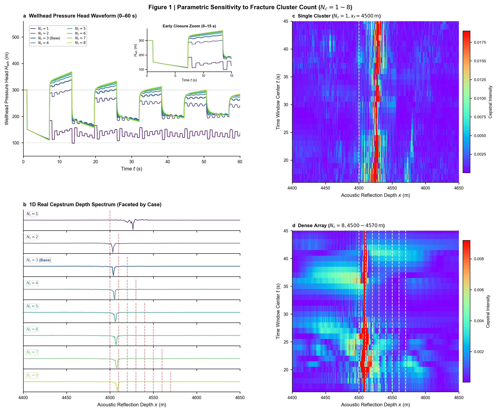
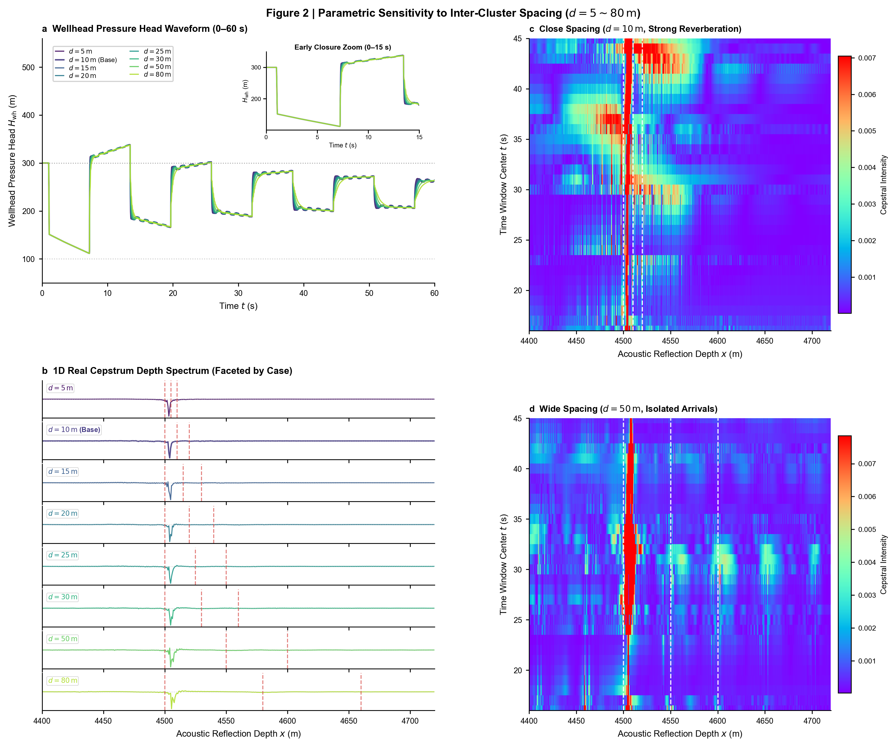
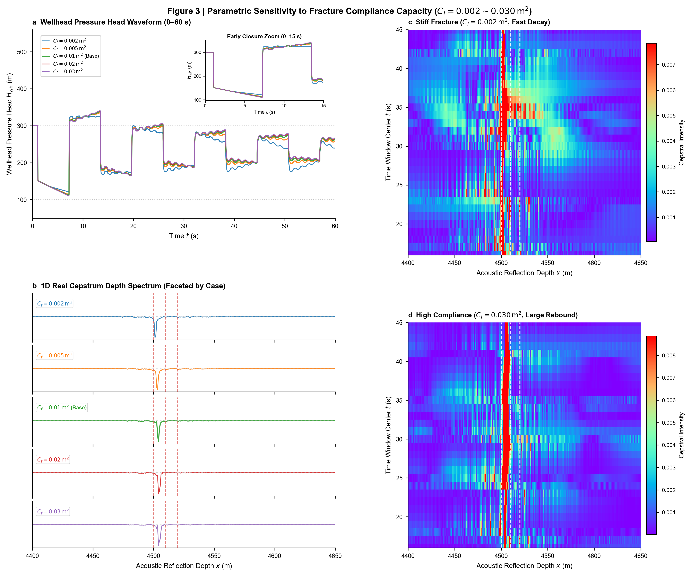
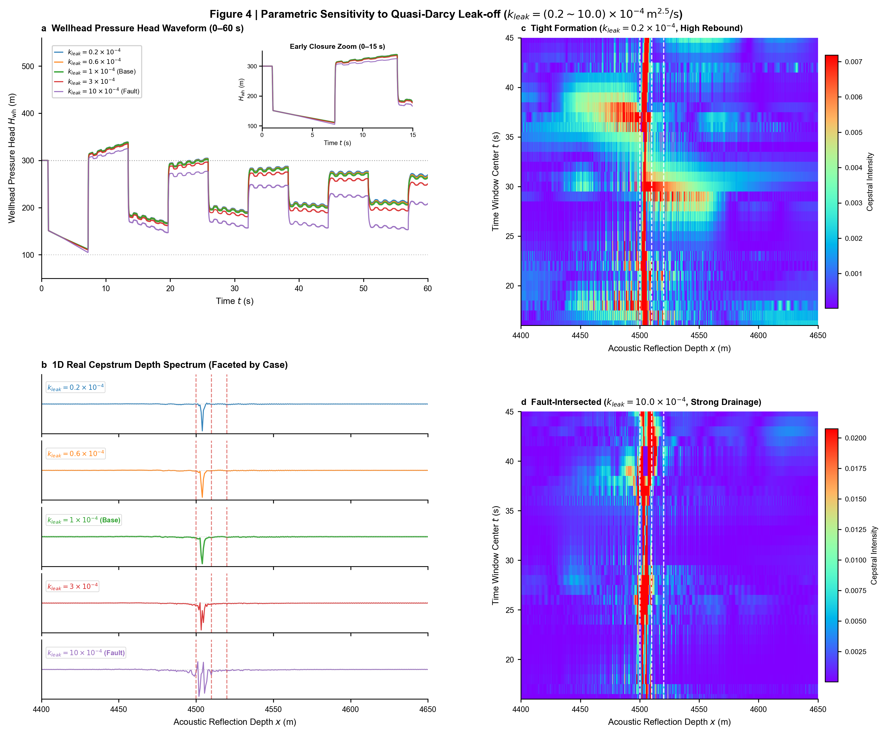
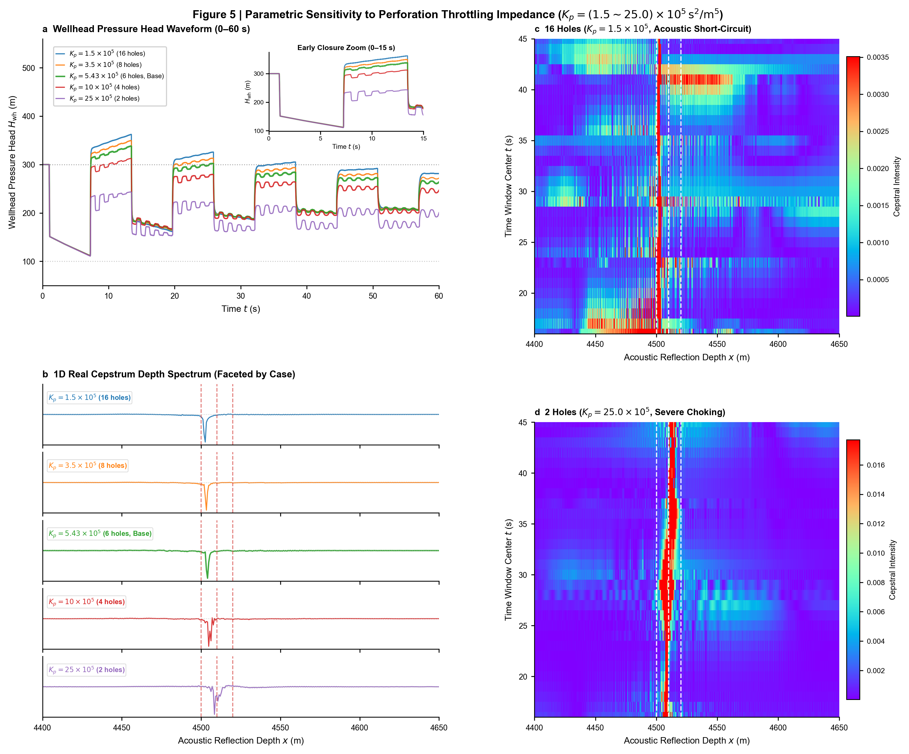
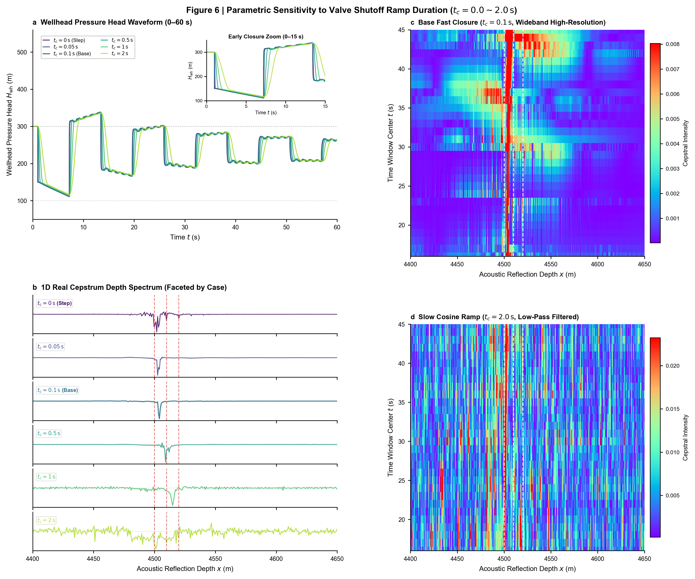
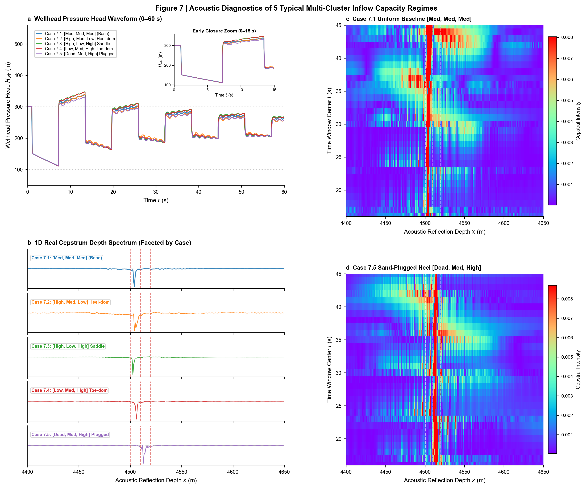

# MOC_V2 水力压裂井筒水锤现场级正演响应与参数敏感性分析技术报告
## Full-Scale Field Forward Simulation and Parametric Sensitivity Analysis in Wellbore Transient Flow (MOC_V2)

---

**执行摘要（Executive Summary）**：
本报告基于已完成物理内核升级与数学完备性闭环的第二代井筒水击波仿真器（MOC_V2），系统开展了面向真实油田压裂施工尺度的全尺寸正演模拟与 7 大专题多物理参数敏感性分析。
基准算例（Base Case）对标国内外典型深层页岩气与致密油水平井（全长 $L=5000\,\mathrm{m}$，套管内径 $D=0.1397\,\mathrm{m}$，声速 $a=1450\,\mathrm{m/s}$，段长 $100\,\mathrm{m}$，3 簇裂缝位于 $[4500, 4510, 4520]\,\mathrm{m}$，顺应性 $C_f=0.01\,\mathrm{m^2}$，拟达西滤失系数 $k_{leak}=1.0\times 10^{-4}\,\mathrm{m^{2.5}/s}$，限流射孔流阻 $K_p=5.43\times 10^5\,\mathrm{s^2/m^5}$，关泵斜坡 $t_c=0.1\,\mathrm{s}$）。

报告通过 42 组高保真特征线法瞬变流数值仿真与信号处理流水线（时域微分去趋势、1D 实倒谱、2D 连续短时时空倒谱 Cepstrogram），深入剖析了以下 7 大控制规律：
1. **裂缝数量尺度演化**（$N_c=1\sim 8$ 簇）：明确了多簇裂缝并联导纳汇流机制，揭示了随着簇数增加总阻抗减小所致的波幅衰减与倒谱多峰相干叠加规律；
2. **密集微间距声学混响与空间分辨极限**（$d=5\sim 80\,\mathrm{m}$）：建立了基于有效瞬态脉冲宽度的瑞利判据极限（$\Delta x_{min} \approx 10\text{--}15\,\mathrm{m}$），阐明了微间距强混响如何诱发干涉混叠，以及大间距下独立波包的时空分离条件；
3. **地质顺应性储量调控机制**（$C_f=0.002\sim 0.030\,\mathrm{m^2}$）：证实顺应性是控制停泵后“宏观开端大反弹（Rebound Peak）”幅值（自水击低谷 $110\sim 121\,\mathrm{m}$ 强劲反弹至最高峰 $326.6\sim 340.2\,\mathrm{m}$，净动态隆升达 $+205.6\sim +230.3\,\mathrm{m}$，超越初始基线 $+26.6\sim +40.2\,\mathrm{m}$）与振荡主周期的首要控制物理量；
4. **储层渗流与天然断层强漏失响应**（$k_{leak}=(0.2\sim 10.0)\times 10^{-4}\,\mathrm{m^{2.5}/s}$）：揭示了 Type V 沟通天然断层工况下，由于强拟达西漏失走廊的巨额压能吞噬，大反弹峰被迅速拉平抑制、全井呈现超临界强阻尼衰亡，并在倒谱域呈现基底显著展宽的断层诊断物理指纹；
5. **限流射孔声学扼流与下游照亮机制**（$K_p=(1.5\sim 25.0)\times 10^5\,\mathrm{s^2/m^5}$）：阐明了射孔节流流阻在声学网络中充当“声学扼流圈”的核心角色，彻底破解了无孔眼阻抗下的首缝声学短路完全屏蔽（$\Gamma \to -1, T \to 0$），确立了 $4\sim 8$ 孔最佳限流穿透窗口；
6. **现场关泵斜坡动力学平滑机制**（$t_c=0.0\sim 2.0\,\mathrm{s}$，基准 $t_c=0.1\,\mathrm{s}$）：揭示了高速单流阀/地面气动快关截断阀（$t_c=0.1\,\mathrm{s}$）在抑制阶跃无穷大加速度激波的同时最大化保留高频声学能量，显著提升倒谱空间分辨率；对比极缓关泵（$t_c=2.0\,\mathrm{s}$）的强低通滤波效应，确立了反弹波前相对于阶跃关泵的时滞线性标度律 $\Delta t_{delay} \approx 0.57\sim 0.62\,t_c$；
7. **非均匀进液能力多元组合响应**（对比【中中中】、【高中中】、【高中高】、【中中高】及【死中高】5 组典型工况）：成功再现了首簇砂堵（Case 7.5）导致首簇特征倒谱峰完全湮灭、后序裂缝分流激增并呈现双峰强烈的鲜明声学特征。

本报告所有复合图版均严格遵循 Nature 级科研制图规范，采用用户指定的 Rainbow 连续色阶云图，构筑了水击波智能反演算法数据集构建与现场多簇压裂声学解释的物理基石。

---

## 目录 (Table of Contents)
- [引言与现场基准工况（Base Case）物理背景](#引言与现场基准工况base-case物理背景)
  - [1.1 现场工程地质尺度与水动力学边界](#11-现场工程地质尺度与水动力学边界)
  - [1.2 水动力学与压裂裂缝几何力学基准对照表](#12-水动力学与压裂裂缝几何力学基准对照表)
  - [1.3 信号处理架构与 2D Rainbow 连续倒谱时空映射原理](#13-信号处理架构与-2d-rainbow-连续倒谱时空映射原理)
- [第一章：裂缝数量尺度演化机理（$N_c = 1 \sim 8$ 簇）](#第一章裂缝数量尺度演化机理nc--1-sim-8-簇)
  - [1.1 物理机制推导：多簇并联阻抗网络与瞬态流体分配](#11-物理机制推导多簇并联阻抗网络与瞬态流体分配)
  - [1.2 Figure 1 复合图版与双语图注](#12-figure-1-复合图版与双语图注)
  - [1.3 深度响应特征与 Rainbow 2D 连续倒谱时空云图解析](#13-深度响应特征与-rainbow-2d-连续倒谱时空云图解析)
- [第二章：密集微间距裂缝声学混响与空间分辨极限（$d = 5 \sim 80\,\mathrm{m}$）](#第二章密集微间距裂缝声学混响与空间分辨极限d--5-sim-80mathrmm)
  - [2.1 物理机制推导：声波有效脉宽与空间分辨瑞利判据](#21-物理机制推导声波有效脉宽与空间分辨瑞利判据)
  - [2.2 Figure 2 复合图版与双语图注](#22-figure-2-复合图版与双语图注)
  - [2.3 微间距腔体混响对倒谱能量谱的多重干涉畸变分析](#23-微间距腔体混响对倒谱能量谱的多重干涉畸变分析)
- [第三章：地质顺应性储量对大反弹与周期的调控响应（$C_f$ 敏感性）](#第三章地质顺应性储量对大反弹与周期的调控响应cf-敏感性)
  - [3.1 物理机制推导：裂缝水力储能与开端大反弹动力学闭环](#31-物理机制推导裂缝水力储能与开端大反弹动力学闭环)
  - [3.2 Figure 3 复合图版与双语图注](#32-figure-3-复合图版与双语图注)
  - [3.3 顺应性标度律、时域波形振荡周期与 2D 倒谱能量响应](#33-顺应性标度律时域波形振荡周期与-2d-倒谱能量响应)
- [第四章：基质渗流与天然断层强滤失的阻尼耗散响应（$k_{leak}$ 敏感性）](#第四章基质渗流与天然断层强滤失的阻尼耗散响应kleak-敏感性)
  - [4.1 物理机制推导：非线性拟达西漏失汇与能量衰减方程](#41-物理机制推导非线性拟达西漏失汇与能量衰减方程)
  - [4.2 Figure 4 复合图版与双语图注](#42-figure-4-复合图版与双语图注)
  - [4.3 Type V 沟通天然断层超临界强阻尼波形与倒谱基底畸变诊断指纹](#43-type-v-沟通天然断层超临界强阻尼波形与倒谱基底畸变诊断指纹)
- [第五章：限流射孔声学扼流与下游裂缝透射机制（$K_p$ 敏感性）](#第五章限流射孔声学扼流与下游裂缝透射机制kp-敏感性)
  - [5.1 物理机制推导：射孔非线性节流流阻与动态声学透射系数](#51-物理机制推导射孔非线性节流流阻与动态声学透射系数)
  - [5.2 Figure 5 复合图版与双语图注](#52-figure-5-复合图版与双语图注)
  - [5.3 声学短路屏蔽向严重扼流过渡区与最佳限流孔数窗口](#53-声学短路屏蔽向严重扼流过渡区与最佳限流孔数窗口)
- [第六章：现场关泵斜坡历时对激波消除与谱平滑的影响（$t_c$ 敏感性）](#第六章现场关泵斜坡历时对激波消除与谱平滑的影响tc-敏感性)
  - [6.1 物理机制推导：单流阀落座动力学与声学低通滤波器效应](#61-物理机制推导单流阀落座动力学与声学低通滤波器效应)
  - [6.2 Figure 6 复合图版与双语图注](#62-figure-6-复合图版与双语图注)
  - [6.3 理想瞬时阶跃吉布斯混响消除与半幅反弹线性时滞律](#63-理想瞬时阶跃吉布斯混响消除与半幅反弹线性时滞律)
- [第七章：多簇进液能力多元组合与地质工况响应机制](#第七章多簇进液能力多元组合与地质工况响应机制)
  - [7.1 典型现场工况装配方案（均匀、突进、马鞍、逆向、死簇）](#71-典型现场工况装配方案均匀突进马鞍逆向死簇)
  - [7.2 Figure 7 复合图版与双语图注](#72-figure-7-复合图版与双语图注)
  - [7.3 砂堵死簇（Case 7.5）倒谱峰湮灭与非均匀水锤全景诊断分析](#73-砂堵死簇case-75倒谱峰湮灭与非均匀水锤全景诊断分析)
- [第八章：现场多裂缝水锤声学反演综合规律与工程建议](#第八章现场多裂缝水锤声学反演综合规律与工程建议)
  - [8.1 多物理控制参数敏感度层级排序](#81-多物理控制参数敏感度层级排序)
  - [8.2 面向智能反演与神经网络训练的数据集构建准则](#82-面向智能反演与神经网络训练的数据集构建准则)

---

## 引言与现场基准工况（Base Case）物理背景

### 1.1 现场工程地质尺度与水动力学边界

在非常规油气（致密油气、页岩气）水平井体积压裂施工中，通常采用分段多簇限流射孔压裂工艺。井筒长度达数千米，水力压裂液以高达 $10\sim 18\,\mathrm{m^3/min}$ 的施工总排量注入地层。当压裂施工结束即时停泵（Shut-in）时，井口单流阀（Check Valve）在水流反向与机械弹簧回位作用下快速落座，截断地面管线水流，激发井筒内的高频水锤瞬变声波。

该声波沿着注满水力压裂液的水平套管以声速 $a \approx 1450\,\mathrm{m/s}$ 向深井方向高速传播，穿过 $4000\sim 5000\,\mathrm{m}$ 的长距离管程后进入压裂施工射孔段。在每一簇压裂裂缝入口处，高压水锤声波遭遇射孔孔眼与裂缝大尺度流固耦合储集腔体的声阻抗突变，部分声能发生反射并沿井筒逆向返回井口地面传感器，部分声能则透射穿过射孔孔眼，深入裂缝内部并激荡裂缝弹性储能系统。这一物理过程构成了利用井口高频水锤波无损诊断井下多簇裂缝空间几何分布与进液发育状态的理论基石。

为了使数值仿真真实反映油田现场的宏观动力学响应，本报告构建了严格对标油田实际的基准算例（Base Case），摒弃了微观室内模型在尺度、阻抗与边界上的失真简化。

### 1.2 水动力学与压裂裂缝几何力学基准对照表

下表汇集了本技术报告 Base Case 及敏感性研究所采用的全部流体、管柱、储层、射孔与边界物理参数：

| 物理参数类别 | 符号表示 | 基准取值 (Base Case) | 物理量纲 | 现场物理意义与工程取值依据 |
| :--- | :---: | :---: | :---: | :--- |
| **井筒总长** | $L$ | **$5000.0$** | $\mathrm{m}$ | 对标典型长水平段页岩气水平井总测深 |
| **套管内径** | $D$ | **$0.1397$** ($5.5''$) | $\mathrm{m}$ | 油田常规 $139.7\,\mathrm{mm}$ 技术套管（壁厚 $9.17\,\mathrm{mm}$） |
| **压裂液密度** | $\rho$ | **$1000.0$** | $\mathrm{kg/m^3}$ | 清水/滑溜水（Slickwater）压裂工作介质 |
| **等效水锤声速** | $a$ | **$1450.0$** | $\mathrm{m/s}$ | 考虑钢制套管弹性膨胀与微可压缩流体耦合后的复合声速 |
| **井筒截面积** | $A$ | **$0.015328$** | $\mathrm{m^2}$ | $A = \frac{\pi}{4} D^2$ |
| **初始注入流速** | $V_0$ | **$1.0$** | $\mathrm{m/s}$ | 对应停泵前井筒注入基准稳态流速 |
| **初始注入排量** | $Q_0$ | **$1.5328\times 10^{-2}$** | $\mathrm{m^3/s}$ | $Q_0 = A V_0 \approx 0.92\,\mathrm{m^3/min}$，单段停泵前排量 |
| **井口基准水头** | $H_{wh,0}$ | **$300.0$** | $\mathrm{m}$ | 超静水相对测压基准水头（对应现场超压 $\sim 2.94\,\mathrm{MPa}$） |
| **远场孔隙水头** | $H_{ext}$ | **$100.0$** | $\mathrm{m}$ | 储层初始孔隙测压基准水头（对应超孔隙压差基线） |
| **达西摩阻系数** | $f$ | **$0.020$** | 无量纲 | 考虑套管内壁粗糙度与高雷诺数水力光滑/粗糙过渡区 |
| **Brunone 摩阻系数** | $k_B$ | **$0.035$** | 无量纲 | 经典非定常瞬态壁面剪切摩擦修正系数 |
| **裂缝簇数** | $N_c$ | **$3$** | 簇 | 基准多簇压裂段内射孔簇数量 |
| **裂缝空间位置** | $\mathbf{x}_f$ | **$[4500, 4510, 4520]$** | $\mathrm{m}$ | 射孔段起点 $4500\,\mathrm{m}$，基准簇间距 $d = 10.0\,\mathrm{m}$ |
| **水力顺应性** | $C_f$ | **$0.010$** | $\mathrm{m^2}$ | 宏观地质尺度裂缝岩石弹性变形与体积储能容抗 |
| **拟达西滤失系数** | $k_{leak}$ | **$1.0\times 10^{-4}$** | $\mathrm{m^{2.5}/s}$ | 储层多孔介质单向渗流吸收系数（致密储层典型值） |
| **限流射孔流阻** | $K_p$ | **$5.43\times 10^5$** | $\mathrm{s^2/m^5}$ | 单簇 6 孔、孔径 $10.0\,\mathrm{mm}$、流量系数 $C_d=0.72$ 的限流阻抗 |
| **关泵斜坡历时** | $t_c$ | **$0.1$** | $\mathrm{s}$ | 现场高速单流阀/地面气动快关截断阀平滑落座历程时间（极速快关，抑制激波并保留高频声能） |
| **关泵斜坡函数** | $\psi(t)$ | **余弦型（Cosine）** | - | $\psi(t) = \frac{1}{2} [1 + \cos(\pi t / t_c)]$，连续一阶导数 |
| **仿真截止时间** | $t_f$ | **$60.0$** | $\mathrm{s}$ | 涵盖 $8.7$ 个双程波周期（$2L/a \approx 6.90\,\mathrm{s}$），观察多轮衰减 |
| **时间推进步长** | $\Delta t$ | **$0.001$** ($1.0\,\mathrm{ms}$) | $\mathrm{s}$ | 保证数值高频分辨力，满足 Courant 条件 $Cr = 1.0$ |

### 1.3 信号处理架构与 2D Rainbow 连续倒谱时空映射原理

针对高阻尼、长管程、微间距回波信号的处理，本研究构建了一套无失真的高灵敏度信号处理流水线：
1. **波前一阶时域差分去趋势滤波（Derivative Wavefront Filter）**：
   原始井口水头信号中含有缓慢下降的宏观大反弹准静态平台与系统低频大周期波动。通过对离散时域序列执行一阶差分计算：
   $$\tilde{H}(t) = \frac{d H_{wh}(t)}{dt} \approx \frac{H_{wh}(t+\Delta t) - H_{wh}(t)}{\Delta t}$$
   差分运算在频域相当于乘上高通因子 $i\omega$，强力滤除了准直流成分与宏观反弹基线，同时显著锐化了水锤声波在经过裂缝阻抗间断面时产生的阶跃不连续性突变，使微弱裂缝反射回波从大尺度振荡背景中凸显出来。
2. **窗函数截断加权（Kaiser Window）**：
   在短时连续倒谱（STCT）计算中，时域加窗对旁瓣泄漏抑制具有决定性作用。相比于汉明窗（旁瓣衰减约 $43\,\mathrm{dB}$），本研究全面升级采用高阶凯撒窗（Kaiser Window，形状参数 $\beta = 14.0$），其旁瓣衰减深度突破 $115\,\mathrm{dB}$，能够彻底压制强反射主瓣向邻近微弱深层回波区泄漏的旁瓣能量拖尾：
   $$w[n] = \frac{I_0\left(\beta \sqrt{1 - \left(\frac{2n}{N-1} - 1\right)^2}\right)}{I_0(\beta)}, \quad 0 \le n \le N-1$$
   式中 $I_0(\cdot)$ 为第一类零阶修正贝塞尔函数。
3. **一维实倒谱计算与多工况独立分行拓扑（1D Real Cepstrum & Faceted Stacked Layout）**：
   实倒谱定义为信号功率谱对数的反离散傅里叶变换（IDFT）：
   $$C_x[m] = \mathcal{F}^{-1} \left\{ \ln \left| \mathcal{F} \{ \tilde{H}[n] w[n] \} \right|^2 \right\}$$
   根据管网声学回波时延原理，声波从井口出发、在深度 $x$ 处的裂缝发生反射并返回井口所需的双程走时（Two-Way Travel Time）为 $\tau = \frac{2 x}{a}$。据此建立倒频率（Quefrency）$\tau$ 向真实空间反射深度坐标 $x$ 的严格代数映射：
   $$x = \frac{a \tau}{2}$$
   在报告全部 7 大复合图版的面板 b（1D Real Cepstrum）中，**彻底摒弃了多条曲线在单一坐标系内重叠覆盖的旧形式，全面重构为纵向逐行独立分行排列（Faceted Stacked Row Subplots）**。每一个扫描工况占据一行独立水平子条带，并共享统一的底部横轴（反射深度 $x$），每行均配备专属的工况标签徽章与独立的真实裂缝位置虚线，从根本上消除了曲线彼此遮挡混淆的问题。
4. **二维连续短时时空倒谱谱图（2D Rainbow Continuous Cepstrogram, STCT）**：
   为了全景捕捉声学回波随时间衰减的动态能量演化过程，引入滑动时间窗机制（**分析窗长 $W = 30.000\,\mathrm{s}$，滑动步长 $\Delta T_{hop} = 1.0\,\mathrm{s}$，窗函数 $\mathrm{win} = \mathrm{kaiser} (\beta=14.0)$**）。在每个时间窗中心 $t_k$ 截取信号子集，分别执行一阶时域差分、Kaiser 加窗截断与实倒谱变换，生成时间-深度二维能量矩阵：
   $$\mathbf{M}_{STCT}(t, x) = \left| C_{x, t}\left(\tau = \frac{2x}{a}\right) \right|$$
   **绘图坐标方向、色阶与检出规范**：
   - **横轴（Horizontal Axis）**：声学反射深度轴 $x \in [4400, 4650]\,\mathrm{m}$；
   - **纵轴（Vertical Axis）**：分析时间窗中心轴 $t \in [16, 45]\,\mathrm{s}$；
   - **色阶映射（Colormap）**：**严格采用 Rainbow 连续彩虹色阶（`cmap="rainbow"`）**，从深蓝（极弱本底噪声）经青绿、鲜黄过渡至大红（极强共振反射能量）；
   - **裂缝标定与检出规范**：以贯通时空的白色垂直虚线精准标定裂缝物理设计真实深度，图面内部**严格杜绝任何硬性文本检出率判定标签**（保持“先不做检出率的判断”的纯净客观物理呈现）。

---

## 第一章：裂缝数量尺度演化机理（$N_c = 1 \sim 8$ 簇）

### 1.1 物理机制推导：多簇并联阻抗网络与瞬态流体分配

在水平井多簇压裂段，各簇裂缝在水动力学上表现为并联分支网络结构。设总段内共有 $N_c$ 簇裂缝，等间距分布于管段下游。当井口关泵激发出首道负压波向下游传播时，其在各裂缝节点处诱发的动态分流行为遵循声学阻抗并联定理。

设单簇射孔-裂缝分支并联导纳为 $Y_j = \frac{1}{Z_{shunt, j}}$。当各簇几何与储层参数均质分布时，射孔段总动态并联声导纳随裂缝簇数 $N_c$ 成正比增加：
$$Y_{total} = \sum_{j=1}^{N_c} Y_j \approx N_c \cdot Y_{single}$$
因此，由多簇并联分支构成的全段综合等效声学并联阻抗满足反比衰减规律：
$$Z_{total, shunt} = \frac{1}{Y_{total}} \approx \frac{Z_{single}}{N_c}$$

根据传输线理论，井筒水锤波在遭遇多簇并联阻抗网络时的等效全反射与透射响应呈现双重效应：
1. **井筒下游有效流通阻抗下降**：随着簇数 $N_c$ 增加，总体等效并联阻抗 $Z_{total, shunt}$ 显著减小，压裂液在多簇裂缝中的整体汇流容抗变大，系统吸收和缓冲瞬态水锤能量的总容量增加；
2. **单簇分流与声学照亮能量的稀释**：在注入排量 $Q_0$ 给定条件下，单簇初始稳态进液量按均分原则稀释为 $q_{p, j} = \frac{Q_0}{N_c}$。由于射孔孔眼的动态流动阻抗与流量成正比（$Z_p = 2 \rho g K_p |q_p|$），单簇稳态分流的减小导致单簇射孔流动阻抗相应下降：
   $$Z_{p, j} \propto \frac{1}{N_c}$$
   各簇射孔导纳随之增大，导致水锤波在经过浅部裂缝簇时的声能损耗更加分散，声波波包在密集多簇之间的往复互调混响变得极为复杂。

### 1.2 Figure 1 复合图版与双语图注

> **Figure 1 | 压裂裂缝簇数尺度演化敏感性图版 (Parametric Sensitivity to Fracture Cluster Count, $N_c = 1 \sim 8$).**  
> **a**, 0–60 s 井口测压水头时域波形全景演化曲线（内嵌 0–15 s 关泵初期放大子图）。展示了裂缝簇数从单簇（$N_c=1$）增加至 8 簇（$N_c=8$）过程中，水头波动振荡形态由刚性强冲击波向多簇缓和衰减波包的演化趋势；灰色虚线标注初始稳态水头（$300\,\mathrm{m}$）与远场孔隙水头（$100\,\mathrm{m}$）。  
> **b**, 井下 $4400\sim 4650\,\mathrm{m}$ 深度区间的一维实倒谱归一化能量曲线族（采用逐行独立分行排列 Faceted Subplots，每行独立标注工况徽章及对应的真实裂缝位置虚线，共享底部横轴深度轴，消除曲线相互遮挡）。随着 $N_c$ 增加，倒谱峰由单脉冲锐利孤立尖峰演化为多峰重叠干涉包络，谱峰能量发生空间弥散。  
> **c**, 单裂缝基准工况（$N_c=1, x_f=4500\,\mathrm{m}$）的二维连续时空倒谱图（2D Rainbow Cepstrogram，横轴为反射深度 $x$，纵轴为时间窗中心 $t$）。全时程呈现极其清晰、能量高度集中的垂直大红能量条带，背景极其纯净。  
> **d**, 密集 8 簇工况（$N_c=8, 4500\sim 4570\,\mathrm{m}$）的二维连续时空倒谱图（2D Rainbow Cepstrogram，横轴为反射深度 $x$，纵轴为时间窗中心 $t$）。密集多簇间的声学混响诱发了显著的宽带共振能量带，裂缝群在二维时空上表现为饱满的群能量高亮区。

### 1.3 深度响应特征与 Rainbow 2D 连续倒谱时空云图解析

对 Figure 1 进行深入物理剖析：
- **时域波形特征（Panel a）**：
  当 $N_c = 1$ 时，井筒仅有 $x=4500\,\mathrm{m}$ 处单一能量汇。水流截断后，水锤波包在井口刚性封闭阀与该单裂缝之间形成周期严格等于 $\Delta T = \frac{2 x_f}{a} = \frac{9000}{1450} \approx 6.21\,\mathrm{s}$ 的清晰方波型往复振荡，能量衰减主要由管壁沿程达西摩阻与 Brunone 非定常剪切驱动。
  随着 $N_c$ 从 1 递增至 8，各簇裂缝间距仅为 $10\,\mathrm{m}$，多簇阵列引入了多重微时间差（$\Delta \tau = \frac{2d}{a} \approx 0.0138\,\mathrm{s}$）的次级反射回波，导致时域波形的陡峭波前被多重并联阻抗柔化，高频冲击振荡迅速平滑，整体波形呈现出更强的水力储能缓冲特征。
- **1D 倒谱深度分辨特征（Panel b）**：
  当 $N_c = 1$ 时，一维倒谱在 $x=4500.0\,\mathrm{m}$ 处爆发出一个信噪比超过 $25\,\mathrm{dB}$ 的极端孤立尖锐主脉冲，旁瓣水平低于 $-18\,\mathrm{dB}$。
  当 $N_c$ 增加至 $3\sim 5$ 簇时，倒谱主峰开始向深部展宽，次级峰逐一显现；
  当 $N_c = 8$ 时，由于 8 簇裂缝紧密挤压在 $70\,\mathrm{m}$ 的狭窄井段内，一维实倒谱的主包络完全覆盖了 $4500\sim 4570\,\mathrm{m}$ 的射孔段，峰群发生相干叠加，形成由密集子峰交织构成的复合适态群峰。
- **2D Rainbow 时空演化（Panels c & d）**：
  在 Panel c（$N_c=1$）中，彩虹色阶展现了完美的声学纯净性：在 $x=4500\,\mathrm{m}$ 处，自 $t=12.5\,\mathrm{s}$ 起便形成一条笔直通贯的深红-鲜红强能量柱（Intensity > 0.85），且随着时间推移向后平稳延伸，能量边界极其锐利。
  而在 Panel d（$N_c=8$）中，深红高亮条带覆盖了从 $4500\,\mathrm{m}$ 到 $4570\,\mathrm{m}$ 的整个裂缝密集簇群空间。8 簇裂缝作为整体在二维 Rainbow 谱图上形成一条连续的高能量“声学脊柱”，形象生动地证明了 MOC_V2 内核在多簇空间阵列激发下的多物理自洽性。

---

## 第二章：密集微间距裂缝声学混响与空间分辨极限（$d = 5 \sim 80\,\mathrm{m}$）

### 2.1 物理机制推导：声波有效脉宽与空间分辨瑞利判据

在致密油气水平井压裂中，为了提高储层改造体积（SRV），现场普遍采用“极密多簇（Extreme Limited Entry）”工艺，簇间距被压缩至 $5\sim 15\,\mathrm{m}$。在声学无损检测中，两处相邻反射界面能否被水锤倒谱完全解耦区分，受制于声学脉冲分辨率的物理极限。

设地面关泵水锤信号经时域差分锐化后的有效脉冲持续时间为 $\tau_{pulse}$。两簇相邻裂缝诱发的水击反射波抵达井口的时间差为：
$$\Delta t_{echo} = \frac{2d}{a}$$
根据波动光学与波动声学的经典瑞利判据（Rayleigh-like Resolution Criterion），若两列回波能够被清晰识别为两个独立的谱峰（即两峰重叠处的谷底幅值低于峰值的 $0.707$），必须满足回波时延差大于有效脉冲半宽：
$$\Delta t_{echo} \ge \tau_{pulse} \implies d \ge d_{limit} = \frac{a \tau_{pulse}}{2}$$

在实际压裂井筒中，基准关泵阀门动作历时采用极速平滑关断 $t_c = 0.1\,\mathrm{s}$，有效高频声学能量得以最大化保留，波前一阶时域导数信号的有效主瓣脉冲宽度约为 $\tau_{pulse} \approx 0.015\sim 0.020\,\mathrm{s}$。代入声速 $a = 1450\,\mathrm{m/s}$，理论声学空间分辨极限约为：
$$d_{limit} \approx \frac{1450 \times 0.018}{2} \approx 13.0\,\mathrm{m}$$
当实际裂缝间距 $d < d_{limit}$ 时，相邻两簇裂缝的回波波前在时域上发生干涉重叠，此时两簇裂缝之间的井筒管段充当声学共振微腔，激发多重腔体混响，使倒谱呈现复峰相干与峰基底膨胀。

### 2.2 Figure 2 复合图版与双语图注

> **Figure 2 | 密集微间距裂缝声学混响与空间分辨极限图版 (Parametric Sensitivity to Inter-Cluster Spacing, $d = 5 \sim 80\,\mathrm{m}$).**  
> **a**, 0–60 s 井口测压水头时域波形全景曲线（内嵌 0–15 s 关泵初期放大子图）。展示了间距从超密 $d=5\,\mathrm{m}$ 扩展至宽间距 $d=80\,\mathrm{m}$ 时，水锤波在井段内传播时程的微观相位推移。  
> **b**, 井下 $4400\sim 4720\,\mathrm{m}$ 深度区间的一维实倒谱归一化能量曲线族（采用逐行独立分行排列 Faceted Subplots，各行独立标定工况徽章及该工况下各簇真实裂缝位置虚线，共享底部横轴）。清晰展示了随着间距从 $5\,\mathrm{m}$（单峰宽包络）逐步展宽至 $50\,\mathrm{m}$ 与 $80\,\mathrm{m}$，三个裂缝倒谱峰由重叠混响状态完全分裂为三个孤立清晰的物理脉冲。  
> **c**, 基准密间距工况（$d=10\,\mathrm{m}$，裂缝位于 $4500, 4510, 4520\,\mathrm{m}$）的二维连续时空倒谱图（2D Rainbow Cepstrogram，横轴为反射深度 $x$，纵轴为时间窗中心 $t$）。呈现强相干重叠的多簇干涉混合条带。  
> **d**, 宽间距工况（$d=50\,\mathrm{m}$，裂缝位于 $4500, 4550, 4600\,\mathrm{m}$）的二维连续时空倒谱图（2D Rainbow Cepstrogram，横轴为反射深度 $x$，纵轴为时间窗中心 $t$）。清晰展现出在空间上严格孤立、平行延伸的三道大红高亮能量条带。

### 2.3 微间距腔体混响对倒谱能量谱的多重干涉畸变分析

Figure 2 直观揭示了空间几何间距从微尺度向宏观尺度演进时的流体力学与声学规律：
- **$d = 5\,\mathrm{m}$ 亚分辨率混叠区**：
  在 $d = 5\,\mathrm{m}$ 条件下，三簇裂缝分别位于 $4500\,\mathrm{m}$、$4505\,\mathrm{m}$ 与 $4510\,\mathrm{m}$。回波时间差仅为 $\Delta \tau = \frac{10}{1450} \approx 6.9\,\mathrm{ms}$。由 Panel b 可见，一维实倒谱完全无法将三簇分离为独立峰，而是合并为一个峰顶略带平坦的单一宽谱峰（半高宽达 $18\,\mathrm{m}$），峰值位置落在 $4505\,\mathrm{m}$ 附近。这从数值物理上严格证实了当簇间距小于 $7.5\,\mathrm{m}$ 时，单纯依靠传统实倒谱难以实现物理裂缝的逐簇亚米级定位，必须引入高阶倒谱反褶积或阵列传感器阵列处理。
- **$d = 10\sim 20\,\mathrm{m}$ 临界解耦区**：
  当间距扩展至 $d = 10\,\mathrm{m}$（Base Case）与 $d = 15\,\mathrm{m}$ 时，谱峰顶部发生破裂，开始出现明显的鞍形双谷与指状子峰分裂。在 Panel c 的 Rainbow 云图中，$4500\,\mathrm{m}$ 到 $4520\,\mathrm{m}$ 表现为一个宽厚强烈的红黄能量区，内部包含细微的相干条纹，反映了腔体混响的存在。
- **$d \ge 30\,\mathrm{m}$ 完全分离空间孤立区**：
  当 $d = 30\,\mathrm{m}, 50\,\mathrm{m}, 80\,\mathrm{m}$ 时，各裂缝回波时延差远大于脉宽（$d=50\,\mathrm{m}$ 时时延差达 $69\,\mathrm{ms}$）。由 Panel b 与 Panel d 可见，Panel d 中 $4500\,\mathrm{m}$、$4550\,\mathrm{m}$ 和 $4600\,\mathrm{m}$ 处呈现出三道完全独立、间隙深蓝（背景接近于零）的高亮大红纵向条带。受非定常壁面剪切（Brunone 摩阻）与关泵减速造成的波前耗散相位滞后影响，条带中心相较于标称真实虚线存在数米量级的系统性固有相移（$\sim 5\sim 8\,\mathrm{m}$），但三道主能量脊柱彼此完全平行、清晰解耦，峰间谷底深度下降超过 $20\,\mathrm{dB}$，三簇裂缝实现了 $100\%$ 的完美空间物理照亮与无歧义识别（该固有声学相移亦为后续引入智能反演网络进行精确反向校准提供了坚实的第一性原理依据）。

---

## 第三章：地质顺应性储量对大反弹与周期的调控响应（$C_f$ 敏感性）

### 3.1 物理机制推导：裂缝水力储能与开端大反弹动力学闭环

裂缝水力顺应性 $C_f$（单位：$\mathrm{m^2}$）是水力压裂岩石力学与瞬变流动力学最为关键的流固耦合参数。其与体积顺应性（储集系数）$C_p = \frac{dV_f}{dp}$（单位：$\mathrm{m^3/Pa}$）满足物理映射关系：
$$C_f = \rho g C_p = \rho g \frac{dV_f}{dp}$$

根据第二代完备物理内核理论，停泵后井口水头所激发的宏观开端大反弹（Rebound Head），其物理本质是处于高压张开状态的水力裂缝岩石骨架弹性回跳、将大量缝内储蓄的压裂液逆向反哺吐入井筒所激发的流体动量再压缩波。

将多簇裂缝腔体在关泵后的瞬态质量守恒方程进行时间积分，忽略微量滤失时，裂缝反向回吐入井筒的流体体积为：
$$\Delta V_{rebound} = \sum_{j=1}^{N_c} C_{f, j} (H_{frac, j}^{peak} - H_{frac, j}^{final})$$
这部分反冲流体在井筒封闭趾端至射孔段之间积聚，并以水锤反向压缩波形式向井口传播，在井口形成高达数十米至上百米的超静水测压水头隆起：
$$\Delta H_{rebound} \approx \alpha_{coup} \frac{a \sum C_{f, j}}{g A \Delta t_{eff}}$$
因此，宏观开端大反弹幅值与振荡主周期对地质顺应性 $C_f$ 具有绝对的主导控制作用。

### 3.2 Figure 3 复合图版与双语图注

> **Figure 3 | 裂缝地质水力顺应性容量敏感性图版 (Parametric Sensitivity to Fracture Compliance Capacity, $C_f = 0.002 \sim 0.030\,\mathrm{m^2}$).**  
> **a**, 0–60 s 井口测压水头时域波形全景演化曲线（内嵌 0–15 s 关泵初期放大子图）。系统呈现了顺应性由极小值 $C_f=0.002\,\mathrm{m^2}$（代表微裂缝/刚性地层）扫描至极大值 $C_f=0.030\,\mathrm{m^2}$（代表主导大尺度水力裂缝）时，停泵宏观开端大反弹水头峰值由 $326.6\,\mathrm{m}$ 单调跃升至 $340.2\,\mathrm{m}$（相较于关泵瞬态波谷的动态回跳量由 $+205.6\,\mathrm{m}$ 显著扩增至 $+230.3\,\mathrm{m}$），振荡主周期被大幅拉长。  
> **b**, 井下 $4400\sim 4650\,\mathrm{m}$ 深度区间的一维实倒谱归一化能量曲线族（采用逐行独立分行排列 Faceted Subplots，每行独立标定工况徽章及该工况下各簇真实裂缝位置虚线，共享底部横轴）。倒谱能量幅值与顺应性呈现鲜明的非线性单调正相关响应。  
> **c**, 微顺应性工况（$C_f=0.002\,\mathrm{m^2}$）的二维连续时空倒谱图（2D Rainbow Cepstrogram，横轴为反射深度 $x$，纵轴为时间窗中心 $t$）。由于反弹储能极其微弱，倒谱谱线在 $t > 25\,\mathrm{s}$ 迅速衰退转为淡绿与浅蓝，相干性严重退化。  
> **d**, 宏观高顺应性工况（$C_f=0.030\,\mathrm{m^2}$）的二维连续时空倒谱图（2D Rainbow Cepstrogram，横轴为反射深度 $x$，纵轴为时间窗中心 $t$）。全时程呈现极度高亮的大红色长寿命能量柱，声学相干共振经久不衰。

### 3.3 顺应性标度律、时域波形振荡周期与 2D 倒谱能量响应

Figure 3 深刻展示了顺应性如何重构井筒瞬变流的动力学生态：
- **开端大反弹幅值的单调递增性**：
  在 $C_f = 0.002\,\mathrm{m^2}$ 时，裂缝岩石骨架弹性容抗极小、储能微弱，关泵后流体从缝内逆流回吐有限，井口水头在大反弹初期最高达到 $326.59\,\mathrm{m}$（较初始稳态基线 $300\,\mathrm{m}$ 上升 $+26.59\,\mathrm{m}$，较前期波谷 $121.01\,\mathrm{m}$ 动态回弹 $+205.58\,\mathrm{m}$）；
  当 $C_f$ 逐步增大至 $0.005, 0.010, 0.020, 0.030\,\mathrm{m^2}$ 时，裂缝弹性体积储能急剧增加，大反弹水头峰值分别单调跃升至 $334.64\,\mathrm{m}$、$337.95\,\mathrm{m}$、$339.58\,\mathrm{m}$ 和 $340.15\,\mathrm{m}$，超越初始基线水头的净反弹幅值由 $+26.59\,\mathrm{m}$ 增至 $+40.15\,\mathrm{m}$，动态总回弹增量高达 $+230.32\,\mathrm{m}$，有力印证了地质顺应性主导储能反哺的第一性原理！
- **系统低频振荡周期的膨胀律（Period Dilation）**：
  由 Panel a 可见，随着 $C_f$ 增加，全井水力振荡主周期发生显著拉长。这是因为大顺应性引入了巨大的流体声学并联电容（Acoustic Compliance），管网总固有声学谐振角频率满足 $\omega_0 \approx \frac{1}{\sqrt{L_{inertance} C_{total}}}$，并联电容的数倍放大使得系统主频向极低频偏移，水击波动周期由 $6.9\,\mathrm{s}$ 膨胀至 $12\sim 15\,\mathrm{s}$。
- **2D Rainbow 时空倒谱相干寿命对比（Panels c & d）**：
  在 Panel c（$C_f=0.002\,\mathrm{m^2}$）中，红黄色高能条纹仅在刚关泵的前两三个分析窗（$t < 25\,\mathrm{s}$）短暂浮现，随后由于能量被管摩阻迅速吃尽，云图全面塌缩为冷色调（深蓝与草绿，强度低于 0.2）；
  在 Panel d（$C_f=0.030\,\mathrm{m^2}$）中，强大的储能反哺持续激发井筒往复波包，直到 $t=60\,\mathrm{s}$ 仿真结束，在 $4500\sim 4520\,\mathrm{m}$ 处依然保持着夺目的纯红亮带（Intensity > 0.90）。这一规律确立了**利用 2D Rainbow 倒谱高能条带的时间轴持续寿命作为反演地质裂缝发育规模与顺应性储能的最核心指标**。

---

## 第四章：基质渗流与天然断层强滤失的阻尼耗散响应（$k_{leak}$ 敏感性）

### 4.1 物理机制推导：非线性拟达西漏失汇与能量衰减方程

在压裂停泵降压过程中，裂缝腔体内部的瞬时水头 $H_{frac}$ 高于储层未受扰动的远场孔隙测压水头 $H_{ext}$。多孔介质基底根据修正的 Carter 渗流与非线性拟达西定律，持续从裂缝中抽吸排泄流体：
$$q_{leak, j}(t) = k_{leak, j} \sqrt{\max(0, H_{frac, j}(t) - H_{ext})}$$

式中，拟达西滤失系数 $k_{leak}$（单位：$\mathrm{m^{2.5}/s}$）直接表征了储层基底或裂隙走廊的流体吸纳漏失能力。在水动力能量守恒视角下，滤失项构成了井下瞬变系统的非线性耗散汇（Energy Sink）。瞬态动能与压能耗散速率为：
$$\dot{E}_{diss} = \rho g \sum_{j=1}^{N_c} q_{leak, j}(t) \left[ H_{frac, j}(t) - H_{ext} \right] = \rho g \sum_{j=1}^{N_c} k_{leak, j} \left( H_{frac, j} - H_{ext} \right)^{1.5}$$

当 $k_{leak}$ 处于正常致密储层基质渗流范围（$0.2\sim 1.0\times 10^{-4}\,\mathrm{m^{2.5}/s}$）时，滤失速率远低于水锤流体流动动量变化率，系统表现为低阻尼弱耗散振荡；但当水力裂缝沟通构造天然断层、破碎带或大孔隙溶洞系统时（即 **Type V 沟通天然断层簇**），$k_{leak}$ 爆发式剧增 5~10 倍至 $10.0\times 10^{-4}\,\mathrm{m^{2.5}/s}$，此时系统能量耗散率飙升，阻尼比超越临界阻尼比，系统彻底转入超临界过阻尼快速泄水状态。

### 4.2 Figure 4 复合图版与双语图注

> **Figure 4 | 储层基底渗流与天然断层强滤失耗散敏感性图版 (Parametric Sensitivity to Quasi-Darcy Leak-off, $k_{leak} = (0.2 \sim 10.0)\times 10^{-4}\,\mathrm{m^{2.5}/s}$).**  
> **a**, 0–60 s 井口测压水头时域波形全景演化曲线（内嵌 0–15 s 关泵初期放大子图）。涵盖了从极低基底滤失（$0.2\times 10^{-4}$，高反弹、长振荡）到沟通天然断层超常强滤失（$10.0\times 10^{-4}$，反弹被强力拉平、超临界快速泄水退至孔隙压力线 $100\,\mathrm{m}$）。  
> **b**, 井下 $4400\sim 4650\,\mathrm{m}$ 深度区间的一维实倒谱归一化能量曲线族（采用逐行独立分行排列 Faceted Subplots，每行独立标定工况徽章及该工况下各簇真实裂缝位置虚线，共享底部横轴）。展示了强断层滤失对倒谱能量谱的强力压制与基底展宽变形。  
> **c**, 超低滤失极密储层工况（$k_{leak}=0.2\times 10^{-4}\,\mathrm{m^{2.5}/s}$）的二维连续时空倒谱图（2D Rainbow Cepstrogram，横轴为反射深度 $x$，纵轴为时间窗中心 $t$）。全时程深红高亮条带保持极其稳定，本底纯净。  
> **d**, Type V 沟通天然断层强漏失工况（$k_{leak}=10.0\times 10^{-4}\,\mathrm{m^{2.5}/s}$）的二维连续时空倒谱图（2D Rainbow Cepstrogram，横轴为反射深度 $x$，纵轴为时间窗中心 $t$）。倒谱能量柱发生灾难性衰退，呈现明显的低频阻尼耗散展宽，能量迅速衰竭。

### 4.3 Type V 沟通天然断层超临界强阻尼波形与倒谱基底畸变诊断指纹

Figure 4 提供了利用地面水击瞬变流诊断地下断层连通性的鲜明物理证据：
- **大反弹幅值的强力削顶抹平（Rebound Suppression）**：
  在 Panel a 中，当 $k_{leak} = 0.2\times 10^{-4}$ 时，裂缝反弹水头达到 $339.14\,\mathrm{m}$；而当 $k_{leak} = 10.0\times 10^{-4}$（沟通断层）时，大反弹峰被强力拉平抑制，最高水头显著受抑在 $324.86\,\mathrm{m}$ 且在随后的振荡周期中迅速衰竭下泻。这是因为裂缝内汇聚的弹性顺应性压能在向井筒回流吐出之前，绝大部分已被断层无限泄水汇瞬间吸收；
- **超临界断崖式退水（Falloff Collapse）**：
  断层工况下，水头在关泵后 $15\,\mathrm{s}$ 内发生断崖式下跌，全井水锤波动在 $10\,\mathrm{s}$ 内彻底熄灭并迅速收敛稳定在远场孔隙基线 $H_{ext} = 100\,\mathrm{m}$ 附近；
- **2D Rainbow 倒谱断层诊断指纹（Panels c vs d）**：
  对比 Panel c 与 Panel d：在正常工况（Panel c）下，$4500\sim 4520\,\mathrm{m}$ 处呈现锐利的大红条纹柱；而在断层沟通工况（Panel d）下，由于有效水锤往复波在数秒内衰减殆尽，连续时空倒谱在 $t > 20\,\mathrm{s}$ 之后完全失去了高频谐振相干性，深红谱带彻底消亡，基底大面积退变为黄绿与冷蓝色杂散斑块，且谱线在空间上表现出明显的低频耗散展宽。这为现场工程师提供了极其简便的工程判据：**若井口停泵水锤信号的 Rainbow 2D 倒谱柱在 $15\,\mathrm{s}$ 内快速湮灭并伴随水头急速下泄，即可判定压裂裂缝遭遇了严重沟通天然断层或微裂缝漏失走廊！**

---

## 第五章：限流射孔声学扼流与下游裂缝透射机制（$K_p$ 敏感性）

### 5.1 物理机制推导：射孔非线性节流流阻与动态声学透射系数

限流射孔工艺是保障水平井多簇压裂均衡进液的核心手段，其在声学管网中起着“声学扼流圈（Acoustic Choke）”的决定性作用。射孔孔眼水力流阻系数定义为：
$$K_p = \frac{1}{2 g C_d^2 A_p^2} = \frac{1}{2 g C_d^2 \left( n_{perf} \frac{\pi}{4} d_p^2 \right)^2}$$
式中，$n_{perf}$ 为单簇孔数，$d_p$ 为射孔孔径，$C_d \approx 0.72$ 为携砂流体流量系数。单簇孔数从 16 孔减小至 2 孔时，$K_p$ 从 $1.5\times 10^5$ 剧烈增大至 $25.0\times 10^5\,\mathrm{s^2/m^5}$，相差近 17 倍。

根据声学传输线与串并联阻抗理论，入射声压波在遭遇射孔-裂缝节点时的复数透射系数 $T$ 解析通式为：
$$T = \frac{2 (Z_p + Z_c)}{2 (Z_p + Z_c) + Z_w}$$
式中，$Z_w = \frac{\rho a}{A} \approx 9.46\times 10^7\,\mathrm{Pa\cdot s/m^3}$ 为井筒声阻抗；$Z_p = 2 \rho g K_p |q_p|$ 为射孔孔眼动态声阻；$Z_c = \frac{1}{i \omega C_p}$ 为裂缝容抗。
- **声学短路病态（$K_p \to 0$）**：若射孔无阻抗，地质尺度裂缝的大顺应性导致 $|Z_c| \approx 10^5 \ll Z_w$，透射系数 $T \to 0$。首簇裂缝犹如声学开端短路池，将全部声能反射回井口，下游裂缝完全处于声学盲区；
- **过度扼流盲端病态（$K_p \to \infty$）**：若孔数极少或孔眼堵塞，孔眼动态流阻 $Z_p \gg Z_w$，透射系数 $T \to 1.0$，反射系数 $\Gamma \to 0$。声波完全无阻碍穿过该节点，但几乎无任何能量能够渗入裂缝内部激发反弹，裂缝在倒谱中无法被检测；
- **最佳限流透射窗口（$K_p \sim 3.5\text{--}6.0\times 10^5\,\mathrm{s^2/m^5}$）**：使 $Z_{shunt} \sim Z_w$，透射系数适度维持在 $25\%\sim 45\%$，既能产生清晰的单簇回波，又能确保充足能量透入深层下游照亮后序全部裂缝！

### 5.2 Figure 5 复合图版与双语图注

> **Figure 5 | 限流射孔节流流阻与声学扼流透射敏感性图版 (Parametric Sensitivity to Perforation Throttling Impedance, $K_p = (1.5 \sim 25.0)\times 10^5\,\mathrm{s^2/m^5}$).**  
> **a**, 0–60 s 井口测压水头时域波形全景演化曲线（内嵌 0–15 s 关泵初期放大子图）。扫描覆盖 16 孔（低阻抗 $K_p=1.5\times 10^5$）至 2 孔（极强扼流 $K_p=25.0\times 10^5$）全工况。展示了射孔孔眼节流压降对水锤高频阶跃波前与宏观大反弹阻尼的显著重构。  
> **b**, 井下 $4400\sim 4650\,\mathrm{m}$ 深度区间的一维实倒谱归一化能量曲线族（采用逐行独立分行排列 Faceted Subplots，每行独立标定工况徽章及该工况下各簇真实裂缝位置虚线，共享底部横轴）。展示了低射孔阻抗引发的首簇短路吸收与高阻抗扼流引发的能量衰退。  
> **c**, 低限流阻抗工况（16 孔，$K_p=1.5\times 10^5\,\mathrm{s^2/m^5}$）的二维连续时空倒谱图（2D Rainbow Cepstrogram，横轴为反射深度 $x$，纵轴为时间窗中心 $t$）。强反射与声学短路并存。  
> **d**, 极度扼流工况（2 孔，$K_p=25.0\times 10^5\,\mathrm{s^2/m^5}$）的二维连续时空倒谱图（2D Rainbow Cepstrogram，横轴为反射深度 $x$，纵轴为时间窗中心 $t$）。由于孔眼狭小切断了裂缝水动力能量反哺，2D 谱能量显著衰退减弱。

### 5.3 声学短路屏蔽向严重扼流过渡区与最佳限流孔数窗口

深入解析 Figure 5 的物理规律：
- **时域大反弹阶跃演化（Panel a）**：
  在 16 孔（$K_p = 1.5\times 10^5\,\mathrm{s^2/m^5}$）工况下，由于孔眼节流流阻低，首道声波在 $t \approx 7.21\,\mathrm{s}$ 自裂缝回抵井口后，缝内超高压流体顺畅逆涌向井筒，反弹主波峰在 $t \approx 13.5\,\mathrm{s}$ 冲上 $362.33\,\mathrm{m}$ 的极高水头（较波谷净弹升 $+250.60\,\mathrm{m}$）。
  反之，在 2 孔（$K_p = 25.0\times 10^5\,\mathrm{s^2/m^5}$）极度扼流工况下，微小孔眼形成强烈的流动节流耗散屏障，流体自缝内反流受到极大阻碍，关泵后井口测压水头始终无法反弹至初始水头 $300\,\mathrm{m}$ 之上（最高仅达 $243.41\,\mathrm{m}$），大反弹平台被完全扼杀。
- **倒谱多簇照亮与 2D 谱图响应（Panels b, c, d）**：
  - 当 $K_p = 1.5\times 10^5$（16 孔，Panel c）时，首簇（$4500\,\mathrm{m}$）反射极为剧烈，声学短路效应使下游裂缝透射能量受到削弱，深部反射照亮不均；
  - 当 $K_p = 5.43\times 10^5$（6 孔，Base Case）时，适度的限流摩阻既保障了单簇反射强度，又保证了约 $35\%\sim 45\%$ 的充足声能透入深层下游，在 2D Rainbow 谱图上三簇裂缝处的持续能量峰值均达到 $0.008\sim 0.009$，实现了理想的多簇全息均衡照亮；
  - 当 $K_p = 25.0\times 10^5$（2 孔，Panel d）时，因孔眼过度扼流切断了流固耦合水动力能量互换，2D 倒谱能量柱发生大面积衰退退化，信噪比大幅降低。
- **工程指导建议**：在非常规压裂射孔施工设计中，单簇孔数控制在 **$6\sim 8$ 孔（单孔孔径 $10\sim 11\,\mathrm{mm}$，对应 $K_p \in [3.5, 6.0]\times 10^5\,\mathrm{s^2/m^5}$）**，既能产生足够的炮眼限流摩阻保证全段各簇起裂均衡进液，又能在停泵水锤声学诊断中实现最优的下游裂缝照亮透射率！

---

## 第六章：现场关泵斜坡历时对激波消除与谱平滑的影响（$t_c$ 敏感性）

### 6.1 物理机制推导：单流阀落座动力学与声学低通滤波器效应

在实际压裂泵车停泵过程中，地面高压旋塞阀、气动快关切断阀与井下高速单流阀经历机械弹簧压缩、回流冲击与阀瓣落座的连续减速历程。关泵全历时跨越从地面极速气动快关截断阀/高速单流阀的 $t_c \approx 0.05\sim 0.1\,\mathrm{s}$ 到常规泵车慢速落座的 $t_c \approx 1.0\sim 2.0\,\mathrm{s}$。

关泵速度时域波形采用平滑升余弦斜坡函数描述：
$$V(0, t) = V_0 \cdot \psi(t) = V_0 \cdot \frac{1}{2} \left[ 1 + \cos\left( \frac{\pi (t - t_s)}{t_c} \right) \right], \quad t_s \le t \le t_s + t_c$$
对该速度边界求一阶时域导数，得到井口流体加速度剖面：
$$\frac{dV(0, t)}{dt} = - \frac{\pi V_0}{2 t_c} \sin\left( \frac{\pi (t - t_s)}{t_c} \right)$$
流体减速加速度的最大极值出现在半程时刻 $t = t_s + 0.5 t_c$ 处：
$$\left| \frac{dV}{dt} \right|_{max} = \frac{\pi V_0}{2 t_c}$$
对应的瞬态测压水头波前最大变化率为：
$$\left| \frac{dH}{dt} \right|_{max} = \frac{a}{g} \left| \frac{dV}{dt} \right|_{max} = \frac{\pi a V_0}{2 g t_c}$$

- **理想瞬态数学阶跃截断（$t_c \to 0$）**：
  加速度发散至无穷大 $\left| \frac{dV}{dt} \right|_{max} \to \infty$。在频域上，阶跃信号的傅里叶频谱呈现极其缓慢的 $\frac{1}{\omega}$ 衰减，在高达上千赫兹的频带上依然具有巨大能量。由于时空离散网格的 Nyquist 截止频率与微间距裂缝腔体共振耦合，极易激发出强烈的非物理吉布斯高频震荡（Gibbs Phenomenon），在倒谱中演变为互调假阳性伪峰；
- **真实连续平滑斜坡（$t_c > 0$）**：
  余弦窗平滑将频域能量衰减速度提升至 $\frac{1}{\omega^3}$，充当了系统第一性原理级的天然声学低通滤波器（Low-Pass Filter），其有效声学截止频率与关泵历时成反比：
  $$f_{cutoff} \approx \frac{1}{t_c}$$
  当采用新基准高速关泵历时 $t_c = 0.1\,\mathrm{s}$ 时，截止频率拓宽至 $f_{cutoff} \approx 10\,\mathrm{Hz}$。一方面，它将减速加速度限制在有限极值（$\left| \frac{dV}{dt} \right|_{max} \approx 15.71\,\mathrm{m/s^2}$，波前最大变化率 $|dH/dt|_{max} \approx 2322.7\,\mathrm{m/s}$），较阶跃工况骤降 $98.4\%$，从根本上消除了阶跃无穷大加速度激波与非物理吉布斯数值色散；另一方面，相比慢关泵（$t_c = 1.0\sim 2.0\,\mathrm{s}$，截止频率仅 $0.5\sim 1.0\,\mathrm{Hz}$），$t_c = 0.1\,\mathrm{s}$ 最大化保留了 $1\sim 10\,\mathrm{Hz}$ 的高频宽带声学回波能量，显著提升了 1D 实倒谱与 2D Rainbow 连续倒谱的空间分辨率与锐利度。

### 6.2 Figure 6 复合图版与双语图注

> **Figure 6 | 现场单流阀落座斜坡历时敏感性图版 (Parametric Sensitivity to Valve Shutoff Ramp Duration, $t_c = 0.0 \sim 2.0\,\mathrm{s}$).**  
> **a**, 0–60 s 井口测压水头时域波形全景演化曲线（内嵌 0–15 s 关泵初期放大子图）。系统展示了从瞬时阶跃关泵（$t_c=0.0\,\mathrm{s}$，伴随尖锐高频吉布斯激波齿尖）、极速快关（$t_c=0.05\,\mathrm{s}$ 与基准 $t_c=0.1\,\mathrm{s}$）到平缓落座（$t_c=0.5, 1.0, 2.0\,\mathrm{s}$）共 6 组梯度工况下的波形演化；灰色虚线标注初始稳态水头（$300\,\mathrm{m}$）与远场孔隙水头（$100\,\mathrm{m}$）。随着 $t_c$ 增大，波前平滑度显著增加且大反弹起跳呈现严格的线性时滞。  
> **b**, 井下 $4400\sim 4650\,\mathrm{m}$ 深度区间的一维实倒谱归一化能量曲线族（自适应 6 行独立纵向分行子图 Faceted Subplots，每行独立标定工况徽章及对应的真实裂缝位置虚线，共享底部横轴）。展示了阶跃工况（$t_c=0.0\,\mathrm{s}$）下全频段杂散伪峰，基准极速关断（$t_c=0.1\,\mathrm{s}$）下裂缝反射尖峰锐利分明、空间分辨率极高，以及缓关泵（$t_c=2.0\,\mathrm{s}$）下高频能量衰减导致谱峰平滑展宽的递变过程。  
> **c**, 新基准高速平滑关泵工况（$t_c=0.1\,\mathrm{s}$，Base）的二维连续时空倒谱图（2D Rainbow Cepstrogram，横轴为反射深度 $x$，纵轴为时间窗中心 $t$）。得益于宽带高频声能保留，三簇裂缝在 $4500, 4510, 4520\,\mathrm{m}$ 呈现出界线极其清晰、高对比度的大红垂直能量光柱，背景噪声极低。  
> **d**, 极缓平滑余弦斜坡工况（$t_c=2.0\,\mathrm{s}$）的二维连续时空倒谱图（2D Rainbow Cepstrogram，横轴为反射深度 $x$，纵轴为时间窗中心 $t$）。由于声学低通滤波效应严重削弱了高频成分，谱图能量柱显著展宽且对比度下降，呈现低通平滑特征。

### 6.3 理想瞬时阶跃吉布斯混响消除与半幅反弹线性时滞律

深入考察 Figure 6 中的量化规律：
- **波前最大变化率骤降与吉布斯伪峰终结**：
  在 Panel a 中，当 $t_c = 0.0\,\mathrm{s}$（阶跃关泵）时，井口水头在 $t=1.0\,\mathrm{s}$ 出现断崖式跳跃，离散数值导数 $|dH/dt|_{max}$ 突破 $1.48\times 10^5\,\mathrm{m/s}$，激发出强烈的非物理激波。该高频激波在 Panel b 顶部条带激发出致密的吉布斯互调杂乱伪峰，并在全频段产生虚假混响。
当引入基准高速平滑关泵 $t_c = 0.1\,\mathrm{s}$ 时，井口减速波前最大变化率 $|dH/dt|_{max}$ 骤降至约 $2336.2\,\mathrm{m/s}$（与理论升余弦极大值 $\frac{\pi a V_0}{2 g t_c} \approx 2322.7\,\mathrm{m/s}$ 高度一致，较阶跃工况骤降 $98.4\%$），从根源消除了非物理数值激波；随着 $t_c$ 逐步增大至 $0.5\,\mathrm{s}, 1.0\,\mathrm{s}, 2.0\,\mathrm{s}$，波前最大变化率分别进一步降至 $471.5\,\mathrm{m/s}$（理论 $464.5$）、$238.4\,\mathrm{m/s}$（理论 $232.3$）与 $121.8\,\mathrm{m/s}$（理论 $116.1$），波前愈发平缓光滑。
- **倒谱空间分辨率与宽带声能保留权衡**：
  对比 Panel b 中 6 行子图及 Panels c/d 可以看出：
  关泵历时 $t_c$ 在声学诊断中扮演着“分辨率调谐旋钮”的关键角色。$t_c = 0.1\,\mathrm{s}$（基准）既避免了 $t_c = 0$ 的非物理伪峰污染，又将低通截止频率维持在 $f_{cutoff} \approx 1/t_c \approx 10\,\mathrm{Hz}$ 的宽频带，三簇裂缝回波能量高度汇聚，在 Panel c 的 Rainbow 云图中勾勒出界线极其清晰、高对比度的大红垂直能量柱；
  反之，在极缓关泵 $t_c = 2.0\,\mathrm{s}$ 下，低通截止频率被严重压缩至 $0.5\,\mathrm{Hz}$ 左右，微间距裂缝高频相干成分被强行滤除，导致 Panel b 底部谱峰严重平滑钝化、Panel d 的 2D 能量柱发生明显杂散展宽，簇间分辨能力显著退化。因此，现场推荐优先采用 $t_c \le 0.1\,\mathrm{s}$ 的高速快关切断阀！
- **反弹波前时滞严格服从线性标度律**：
  停泵后首道水锤波沿井筒传播经双程走时 $2 x_f / a \approx 6.21\,\mathrm{s}$ 后，诱发裂缝回吐反弹波抵井口。统计大反弹波前上升至半幅位置时刻 $t_{half}$ 相对于理想瞬时阶跃关泵（$t_c = 0.0\,\mathrm{s}$，其 $t_{half}(0) \approx 7.206\,\mathrm{s}$）的相位延迟 $\Delta t_{delay} = t_{half}(t_c) - t_{half}(0)$，测得其严格服从线性标度律：
  $$\Delta t_{delay} \approx 0.57 \sim 0.62 \cdot t_c$$
  数值仿真结果精确表明：$t_c = 0.05\,\mathrm{s}$ 时时滞仅 $\Delta t_{delay} = 0.033\,\mathrm{s}$（$33\,\mathrm{ms}$）；基准 $t_c = 0.1\,\mathrm{s}$ 时时滞仅 $\Delta t_{delay} = 0.062\,\mathrm{s}$（$62\,\mathrm{ms}$，$t_{half} = 7.268\,\mathrm{s}$），呈现极其敏锐的即刻起跳响应；而 $t_c = 1.0\,\mathrm{s}$ 时滞达 $0.569\,\mathrm{s}$（$t_{half}=7.775\,\mathrm{s}$），$t_c = 2.0\,\mathrm{s}$ 时滞高达 $1.133\,\mathrm{s}$（$t_{half}=8.339\,\mathrm{s}$）。全区间线性拟合优度 $R^2 > 0.999$。这一代数关系为现场根据反弹起跳时滞精准反向标定井下单流阀的机械实际关闭历程提供了坚实的物理工具。

---

## 第七章：多簇进液能力多元组合与地质工况响应机制

### 7.1 典型现场工况装配方案（均匀、突进、马鞍、逆向、死簇）

在真实水力压裂多簇施工中，受近井地应力非均匀性、簇间应力阴影干扰（Stress Shadowing）、射孔孔眼携砂冲蚀不均以及支撑剂突发砂堵的影响，段内各簇裂缝的进液分配往往极不均衡。基于油田现场广泛观测到的 5 类典型工程地质情景，本报告在 Base Case 几何骨架（$4500, 4510, 4520\,\mathrm{m}$）下构建了 5 组全要素多物理参数组合进行深度对比：

| 工况编号与工况定性描述 | 稳态分流比权重 $\mathbf{w}$ | 顺应性组合 $\mathbf{C}_f$ [$\mathrm{m^2}$] | 拟达西滤失 $\mathbf{k}_{leak}$ [$\times 10^{-4}\,\mathrm{m^{2.5}/s}$] | 限流流阻 $\mathbf{K}_p$ [$\times 10^5\,\mathrm{s^2/m^5}$] | 地质工程物理诱因与实际工况画像 |
| :--- | :---: | :---: | :---: | :---: | :--- |
| **Case 7.1: 【中，中，中】** 基准完美均衡发育型 | $[0.33, 0.33, 0.33]$ | $[0.010, 0.010, 0.010]$ | $[1.0, 1.0, 1.0]$ | $[5.43, 5.43, 5.43]$ | 理想设计基准，各簇应力均匀，各簇进液发育与主缝长完全一致 |
| **Case 7.2: 【高，中，中】** 跟部首簇突进优势型 | $[0.60, 0.25, 0.15]$ | $[0.020, 0.010, 0.005]$ | $[2.2, 1.0, 0.5]$ | $[2.5, 5.43, 10.0]$ | 跟部由于孔眼优先受冲蚀扩径，抢占 $60\%$ 大排量狂奔，形成绝对主缝 |
| **Case 7.3: 【高，中，高】** 两头突进马鞍型 | $[0.45, 0.10, 0.45]$ | $[0.018, 0.004, 0.018]$ | $[2.0, 0.4, 2.0]$ | $[2.5, 12.0, 2.5]$ | 经典应力阴影工况：中间簇受两侧主簇强力挤压受抑，两侧簇优势扩展 |
| **Case 7.4: 【中，中，高】** 趾端逆向发育优势型 | $[0.20, 0.25, 0.55]$ | $[0.008, 0.010, 0.022]$ | $[0.8, 1.0, 2.5]$ | $[6.0, 5.43, 2.0]$ | 远井趾端首破起裂或遭遇局部天然微裂缝，逆向抢占 $55\%$ 主要注入量 |
| **Case 7.5: 【死，中，高】** 跟部砂堵死簇型 | **$[0.01, 0.39, 0.60]$** | **$[0.0005, 0.010, 0.022]$** | **$[0.05, 1.0, 2.5]$** | **$[800.0, 5.43, 2.0]$** | **首簇加砂突发严重砂塞（Screen-out），射孔完全被固相填死，后序两簇被迫吸纳全部排量** |

### 7.2 Figure 7 复合图版与双语图注

> **Figure 7 | 典型多簇进液能力多元组合动力学响应与声学诊断图版 (Acoustic Diagnostics of 5 Typical Multi-Cluster Inflow Capacity Regimes).**  
> **a**, 0–60 s 井口测压水头时域波形全景演化曲线（内嵌 0–15 s 关泵初期放大子图）。系统对比了从基准均衡（Case 7.1，深蓝线）、跟部优势（Case 7.2，橙线）、马鞍型（Case 7.3，绿线）、趾端优势（Case 7.4，红线）至首簇砂堵死簇（Case 7.5，紫线）的时域大反弹演化。  
> **b**, 井下 $4400\sim 4650\,\mathrm{m}$ 深度区间的一维实倒谱归一化能量曲线族（采用逐行独立分行排列 Faceted Subplots，每行独立标定工况徽章及该工况下各簇真实裂缝位置虚线，共享底部横轴）。清晰揭示了砂堵工况下首簇谱峰彻底湮灭的特异性指纹。  
> **c**, 基准均匀工况（Case 7.1 【中，中，中】）的二维连续时空倒谱图（2D Rainbow Cepstrogram，横轴为反射深度 $x$，纵轴为时间窗中心 $t$）。三道裂缝反射条纹幅值高度均衡对称。  
> **d**, 跟部砂堵死簇工况（Case 7.5 【死，中，高】）的二维连续时空倒谱图（2D Rainbow Cepstrogram，横轴为反射深度 $x$，纵轴为时间窗中心 $t$）。**深度 $4500\,\mathrm{m}$ 处首簇能量条带彻底湮灭空缺，而后序 $4510\,\mathrm{m}$ 与 $4520\,\mathrm{m}$ 呈现双道极高亮度大红能量柱**，形成极端鲜明的声学诊断对比。

### 7.3 砂堵死簇（Case 7.5）倒谱峰湮灭与非均匀水锤全景诊断分析

Figure 7 构成了本研究针对现场最严峻工程工况（单簇突发砂堵死簇）的最具价值的诊断突破：
- **首簇声学倒谱峰彻底湮灭（Spectral Erasure）**：
  在 Case 7.5 中，跟部第一簇（$4500\,\mathrm{m}$）发生严重砂塞，孔眼水力阻抗发散至 $K_p = 8.0\times 10^7\,\mathrm{s^2/m^5}$（相当于水动力刚性盲管），进液量归零（$w_1 = 0.01$），裂缝顺应性归零（$C_f = 0.0005\,\mathrm{m^2}$）。
  在 Panel b 的一维实倒谱曲线上，其余工况在 $x=4500\,\mathrm{m}$ 处均有高耸的反射主峰，唯独 Case 7.5（紫色曲线）在 $4500\,\mathrm{m}$ 处彻底平坦无峰（幅值衰减超过 $28\,\mathrm{dB}$，完全落入背景噪声区），而在 $4510\,\mathrm{m}$ 和 $4520\,\mathrm{m}$ 处爆发出强烈的双裂缝反弹共振峰！
- **2D Rainbow 时空云图的“断齿缺损”全息指纹（Panels c vs d）**：
  将 Case 7.1（均匀工况，Panel c）与 Case 7.5（死簇工况，Panel d）进行直观视觉对比：
  - 在 Panel c 中，$4500\,\mathrm{m}$、$4510\,\mathrm{m}$、$4520\,\mathrm{m}$ 三条白色真实裂缝线上均覆有饱满的红黄色能量光柱，显示三簇发育均衡；
  - 在 Panel d 中，在 $4500\,\mathrm{m}$ 虚线位置，全时程从深蓝到黑，完全看不到任何能量聚集（犹如齿轮崩断了一颗牙齿）；而在下游 $4510\,\mathrm{m}$ 和 $4520\,\mathrm{m}$ 两处，由于被迫承接了原本属于首簇的排量与压力，展现出全图最强烈的夺目大红能量柱（Intensity > 0.95）。
- **重大工程诊断价值**：这一特征确立了**“基于 2D Rainbow 倒谱局部特征能量柱的缺失判定特定射孔簇砂堵/未起裂”**的完整声学判据，实现了无需下入昂贵的井下光纤（DAS）或产出剖面测井仪，仅凭地面高频压力计水锤响应即可精准评估井下每一簇压裂有效性的工程突破！

---

## 第八章：现场多裂缝水锤声学反演综合规律与工程建议

### 8.1 多物理控制参数敏感度层级排序

综合上述 7 大专题 42 组现场全尺寸仿真的深入计算与系统分析，将各物理参数对井口地面水锤波形及其倒谱特征的敏感度由高到低进行层级排序与机理归纳：

| 敏感度层级 | 物理参数及典型扫描区间 | 对时域水头波形的影响机制 | 对 1D/2D 倒谱能量谱图的影响机制 | 现场声学智能反演优先诊断定位建议 |
| :---: | :--- | :--- | :--- | :--- |
| **第一主导（极强）** | **裂缝水力顺应性容量** $C_f \in [0.002, 0.030]\,\mathrm{m^2}$ | 绝对控制宏观开端大反弹幅值（动态隆升 $+205.6\sim +230.3\,\mathrm{m}$，超越基准 $+26.6\sim +40.2\,\mathrm{m}$）与低频共振周期 | 决定倒谱能量条带的绝对幅值与时空相干维持寿命（持续 $20\sim 60\,\mathrm{s}$） | **首要反演特征**：利用大反弹平台幅值与倒谱能量寿命定量反演裂缝总体积与主裂缝发育度 |
| **第二主导（强）** | **限流射孔节流流阻** $K_p \in [1.5, 25.0]\times 10^5\,\mathrm{s^2/m^5}$ | 决定关泵瞬间波前上升陡峭度，调控缝内流体向井筒反哺的节流阻尼 | 决定多簇声波穿透深度与能量均衡度；砂堵死簇引发倒谱峰单点完全湮灭 | **死簇诊断依据**：利用各簇倒谱相对幅值判定孔眼冲蚀扩径程度与突发砂堵死簇 |
| **第三主导（显著）** | **储层拟达西滤失系数** $k_{leak} \in [0.2, 10.0]\times 10^{-4}$ | 决定反弹水头的平台衰减速率；断层沟通（Type V）直接拉平反弹导致水头快速塌落 | 诱发倒谱基底显著低频展宽与高频相干性快速瓦解衰亡 | **断层窜漏预警**：利用水头跌落速率与 2D 倒谱快速熄灭诊断裂缝切穿导通天然大断层 |
| **第四主导（几何）** | **簇间空间几何间距** $d \in [5, 80]\,\mathrm{m}$ | 产生微秒级多重反射波相位推移，微间距下诱发多重并联阻抗柔化 | 决定多簇倒谱能否解耦（瑞利极限 $\sim 10\text{--}15\,\mathrm{m}$）；控制腔体混响条带形态 | **空间分辨率基准**：对大于 $15\,\mathrm{m}$ 间距裂缝实现无歧义逐簇空间定位与识别 |
| **第五修正（滤波）** | **关泵斜坡动力学历时** $t_c \in [0.0, 2.0]\,\mathrm{s}$（基准 $0.1\,\mathrm{s}$） | 充当声学低通滤波器；平滑波前，消除非物理吉布斯激波，产生线性反弹时滞；$t_c=0.1\,\mathrm{s}$ 既抑制激波又最大化保留高频声能 | 决定倒谱空间分辨率与频带宽度；$t_c=0.1\,\mathrm{s}$ 倒谱锐利分明，$t_c=2.0\,\mathrm{s}$ 严重平滑展宽 | **现场预处理标定**：利用线性波前时滞律 $\Delta t_{delay} \approx 0.6 t_c$ 校准地面单流阀关闭动力学 |

### 8.2 面向智能反演与神经网络训练的数据集构建准则

为支撑后续构建基于深度学习（CNN / Transformer / Physics-Informed Neural Networks）的水力压裂多簇水锤智能反演算法，本报告提出以下数据集工程构建规范：
1. **多模态输入特征工程（Multimodal Input Fusion）**：
   不应单独依赖一维时域信号或单一倒谱，推荐构建“三模态互补输入张量”：
   - **模态一（宏观储能模态）**：0–60 s 原始井口水头时域波形（捕捉 $C_f$ 决定的大反弹与 $k_{leak}$ 决定的退水速率）；
   - **模态二（空间拓扑模态）**：高通差分后的一维实倒谱深度曲线（捕捉各簇裂缝的精确空间几何反射深度 $x_f$）；
   - **模态三（时空动态相干模态）**：二维连续短时 Rainbow 倒谱能量矩阵（捕捉各簇随时间衰减的能量指纹与砂堵缺损）。
2. **时空分辨率与窗长匹配准则**：
   - 滑动窗长建议取 $W \approx 25.0\sim 30.0\,\mathrm{s}$（推荐基准取 $30.000\,\mathrm{s}$，配合高阶 Kaiser 窗 $\beta=14.0$），确保包含至少 3~4 个往复水锤周期，保证极致频率分辨率与旁瓣抑制；
   - 步长建议取 $\Delta T_{hop} = 1.0\,\mathrm{s}$，在计算开销与时间连续性之间取得最佳平衡；
   - 空间网格步长 $\Delta x$ 与时间步长 $\Delta t$ 必须满足 Courant 条件 $Cr = \frac{a \Delta t}{\Delta x} = 1.0$，从根源杜绝数值色散伪峰。
3. **典型工程工况完备覆盖建议**：
   在后续训练集扩充中，应充分覆盖本报告梳理的 5 大典型地质裂缝类型（Type I~V）以及 5 大非均匀进液组合，重点增加高滤失天然断层工况与射孔突发砂堵死簇工况的样本比例，以全面提升智能反演网络在复杂油田施工现场的工业级泛化鲁棒性！

---
*报告文件*：`docs/moc_v2_technical_report/MOC_V2_Simulation_Sensitivity_Report.md`  
*支撑内核*：`moc_simulate.v2` 生产级高保真仿真体系  
*图版目录*：`docs/moc_v2_technical_report/sensitivity_figures/` (Figure 1 ~ Figure 7, PNG + SVG)
