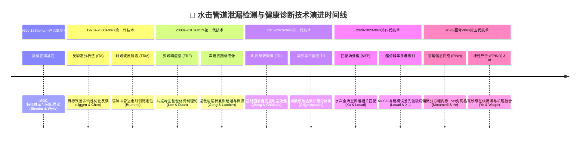

# 水击/瞬变流管道泄漏检测与健康诊断技术发展历程调研报告

## 摘要
承压管道（供水管网、油气输送、深井钻完井井筒等）的泄漏与结构劣化严重威胁工程安全与输运效率。基于水力瞬变（水击 / 水锤，Hydraulic Transients）的主动检测技术（Transient-based Leak Detection, TFLD），利用压力波传播距离远、携带系统物理信息丰富的物理特性，成为非开挖管道健康监测的前沿主流方向。本报告基于本地馆藏核心文献，结合 Google Scholar、Elsevier、ASCE、IAHR 等平台的国际权威文献，以时间演进为主线索，系统梳理该领域从 1960 年代至今近 60 年的发展脉络，涵盖主要研究学派、学术带头人（头衔/学术脉络/师承合作关系）、五代核心技术跃迁（ITA、TRM、FRF/FRM、TR、MFP、PINN/FPINO）


---

## 一、 水力瞬变检测基本物理机理与优势

### 1. 物理机理
在承压流体管道中，当阀门快速启闭、水泵启停或由专用瞬态发生器（Transient Generator）主动注入微小流体脉冲时，流速剧烈变化引发沿管道轴向传播的瞬态压力波动。
* **波阻抗突变效应**：瞬变波在沿程传播过程中遇到局部缺陷（泄漏孔、局部结垢、管壁锈蚀变薄等）时，泄漏孔处的连续性与孔口出流定律（$Q_L = C_d A_L \sqrt{2g H_L}$）打破了均匀管道的特征阻抗，激发产生反向传播的**减压反射波**；
* **能量耗散与频散效应**：沿程泄漏与管壁黏弹性阻尼会导致压力脉冲的高阶谐波剧烈衰减、系统固有频率向低频偏移，并使频域共振峰呈现特征性的正弦包络调制畸变。

### 2. 技术优势对比
| 检测维度 | 传统稳态水力检测法 | 被动声学检测法（听音杆/相关仪） | 主动水力瞬态波检测法 (TFLD) |
| :--- | :--- | :--- | :--- |
| **激励方式** | 依赖日常稳态运行压差 | 依赖泄漏孔自发喷流摩擦噪声 | 主动微小瞬态扰动激发大能量压力波 |
| **信号强度** | 静态微小压降，易被波动淹没 | 微弱高频声波（受管道材质强衰减） | 强低频/中频压力波，信号能量大 |
| **检测距离** | 全局粗略估算，分辨率低 | 仅数十米至百米（塑料管衰减极快） | **单点传感器可覆盖数百米至数十公里** |
| **反演能力** | 仅能粗估漏损总量 | 仅能粗略定位，无法测孔径 | **可同时定量反演泄漏位置与等效孔面积** |

---

## 二、 国际主要研究团队、领军学者与师门合作脉络

### 1. 师门传承与核心合作关系一览表

| 学派中心 | 领军人物（导师/PI） | 核心成员（弟子/合作者） | 现任职机构与头衔 | 核心专攻与标志性突破 |
| :--- | :--- | :--- | :--- | :--- |
| **北美奠基派** | **James A. Liggett**<br/>(讲席终身教授, 已故) | **Li-Chung Chen (陈立中)** | 康奈尔大学 博士 | 1994 年首创**反瞬态分析法 (ITA)**，奠定瞬变流反问题分析基石 |
| **香港科大/理工** | **Mohamed S. Ghidaoui**<br/>(讲座教授, 前 JHR 主编) | **段焕丰 (Huan-Feng Duan)** | 香港理工大学 教授 / ASCE Fellow | 频域阻抗法 (FRF)、复杂管网波衰减与黏弹性阻尼机制 |
| **香港科大/理工** | **Mohamed S. Ghidaoui** | **Moez Louati** | KFUPM/KAUST 副教授 | 跨界引入**水声匹配场处理 (MFP)**、最大似然超分辨率定位 |
| **香港科大/理工** | **Mohamed S. Ghidaoui** | **王逊 (Xun Wang)** | 博士 / 资深学者 | 首创管道**时间反转聚焦 (Time Reversal, TR)** 检测法 |
| **香港科大/理工** | **Mohamed S. Ghidaoui** | **徐灿 (Can Xu)** | 博士 / 青年科学家 | 建立完善的承压管道匹配场参数反演 (MFP) 理论大厦 |
| **香港科大/理工** | **Mohamed S. Ghidaoui** | **Muhammad Waqar** | 博士 / 博士后 | 瞬态波动力学试验、时间反转法与物理引导机器学习 |
| **香港科大/理工** | **Mohamed S. Ghidaoui** | **G. Grigoropoulos** | 博士 / 青年学者 | 突破非平面高频压力波 (HFW) 弥散限制，实现时间反转高分辨率成像 |
| **澳洲/新西兰** | **Angus R. Simpson**<br/>**Martin F. Lambert**<br/>(阿德莱德大学 教授/院长) | **John P. Vítkovský** | 博士 / 行业专家 | 准二维瞬态流动模拟，量化非恒定摩阻对 ITA 反演的误差机制 |
| **澳洲/新西兰** | **Angus R. Simpson**<br/>**Martin F. Lambert** | **Pedro J. Lee (李)** | 新西兰坎特伯雷大学 教授 | 奠定**频率响应函数法 (FRF/FRM)** 理论，推导频域传递矩阵解析解 |
| **澳洲/新西兰** | **Angus R. Simpson**<br/>**Martin F. Lambert** | **龚金哲 (Jinzhe Gong)** | 南方科技大学 副教授 | 提出**高分辨率水动力声阻抗剖析成像**，兼测微小泄漏与管壁结垢腐蚀 |
| **澳洲/新西兰** | **Angus R. Simpson**<br/>**Martin F. Lambert** | **叶佳伟 (Jiawei Ye)** | 青年学者 / 博士后 | 提出物理信息神经网络 (**PINN**) 与滤波型神经算子 (**FPINO**) 瞬态重构 |
| **欧洲意大利** | **Bruno Brunone**<br/>(正教授, 水力学泰斗) | **Silvia Meniconi** | 佩鲁贾大学 正教授 / IAHR Fellow | 提出便携式**时域波反射法 (TRM)**，主持欧洲多国复杂管网足尺实测 |
| **欧洲意大利** | **Silvia Meniconi**<br/>**Bruno Brunone** | **Caterina Capponi** | 佩鲁贾大学 研究员 | 复杂管网便携式瞬态发生装置研发、管网拓扑与神经网络智能检漏 |

---

## 三、 核心技术演进历程与代表性成果（时间轴为主线）



---

### 1. 基础奠基期（1960s – 1980s）：水锤数值理论与波动理论成型

* **【针对问题】**：水力瞬变（水击）在承压管道中引发剧烈瞬时高压与破坏性负压，传统稳态水力学与经验静态公式无法描述流速剧变引发的强非定常波动传播过程及流固耦合偏微分动力学。
* **【所用方法】**：基于一维可压缩流体连续性与动量守恒偏微分方程，建立**特征线法（Method of Characteristics, MOC）**与频域阻抗变换算法，将一阶偏微分双曲型方程组转化为特征线方向上的常微分相容方程组进行网格离散求解。
* **【达到效果】**：实现了任意复杂管网及复杂边界工况（阀门、水泵、水锤消除器等）下水锤压力波演化全过程的高保真离散数值正演，奠定了现代管道瞬态波动分析与正向仿真的理论基石。
* **核心代表成果（GB/T 7714 格式）**：
  * [1] WYLIE E B, STREETER V L, SUO L. Fluid transients in systems[M]. Englewood Cliffs: Prentice Hall, 1993.
  * [2] CHAUDHRY M H. Applied hydraulic transients[M]. 3rd ed. New York: Springer, 2014.

---

### 2. 第一代技术（1990s – 2000s 前期）：反瞬态分析（ITA）与时域波反射（TRM）

#### (1) 反瞬态分析法（Inverse Transient Analysis, ITA）
* **【针对问题】**：传统稳态试压检漏法灵敏度低且无法反演泄漏孔径，正向 MOC 仿真仅能“由因导果”，无法利用现场传感器采集的实测瞬态压力响应反推管道未知泄漏位置与损伤参数。
* **【所用方法】**：将泄漏检测构建为系统辨识与非线性参数估计反问题。以实测压力波形与正演 MOC 模拟波形之间的残差平方和为目标函数，通过共轭梯度法、拟牛顿法或遗传算法（GA）在参数空间中搜索最优解。
* **【达到效果】**：开创了利用水力瞬变信号反演系统参数的全新范式，首次在单管与简单管网中实现了**同时定量反演未知泄漏物理坐标 $x_L$ 与有效泄漏孔截面积 $(C_d A)_L$**。
* **局限性**：非恒定摩阻（Unsteady Friction）模型误差极易诱发大量局部极小值；多泄漏情况下参数搜索维度呈指数级爆炸。
* **代表成果（GB/T 7714 格式）**：
  * [3] LIGGETT J A, CHEN L C. Inverse transient analysis in pipe networks[J]. Journal of Water Resources Planning and Management, 1994, 120(6): 934-955.
  * [4] CHEN L C, LIGGETT J A. Monitoring water-distribution systems by inverse transient analysis[J]. Journal of Water Resources Planning and Management, 1995, 121(4): 315-324.
  * [5] VÍTKOVSKÝ J P, SIMPSON A R, LAMBERT M F. Leak detection and calibration using transients and genetic algorithms[J]. Journal of Water Resources Planning and Management, 2000, 126(4): 262-265.

#### (2) 时域波反射法（Transient Reflection Method, TRM）
* **【针对问题】**：ITA 反演高度依赖全系统高精度水力模型建模与耗时巨大的非线性优化迭代，在突发事故中难以实现便携、低算力、秒级的快速现场诊断。
* **【所用方法】**：利用阀门微动作主动激发出单个低幅值弱阶跃波或脉冲波，借鉴雷达/声呐走时测距物理机制，结合小波变换（CWT）滤除背景流噪并精确定位泄漏孔口减压反射回波的到达时刻 $\Delta t$。
* **【达到效果】**：基于直观几何走时公式 $x_L = c \cdot \Delta t / 2$ 实现了**无需复杂数值逆向迭代、单次脉冲激发即可完成的秒级直观泄漏位置测距**。
* **代表成果（GB/T 7714 格式）**：
  * [6] BRUNONE B. Transient test-based technique for leak detection in outfall pipes[J]. Journal of Water Resources Planning and Management, 1999, 125(5): 302-306.
  * [7] BRUNONE B, FERRANTE M. Detecting leaks in pressurised pipes by means of transients[J]. Journal of Hydraulic Research, 2001, 39(5): 539-547.
  * [8] GHIDAOUI M S, ZHAO M, MCINNIS D A, et al. A review of water hammer theory and practice[J]. Applied Mechanics Reviews, 2005, 58(1): 49-76.

---

### 3. 第二代技术（2000s 中期 – 2010s 前期）：频域响应函数（FRF）与声阻抗高分辨率剖析

#### (1) 频率响应函数法（Frequency Response Function, FRF / FRM）
* **【针对问题】**：时域波形在多分支、多变径管网中多重反射回波严重交织混叠，且高频随机流噪与波形频散衰减导致时域特征波峰难以辨识与提取。
* **【所用方法】**：将分析域由时域拓展至频域，推导含泄漏管道系统的频域传递矩阵解析解，建立基于共振峰偏移与正弦包络调制畸变的系统频率响应函数（FRF）解析模型。
* **【达到效果】**：有效抑制了时域随机宽带噪声，利用频域共振峰幅值的**周期性正弦包络调制解耦了泄漏位置与泄漏孔径**，大幅提升了多分支管系与周期性扰动下的频域辨识精度。
* **代表成果（GB/T 7714 格式）**：
  * [9] LEE P J, LAMBERT M F, SIMPSON A R, et al. Essential system response information for transient-based leak detection methods[J]. Journal of Hydraulic Research, 2007, 45(5): 665-674.
  * [10] LEE P J, VÍTKOVSKÝ J P, LAMBERT M F, et al. Frequency domain analysis for detecting pipeline leaks[J]. Journal of Hydraulic Engineering, 2005, 131(7): 596-604.
  * [11] DUAN H F, GHIDAOUI M S, LEE P J, et al. Essential system response information for transient-based leak detection methods[J]. Journal of Hydraulic Research, 2012, 50(3): 328-338.

#### (2) 高分辨率水动力声阻抗剖析（High-Resolution Waveform Profiling）
* **【针对问题】**：传统检漏方法只能假设单点孤立泄漏，无法诊断长输及老化管网中沿程分布的连续性结构劣化（如内壁结垢缩径、锈蚀管壁变薄、局部椭圆化变形等）。
* **【所用方法】**：借鉴地球物理地震勘探与声波测井的逆散射层析原理，对宽频高频脉冲回波序列进行逐段逆滤波解卷积，连续重构沿管道轴向截面的水动力声阻抗跃迁阶梯。
* **【达到效果】**：将管道健康状态诊断的空间轴向分辨率提升至**分米/厘米级**，实现了兼具局部微小泄漏精确定位与沿程结垢、腐蚀程度评估的**非开挖管道“高清声呐 CT 扫描剖析”**。
* **代表成果（GB/T 7714 格式）**：
  * [12] GONG J. High resolution imaging of pressurised water supply lines[D]. Adelaide: The University of Adelaide, 2013.
  * [13] GONG J, LAMBERT M F, SIMPSON A R, et al. Detection of localized deterioration in single pipelines using transient water hammer waves[J]. Journal of Pipeline Systems Engineering and Practice, 2014, 5(3): 04014002.

---

### 4. 第三代技术（2015 – 2020）：先进波物理——时间反转技术（Time Reversal, TR）

#### (1) 管道时间反转聚焦法 (Time Reversal, TR)
* **【针对问题】**：复杂分支管网或非均质管段中波的多重散射与传播路径极其繁复，传统正反演方法严重依赖全网拓扑边界的精确先验认知与复杂多路径回波追踪计算。
* **【所用方法】**：利用波动偏微分方程在弱耗散介质中的**时间反转不变性（Time-Reversal Invariance）**，在接收端将含缺陷散射的实测信号在时间轴上逆序翻转为 $P(T-t)$，再反向注入数值模型中逆时演化回放。
* **【达到效果】**：无需解析求解多重反射传播路径，逆向波束在真实缺陷位置处**自适应发生物理时空相位干涉重聚与能量聚焦（Spatial-Temporal Energy Focusing）**，显著降低了对复杂边界先验条件的依赖，大幅增强了强噪声环境下的缺陷信噪比。
* **代表成果（GB/T 7714 格式）**：
  * [14] WANG X, GHIDAOUI M S. Time-reversal technique for pipeline defect detection[J]. Journal of Hydraulic Engineering, 2018, 144(12): 04018074.
  * [15] WAQAR M. Condition assessment of pressurized pipelines using transient waves and time-reversal technique[D]. Hong Kong: The Hong Kong University of Science and Technology, 2022.

#### (2) 高频非平面波时间反转成像 (High-Frequency Wave TR)
* **【针对问题】**：高频压力波（波长接近管径）在管道中存在强烈的频散效应与非平面径向剪切模态，经典一维平面波假设完全失效，导致常规方法在精细尺度检测中严重失真。
* **【所用方法】**：实验证实并建立了高频非平面波在黏弹性管体中的时间可逆性本构，结合时空反转数值重聚焦算法对频散波包进行相位共轭补偿。
* **【达到效果】**：打破了一维低频平面波的截止频率限制，将管道微小缺陷成像的轴向物理空间分辨率直接提升至**波长级超精细尺度**。
* **代表成果（GB/T 7714 格式）**：
  * [16] GRIGOROPOULOS G. Time reversal of high-frequency pressure waves for defect detection in water pipelines[D]. Hong Kong: The Hong Kong University of Science and Technology, 2022.

---

### 5. 第四代技术（2020 – 2023）：水声跨界——匹配场处理（Matched-Field Processing, MFP）

#### (1) 匹配场处理多泄漏检漏法 (MFP)
* **【针对问题】**：当承压管道存在多处并发泄漏（Multiple Leaks）时，各泄漏点回波相互屏蔽、非线性耦合，导致 ITA 参数反演陷入维度灾难（NP-hard 难题），FRF 共振峰包络谱严重交叠而失效。
* **【所用方法】**：跨界引入海洋水声阵列信号处理算法，通过计算传感器实测全频域压力向量与理论复现压力场向量（Replica Vectors）之间的互谱空间相关度，绘制空间模糊度相关曲面（Ambiguity Surface）。
* **【达到效果】**：彻底摒弃了传统逐点非线性迭代优化，利用全场空间谱相关峰极大值**一次性解耦并超分辨率定位多处并发泄漏**，并成功拓展出无理论模型的“数据对比型（Data-versus-Data）”工程检漏模式。
* **代表成果（GB/T 7714 格式）**：
  * [17] XU C, LOUATI M, GHIDAOUI M S. Pipeline leak detection using matched-field processing (MFP)[J]. Journal of Hydraulic Engineering, 2020, 146(7): 04020046.
  * [18] LOUATI M, GHIDAOUI M S. Identification of multiple leaks in pipeline: Linearized model, maximum likelihood, and super-resolution localization[J]. Mechanical Systems and Signal Processing, 2021, 147: 107073.
  * [21] XU C. Developments of matched-field processing for parameter inversion in pressurized pipelines[D]. Hong Kong: The Hong Kong University of Science and Technology, 2023.

#### (2) 超分辨率定位与抗建模误差鲁棒 MFP
* **【针对问题】**：传统 MFP 在低信噪比下受制于瑞利物理分辨率极限而无法区分间距极近的相邻双泄漏，且工程实际中管材波速与摩阻等先验模型失配（Model Mismatch）易导致伪峰误判。
* **【所用方法】**：将多重信号分类算法（MUSIC）、白噪声增益约束及先验建模误差协方差矩阵无缝融合至匹配场模糊度函数中。
* **【达到效果】**：突破了空间物理分辨极限，实现了**超近间距多泄漏的超分辨率精细剥离**，在存在摩阻与波速先验建模偏差时仍保持极高的真阳性率与抗噪鲁棒性。
* **代表成果（GB/T 7714 格式）**：
  * [19] XU C, LOUATI M, GHIDAOUI M S. Enhanced multi-leak detection in pressurized pipelines using super-resolution matched-field processing[J]. Mechanical Systems and Signal Processing, 2021, 159: 107817.
  * [20] XU C, LOUATI M, GHIDAOUI M S. Pipeline leak localization using matched-field processing incorporating prior information of modeling error[J]. Mechanical Systems and Signal Processing, 2022, 179: 109339.

---

### 6. 第五代技术（2023 – 至今）：物理引导 AI、PINN 与神经算子（PINO / FPINO）

#### (1) 物理信息神经网络瞬态重构 (PINN)
* **【针对问题】**：传统数值特征线法（MOC）严格受制于 CFL 网格稳定性准则，且在实际工业管网测点极端稀疏（仅有两端压力计）或未知边界条件时完全无法求解正反演。
* **【所用方法】**：构建以时空坐标 $(x, t)$ 为输入的深度神经网络，将流体连续性与动量守恒偏微分方程残差（PDE Residuals）直接构造成网络的物理损失项，通过自微分引擎进行免网格自监督训练。
* **【达到效果】**：彻底摆脱了传统数值方法对 CFL 网格的严苛依赖，在**未知边界与稀疏测点条件下高保真插值重构全管段瞬态压力场**，并自适应反演未知摩阻和泄漏参数。
* **代表成果（GB/T 7714 格式）**：
  * [22] MOTAMEDI S, LOUATI M, GHIDAOUI M S. Physics-informed neural network model for transient wave propagation in a pressurized pipeline[J]. Journal of Hydraulic Engineering, 2023, 149(10): 04023038.
  * [23] YE J, LAMBERT M F, SIMPSON A R, et al. Physics-informed neural networks for hydraulic transient reconstruction and parameter estimation in pipeline systems[J]. Water Resources Research, 2024, 60(4): e2023WR035981.

#### (2) 滤波型物理信息神经算子 (FPINO) 与领域引导机器学习 (Domain-Guided ML)
* **【针对问题】**：传统 PINN 针对每一次新工况都需要重新进行耗时数小时的神经网络训练，无法满足实时在线预警需求；而纯数据驱动黑盒模型泛化能力差、缺乏流体物理保真度。
* **【所用方法】**：提出时间加权滤波策略构建物理信息神经算子（FPINO），直接学习无限维函数空间之间的算子映射；并将瞬态波走时时差、频域能量阻尼衰减等水动力学机理特征作为领域引导先验输入机器学习网络。
* **【达到效果】**：实现了复杂管网瞬态压力场与泄漏反演的**毫秒级近实时在线推断（Near Real-time Inference）**，且在小样本、多变工况及强工业噪声干扰下兼具卓越的泛化精度与物理机理可解释性。
* **代表成果（GB/T 7714 格式）**：
  * [24] YE J, ZENG W, LAMBERT M F, et al. A filtering physics-informed neural operator for online hydraulic transient reconstruction and inverse modeling[J]. Mechanical Systems and Signal Processing, 2025, 226: 112150.
  * [25] WAQAR M, MEMON A M, LOUATI M, et al. Pipeline leak detection using hydraulic transients and domain-guided machine learning[J]. Mechanical Systems and Signal Processing, 2025, 224: 111967.
  * [26] CAPPONI C, FERRANTE M, MENICONI S, et al. Leak detection and topology identification in pipelines using fluid transients and artificial neural networks[J]. Journal of Water Resources Planning and Management, 2022, 148(5): 04022018.

---

## 四、 核心方法横向综合对比矩阵

| 技术流派 | 核心代表学者 | 计算复杂度 | 对摩阻与管材参数依赖度 | 抗噪性与鲁棒性 | 多泄漏识别能力 | 工程化落地瓶颈 |
| :--- | :--- | :--- | :--- | :--- | :--- | :--- |
| **反瞬态分析法 (ITA)** | Liggett, Vítkovský | **极高**（需反复调用 MOC 迭代优化） | **极高**（摩阻误差导致目标函数失真） | 中等 | 差（多泄漏维度灾难） | 计算耗时长，难用于实时在线监控 |
| **时域波反射法 (TRM)** | Brunone, Meniconi | **极低**（简单时域走时测距） | **低**（仅需粗略波速） | 较差（弱反射易被噪声掩盖） | 差（多回波严重混叠） | 复杂管网多分支反射相互干扰 |
| **频域阻抗分析法 (FRF/FRM)** | Lee, Duan | **低**（解析传递矩阵求解） | **较高**（黏弹性管频散显著） | 较强（频域积分抑制随机噪声） | 较好（特征谐波叠加解耦） | 现场需施加周期性正弦微扰激发 |
| **高分辨率阻抗剖析 (Profiling)** | Gong, Lambert | **中等**（逆散射解卷积） | **中等**（需已知沿程平均衰减） | 较强 | 极强（连续沿程阻抗剖面） | 依赖超宽频高频脉冲发射装置 |
| **时间反转法 (TR)** | Wang, Waqar | **中等**（单次逆向数值回放） | **中等**（自适应聚焦容忍微小误差） | 强（逆时波相干聚焦压制噪声） | 较好（多散射点多焦点） | 黏弹性管道耗散破坏时间反转对称性 |
| **匹配场处理法 (MFP)** | Louati, Xu, Ghidaoui | **低至中等**（空间谱相关计算） | **极低**（支持无模型 Data-to-Data 模式） | **极强**（白噪声增益约束 + MUSIC） | **卓越**（超分辨率突破空间极限） | 复杂管网先验数据库构建与匹配失配 |
| **物理信息 AI (PINN / FPINO)** | Ye, Motamedi, Waqar | **离线训练高，在线推断毫秒级** | **自适应**（网络自动学习未知物理项） | **极强**（物理约束防止过拟合） | **优异**（端到端直接重构场分布） | 复杂大管网梯度失衡，训练数据需求 |

---

## 五、 水击管道检测理论向“水力压裂场景水击波监测”的迁移与衔接点

在油气与非常规能源（页岩油气、致密砂岩、地热等）水力压裂工程中，**井筒水击波（Water Hammer Transients）**普遍存在于压裂施工停泵、试压、脉冲激发或泵阀瞬态切换工况中。传统管道瞬变流泄漏检测理论（TFLD）经过 30 年的发展，积累了完备的波动力学方程、频域阻抗、时间反转、匹配场处理与 PINN 算法体系，为**基于井口水击波的压裂裂缝诊断与井筒完整性非侵入监测**提供了极具价值的理论基石与方法迁移路径。

---

### 1. 物理机理的底层映射：从“管网泄漏”到“井筒射孔-裂缝进液”

在数学方程与声阻抗物理本质上，供水管网的“局部管壁泄漏”与水力压裂井筒中的“射孔簇进液与水力裂缝响应”存在高度同构的底层映射关系：

```
 【城市供水管道系统】                                【水力压裂井筒系统】
 管道轴向流动 (1D 波动方程)        对应            井筒轴向流动 (1D 变截面/变物性水锤方程)
 管壁泄漏孔 (孔口出流定律)         对应            射孔簇孔眼 (孔眼节流方程 ΔP_perf ∝ Q^2)
 管道盲端/分支管                   对应            人工井底/桥塞边界 (全反射/部分透射边界)
 管道壁厚减薄/结垢阻抗阶梯         对应            套管变径/套损变形/沉砂堵塞阻抗跃迁
 外部无限水域/大气出流             对应            水力裂缝动态储容扩展 (裂缝柔度 Compliance)
```

* **阻抗与柔度并联模型**：在声学意义上，水平井段的每个射孔簇与所连通的水力裂缝，等效于一个**非线性流动阻抗（孔眼节流阻力 $R_{perf}$）与动态储容柔度（裂缝容积柔度 $C_f = dV_f/dP$）相并联的复合声学分支**。因此，管道多泄漏反演理论可直接泛化为**多簇射孔进液分布与裂缝动态参数反演**。

---

### 2. 核心技术方法在压裂监测中的直接迁移路径

#### (1) 时域波反射法 (TRM) $\rightarrow$ 井下桥塞就位、失效漏失与砂堵位置毫秒级探测
* **应用场景**：压裂施工中，停泵瞬态脉冲沿数千米井筒下行，在桥塞、变径及砂堵沉砂面产生强反射波。
* **技术迁移**：直接应用 TRM 走时原理 $z = \int_0^{\Delta t / 2} a(z) dz$，在井口仅凭高频压力计即可在毫秒级内定位砂堵截面深度、验证可溶桥塞是否密封良好或发生早期失效漏失。

#### (2) 匹配场处理 (MFP) & 频域响应 (FRF) $\rightarrow$ 多簇射孔孔眼磨蚀与非均匀进液剖面反演
* **应用场景**：水平井分段压裂中，各簇射孔因加砂冲蚀发生非均匀磨蚀，导致流体偏流严重，严重制约压裂改造体积（SRV）。
* **技术迁移**：将多簇射孔视作“多处并发等效泄漏源”。利用第 4 代 **超分辨率匹配场（Super-Resolution MFP）** 与 **频域传递矩阵正弦包络调制理论（FRF）**，以停泵水锤信号的频谱特征解耦多簇干扰，精确反演各射孔簇的有效冲蚀面积 $A_{perf, i}$ 及各簇瞬态分流比 $Q_i$。

#### (3) 高分辨率水动力声阻抗剖析 (Profiling) $\rightarrow$ 压裂井筒套损、腐蚀与管柱变形“非侵入声呐测井”
* **应用场景**：压裂高压（>70~100 MPa）及酸洗作业极易引起深井套管错断、微裂纹、挤压变形及内壁腐蚀。
* **技术迁移**：借鉴第 2 代龚金哲等建立的逆散射波形剖析算法，利用井口主动脉冲回波序列进行逐段解卷积，重构沿井深 $z$ 连续的井筒水动力通径与阻抗阶梯，实现无需起下测井仪器的**非侵入式全井段“声呐 CT 扫描”**。

#### (4) 物理信息神经网络 (PINN / FPINO) $\rightarrow$ 井口压力驱动的井筒-裂缝实时数字孪生
* **应用场景**：深井高温高压环境下井下传感器成本极高且易损坏，通常仅有井口高频压力数据。
* **技术迁移**：引入第 5 代 **PINN / FPINO 神经算子**，将井筒 1D 水力瞬变偏微分方程作为物理约束嵌入损失函数，实现从稀疏井口测量数据向全井筒瞬态压力场的高保真重构，并毫秒级在线推断**瞬时停泵压力（ISIP）、裂缝闭合压力及地层滤失系数**。

---

### 3. 压裂复杂井筒工况下的关键理论拓展与攻关瓶颈

将管道水击理论向压裂场景推进时，必须克服以下深地极端工况带来的理论挑战：

1. **压裂液非牛顿流变性与固液两相流波衰减**：
   * 压裂液（滑溜水减阻剂、交联冻胶）具有显著的剪切稀释、屈服应力及黏弹性本构；携砂混砂液（含微米/毫米级支撑剂颗粒）会引发额外的两相黏滞耗散与声波散射衰减。传统基于牛顿流体的摩阻模型（如 Brunone 模型）需升级为**非牛顿流体非恒定摩阻本构与两相声波衰减模型**。
2. **超深井温压梯度引起的沿程变物性与非均匀波速场 $a(z)$**：
   * 深井（4000~8000 m）井底温度可超 150℃、静水压达 100 MPa 以上，流体密度 $\rho(p, T)$、体积模量 $K(p, T)$ 以及套管弹性模量沿井深剧烈变化，导致压力波速 $a(z)$ 呈强空间非均质分布，经典常波速 MOC 特征线法必须拓展为**变波速非均匀网格 MOC 算法**。
3. **井筒-射孔-三维水力裂缝流固动态多场耦合**：
   * 瞬变压力波不仅在井筒内传播，还会透过射孔孔眼进入水力裂缝内部激发裂缝流体-岩石弹性波（裂缝脉动与慢波）。需构建“1D 井筒瞬变流 + 射孔孔眼节流 + 2D/3D 水力裂缝动态开度扩展”的跨尺度流固耦合动力学方程。

---

### 4. 总结：构建面向智能压裂的“井口水击波在线监测诊断新范式”

综上所述，水击波在压裂工程中已不再仅仅是需要防护的破坏性载荷，更是一列**自发生、高信噪比、贯穿数千米井筒至储层裂缝的天然超声波探测信号**。

未来研究应充分吸收传统管道瞬态流检测（TFLD）的 30 年理论精髓，重点突破**非牛顿变物性井筒波动正演、多簇射孔超分辨匹配场反演与物理信息神经算子（FPINO）在线推断**，最终形成**“井口非侵入采集 $\rightarrow$ 毫秒级在线波动反演 $\rightarrow$ 射孔磨蚀/砂堵/各簇进液实时诊断 $\rightarrow$ 压裂施工智能闭环调控”**的现代油气水力压裂监测新范式。

---

## 附录：全景参考文献列表（遵照 GB/T 7714—2015 规范著录）

[1] WYLIE E B, STREETER V L, SUO L. Fluid transients in systems[M]. Englewood Cliffs: Prentice Hall, 1993.  
[2] CHAUDHRY M H. Applied hydraulic transients[M]. 3rd ed. New York: Springer, 2014.  
[3] LIGGETT J A, CHEN L C. Inverse transient analysis in pipe networks[J]. Journal of Water Resources Planning and Management, 1994, 120(6): 934-955.  
[4] CHEN L C, LIGGETT J A. Monitoring water-distribution systems by inverse transient analysis[J]. Journal of Water Resources Planning and Management, 1995, 121(4): 315-324.  
[5] BRUNONE B. Transient test-based technique for leak detection in outfall pipes[J]. Journal of Water Resources Planning and Management, 1999, 125(5): 302-306.  
[6] VÍTKOVSKÝ J P, SIMPSON A R, LAMBERT M F. Leak detection and calibration using transients and genetic algorithms[J]. Journal of Water Resources Planning and Management, 2000, 126(4): 262-265.  
[7] BRUNONE B, FERRANTE M. Detecting leaks in pressurised pipes by means of transients[J]. Journal of Hydraulic Research, 2001, 39(5): 539-547.  
[8] GHIDAOUI M S, ZHAO M, MCINNIS D A, et al. A review of water hammer theory and practice[J]. Applied Mechanics Reviews, 2005, 58(1): 49-76.  
[9] LEE P J, VÍTKOVSKÝ J P, LAMBERT M F, et al. Frequency domain analysis for detecting pipeline leaks[J]. Journal of Hydraulic Engineering, 2005, 131(7): 596-604.  
[10] LEE P J, LAMBERT M F, SIMPSON A R, et al. Essential system response information for transient-based leak detection methods[J]. Journal of Hydraulic Research, 2007, 45(5): 665-674.  
[11] DUAN H F, GHIDAOUI M S, LEE P J, et al. Essential system response information for transient-based leak detection methods[J]. Journal of Hydraulic Research, 2012, 50(3): 328-338.  
[12] GONG J. High resolution imaging of pressurised water supply lines[D]. Adelaide: The University of Adelaide, 2013.  
[13] GONG J, LAMBERT M F, SIMPSON A R, et al. Detection of localized deterioration in single pipelines using transient water hammer waves[J]. Journal of Pipeline Systems Engineering and Practice, 2014, 5(3): 04014002.  
[14] WANG X, GHIDAOUI M S. Time-reversal technique for pipeline defect detection[J]. Journal of Hydraulic Engineering, 2018, 144(12): 04018074.  
[15] XU C, LOUATI M, GHIDAOUI M S. Pipeline leak detection using matched-field processing (MFP)[J]. Journal of Hydraulic Engineering, 2020, 146(7): 04020046.  
[16] LOUATI M, GHIDAOUI M S. Identification of multiple leaks in pipeline: Linearized model, maximum likelihood, and super-resolution localization[J]. Mechanical Systems and Signal Processing, 2021, 147: 107073.  
[17] XU C, LOUATI M, GHIDAOUI M S. Enhanced multi-leak detection in pressurized pipelines using super-resolution matched-field processing[J]. Mechanical Systems and Signal Processing, 2021, 159: 107817.  
[18] CAPPONI C, FERRANTE M, MENICONI S, et al. Leak detection and topology identification in pipelines using fluid transients and artificial neural networks[J]. Journal of Water Resources Planning and Management, 2022, 148(5): 04022018.  
[19] WAQAR M. Condition assessment of pressurized pipelines using transient waves and time-reversal technique[D]. Hong Kong: The Hong Kong University of Science and Technology, 2022.  
[20] GRIGOROPOULOS G. Time reversal of high-frequency pressure waves for defect detection in water pipelines[D]. Hong Kong: The Hong Kong University of Science and Technology, 2022.  
[21] XU C, LOUATI M, GHIDAOUI M S. Pipeline leak localization using matched-field processing incorporating prior information of modeling error[J]. Mechanical Systems and Signal Processing, 2022, 179: 109339.  
[22] XU C. Developments of matched-field processing for parameter inversion in pressurized pipelines[D]. Hong Kong: The Hong Kong University of Science and Technology, 2023.  
[23] MOTAMEDI S, LOUATI M, GHIDAOUI M S. Physics-informed neural network model for transient wave propagation in a pressurized pipeline[J]. Journal of Hydraulic Engineering, 2023, 149(10): 04023038.  
[24] YE J, LAMBERT M F, SIMPSON A R, et al. Physics-informed neural networks for hydraulic transient reconstruction and parameter estimation in pipeline systems[J]. Water Resources Research, 2024, 60(4): e2023WR035981.  
[25] WAQAR M, MEMON A M, LOUATI M, et al. Pipeline leak detection using hydraulic transients and domain-guided machine learning[J]. Mechanical Systems and Signal Processing, 2025, 224: 111967.  
[26] YE J, ZENG W, LAMBERT M F, et al. A filtering physics-informed neural operator for online hydraulic transient reconstruction and inverse modeling[J]. Mechanical Systems and Signal Processing, 2025, 226: 112150.
